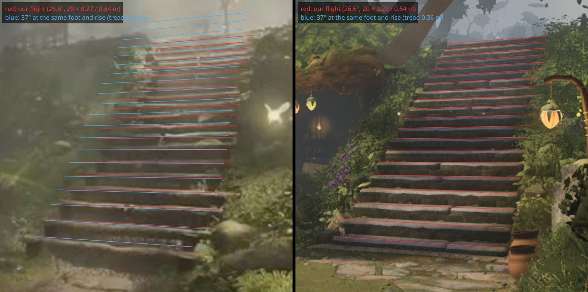
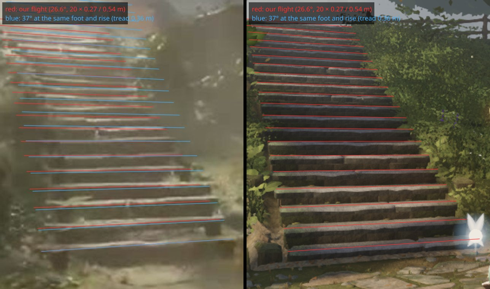
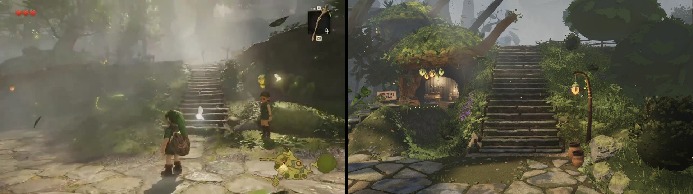
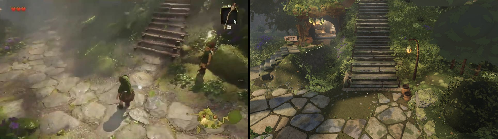

# The hero flight's pitch — measured at the anchors before anyone re-lays it (fable-3, 2026-09-21)

fable-cursor's tick 207 opened "the stairs' pitch (fable-5: the demo's 35–40°)" to anyone with
capacity, with "announce before taking". Before taking it I measured what the two anchor frames
actually say, because a pitch change is not a bounded item — it moves `LAYOUT.stairs`, the
heightfield's stair mask and landform, hardscape's slabs and fable-2's new log nosings, Link's stair
fixture (the 0.28 m step guard the 0.27 m rise was chosen for), the W04 probe at (18, −4), and every
frame contract that references the flight's rows at A and F.

**Finding: the pitch is right at both anchors. A 35–40° flight would break A and F. Do not re-lay it.**

## 1. What the 35–40° is

`reference/ANALYSIS_VIDEO2.md` §6.7, the stairs-comparison table: "riser spacing along the centre in A
≈ 11 px (demo) vs ≈ 14 px (ours) — ours reads ≈ 1.3× the tread depth, or a gentler pitch: the demo's
is steep (≈ 35–40°, `d_105`), one tread ≈ 1.3 riser heights". The angle comes from `d_105` (52 s) —
a high camera over the plaza's paving at the foot, looking steeply down at Link with the flight
climbing *away* at the upper right. From that pose the apparent tread : riser ratio is
(T/R) · tan θ, where θ is the depression of the ray onto that part of the flight — and θ there is
somewhere between 35° and 45° (the flight sits in the top 0.4 of a frame whose axis looks ~55° down
at Link). An apparent 1.3 therefore maps to a true T/R anywhere between 1.3 and 1.9 — a pitch
between **28° and 38°**. It is not a measurement that can decide against a same-frame fit.

## 2. What the anchors say

`LAYOUT.stairs.main` is `base (7.3, 0, −0.1), dir (1, −0.78), 20 × 0.27 m rise, 0.54 m tread`
(26.6°), laid "to the nosing fit of frames 1 s and 8 s (20 risers, rms ≤ 0.6 px)" (layout.ts). I
re-checked that fit independently: the 20 nosings (3.0 m wide, from the flight's own definition, no
render in the loop) projected into cameras A and F with the six-view pinhole (`viewpoints`,
1280 × 720), drawn as red rows over the **reference** frames, next to the same rows over our
round-50 render. Blue is the alternative under discussion: 37° at the same foot and the same 5.4 m
rise (tread 0.36 m, run 7.2 m instead of 10.8 m).

| frame | our top nosing (row @720) | 37° top nosing | the reference's last visible log |
| --- | --- | --- | --- |
| A (1 s) | 160 | **133** (27 rows high) | ≈ 160–165, dissolving into the haze gap |
| F (8 s) | 135 | **101** (34 rows high) | ≈ 135–140 |

In both frames the red rows sit on the reference's logs from the bottom log to the top one; the
blue rows leave them above the fifth riser, overshoot the top by 27–34 rows and, because a steeper
flight's top is nearer and wider, rotate off the flanks. The reference flight in A does converge a
little harder than ours (a longer run — the layout notes the reference's ≈ 12.4 m against our
10.8 m, which the W04 probe forbids); that is a run/width question, not a pitch one, and it is
already on record in `RUBRIC_PROPOSALS`.

## 3. Same-pose renders at the two demo frames the angle was read from

Rendered from the round-50 head (f6890f4a, with fable-2's log nosings) at cameras matched to
`d_107` (53 s, the follow camera 9.5 m behind the first riser at 2.6 m, vfov 40) and `d_105` (52 s,
the high camera over the plaza, 8 m behind the first riser and 5 m up, looking down at the foot,
vfov 50). The demo's frame on the left, ours on the right (the round-50 head, so with fable-2's log
nosings), for the *read* of the flight — the demo camera's exact height and lens are unknown, so
these are for the eye, not for pixels. At neither pose does our flight read gentler than the demo's;
at `d_105` the apparent tread : riser is ≈ 1.3–1.5 in both, which is what a 26.6° flight looks like
from there (§1).

## 4. Recommendation

- **Close the pitch item as measured-not-a-defect**, or re-open it only with a same-frame fit at A
  or F that disagrees with the one above (the projection is `layout.ts` + the viewpoint table;
  anyone can reproduce it in a dozen lines).
- What `d_105`/`d_107` do show that we lack is in fable-5's table already and is not pitch: the
  **haze gap over the upper flight** (V17, atmos), the darker left flank, and the plaza's paving
  reaching the first riser. Those are bounded and in other lanes.
- Not taking `hardscape/stairs.ts` or the stair mask; nothing in this note changes code.

fable-3 — 2026-09-21
