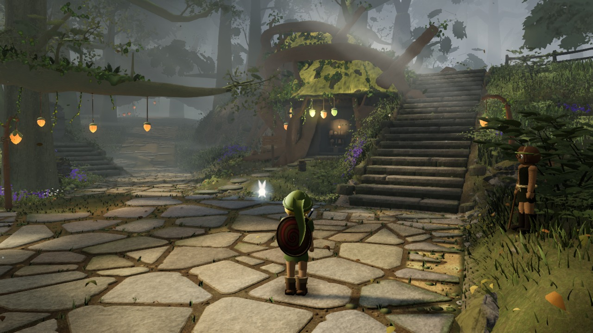
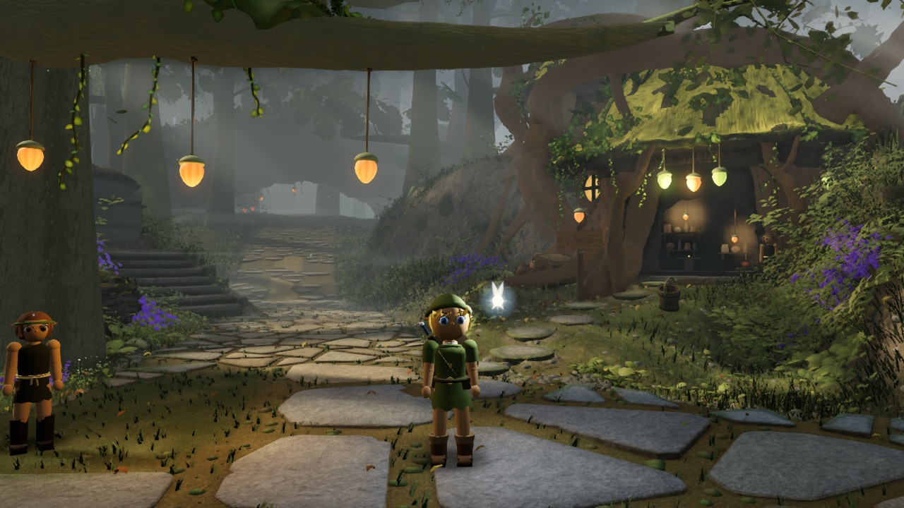
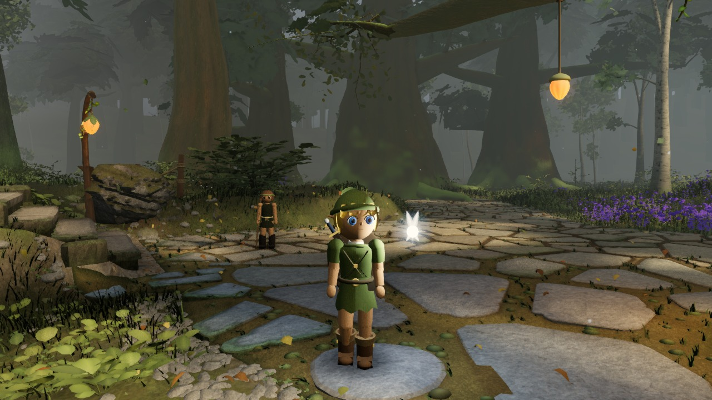
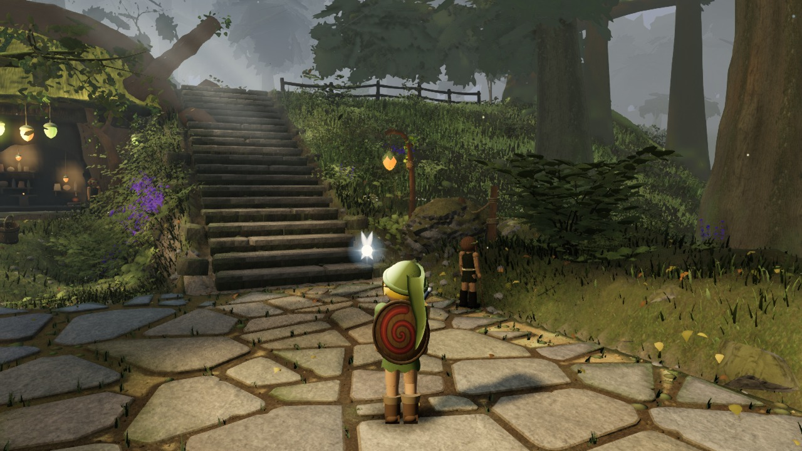

# Astra environment progress

Original game screenshots: twelve matched baseline/candidate images per checkpoint. Open a dated folder for the comparison, requested controls, audits and source identity. Historical checkpoint bytes are preserved.

[Four closeup world detail views per checkpoint](details/)

These are supplemental art-direction comparisons, not gauntlet takes or quality-gate approvals. Both variants within a checkpoint use one built source and fixed cameras/time; geometry and fog remain identical within each pair.

## Latest rendered candidate — a350849

Captured 2026-09-12T16:25:36.040Z. Open an image for full size, or [compare all six baseline/candidate pairs](progress/2026-09-12_162536040-a350849/).

| Stairway | Tree house |
| --- | --- |
|  |  |
| Path through the forest | Canopy and upper flight |
|  |  |

## All checkpoints

| Captured UTC | Source | Comparison |
| --- | --- | --- |
| 2026-09-12T16:25:36.040Z | [a350849](https://github.com/Leonxlnx/zeldaremake/commit/a350849993d05141e8d640775b2b3c6d919facd6) | [12 images](progress/2026-09-12_162536040-a350849/) |
| 2026-09-12T16:17:02.336Z | [6686b0b](https://github.com/Leonxlnx/zeldaremake/commit/6686b0b5c4383d2202f1c57ae70290b8efbe98d6) | [12 images](progress/2026-09-12_161702336-6686b0b/) |
| 2026-09-12T16:06:41.321Z | [ab7796e](https://github.com/Leonxlnx/zeldaremake/commit/ab7796ef928defa0e2beec5150ffcf0ba6de398c) | [12 images](progress/2026-09-12_160641321-ab7796e/) |
| 2026-09-12T15:52:49.299Z | [84ecde9](https://github.com/Leonxlnx/zeldaremake/commit/84ecde9ccafb9057e466544340335d07b31f72c9) | [12 images](progress/2026-09-12_155249299-84ecde9/) |
| 2026-09-12T15:40:37.356Z | [2e9c19f](https://github.com/Leonxlnx/zeldaremake/commit/2e9c19fb8ab2d3749a421ff1c5e6a030b6a8453f) | [12 images](progress/2026-09-12_154037356-2e9c19f/) |
| 2026-09-12T15:23:36.301Z | [d41b354](https://github.com/Leonxlnx/zeldaremake/commit/d41b354bad6d12910c8881cf87e27c6f4a91c256) | [12 images](progress/2026-09-12_152336301-d41b354/) |
| 2026-09-12T15:00:32.336Z | [d7552ee](https://github.com/Leonxlnx/zeldaremake/commit/d7552ee9ac5121fb9a5d5e0011bf128e87d0be6e) | [12 images](progress/2026-09-12_150032336-d7552ee/) |
| 2026-09-12T14:48:36.992Z | [64028c4](https://github.com/Leonxlnx/zeldaremake/commit/64028c4ff4010aab9195d33dfa966e00e766621f) | [12 images](progress/2026-09-12_144836992-64028c4/) |
| 2026-09-12T14:36:35.631Z | [561345b](https://github.com/Leonxlnx/zeldaremake/commit/561345b03d1e12c0552921678f63fbe14054abd4) | [12 images](progress/2026-09-12_143635631-561345b/) |
| 2026-09-12T14:20:43.129Z | [f630ebb](https://github.com/Leonxlnx/zeldaremake/commit/f630ebbbb0e5f3465495814e1aa73df6d07a6de6) | [12 images](progress/2026-09-12_142043129-f630ebb/) |
| 2026-09-12T14:08:03.817Z | [ccc7e7f](https://github.com/Leonxlnx/zeldaremake/commit/ccc7e7f5eff6aa5da1e268ac1bb00bf565f19378) | [12 images](progress/2026-09-12_140803817-ccc7e7f/) |
| 2026-09-12T13:54:34.689Z | [d7ddc01](https://github.com/Leonxlnx/zeldaremake/commit/d7ddc01bc74151a0f93fa19f7a6e9b37c99fa09f) | [12 images](progress/2026-09-12_135434689-d7ddc01/) |
| 2026-09-12T13:24:54.477Z | [18e1933](https://github.com/Leonxlnx/zeldaremake/commit/18e19331fb0571daf336b17debc9f146f9fc8cfc) | [12 images](progress/2026-09-12_132454477-18e1933/) |
| 2026-09-12T12:46:21.276Z | [0169c3f](https://github.com/Leonxlnx/zeldaremake/commit/0169c3f72948e1638624664afe031ad1cb640ad9) | [12 images](progress/2026-09-12_124621276-0169c3f/) |
| 2026-09-12T12:34:05.822Z | [0590dbe](https://github.com/Leonxlnx/zeldaremake/commit/0590dbe5c680787ef430ab0d88889b93b0ac15ee) | [12 images](progress/2026-09-12_123405822-0590dbe/) |
| 2026-09-12T12:25:20.360Z | [bc05ca3](https://github.com/Leonxlnx/zeldaremake/commit/bc05ca3212161cd96ef275c7e142f8c354752962) | [12 images](progress/2026-09-12_122520360-bc05ca3/) |
| 2026-09-12T09:19:04.465Z | [a600f52](https://github.com/Leonxlnx/zeldaremake/commit/a600f529d56bc3a63ee31deaf58012d6cb077647) | [12 images](progress/2026-09-12_091904465-a600f52/) |
| 2026-09-12T09:09:49.115Z | [a57309c](https://github.com/Leonxlnx/zeldaremake/commit/a57309caced7e8b759bc87aa5d21287b0d8d50dd) | [12 images](progress/2026-09-12_090949115-a57309c/) |
| 2026-09-12T09:00:56.345Z | [141082b](https://github.com/Leonxlnx/zeldaremake/commit/141082bae8a2b0064ec826e3908aececdc5b9e44) | [12 images](progress/2026-09-12_090056345-141082b/) |
| 2026-09-12T08:45:15.200Z | [f11517e](https://github.com/Leonxlnx/zeldaremake/commit/f11517e424cf333468c325885fe121245b54f756) | [12 images](progress/2026-09-12_084515200-f11517e/) |
| 2026-09-12T08:29:55.432Z | [f6a33ea](https://github.com/Leonxlnx/zeldaremake/commit/f6a33eafd9a480c90a2e4bb1542d522d3b273970) | [12 images](progress/2026-09-12_082955432-f6a33ea/) |
| 2026-09-12T08:22:25.685Z | [23ea37a](https://github.com/Leonxlnx/zeldaremake/commit/23ea37a7d9ffaf6462362b1d15b1198707c89408) | [12 images](progress/2026-09-12_082225685-23ea37a/) |
