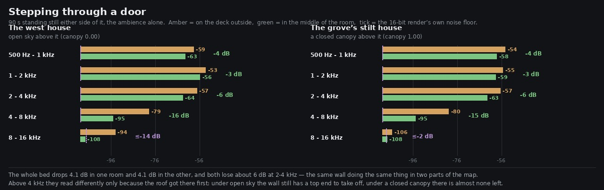

# Lane 5 — a hut is a room, and going indoors sounds like it

Branch `agent/squad5-indoors`, stacked on `agent/squad5-ropewalk` (PR #68) because both touch
`surfaceAt` in `src/audio/index.ts`. Merge #68 first.

## The problem

`distantHouse.ts` does not build scenery. It builds three walkable rooms and publishes each one to
`ctx.shared.walkSurfaces` as a platform disc, a deck, and **a wall ring at `radius × WALL_TAPER`
with a gap in it for the door**:

```js
walk.push({ id: def.id, disc: {...}, deck: {...}, wall: { r: R * WALL_TAPER, half: 0.2, gap: [...] } });
```

So the player can walk in through the door of all three — the west house off its flight of steps,
the grove's stilt house off the gangway, its tree hut off the rope walk — and until this change,
doing so changed nothing whatsoever. The forest came through the planks at full level and full
brightness. That is the same fault the log arch's bore had before this lane closed it, in a place
the player is far more likely to stand still in.

Standing in the middle of the west house before the change, `surfaceAt` returned
`enclosure: 0.00` — the same number it returns in the middle of the lawn.

## What a wall is, and what it is not

A wall is a filter, not a fader. That distinction decides the whole shape of the fix and of the
measurement: a fader moves every band by the same amount, and planks take the top off and leave the
body. So the sheet below reports five bands rather than one level, because one level cannot tell
those two apart.

A hut is also not a tunnel. Its walls are planks and its door stands open, so `INDOORS_CLOSE` is
**0.7** of the bore's full enclosure rather than 1. Through the bed's filter that lands at:

| where | enclosure | the bed's top |
| --- | ---: | ---: |
| outdoors under open sky | 0.00 | 18 kHz |
| under a closed canopy | 0.00 | 4.0 kHz (the roof, via `CANOPY_CLOSE`) |
| **inside a hut** | **0.70** | **2.2 kHz** |
| inside the log arch's bore | 1.00 | 900 Hz |

and it fades across the doorway rather than switching at the wall line, the way the bore's does:

```
0.70 through the middle of the room
0.36 at the wall
0    past it — the veranda and the rope walk are outdoors
```

## The measurement

Six 90 s renders of the **bed alone** (`renderOffline({ stem: 'bed', at })`), from the middle of
each room and from a spot the same short walk outside its door. One world load, one seed, nothing
different between a pair but where the listener is standing, so the difference between the two
takes *is* the wall.



```
west-house   overall -4.1    500-1k -3.8   1-2k -2.6   2-4k -6.4   4-8k -16.2   8-16k ≤-13.7
stilt        overall -4.1    500-1k -3.9   1-2k -3.3   2-4k -6.0   4-8k -14.9   8-16k  ≤-2.2
```

The overall **−4.1 dB is not a tuned number, it is a prediction met**: the bed ducks by
`1 − (1 − ENCLOSURE_DUCK) × enc` = `1 − 0.55 × 0.70` = 0.615, which is −4.2 dB. The renders came
back at −4.1. The rest of the change is the filter, and it is where it should be — the body of the
bed barely moves (−2.6 dB at 1–2 kHz) while everything above 4 kHz goes.

Two honest limits on reading those numbers, both marked on the sheet:

* **The renders are 16-bit, and the two `8-16k` figures are bounds, not readings.** Inside either
  room that band lands at −107.8 dBFS, which is exactly the file's own noise floor scaled to an
  8 kHz width (measured from 16–20 kHz, where the bed has nothing). The true attenuation can only
  be larger. The sheet draws each band's floor as a tick and prefixes a bound with `≤`.
* 90 s of gusts and birds settles these to a few tenths, so the first decimal is real and the
  second is not.

## The two grove huts are one measurement, not two

The stilt house's pair and the tree hut's pair came back **equal to a tenth of a decibel in every
band**. That is not a broken render, and `where.mjs` says why — it prints what `surfaceAt` actually
hands the bed at each of the six spots:

```
spot            x        z      surface   enclosure  canopy   gorge
west-house-in    -23.0      9.0   wood        0.70     0.00    0.00
west-house-out   -19.6      7.7   wood        0.00     0.00    0.00
stilt-in          12.0    -91.5   wood        0.70     1.00    0.00
stilt-out         14.2    -91.5   wood        0.00     1.00    0.00
hut-in            16.8    -85.2   wood        0.70     1.00    0.00
hut-out           14.4    -88.3   bridge      0.00     1.00    0.00
```

The bed is one global source shaped by local terms. Those two rooms hand it identical terms — same
enclosure, same roof, same ground, both about a hundred metres from anything else in earshot — so
they sound the same, which is correct. It does mean **the tree hut's take corroborates nothing the
stilt house's take did not already say**, and the sheet does not draw it as if it did.

What *is* an independent check is the west house, because it stands under open sky (`canopy 0.00`)
where the grove stands under a closed one (`canopy 1.00`). Both rooms lose the same 4.1 dB overall
and the same ~6 dB at 2–4 kHz. They only diverge above 4 kHz, and for a reason the table above
already gives: the grove's roof had taken the bed's top to 4 kHz before the wall got a turn, so
there was almost nothing left up there for the wall to remove. Same wall, same behaviour, different
amount of top end to work on.

(`hut-out` reading `bridge` is PR #68 underneath this one, working.)

## Listen

Same gain on all four clips (+22 dB, so the quiet bed is audible on laptop speakers) — the
difference you hear between a pair is the difference that was measured, not a normalisation.

```
clips/west-house-out.mp3   clips/west-house-in.mp3     under open sky
clips/stilt-out.mp3        clips/stilt-in.mp3          under a closed canopy
```

## The guards

`src/audio/places.test.mjs`, two new tests (6/6 in the file):

* **a hut is a room** — walks a radial line out of all three, asserts the middle is over 0.4 closed,
  that a hut with a door in it is always less closed than the bore, that the fade is monotone and
  has no step bigger than 0.25 in it (a switch at the wall line would fail this), that past the wall
  it is 0, and that the veranda and the walkway are outdoors.
* **the wall the huts are measured against is the one they are built with** — `WALL_AT` duplicates
  `distantHouse.ts`'s `WALL_TAPER`, which is not exported, so the test reads it out of that source
  and fails by name if the wall ever moves. Same guard the cadence has against a re-authored clip.

## Deliberately not in this change

A real room also answers — the wood gives back early reflection — and the bed has a `hall` term
already, driven by `canopy` and `gorge` but not by `enclosure`. Adding a room's own reflection is
the obvious next thing and it is a different claim from this one, needing its own renders and its
own before/after. Keeping it out keeps this PR to a measurement a reviewer can check in one sitting.

## Reproduce

```bash
npm run build
node art/audio/2026-09-24-indoors/pairs.mjs --dist dist --out /tmp/indoors
python3 art/audio/2026-09-24-indoors/bands.py --takes /tmp/indoors --all \
    --out art/audio/2026-09-24-indoors/indoors.jpg
node art/audio/2026-09-24-indoors/where.mjs
node --test src/audio/places.test.mjs
```

Typecheck clean, build green, **180 / 180 tests across the repo** (50 files; the two new ones here
take it from 178). This branch's own commits touch nothing outside `src/audio/` and
`art/audio/` — the one file elsewhere in the diff, `src/world/terrain/expansionNorth.test.mjs`,
belongs to #68 underneath and is explained there.
