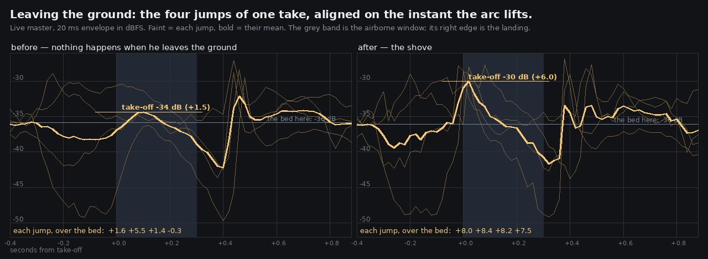

# Lane 5 — a jump left the ground in silence

Branch `agent/squad5-jump`, stacked on `agent/squad5-music-file`.
Sheet: `jump-before-after.jpg`. Listen: `clips/jumps-{before,after}.mp3` (10.8 s each).
Run it: `node art/audio/2026-09-24-jump/probe.mjs --dist dist`.

The footstep work on this lane has all been about walking — the surface under the boot, the cadence,
the gait's stance edges. A jump is the one move that takes both boots off the ground, and it is
driven from `airHeight()` rather than from the gait, so it is the one place a contact can be missed
without any walking test noticing. Nobody had listened to it.

## What it sounded like

`probe.mjs` places Link on the flagstones and drives a fixed script — stand, walk, four jumps from a
standstill — while the live master is recorded and `airHeight()` is sampled every 100 ms alongside
it. Across the four jumps the footstep counter **does not move**, and in the recording:

| four jumps, measured against the bed they started from | before |
| --- | ---: |
| jump 1, at take-off | +1.6 dB |
| jump 2 | +5.5 |
| jump 3 | +1.4 |
| jump 4 | **−0.3** |

Scattered, and one of the four *below* the bed. That spread is the wind wandering, not an event:
nothing was being played. A jump was **silence up and a thump down**, which is what makes one feel
weightless — every other contact in this game answers, and the one where he pushes hardest did not.

## The fix, and the mistake in the middle of it

`designPushOff()` builds the shove out of the same surface the step uses, with the step's timing
inverted. A boot arriving is a transient: the weight hits and the surface rings. A boot leaving
**presses**, then peels. So:

- the body's onset is 3.5× the step heel's (relative, because a grass step already arrives over
  5 ms where a flagstone's takes 2.5) — you hear weight arrive rather than a crack;
- the surface's two most sustained bands are stretched past 0.13 s and swept upward as the sole
  rolls off — the peel;
- a few of its grains flick 100–170 ms in as the sole lets go: grass springing back, grit off a
  flagstone, a plank unloading;
- the hall gets 0.75 of the step's send. There is no crack to bounce off the trunks.

**The first attempt measured like its before.** I had held the shove's bodies *under a walking
step's*, reasoning that a shove has no impact in it. Rebuilt and re-measured, the take-off came out
at −31 dB against a bed at −32 — where an ordinary walking step in the same recording peaks at −25.
It fired, and it could not be heard. The reasoning was wrong: a standing jump drives something like
twice body weight into the ground and a walking step nearer 1.2, so the shove is the **harder** of
the two. What separates them is shape, not level. The body now carries 1.2× the step heel's weight
with 3.5× its attack, and the test asserts that relationship in both directions.

## What it sounds like now

Same script, same place, the four jumps aligned on the instant the arc lifts:

| four jumps, over the bed they started from | before | after |
| --- | ---: | ---: |
| jump 1 | +1.6 dB | **+8.0** |
| jump 2 | +5.5 | **+8.4** |
| jump 3 | +1.4 | **+8.2** |
| jump 4 | −0.3 | **+7.5** |
| mean of the four envelopes | +1.5 | **+6.0** |

The consistency is the part that matters: 0.9 dB of spread across four jumps where there used to be
5.8. That is the signature of something being played, rather than the bed being read.

For scale, in the same recording a walking step peaks at −27.8 and the landing at −27.9; the shove
lands at −28.0. It is the weight of a footfall, not a new loudest thing in the game.



## Also checked

- **No shove fires while walking.** 12 walking steps before the jumps, `pushOffs` still 0; the
  counter first moves on the sample where `airHeight()` first exceeds 0.02.
- **It does not eat a step.** `pushOff()` takes `MIN_STEP_GAP` and resets the stride integrator the
  way `land()` does, so no boot plant lands on top of it.
- **A running jump shoves harder** than a standing one (`pushOffStrength` follows ground speed).
- The probe's fourth leg was meant to walk Link into a wall and check his boots stop when the world
  stops him. It missed — the heading walks him up the open plaza instead, 11.8 m with nothing in the
  way. **Not tested; still open.**

## Reproduce

```bash
npm run build
node art/audio/2026-09-24-jump/probe.mjs --dist dist --out /tmp/jump
ffmpeg -i /tmp/jump/jump.webm -ar 44100 -ac 2 -c:a pcm_s16le /tmp/jump/jump.wav
python3 art/audio/2026-09-24-jump/sheet.py --before /tmp/jump-old --after /tmp/jump \
    --out art/audio/2026-09-24-jump/jump-before-after.jpg
```

`node --test src/audio/footsteps.test.mjs` — 14 tests, one new: that the shove's noise outlasts the
step's and rises, that it carries more weight than a walking step's heel but arrives over at least
3.5× its attack, that a landing reaches lower and sends more to the hall, and that two shoves from
one seed are byte-identical.
