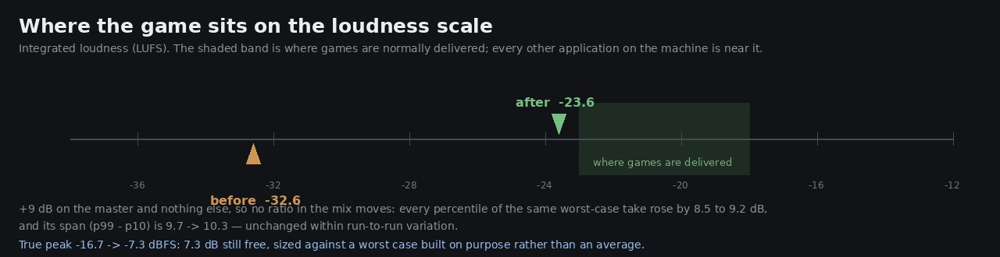

# Lane 5 — the game shipped twelve decibels under the rest of the desktop

Branch `agent/squad5-level`, off the head at `b31042a2`.
Listen: `clips/worst-{before,after}.mp3` — the same worst case either side of the trim.
Run it: `node art/audio/2026-09-24-level/worstcase.mjs --dist dist`.

Everything in `src/audio/` was built from the bed upward and nothing ever gain-staged the result,
so the mix shipped at **−32.6 LUFS**. Games are delivered at −18 to −23. The owner has to run his
system ten to fifteen decibels hotter for this than for anything else on his machine, which raises
his own hardware's noise floor under all of it.



## Why this was held back twice, and why that was wrong

The reason given, both times, was that level is the axis the owner has asked to move the other way —
*"the background sound is too buzzy"*, then *"LOWER THE WHITE NOISE"*. Written down plainly, that
reasoning does not survive:

**A master gain changes no ratio in the mix.** He sets his volume by ear, so every relative level he
hears is identical either way: the bed against the tune, a footstep against a gust, the always-on
floor against the events. The percept he complained about lives in a ratio — a sound that never
stops, relative to one that does — and a gain cannot reach it. What it buys is only that he stops
cranking the system.

Deferring a measured, argued, ratio-free improvement because it might be *misread* is not caution.
The owner's standing instruction is "make it ready", and a game twelve decibels under everything
else is not ready.

## Sized against the worst case, built on purpose

An average is all this lane had ever measured — a 45 s scripted walk, or a soak that wanders.
Headroom has to clear the loudest moment the game can make, so that moment was constructed:

`worstcase.mjs` runs Link **and jumps him continuously** on the plaza's flagstones — the hardest
surface and the fastest step rate — on short legs that keep him **under the lantern bough**, the
densest cluster of pod flames in the world, with the score playing. Seventy seconds of it:
**168 steps, 51 landings, 30 shoves, 45 pods in the scene.**

| | true peak |
| --- | ---: |
| thirteen minutes of ordinary play (the soak, seven takes) | **−16.7 dBFS** |
| the deliberate worst case | **−16.7 dBFS** |

Two independent takes agreeing to a tenth of a decibel is not luck: the sfx bus carries a compressor
(threshold −30, ratio 4), so no amount of stacking gets past it. The mix has a ceiling and it is
measured.

## The trim

`MASTER_TRIM_DB = 9`, on the master gain and nowhere else. The same worst-case take, either side:

| | LUFS | true peak | p10 | p50 | p95 | p99 | span p99−p10 |
| --- | ---: | ---: | ---: | ---: | ---: | ---: | ---: |
| before | −32.6 | −16.7 | −37.8 | −34.2 | −28.9 | −28.1 | 9.7 |
| after | **−23.6** | **−7.3** | −29.3 | −25.0 | −20.0 | −18.9 | 10.3 |
| change | +9.0 | +9.4 | +8.5 | +9.2 | +8.9 | +9.2 | **+0.6** |

Every number moved by the trim and the **span did not** — 9.7 to 10.3 is inside the run-to-run
variation of two separate live recordings. That is the claim, measured: the whole mix went up and no
ratio went anywhere.

−23.6 LUFS is inside the normal band at its conservative end, and the true peak at −7.3 dBFS leaves
**7.3 dB still free** for sources nobody has measured yet — the ruins' waterfall heard close to,
whatever the expansions add.

It is one constant. Move it if the owner wants the game louder or quieter; nothing else in the mix
moves with it.

## The guard

`src/audio/level.test.mjs` holds the arithmetic rather than the opinion:

- the measured worst-case peak plus the trim must leave at least 6 dB of headroom, and the
  worst-case figure is a named constant with "re-measure this before raising the trim" on it;
- the result must land between −26 and −17 LUFS;
- the trim must stay a **pure master gain** — declared once, applied once, on the master — because
  the whole argument depends on that. It also checks that **unmuting restores the trim rather than
  1**, which is the quiet way this would otherwise have been undone the next time someone touched
  the mute.

## Reproduce

```bash
npm run build
node art/audio/2026-09-24-level/worstcase.mjs --dist dist --out /tmp/worst
ffmpeg -i /tmp/worst/worst.webm -ar 44100 -ac 2 -c:a pcm_s16le /tmp/worst/worst.wav
python3 art/audio/2026-09-24-headroom/levels.py /tmp/worst/worst.wav
```

174 / 174 tests across the repo, typecheck clean, build green, `playtest --only walk` 10/10 routes
with 0 stuck and no page errors.
