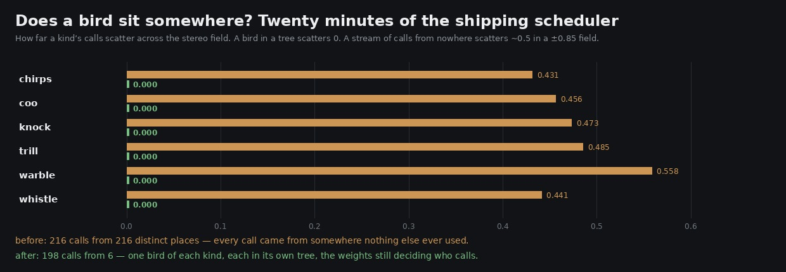

# Lane 5 — the wood had no birds in it, only calls

Branch `agent/squad5-birdvoice`, off the head at `b31042a2`.
Listen: `clips/standing-{before,after}.mp3` — two minutes standing at the plaza.
Run it: `node art/audio/2026-09-24-perches/measure.mjs --minutes 20`.

## What was there

The scheduler picked a kind from a weighted list and then drew **a fresh bearing and a fresh
distance for it**. Nothing was carried between calls, so there were no birds — only calls, arriving
from wherever.

Driving the shipping scheduler for twenty minutes:

| | |
| --- | ---: |
| calls | 216 |
| distinct places they came from | **216** |
| a kind's calls, scatter across the stereo field | **0.474** |
| a kind's calls, scatter in distance | 0.165 |

Every single call came from somewhere nothing else ever used, and a kind scattered 0.474 across a
±0.85 field — indistinguishable from uniform. A wood does not do that. It holds a handful of
individuals, each in its own tree, each calling from the same direction over and over, and that is
most of what makes one sound inhabited rather than sprinkled.

## What is there now



One bird of each kind, in slots round the compass and jittered inside the slot so it is not a ring.
A perch keeps a **world direction** rather than a stereo position, so the bearing is worked out
against the listener's facing when the call is scheduled — turn your head and the birds stay where
they were, which a random pan can never do. The weights move off the seeding and onto **how often a
bird calls**, which is what they always meant: a wood has one of everything and you hear the common
ones more. An answering call is a different bird in its own tree rather than this one mirrored, and
a bird that has just called does not call again straight away.

| twenty minutes | before | after |
| --- | ---: | ---: |
| calls | 216 | 198 |
| distinct places | **216** | **6** |
| bearing scatter within a kind | 0.474 | **0.000** |
| distance scatter within a kind | 0.165 | **0.000** |
| kinds heard | 6 | 6 |

The call counts still follow the weights — whistle 46, chirps 39, trill 32, coo 29, warble 29,
knock 23 — so the commoner birds are still the commoner birds.

**`PERCH_RESEED_M = 25`.** Birds do not follow you, and they are not the same birds a hundred metres
on. Holding the perches for ever would leave them all behind by the time he reached the ruins;
re-seeding every step would be the random stream this replaces. Re-seeding once he has walked out of
earshot of the last lot is both: consistent individuals while he is among them, new ones when he is
somewhere else.

## Two things tried and rejected on the way

**Six perches drawn from the weighted list.** The obvious first cut, and it left the wood with
**three species in it** — the weighted draw doubled kinds up. Measured, not guessed: chirps, trill
and whistle, three times each, and no coo, warble or knock at all for twenty minutes. That is why it
is one of each with the weights on the calling instead.

**Measuring this in the rendered audio.** It cannot be done with the tools here and it is worth
saying so rather than quietly leaving it out. Two attempts:

- the 45 s evidence walk holds about seven calls, and the listener crosses `PERCH_RESEED_M` twice,
  so there is nothing to see: 7 apparent places before, 7 after.
- five minutes standing still, band-limited to 1.3–5.2 kHz where the calls live, clustering the
  L/R balance of each onset: 10 clusters before, 9 after. That detector is **scoring leaf
  flutters**, which live in the same band, are panned at random, and outnumber the calls six to one.

The schedule-domain measurement is the right instrument for this and it is exact — it reads what the
shipping scheduler decided, not what a detector could pick out of a mix that is mostly leaves. The
clips are there to listen to.

## Reproduce

```bash
node art/audio/2026-09-24-perches/measure.mjs --minutes 20
```

`node --test src/audio/ambience.test.mjs` — 13 tests, two new: that every call of a kind comes from
one bearing and one distance and that the birds are round the listener rather than clumped on one
side, and that walking six times `PERCH_RESEED_M` puts him among different birds while standing
still does not. The lull test was also widened from one wind cycle to thirty, because at one cycle
it compared three calls against four and which was larger was a coin toss on the seeded stream.
