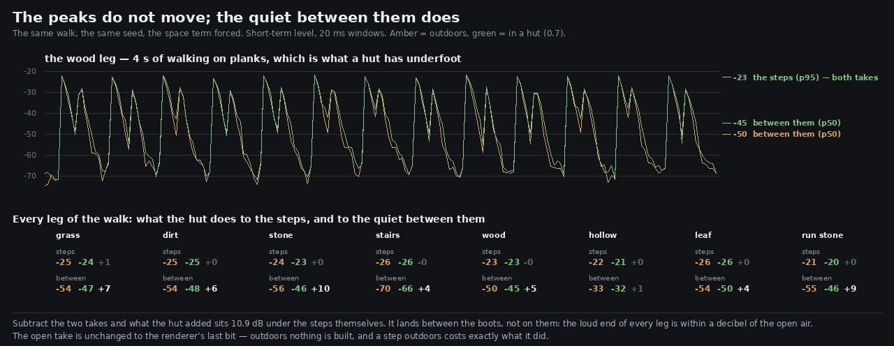

# Lane 5 — a room answers, so the boots know they are indoors

Branch `agent/squad5-room-answers`, off `agent/squad5-indoors` (PR #70). Merge #70 first.

This is the thing #70 said it was deliberately leaving out, done.

## The problem

`surfaceAt` has known he is indoors since the huts became rooms. His boots did not. Rendering the
footsteps stem three times with the space term forced — to 0, to a hut's 0.7, to the log bore's 1 —
gave three files that differ only at **the renderer's own last bit**:

```
before   room take vs open take:  -112.3 dB  (the renderer's own LSB floor is about -115)
before   bore take vs open take:  -111.6 dB
```

A step in a small plank box was the same sound as a step in a clearing, on the one surface a player
is most likely to be standing on inside a hut.

### A note on that floor, because it matters for every measurement on this lane

Two calls to `renderOffline` with *identical* options do not produce identical files. Checked
directly rather than assumed: the difference is **115 dB under the signal**, a handful of samples
landing on the other side of a 16-bit quantisation boundary. That is floating-point, not logic — the
render is reproducible for every purpose this lane has — but it means `cmp` is the wrong tool and
"differs at −112 dB" is the correct way to say "nothing happened".

## What a room is, and what it is not

**Not the hall.** That convolver is a 1.5 s wood: trunks scattering four to twelve metres off, the
top absorbed. Sending more of a step into it would make a hut sound like a *larger* forest, which is
the opposite of walking into one. So `graph.ts` carries a second, much smaller space — 0.32 s,
dense, dark, early reflections at 6–28 ms (walls one to five metres away), returning to the master
rather than the sfx bus so the room answering a step is not itself squeezed by the step compressor.

**Not three echoes either**, which is what this branch tried first and is worth recording because it
measured like its before. Taps at a hut's real geometry (9, 15, 24 ms) at the real level — −11 dB,
the spreading loss over a 5.7 m path off a plank wall — vanished into the step's own tail, because a
wooden step already rings for 100 ms. The reflected-to-direct ratio in the 5–35 ms window went
*down* 2.5 dB: the only thing three quiet taps changed was how hard the step compressor pulled. A
small room is not a handful of first-order reflections. It is those reflecting again off six
surfaces until they are a field.

**And a space cannot start at t = 0.** `impulseResponse` built its diffuse tail from sample zero,
which adds a copy of the source to the source and thickens the attack instead of reflecting it.
Measured, that put the room's own energy inside the 0–5 ms direct window and made a hut read as
*less* reflective than open air. It now takes a `preDelay`, defaulting to 0 so the wood's hall is
the impulse it has always been.

## The measurement

The same walk, the same seed, the space term forced; the whole result is in two percentiles of the
short-term level, and it needs both.



```
leg                  the steps (p95)            between them (p50)        what the hut added
                  open   room   bore          open   room   bore
grass            -24.9  -24.3  -24.0         -54.1  -47.2  -44.6              -13.3 dB
dirt             -25.0  -24.9  -24.7         -54.2  -48.5  -45.9              -13.6
stone            -23.7  -23.3  -23.1         -55.8  -46.2  -44.6              -11.5
stairs           -26.1  -26.1  -26.1         -70.2  -66.3  -64.2              -12.2
wood             -22.8  -22.9  -22.9         -50.2  -44.8  -42.8              -13.3
hollow           -21.6  -21.2  -20.9         -33.4  -32.3  -31.7              -14.2
leaf             -26.2  -25.9  -25.7         -54.0  -49.7  -47.3              -13.6
run stone        -20.9  -20.4  -20.4         -55.0  -46.1  -43.4               -9.4
```

* **p95 is the steps themselves, and it does not move** — within 0.6 dB of the open take on all
  eight surfaces, and on planks it is *lower* by 0.1. Whatever changed, it is not a fader.
* **p50 is mostly the quiet between one boot and the next, and it comes up 4 to 10 dB.** That is
  where a space lives: the silence a footstep used to fall into is no longer reached before the next
  one lands.
* Subtract the two takes and what the hut put in sits **10.9 dB under the steps** (the bore, 7.8).

The one row that barely moves is `hollow`, +1.1 dB, and it should: the log bore's own step design
already rings enormously — its p50 is −33 dB where every other surface sits near −54 — so there was
little silence in it for a room to fill.

### Two metrics that were tried and are wrong here

* **Reflected energy per step**, in a window after each onset against the direct. Steps arrive
  300 ms apart and the room's tail is 320 ms, so the previous step's reflections are still sounding
  inside the next step's "direct" window. It reads backwards.
* **The decay after the last step**, with 4.5 s of standing behind it. It is in the printout
  (20 dB in 23 / 27 / 39 ms) but not drawn, because it barely separates the three spaces and
  honestly so: the shared 1.5 s hall is under every footstep in this world already and it outlasts a
  hut. What a small room changes is the first third of a second, not the last.

## Cost, and what did not change

The open take is unchanged **to the renderer's last bit** (−112 dB under the steps, which is the
floor). Outdoors no node is built at all: `ROOM_MIN` skips the send entirely, so a step in the open
costs what it always did in nodes as well as in level. The peak on the steps stem moves from
−12.0 dBFS outdoors to −12.0 in a hut and −11.6 in the bore, so the master's headroom (PR #63
measured the worst case at −7.7 dBFS true) is untouched.

## The guards

`src/audio/room.test.mjs`, four tests, and they were checked by breaking the code:

* **the room starts answering after the direct sound** — the impulse is exactly zero for its first
  6 ms and nonzero after, and the hall's default is still 0 so this change cannot have moved it.
* **a hut is not a bigger wood** — the room is its own convolver, under a third of the hall's
  length, at `ROOM_RETURN`, and its return reaches the master without passing the step compressor.
  This one also reads the buffer the buses actually built, not just what the function can build:
  deleting the pre-delay argument at the call site fails it by name.
* **a step outdoors builds no room at all** — nothing is connected below `ROOM_MIN`, and the send is
  `ROOM_SEND × enclosure` exactly at 0.7 and at 1.
* **the landing and the shove are in the room too** — the two contacts that are not walking steps.

## Reproduce

```bash
npm run build
node art/audio/2026-09-24-room/steps.mjs --dist dist --out /tmp/room --tag after
python3 art/audio/2026-09-24-room/echo.py --takes /tmp/room --tag after \
    --out art/audio/2026-09-24-room/room.jpg
node --test src/audio/room.test.mjs
```

`clips/` — the plank leg on its own and the whole walk, outdoors and in a hut, at one common
+9 dB so what you hear between a pair is what was measured.

189 / 189 tests across the repo, typecheck clean, build green.
