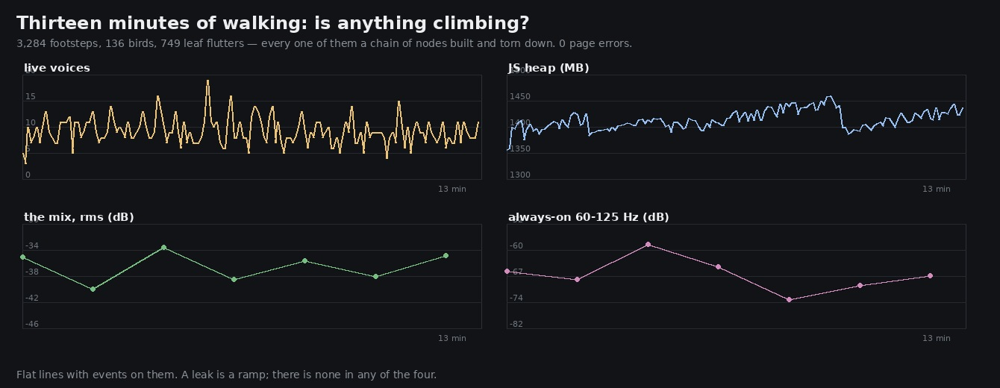

# Lane 5 — thirteen minutes of walking: does the audio still sound the same?

Branch `agent/squad5-soak`, off the head at `31146062`.
Listen: `clips/t0000.mp3` and `clips/t0720.mp3` — the first and last takes of the same session.
Run it: `node art/audio/2026-09-24-soak/probe.mjs --dist dist --minutes 13`.

The owner's standing word is *"make it ready, keep working and CHECK EVERYTHING"*. Every measurement
this lane has published is between eight seconds and three minutes long. Nobody has ever played the
game for a quarter of an hour and checked the sound was still right, and this graph is the kind that
would not survive it quietly.

## Why a soak, specifically

Every event here builds its own little chain of nodes and tears it down again through `cleanupAt` —
a footstep, a leaf flutter, a bird, a harp note, a fairy glint. At roughly ten a second that is
thousands of chains in a session, and **this lane has already shipped one leak of exactly that
kind**: `adEnvelope` left its gates at their exponential floor instead of at zero, so every noise
burst kept a permanent tap on the shared noise source open and a 45 s render lifted its own floor by
15 dB. It was found by accident, chasing something else.

A leak shows as a **ramp** in one of four things and in nothing else: the live voice count, the
master's level, the JS heap, and the audio clock against the wall. A healthy graph shows a flat line
with events on it.

## The run

Link walks for thirteen minutes of wall time — it has to be wall time, because the audio clock is
the wall clock — re-placed on a new leg every twenty seconds and running on every other one, so the
heaviest voice load is exercised rather than a stroll. 156 samples every five seconds, plus a
twenty-second recording every two minutes.

In that session: **3,284 footsteps, 136 bird calls, 749 leaf flutters** and the score's own notes.

| t (s) | live voices | context clock | steps | birds | flutters | heap (MB) |
| ---: | ---: | ---: | ---: | ---: | ---: | ---: |
| 0 | 5 | 1.4 | 0 | 1 | 3 | 1357 |
| 120 | 13 | 121.4 | 494 | 27 | 121 | 1423 |
| 240 | 10 | 241.4 | 1009 | 45 | 245 | 1414 |
| 360 | 8 | 361.3 | 1509 | 68 | 363 | 1408 |
| 480 | 9 | 481.4 | 2026 | 89 | 487 | 1439 |
| 600 | 9 | 601.4 | 2541 | 108 | 595 | 1392 |
| 720 | 6 | 721.3 | 3055 | 130 | 698 | 1416 |
| 775 | 11 | 776.3 | 3284 | 136 | 749 | 1437 |

- **voices** oscillate between 5 and 13 for the whole run and end where they started. No ramp.
- **the context clock** tracks the wall clock to a tenth of a second over 776 s. No drift.
- **the heap** wanders 1357–1442 MB with the usual collection sawtooth and no climb. (It is the
  whole renderer's heap, not the audio's.)
- **0 page errors.**

## And the level, as a trend

| at (s) | rms | the floor (p10) | breathes | 60–125 | 500–1k | 1–2k | 4–8k |
| ---: | ---: | ---: | ---: | ---: | ---: | ---: | ---: |
| 0 | −35.0 | −39.0 | 12.4 | −66 | −69 | −73 | −94 |
| 120 | −40.0 | −41.9 | 23.7 | −68 | −68 | −73 | −91 |
| 240 | −33.6 | −36.8 | 9.0 | −58 | −64 | −70 | −90 |
| 360 | −38.6 | −40.6 | 14.6 | −64 | −64 | −70 | −88 |
| 480 | −35.7 | −41.9 | 33.4 | −74 | −81 | −85 | −100 |
| 600 | −38.0 | −41.1 | 16.4 | −70 | −70 | −77 | −97 |
| 720 | −34.9 | −40.3 | 14.8 | −67 | −69 | −74 | −92 |

Least-squares slope with its own standard error:

| | trend | |
| --- | ---: | --- |
| the mix, rms | +0.4 ± 2.4 dB / 10 min | inside the noise |
| the floor (p10) | −1.3 ± 1.8 | inside the noise |
| always-on 60–125 Hz | −4.2 ± 4.7 | inside the noise |
| always-on 4–8 kHz | −3.2 ± 4.3 | inside the noise |

Nothing is climbing, and the scatter is much larger than any of the slopes — it tracks which leg he
is on and whether the tune is in a pass or a rest, not how long the session has run. **For scale,
the leak this lane already fixed was +200 dB / 10 min.**

## The mistake in the first attempt

The first run took eight seconds at the start and eight at the end and read a **43 dB fall** in the
60–125 Hz band. That was not the graph ageing: the placeholder score happened to play through the
first window and rest through the second, and its pad lives in that band. An eight-second window
cannot answer a question about a tune that runs 50 s and rests 16–30.

A leak is a trend, so it has to be sampled as one. Seven twenty-second takes spread through the one
session let the tune's own schedule average out, and the scatter that remains is visible and
quantified rather than mistaken for a result.

## What this does not cover

A single thirteen-minute session on one machine. It does not cover a tab left in the background for
an hour (the tick is a 1 Hz-throttled `setInterval` there, which the 4 s and 6 s lookaheads absorb by
design but nobody has measured), or a session where the player opens and closes the equipment screen
repeatedly, or a machine slow enough that the audio thread misses deadlines — `stats().load` is
plumbed for that last one but `renderCapacity` is unsupported in this Chrome, so it reads null.
