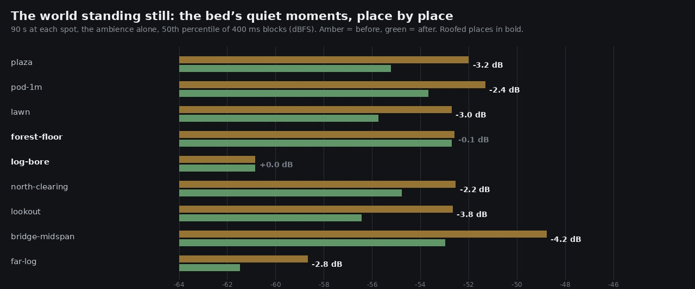

# Lane 5 — standing still somewhere, and what the crowns were actually doing

Branch `agent/squad5-standing`, stacked on `agent/squad5-jump`.
Listen: `clips/{north-clearing,plaza,forest-floor}-{before,after}.mp3`.
Run it: `survey.mjs` (every place), `term.mjs` (one term, forced).

This started as an audit of `exp-ruins`' waterfall (that report is at the bottom, and it passes).
Doing it properly needed an instrument the lane did not have, and the instrument found something
about work of my own.

## The instrument

Every measurement this lane has made comes from one scripted walk through the village. That answers
"what does the game sound like" and **cannot** answer "what does *this place* sound like" — which is
the question the owner's standing complaint actually asks, because the always-on floor is a property
of a place and of a listener who is not doing anything.

`renderOffline({ stem: 'bed', at: { x, z } })` stands still somewhere and renders the world's own
sound there. No footsteps, no music, no browser recorder, deterministic, a second a take. The space
terms come from `surfaceAt(x, z)` unless overridden, so a spot under the crowns or out over the
ravine carries its own; the wind still moves, because a place with no weather in it is not a place.

`survey.mjs` walks a list of places and `term.mjs` forces one space term to a series of values at a
fixed spot — the same seed, the same place, everything else held — which is the only way to ask "is
this term doing what its constants say".

## What it found: the crowns were doing nothing, backwards

Forcing `canopy` to 0, 0.5 and 1 at the north clearing, 90 s each:

| canopy forced to | 0 | 0.5 | 1 | open vs roofed |
| --- | ---: | ---: | ---: | ---: |
| the bed's rms | −47.0 | −47.3 | −47.8 | 0.8 dB |
| during gusts (p90) | −42.7 | −43.1 | −43.8 | **−1.1 dB** |
| between gusts (p50) | −52.6 | −51.8 | −52.5 | ~0 |

Under a *closed roof of leaves* the bed was **quieter** than under open sky, by about a decibel, and
between gusts there was no difference at all. The term was inert and what little it did was
backwards.

The arithmetic says why. The crowns only ever closed a filter (`CANOPY_CLOSE = 0.5`) and lifted the
hall. 0.5 puts the cutoff at 18000 × (900/18000)^0.5 ≈ **4.0 kHz**, and the bed's mean level at
4–8 kHz is −74 dB against −47 at its 1–2 kHz peak. **A filter cannot take away what is not there.**
Raising it to 0.7 (cutoff 2.2 kHz) was tried and measured: 11 dB more removed at 4–8 kHz where
nothing lives, and the rms end to end still 0.8 dB. It went back — moving a tuned constant for an
inaudible gain is churn.

## Two fixes

**The leaf roll now knows whether there is a roof over it** (`CANOPY_SHARE = 0.45`). A roof of
leaves is most of what you hear when the wind moves and you are under it; in the open you still hear
the ring of trees around you, which is why this is a share and not a gate. 0.55 of the roll survives
with no crowns overhead, all of it under a closed roof. It only ever removes, and the forest floor
is unchanged to the digit.

**The sky opens over the north clearing** (`skyOpening`). `forestFloorZone` is the terrain's litter
field, and litter lies in a clearing exactly as it lies under the trees, so it read **1.00 at the
centre** of a paved disc the layout describes as having "banks rising on every side" with a stone
circle on it. The roof is cut across the rim rather than switched — 1.00 at 8 m out, 0.83 at 6, 0.32
at 4, 0.15 in the middle — so the walk in *is* the opening, and never quite to nothing.

Also fixed on the way: `canopyNow` was assigned two hundred lines **below** the first thing that
reads it, so every term keyed on the roof was using the previous tick's value. Harmless at 33 ms in
play; wrong, and it made the new behaviour untestable.

## Result

The same nine places, 90 s standing still in each, the bed alone. Negative is quieter.

| place | quiet moments (p50) | | gusts (p90) | |
| --- | ---: | ---: | ---: | ---: |
| | **before → after** | Δ | **before → after** | Δ |
| plaza | −52.0 → −55.2 | **−3.2** | −42.6 → −45.1 | −2.5 |
| a metre from a pod | −51.3 → −53.7 | −2.4 | −42.5 → −44.9 | −2.4 |
| the lawn | −52.7 → −55.8 | −3.0 | −43.5 → −45.8 | −2.2 |
| the north clearing | −52.5 → −54.8 | −2.2 | −43.8 → −45.0 | −1.2 |
| the plateau lookout | −52.7 → −56.4 | **−3.8** | −42.7 → −45.2 | −2.5 |
| mid-span on the bridge | −48.8 → −53.0 | **−4.2** | −40.5 → −43.0 | −2.5 |
| two metres into the far log | −58.7 → −61.5 | −2.8 | −49.9 → −53.4 | −3.5 |
| **the north forest floor** | −52.6 → −52.7 | **−0.1** | −43.8 → −43.9 | −0.1 |
| **inside the log arch's bore** | −60.9 → −60.9 | **0.0** | −51.3 → −51.3 | 0.0 |



Every open place is 2–4 dB quieter in its quiet moments. Every roofed place is unchanged to a tenth
of a decibel. And the contrast the term was supposed to carry now exists: before, the open village
plaza (−52.0) and the closed forest floor (−52.6) measured the **same**; after, they are 2.5 dB
apart, the right way round.

In isolation the term now runs +1.4 dB from open to roofed during gusts (was −1.1) and +3.9 dB
between them (was ~0), monotone through 0.5 in both.

Worth being plain about the size of it: this is two to four decibels, not a transformation. It is in
the direction the owner has asked for twice, it never makes anything louder, and it puts a
difference where the code claimed one and the sound did not make it.

## The waterfall audit (`exp-ruins`, pre-merge): it passes

`exp-ruins` adds a waterfall, which is continuous broadband noise by definition — the exact percept
the owner has complained about twice. Its author gated it hard by distance for that reason. Checked
with this lane's own metric (`art/audio/2026-09-24-waterfall/`), Link standing still 75 s at each of
a row of distances, with the spots kept 8 m or more from the trail's new pod lanterns so only the
fall varies, and the takes long enough that the placeholder score's rests set the floor:

| distance from the plunge | the fall's attenuation | always-on, 60–125 Hz |
| --- | ---: | ---: |
| 4 m | 0.768 | **−53** |
| 7 m | 0.442 | −59 |
| 11 m | 0.253 | −57 |
| 17 m | 0.130 | −61 |
| 26 m | 0.066 | −70 |
| 35 m | 0.017 | −70 |
| the village plaza | 0.000 | −70 |

The loudest it ever gets — four metres from a nine-metre fall, where a roar is the correct and
expected sound — is **−53 dB**, which is **16.5 dB quieter than the pod lanterns' 96 Hz hum** that
this lane removed on the morning of the 23rd after the owner called the forest buzzy (that measured
−36.5 in the same band). By 26 m it is indistinguishable from the plaza's own floor, and the village
never hears it at all. **No change wanted.**

Two corrections to my own first pass, both mine and both instructive: a nine-second take is far too
short, because the score's pad runs the whole of a 50 s pass in the same 60–125 Hz band and simply
*is* the floor; and a row of spots straight down the trail measures the ruins' three new pod
lanterns as much as the fall — at (−44, 2) the nearest pod is 3.5 m away and its flame is twice the
fall's level there.

## Reproduce

```bash
npm run build
node art/audio/2026-09-24-standing/survey.mjs --dist dist --out /tmp/after --seconds 90
node art/audio/2026-09-24-standing/term.mjs  --dist dist --out /tmp/term \
    --at -1.5,-69.8 --term canopy --values 0,0.5,1 --seconds 90
```

`node --test src/audio/ambience.test.mjs` — 9 tests, one new: that fewer leaves overhead is less
leaf sound, that it is a share rather than a gate (3.5–9 dB), that a full roof is unchanged from
before the term existed, and that no value of it can make the forest louder.
`node --test src/audio/places.test.mjs` — 4, new: the space terms by place, and the clearing's roof.
