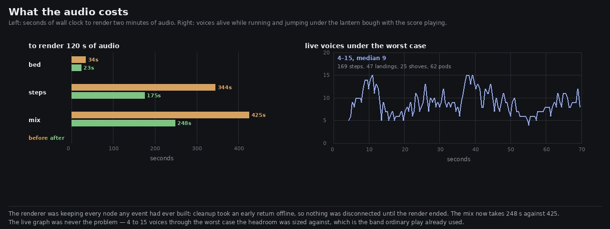

# Lane 5 — what the audio costs, and a renderer that was keeping everything

Branch `agent/squad5-cost`, off the integration head at `cd9400b2`.

Check 49 of `art/audio/RUBRIC_50_SOUND.md` is *it costs what it should: the audio thread is not near
its deadline under the worst case*. It scores **2**, the lowest in the rubric after the one hole that
needs other lanes, and the reason is honest and unhelpful: the direct read is
`AudioContext.renderCapacity`, the diagnostic is plumbed for it (`stats().load`), and this Chrome
does not implement it, so it has always come back null.

Two things can be measured without it. One of them found a fault.



## The live graph was never the problem

`voices` counts the node chains alive at any moment. The soak measured it wandering 5–13 over
thirteen minutes of ordinary play; nobody had counted it under the worst case the headroom was sized
against. Driving that — running and jumping continuously on the flagstones under the densest cluster
of lanterns in the world, with the score playing, sampled twice a second:

```
70 s, 169 steps, 47 landings, 25 shoves, 62 pods, the score playing
voices: min 4, median 9, max 15
```

The same band ordinary play already uses. The graph does not grow under load, and the teardown keeps
up with the worst the game can throw at it.

## The renderer, though, was keeping every node any event had ever built

An `OfflineAudioContext` runs the same graph as fast as it can, so seconds of audio per second of
wall clock is a real-time factor for the DSP. Measured per stem at two lengths, the cost grew as the
**square** of the take:

```
                 30 s        120 s      4x the audio cost...
bed             2.79 s      33.65 s     12.1x
steps          24.94 s     344.21 s     13.8x
mix            33.28 s     425.10 s     12.8x
```

`cleanupAt` is why. It took an early return offline —

```ts
if (typeof (ctx as OfflineAudioContext).startRendering === 'function') return;
```

— on the reasoning, written in its comment, that "the whole graph is discarded when the render
finishes". True of memory and false of cost: **nothing was ever disconnected during a render**, so
every node any event had ever built stayed in the graph and was processed for every remaining
quantum. Ten events a second over two minutes is more than a thousand chains still running at the
end of it.

## The fix: cleanup on the audio clock

A silent `ConstantSourceNode` stopped at the cleanup time fires `onended` **in step with the
render** — checked before building anything: twenty sources stopped across ten seconds of an offline
render all fired during it, each at a `currentTime` within 30 ms of its stop. It works live too, and
it is the better clock there as well: a wall-clock timer drifts from the audio it is cleaning up
after, and a background tab throttles it.

```
                 120 s before    120 s after
bed                  33.65 s        23.13 s     1.45x
steps               344.21 s       175.04 s     1.97x
mix                 425.10 s       247.62 s     1.72x
```

**Every evidence render on this lane is now about 1.7 times faster**, and the steps stem nearly
twice.

**The output does not move.** That is the check that matters, because a cleanup that now actually
happens could cut a tail short: the same 52 s of each stem, before against after, differs by
**−112 dB** (steps) and **−107 dB** (bed) against the renderer's own LSB floor of about −110.

## What it did not fix

It is still superlinear — four times the audio costs 7.6× (bed), 13.3× (steps), 11.8× (mix), so the
exponent is around 1.8 rather than 1. Chrome dispatches `onended` between chunks of rendering rather
than at the sample, so the teardown lags the schedule by however big a chunk is. The measurement is
1.7× and the claim is 1.7×; I have not chased the rest.

And check 49 does not reach 4. The number it actually asks for is the audio thread's own load, and
that needs `renderCapacity`, which this box does not have. What can be said is that the live graph
holds at 4–15 voices through the worst case and that the same graph rendered offline is no longer
accumulating — both bounds on the answer, neither of them the answer.

## Reproduce

```bash
npm run build
node art/audio/2026-09-25-cost/cost.mjs --dist dist --out /tmp/cost --seconds 70
python3 art/audio/2026-09-25-cost/plot.py --before /tmp/cost/cost.json \
    --after art/audio/2026-09-25-cost/after.json --out art/audio/2026-09-25-cost/cost.jpg
```

**202 / 202 tests**, typecheck clean, build green. Nothing outside `src/audio/` and `art/audio/`.

Check 49 goes from **2 to 3**: the graph's size under the worst case is measured and bounded, the
renderer's accumulation is found and fixed, and the audio thread's own load remains unread on a box
that cannot report it.
