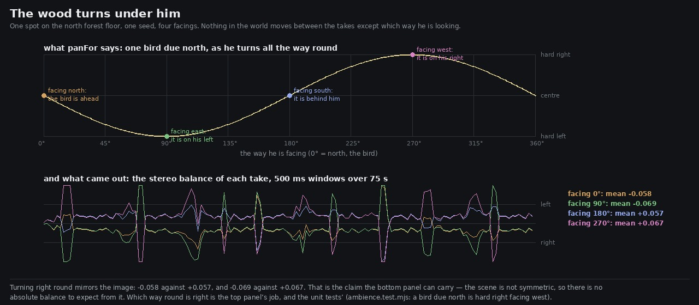

# Lane 5 — the wood turns under him, and now something says so if it stops

Branch `agent/squad5-facing`, off the integration head at `0fc66816`.

## What was untested

Everything in the bed that has a direction — a bird on its perch, the canopy roll leaning out of the
wind, a pod lantern beside the path — is panned against `forward`, the way the listener is facing.
That is the whole of what makes the bed a *place* rather than a pair of speakers: turn ninety
degrees and a bird that was on your left has to move to the front.

**Nothing had ever checked that it does.** The arithmetic was written twice, once for the wind's
lean and once for the perches, and a sign error or a stale heading in either would be invisible to
every measurement this lane makes, because all of them are mono sums or single-position renders.
What a player would hear instead is a wood nailed to the speakers.

## It works



One spot on the north forest floor, one seed, four facings, 75 s each — nothing differs between the
takes but which way he is looking (`turn.mjs`). Turning right round mirrors the image:

```
facing    0°   mean balance -0.058        facing   90°   mean balance -0.069
facing  180°   mean balance +0.057        facing  270°   mean balance +0.067
```

That mirror is the claim the renders can carry. They cannot say which way round is *right*, because
the scene is not symmetric — the perches sit where they sit — so there is no absolute balance to
expect from a take. Which way round is right is the top panel's job and the tests'.

## What changed

Nothing audible. `panFor(forward, to)` is now the one place the convention lives, and both callers
use it; re-rendering the four takes after the change gives files that differ from the ones before it
by **−104 dB**, which is the renderer's own last bit. The duplication is what was worth removing —
two copies of a sign convention is one copy too many for something no test was watching.

`PERCH_PAN` (0.85) also got a name and a reason, having been a bare `0.85` in the middle of an
expression: a call hard against one channel does not read as "over there", it reads as a fault in
the mix. The wind leans a third as far again, deliberately — a bird is a point and the air is not.

## The guards, and the two bugs they catch

`src/audio/ambience.test.mjs`, two new tests (15 in the file). Both were checked by breaking the
code, which is the only way to know a test is doing anything:

**"the world turns under him: a bearing is a place, not a channel"** — a source due north is centre
when he faces it, centre again with his back to it (a stereo pan cannot tell front from back, and
pretending otherwise would be the wrong kind of confident), hard right facing west and hard left
facing east; the sweep is antisymmetric under a half turn at every 15°; and a source further away
must not pan wider, because distance is not a bearing. Flipping the sign in `panFor` fails it.

**"a bird keeps its tree while he turns on the spot"** — the real ambience, seeded perches, the same
listener, two facings: the same birds must be in the wood, and every one of them must be at the
mirror of where it was. Freezing the heading — the wood nailed to the speakers — fails it.

## Also measured, and nothing to do about either

**The canopy term, checked at a second place.** `art/audio/2026-09-24-standing/` set the roof's
behaviour at the north clearing; forcing it at the lawn (a different spot, 90 s at each of 0, 0.5,
1) reproduces it: a roof makes a place **2.9 dB louder between gusts** and 2.5 dB louder in them,
adding 3.6 dB at 1–2 kHz and 3.2 dB at 2–4 kHz, monotone through 0.5. That is the intended
post-fix direction — more of the forest comes back off the crowns — holding somewhere it was not
tuned.

**The height gap named in `art/audio/2026-09-25-resurvey/` is smaller than it looked, and largely
my own error.** That report found the stilt house's veranda and the ground below it sounding the
same and proposed a height term. The same report's correction is why it should not be built: the
veranda has **3.1 m** of air under it, not the 11.6 m the layout's `floorY` appears to say. Two
places three metres apart vertically under the same closed canopy *should* sound nearly the same.
There is no defect there to fix.

## Listen

`clips/facing-{0,90,180,270}.mp3` — the same fifty seconds from one spot, one common +11 dB, four
facings. The birds move across you and the wood does not.

## Reproduce

```bash
npm run build
node art/audio/2026-09-25-facing/turn.mjs --dist dist --out /tmp/turn
python3 art/audio/2026-09-25-facing/sweep.py --takes /tmp/turn \
    --out art/audio/2026-09-25-facing/facing.jpg
node --test src/audio/ambience.test.mjs
node art/audio/2026-09-24-standing/term.mjs --dist dist --at -6.5,2 --term canopy --values 0,0.5,1
```

Typecheck clean, build green, **191 / 191 tests** across the repo. Nothing outside `src/audio/` and
`art/audio/` changes.
