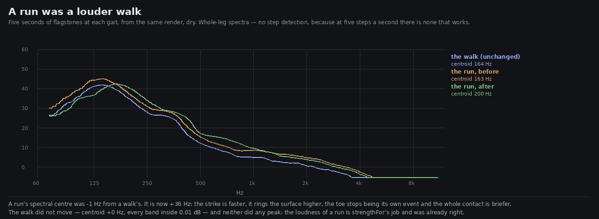

# Lane 5 — a run was a louder walk

Branch `agent/squad5-gait`, off the integration head at `1a183570`.

Check 21 of `art/audio/RUBRIC_50_SOUND.md` is *walking and running differ in more than rate*. I
scored it **3** and wrote beside the score that it was **measured for level, not for spectral
character**. That is the second time this week a "believed rather than measured" note has turned out
to be covering something; the first was check 4, and the loop it was hiding is `2026-09-25-loop`.

## What was there, from the source alone

`designStep`'s docstring said `running` "shortens the heel-to-toe gap **and hardens the heel**".
`running` appeared in exactly one expression:

```ts
const toe = (running ? 0.05 : 0.1) * j(0.22);
```

That is the gap, and not the heel.

## And from the data

`design.mjs` builds the same step twice — the same surface, the same strength, the same seeded
stream, `running` false then true — over eight surfaces and sixty seeds each. Whatever differs *is*
the difference between a walk and a run, exactly, with no rendering noise in it:

```
                parts   heelPeak heelAttack  heelF0  toePeak  latest    peak     end  reverb  topHz
before              =          =          =       =        =    -28%       =       =       =      =
```

One number, on seven surfaces out of eight. On **leaf litter it was not even that** — the litter's
last part is a settling grain rather than the toe, so a run through leaves was *bit for bit* a walk
through leaves at a higher strength.

On the render, at the flagstones: a run's spectral centroid was **163 Hz against a walk's 164**.

## What it is now



```
                parts   heelPeak heelAttack  heelF0  toePeak  latest    peak     end  reverb  topHz
after               =          =       -45%    +18%     -30%    -28%       =    -20%       =      =
```

A run now lands **flatter** (the toe is 30 % of its own event, because the foot is no longer rolling
through it), **faster** (the heel's attack is 45 % shorter), **higher** (a harder strike rings the
surface 18 % up) and **briefer** (20 % off the decay, which it needs at five steps a second or each
step is still sounding under the next). On the render the centroid goes from −1 Hz against the walk
to **+36 Hz**.

**The walk does not move at all** — centroid +0 Hz, every band inside 0.01 dB — and no peak moves on
either gait.

## The one I tried and took out

The first version also lifted the heel 1.35×, to make it "harder". `footsteps.test.mjs`'s headroom
guard caught it: at full strength on a bridge the heel's parts summed to **0.47 against its 0.45
limit**. It was right to. Peak force *is* level, `strengthFor` already gives a run 0.76 against a
walk's 0.46, and a heel lift here would have been loudness a second time wearing shape's clothes.
The four that remain are what is left when loudness is taken out.

## The instrument that does not work here, and how I know

The obvious measurement is to cut each step out of the render and compare them. It cannot answer
this question, and the controls are how I know rather than a hunch:

```
walk stone, first half against second half     3.22 dB rms of shape   <- the noise floor
run stone, first half against second half     13.36 dB
walk against run, same stone                   4.72 dB
stone against grass, both walking              4.77 dB   <- what a real difference looks like
```

The run's own internal variation is nearly three times the walk-against-run difference. At five
steps a second the envelope has not finished when the next step starts, the onset detector
under-counts, and **after the change it stops finding the run's steps at all** (the shorter decay
makes it worse). Everything above is therefore either the design as data, or a whole-leg spectrum
with no step detection in it.

## The guard

`src/audio/footsteps.test.mjs`, one new test (15 in the file), checked by reverting the change —
**"a run is not a louder walk"** fails on the old code. Per surface and per seed: the run's heel must
arrive faster, its step must be briefer, its heel must ring higher, its toe must be less of its own
event, and **its peak must be identical**, because loudness is `strengthFor`'s job and doing it here
would be doing it twice.

## Listen

`clips/{walk,run}-{before,after}.mp3`, one common +10 dB. The walk pair is the control and should be
indistinguishable.

## Reproduce

```bash
npm run build
node art/audio/2026-09-25-gait/design.mjs
node art/audio/2026-09-25-gait/gait.mjs --dist dist --out /tmp/gait
python3 art/audio/2026-09-25-gait/legs.py --before /tmp/gait --after /tmp/gait-after \
    --out art/audio/2026-09-25-gait/gait.jpg
node --test src/audio/footsteps.test.mjs
```

**197 / 197 tests**, typecheck clean, build green. The steps stem's peak moves −12.0 → −11.8 dBFS,
so the headroom PR #63 measured is untouched. Nothing outside `src/audio/` and `art/audio/`.

Check 21 was a 3 on trust and is a 3 on evidence. Not a 4: the whole-leg spectrum is a blunt
instrument, and the per-step one this lane would rather use does not work at a running cadence.
