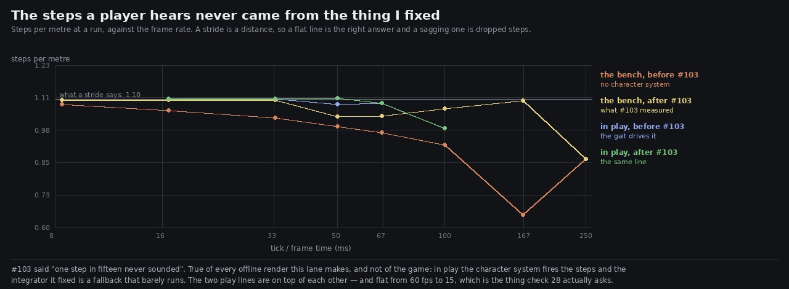

# Lane 5 — the steps a player hears never came from the thing I fixed

Branch `agent/squad5-gaitdriven`, off the integration head at `eb3687cb`. **No `src/` change.**

This is a correction to PR #103, which merged this morning. Its fix was right and its headline was
about the wrong thing, and this measures both halves properly.

## What #103 claimed

> At the 33 ms tick the game actually runs, roughly one step in fifteen never sounded.

Measured on a bench: `createFootsteps` driven directly with a constant speed and no character
system. That is exactly what an offline render does, and the number is correct for one.

## What a player is actually on

`drive` fires steps from the character system's stance edges when it has them, and only falls back
to the distance integrator when it does not. Asked in play, on the plaza's flagstones:

```
walking   28 steps, 26 of them from the gait
running   53 steps, 53 of them from the gait
```

**Every step of a run and all but two of a walk come from the gait.** The integrator #103 fixed is a
fallback that barely runs, so its carry bug could not have cost a player one step in fifteen.

## And the counterfactual says so directly

The honest way to price a fix is to take it out again. Play mode, paced to real time at five frame
rates, with #103 in and with its carry reverted:



```
run, steps per metre    16.7ms   33.3ms   50.0ms   66.7ms   100.0ms
with #103                1.102    1.102    1.104    1.085     0.987
with its carry reverted  1.102    1.102    1.081    1.085     0.987
                                           ^ the only cell that moves, by 2 %
```

Walking is identical in every cell. **#103 changed essentially nothing a player hears.**

## What it did change, and why it was still worth doing

Every offline render this lane makes drives the integrator, because a render has no character
system. So **every step measurement this lane has published was 7 % light**, and the evidence is now
right. That is a real thing to fix; it is just not the thing the PR said.

## The thing check 28 actually asks, now measured

Rubric check 28 is *nothing is missed at any frame rate*, and the frame rate that matters is the
player's. Paced to real time, steps per metre in play:

```
           16.7ms   33.3ms   50.0ms   66.7ms   100.0ms
walk        2.312    2.250    2.250    2.250     2.250     (a stride says 2.27)
run         1.102    1.102    1.104    1.085     0.987     (a stride says 1.10)
```

**Flat from 60 fps to 15 fps**, and at 10 fps a run loses 10 %. At that rate only 7 of 42 steps come
from the gait — the stance edges are being missed and the integrator is carrying the rest, which is
the design working. Nothing is missed anywhere a player is likely to be.

(One measurement trap worth writing down: the first version of this harness ran `__ZR_PLAY__.step`
in a tight loop, which advances the simulation faster than the wall clock. The audio's own tick is a
wall-clock `setInterval`, so it sampled him a handful of times and counted five steps where there
should have been thirty-six. Every frame is paced to real time now — a dt of 1/15 with a 1/15 s wait
after it, which is what a 15 fps machine is.)

## Reproduce

```bash
npm run build
node art/audio/2026-09-25-gaitdriven/gaitrate.mjs --dist dist --out /tmp/gaitrate
python3 art/audio/2026-09-25-gaitdriven/plot.py --play /tmp/gaitrate/gaitrate.json \
    --pre art/audio/2026-09-25-gaitdriven/play-pre103.json \
    --bench art/audio/2026-09-25-tickrate/before.json \
    --benchafter art/audio/2026-09-25-tickrate/after.json \
    --out art/audio/2026-09-25-gaitdriven/gaitdriven.jpg
```

**206 / 206 tests**, typecheck clean, build green. Nothing in `src/` changes on this branch.

**For whoever reads #103:** its fix stands and its guards stand; its claim about the player should
read "every offline render this lane makes was 7 % light on steps" rather than "one step in fifteen
never sounded".
