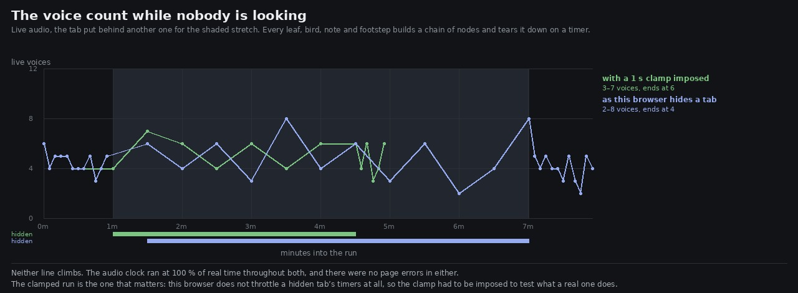

# Lane 5 — what the sound does while the player is looking at something else

Branch `agent/squad5-hidden`, off the integration head at `7468bb38`. **No `src/` change.**

Rubric check 48 — *hidden tab, suspended context, device change* — has scored **1** since the rubric
was written, and this lane called it untested in three reports without testing it. This tests it.

## The specific worry

Every event in the bed builds its own little chain of nodes and tears it down again through
`cleanupAt`, which is a `setTimeout`. A background tab clamps `setTimeout` to about once a second.
But the events are not scheduled by a timer — `scheduleUntil` fills four seconds of **audio** time
ahead on each tick, and the `AudioContext` does not slow down for a hidden tab. Ten voices a second
being created against one cleanup a second is a leak that exists only while nobody is watching,
which is the worst kind, and this lane has already shipped one leak of exactly that family
(`adEnvelope` leaving its gates at their exponential floor).

## What happened



**Neither line climbs.** The audio clock ran at 100 % of real time throughout both runs and there
were no page errors in either.

```
                        setTimeout       rAF     audio clock      voices
with audio, foreground     19.94/s     55.5/s          100 %       6 → 5
with audio, hidden 6 min   19.95/s      0.8/s          100 %       5 → 8   (2–8 across the stretch)
back in front              19.94/s     60.0/s          100 %       8 → 4
```

The tab really was behind: `document.hidden` read true at every 30 s sample taken from outside while
it was there, and rAF fell from 55 a second to 0.8. **So the game's frame loop stopping does not
disturb the audio at all** — which is worth knowing on its own, because the frame loop is rAF and
the audio tick is a `setInterval`, and nobody had checked they were independent.

## But that run could not answer the question, and the control is how I know

`setTimeout` ran at 19.95/s while hidden — exactly its foreground rate. Either Chrome exempts a page
that is making sound from timer throttling, or this headless Chrome does not throttle at all. Those
have very different consequences for a real player, so I ran the same probe **with no audio started**:

```
silent control, foreground   19.90/s      46.8/s
silent control, hidden       19.94/s       1.6/s
```

A silent hidden tab is not throttled either. So the exemption is not the reason — **this browser
simply does not clamp background timers**, and the six-minute run, clean as it is, says nothing
about what a real one would do.

## So the clamp was imposed instead

`--clamp` wraps `setTimeout` and `setInterval` in the page so that while `document.hidden` is true
no timer may fire sooner than a second after it is set. That is *stricter* than Chrome, which wakes
a hidden page once a second and then runs everything due in one go — so a run that survives this
survives the real thing.

```
                        setTimeout    audio clock     voices
clamped, foreground        19.94/s          100 %      6 → 4
clamped, hidden 4 min       1.39/s          100 %      4 → 6   (3–7 across the stretch)
clamped, back in front     19.18/s          100 %      6 → 6
```

The clamp plainly took effect — 1.39 timer callbacks a second against 19.94 — and **the voice count
did not move**: 3 to 7 while hidden, which is the band it oscillates in while visible, ending at 6.

The leak does not exist, and the reason is structural rather than lucky: throttling delays each
*wake-up*, it does not limit how many callbacks run per wake-up, so the cleanups arrive in batches
instead of singly. And the tick keeps up at 1 Hz because `scheduleUntil` fills four seconds ahead
every time it runs.

## Score

Check 48 goes from **1 to 3**, not higher, and the missing point is named rather than rounded away:

* **tested** — a hidden tab for six minutes with rAF stopped, and four minutes with every timer
  clamped to 1 Hz. No leak, no errors, the audio at full speed throughout.
* **not tested** — suspending and resuming the `AudioContext`, and a device change (headphones
  unplugged, or the output's sample rate switching under a running context). Both need hardware or
  an API this headless box does not have.

## Reproduce

```bash
npm run build
node art/audio/2026-09-25-hidden/hidden.mjs --dist dist --hidden 360 --watch 60 --out /tmp/hidden
node art/audio/2026-09-25-hidden/hidden.mjs --dist dist --hidden 180 --silent --out /tmp/hidden-silent
node art/audio/2026-09-25-hidden/hidden.mjs --dist dist --hidden 240 --clamp  --out /tmp/hidden-clamp
python3 art/audio/2026-09-25-hidden/plot.py --runs /tmp/hidden-clamp /tmp/hidden \
    --labels "with a 1 s clamp imposed" "as this browser hides a tab" \
    --out art/audio/2026-09-25-hidden/hidden.jpg
```

The silent run is not optional. Without it the clean six-minute result looks like an answer and is
not one.

**191 / 191 tests**, typecheck clean, build green. Nothing in `src/` changes on this branch.
