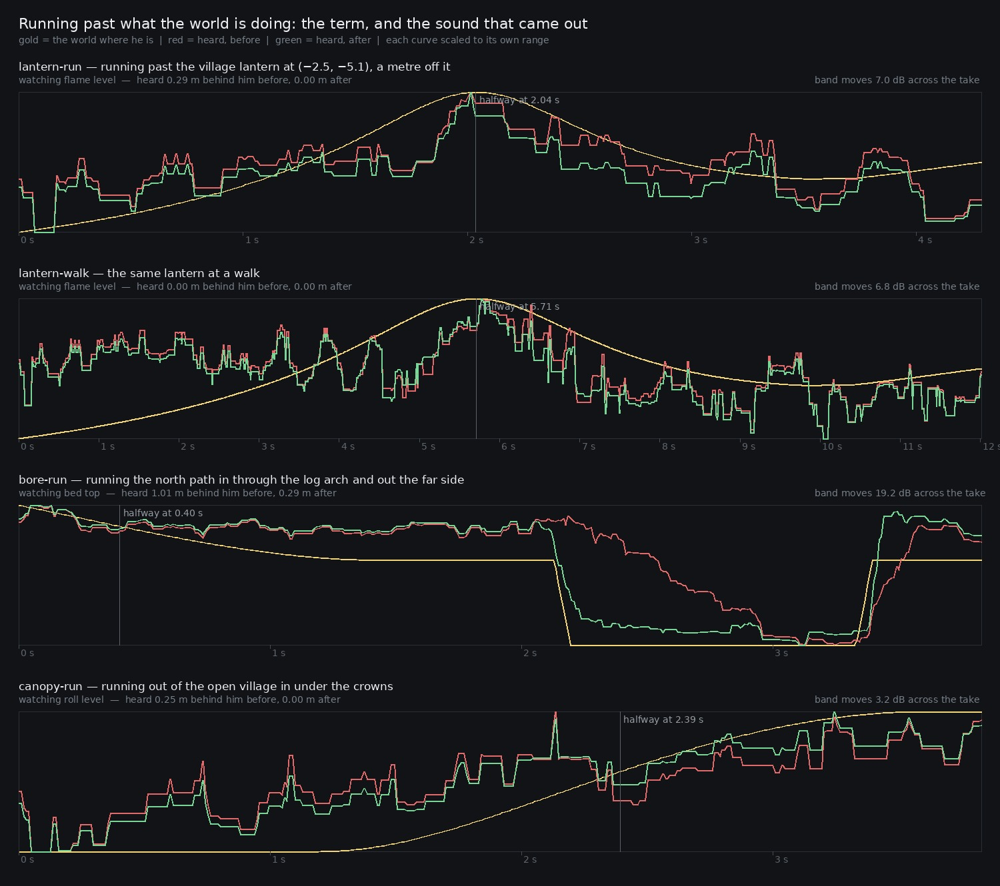
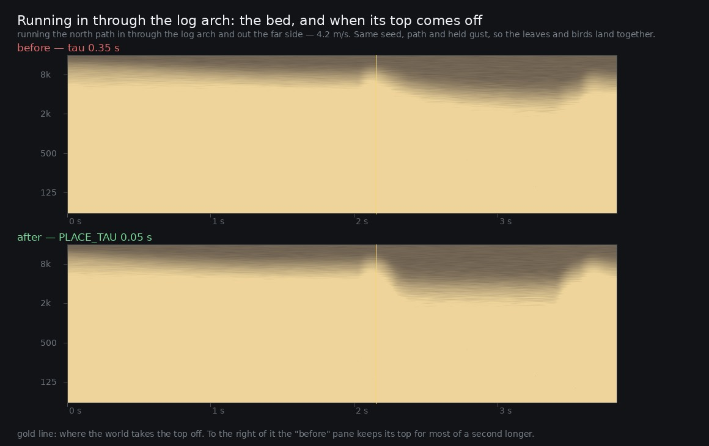

# Lane 5 — the world was arriving up to four metres behind him

Branch `cursor/squad5-passby-5535`, off the integration head at `72532ca9`.

Run out of the village into the wood and the crowns close over you — **2.8 metres after you are
under them**. Run in through the log arch and the bore shuts over you a metre and a half past its
mouth. Run past a lit lantern and it is loudest a metre after you have gone by. None of that is a
bug in any one place: it is one fact about the whole bed, which is that a smoothing time is a
distance once the listener has a speed, and every smoothing time in it had been chosen for weather.

The bed's spatial terms shipped on five different constants — **0.9 s** on the leaf roll's level,
**0.6** on the hall sends, **0.35** on the bed's top, **0.3** on the lantern flame and its pan,
**0.12** on the bore's duck. At the run the player actually has (4.2 m/s, `footsteps.ts`
`RUN_GROUND_SPEED`) those are 3.8, 2.5, 1.5, 1.3 and 0.5 metres of ground.

They are now one constant, `ambience.ts` `PLACE_TAU = 0.05` — one and a half ticks of the 30 Hz
update — and the same journeys arrive within **0.31 m** of him.

## Why nothing had seen it

Every measurement this lane has published came from a listener who was not moving. `at` renders
stand still, so every space term is a constant and the smoothing never does anything. The scripted
walk moves, but it walks abstract legs — five seconds of grass, five of dirt — and never crosses a
doorway, a bore mouth, a canopy edge or a lantern. The live recordings were made standing, or
walking short legs on the plaza. The rubric could not have caught it either: its fifty checks ask
what a place sounds like and what an event sounds like, and none of them asks whether the place
arrives where he is (see the amendment to check 13 below).

So the first half of this iteration is an instrument, in three small commits that change no
behaviour:

- `renderOffline({ pass: { from, to, speed } })` — walk the listener along a real line with every
  space term read from `surfaceAt` where he is, ticking at the game's own `TICK_MS` rather than the
  scripted walk's 20 Hz, because the quantity being measured is a lag and half of one is the tick.
- `{ gust }` — hold the weather. The render's gust swings the bed through its whole range in about
  ten seconds; on the first four-second lantern take **every band from 40 Hz to 11 kHz rose 17 to
  20 dB** between the start of the run and the lantern, and none of it was the lantern.
- `pass.lead` — stand still for four seconds first. Every smoothed parameter starts at whatever its
  node was built with, and at 0.9 s reaching the world takes eleven metres of a run; the first
  canopy take read −12.7 dB at its start and +18.4 at its end, almost none of it the canopy.

Each of those was a wrong answer before it was a fix. They are in the history in that order.

## The measurement

`lag.mjs` needs no browser and no audio. `setTargetAtTime(v, t, tau)` is exactly a one-pole —
`v0 + (target − v0)(1 − e^{−dt/τ})` — so the heard curve along a path can be computed to the
centimetre from the same `surfaceAt` the game reads and the same 62 pod positions the scene holds.
The gust is held, so everything that moves along a path moved because the listener did.

Two numbers per term per journey. **lag** is the shift, in metres of ground, that best lines the
heard curve onto the world's own. **miss** is the widest gap between them anywhere on the path, in
the unit an ear works in — decibels for a level, octaves for a cutoff, pan for pan.

```
tick 33.3 ms, gust held at 0.6. "was" is the constant each term shipped with before
"now" puts every positional term on ambience.ts PLACE_TAU = 0.05 s

--- canopy: the north path from the open village in under the crowns (10.0 m) ---
parameter      was      span   walk lag  walk miss    run lag   run miss    run now   miss now
roll level    0.90   5.19 dB     1.27 m    0.96 dB     2.84 m    2.01 dB     0.28 m    0.23 dB
flame level   0.30   6.84 dB     0.46 m    0.39 dB     1.21 m    1.03 dB     0.28 m    0.24 dB
flame pan     0.30  0.53 pan     0.47 m   0.04 pan     1.27 m   0.10 pan     0.28 m   0.02 pan
bed top       0.35  2.16 oct     0.58 m   0.19 oct     1.63 m   0.52 oct     0.28 m   0.09 oct
hall send     0.60   5.11 dB     0.89 m    0.67 dB     2.15 m    1.54 dB     0.28 m    0.22 dB

--- bore: the north path in through the log arch's mouth (8.0 m) ---
roll level    0.90   0.42 dB     1.34 m    0.22 dB     4.00 m    0.32 dB     0.29 m    0.09 dB
flame level   0.30   3.04 dB     0.47 m    0.35 dB     1.23 m    0.83 dB     0.28 m    0.23 dB
bed top       0.35  2.39 oct     0.56 m   1.87 oct     1.50 m   2.10 oct     0.29 m   1.70 oct
bore duck     0.12   6.94 dB     0.19 m    3.17 dB     0.49 m    5.34 dB     0.26 m    3.99 dB
hall send     0.60   0.41 dB     0.90 m    0.18 dB     3.02 m    0.28 dB     0.29 m    0.09 dB

--- hut: the west house's deck in through its door (4.0 m) ---
flame level   0.30   6.47 dB     0.48 m    1.02 dB     1.18 m    2.34 dB     0.28 m    0.62 dB
bed top       0.35  3.03 oct     0.61 m   1.61 oct     1.44 m   2.42 oct     0.31 m   0.97 oct
bore duck     0.12   4.22 dB     0.20 m    0.92 dB     0.50 m    2.06 dB     0.27 m    1.25 dB

--- lantern: past the village lantern at (-2.5, -5.1), a metre off it (12.0 m) ---
flame level   0.30  17.13 dB     0.43 m    1.77 dB     1.02 m    4.10 dB     0.27 m    1.14 dB
flame pan     0.30  0.64 pan     0.45 m   0.05 pan     1.08 m   0.13 pan     0.28 m   0.03 pan

--- bridge: south over the ravine bridge (13.3 m) ---
roll level    0.90   0.32 dB     1.59 m    0.18 dB     4.00 m    0.25 dB     0.27 m    0.08 dB
flame level   0.30  19.95 dB     0.44 m    2.25 dB     1.04 m    5.74 dB     0.28 m    1.33 dB
flame pan     0.30  0.68 pan     0.42 m   0.24 pan     1.06 m   0.33 pan     0.27 m   0.18 pan
hall send     0.60   0.52 dB     0.85 m    0.25 dB     4.00 m    0.37 dB     0.27 m    0.13 dB
```

4.00 m is the search cap, not a measurement: the roll and the hall on those two paths are somewhere
past four metres behind him and the shift search stops looking there.

**Even at a walk** it was 0.2 to 1.6 m. The gentlest reading in the table — the bore's duck at
0.19 m — is the only one that was already inside a stride.

## In sound

`passby.mjs` renders the same journeys through the real graph; the pair differs in the constants and
in nothing else — same seed, same path, same speed, same held gust, so the bed's leaves and birds
land at identical moments in both files and cancel out of the comparison. `passby.py` pulls the band
that carries each term out of the WAV as its **always-on level** (the 10th percentile of short-time
power across a rolling 0.2 s), which is the metric this lane scores places on and for the same
reason: a leaf flutter puts 40 dB into the top bands for 80 ms and a correlation has no defence
against one.

```
take           watched       speed   lag before     r    lag after     r    of the change heard
lantern-run    flame level   4.2 m/s       0.29 m  0.68       0.00 m  0.73        34 % →  36 %
lantern-walk   flame level   1.5 m/s       0.00 m  0.63       0.00 m  0.65        33 % →  34 %
bore-run       bed top       4.2 m/s       1.01 m  0.86       0.29 m  0.98                  —
canopy-run     roll level    4.2 m/s       0.25 m  0.65       0.00 m  0.88        61 % →  79 %
```



**The bore is the one to look at**, and it is the one the audio measures cleanly: 1.01 m behind him
before, 0.29 m after, and the fit tightens from r = 0.86 to 0.98. In the picture the world's own
top (gold) falls off a cliff at 2.3 s; the new bed (green) goes with it inside a tenth of a second,
and the old one (red) slides down for a further second — you are well inside the log before the log
sounds like one. `clips/bore-run-bed-{before,after}.mp3`.

It is plainer still as a spectrogram, where what is being argued about is visible rather than
inferred. The gold line is the moment the world takes the top off:



**The canopy take is better described by the second column than the first.** Its lag reads 0.25 m,
which is small, but the take only ever received **61 %** of the level change the world asked for
before and **79 %** after: at a run the 0.9 s had not finished arriving by the time the canopy edge
was behind him, so the wood never got as loud as it was supposed to. That is the half of this that
a lag does not describe, and it is the half a player hears as "the place did not arrive".

**The lantern takes are weak evidence and I am not going to pretend otherwise.** With the weather
held, the flame stands only 3 to 5 dB over the bed in its own bands (60–320 Hz), so the band moves
7 dB across a take of which the flame is a part — the shift search reads 0.29 m before against the
model's 1.02, and at a walk it resolves nothing at all. The peak lands at the right place in both.
The model is exact and the audio is consistent with it; the audio does not independently confirm it.
`clips/lantern-run-mix-{before,after}.mp3` is what a player would hear going past, mix and all.

## And in the real game

`live.mjs` drives play mode through the log arch three times with real key events, the character
system's own gait, the world's own gust and the live `setInterval` tick, and records the master:

```
simFrames 1191 over 15 s   voices 5-21   steps 73, gaitDriven true   pods 62
pageErrors []              enclosure max 1.00, 231 frames inside the bore
```

Which is worth exactly what it says. It proves the live path still works after the constants moved,
and it proves the term the offline pass reads out of `surfaceAt` is the one the game really feeds
the bed — the enclosure reaches 1.00 on every lap. It does **not** resolve the change: the master
carries the score and boots at a run, and measured on the recording the 2–8 kHz band swings as
widely between the laps as it does across the bore. That is the whole reason this lane measures
stems, and it is worth writing down rather than quietly rendering a stem and hoping nobody asks.

Two harness traps were paid for on the way and are in the script's header for the next person:
`__ZR_PLAY__.step` with `render: true` draws through SwiftShader in seconds while the audio ticks on
the wall clock — the first run of this logged **3 simulation frames against 12 seconds of audio** —
and at 4.2 m/s he is out of the wood in five seconds, so he has to be put back.

## The thing that could have gone wrong, measured

Shortening a smoothing time is only safe while the glide outlives the tick. If it does not, a moving
parameter becomes a staircase at 30 Hz — and a staircase on a gain is amplitude modulation, which is
the buzz this lane exists to remove. `PLACE_TAU` is 1.5 ticks, so by construction 22 % of each step
is still pending when the next arrives; and measured, the tick is not in the output:

```
the tick in the envelope, dB over the median of 10-50 Hz
take            30 Hz before   after    worst control before   after
lantern-run              2.4     2.8                     7.2     7.4
lantern-walk             6.8     6.8                     7.2     7.2
bore-run                 5.1     5.3                    10.2    10.2
canopy-run               5.1     5.2                    10.9    10.7
```

30 Hz sits *below* off-tick controls at 14, 18, 23, 27, 33, 37, 42 and 47 Hz in every take, and the
change moves it by at most 0.4 dB. There is no tick line in the bed; the envelope spectrum is simply
noisy, and 30 Hz is not special in it.

## What did not change, and why

**The weather's own terms keep their 0.55–0.9 s.** The gust is analytic — `wind.ts` is two sines at
0.37 and 0.11 rad/s plus a cubed push — so its fastest component has a **seventeen-second period**,
and a 0.9 s one-pole against a 0.06 Hz signal costs 0.4 dB of amplitude and a phase shift of 5 % of
a cycle. Those constants smooth nothing that was not already smooth, so moving them would be churn.
The one that matters, the leaf roll's level, carries both the weather and the crowns in one
multiply, and it went to `PLACE_TAU` because the shorter requirement wins and the weather does not
notice.

**The wind's lean keeps its 1.2 s** for the reason already written beside it: that term answers
turning your head, not walking, and #79's guards are on it.

**The bed's top is still smoothed in hertz, not in its own term.** The comment above the constants
says the closure is "geometric in frequency so the change is even as he walks in", and the
`setTargetAtTime` that carries it works in linear hertz, which undoes that — 95 % of the linear
travel from 18 kHz still leaves the cutoff a full octave above 900 Hz. I modelled the alternative
(`bed top*` in the table): smoothing the 0..1 term and mapping afterwards. At the old 0.35 s it was
worth 0.5 m of lag; at `PLACE_TAU` it is worth **0.05 m and 0.11 octaves**, because a short constant
has already taken the drag out. Hand-rolling a smoother in JS for a tenth of an octave is not worth
the code, so it is a finding and not a change.

**The bore mouth and the hut doorway are still crossed faster than the tick can follow, and no
smoothing time fixes that.** The bore's enclosure goes 0 → 1 in about 0.6 m of the real path; at a
run that is 0.14 s, or four ticks, so a 6.9 dB duck is delivered in four steps and the worst
instantaneous gap stays near 4 dB however short `PLACE_TAU` gets. The levers there would be the tick
rate (`TICK_MS`) or the fade distance in `surfaceAt`, and both change numbers this lane and others
have already published. Named, measured, not taken.

## Guards

Two, in different places because they answer different questions.

`ambience.test.mjs` — *a term that moved because HE did arrives at his pace, not the weather's*.
Runs `update` twice with the weather **and the facing** held and only the listener's place changed,
takes every parameter whose target moved, and requires each to have been aimed with `PLACE_TAU`. It
is the contract rather than the constant, so a spatial term added later with a literal time fails
here without anyone remembering this file exists. (Checked: putting the hall send back on 0.6 fails
it with "moved because the listener did and was smoothed over 0.6 s — at a run that is 2.52 m of
ground behind him".)

`lag.test.mjs` — the size of the constant is not a property of the bed alone but of the bed, the
tick and the player's legs together. One test bounds `PLACE_TAU` between one and three `TICK_MS`
and under a quarter-metre at `RUN_GROUND_SPEED`; the other walks the real bore path and the real
canopy edge and fails if the bed is more than 0.2 m behind a walker or 0.45 m behind a runner.
(Checked: `PLACE_TAU = 0.35` fails both.)

## Rubric

`RUBRIC_50_SOUND.md` check 13 was *"space changes fade across the threshold rather than switching at
a line"*, and the sound passed it at 4 while arriving four metres late, because the check only ever
asked about the shape of the fade and not where it lands. It now reads **"…and the fade arrives
where he is, not behind him"**. The score stays 4 on this branch's evidence; before it, on the same
wording, it would have been 2.

Nothing else moves. The scorecard in `2026-09-25-rubric/` is updated for the wording and the
citation only.

## Reproduce

```bash
npm run build
node art/audio/2026-09-25-lag/lag.mjs --out /tmp/lag                      # the model, ~3 s, no browser
node art/audio/2026-09-25-lag/passby.mjs --dist dist --tag after --out /tmp/lag
python3 art/audio/2026-09-25-lag/passby.py --takes /tmp/lag \
    --out /tmp/lag/passby.jpg --spectro /tmp/lag/bore.jpg
node art/audio/2026-09-25-lag/live.mjs --dist dist --out /tmp/lag         # play mode, the live graph
```

The `before` WAVs come from the build at `aacc71f0`, the last commit before the constants moved —
`git checkout aacc71f0 && npm run build && node …/passby.mjs --tag before`. `takes.json` holds the
journeys, the held gust and the lead-in, and is read by both scripts so the model and the renders
cannot drift apart. `pods.json` is the 62 pod positions as the scene reports them
(`__ZR_AUDIO__.stats().podSpots`).

**209 / 209 tests**, typecheck clean, build green, `playtest.mjs --only walk` 11 / 11 with no page
errors.
