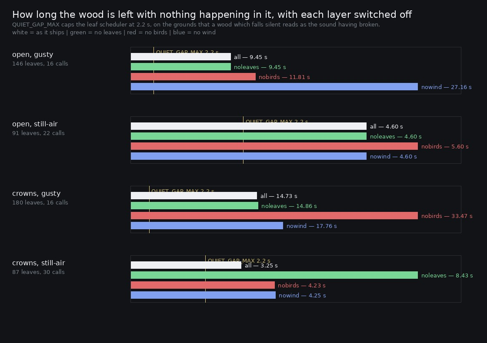

# Lane 5 — what each layer of the wood is worth, and the answer to last hour's question

> **Corrected 2026-09-26 — one number in this report is wrong, and it is understated.** `mute` was
> not muting the wind: `canopyMod` and `hushMod` are connected to the wind gains' AudioParams and
> a node connected to a param is summed with its automation rather than scaling it, so zeroing the
> level left the gust still driving the gain (found in `art/audio/2026-09-26-shadow2/`, fixed
> there). Every "no wind" take below therefore still had wind in it.
>
> Re-run on a build with the bug and one without (`art/audio/2026-09-26-relayers/`): the leaf and
> bird rows are **identical to the decimal**, the quiet gaps move by at most 0.05 s, and the one
> real correction is the sentence *"muting it costs 20.2 dB under gusty crowns"* — **it costs
> 29.2 dB.** The conclusion the report draws from it is strengthened, not overturned.

Branch `cursor/squad5-layers-5535`, **stacked on `cursor/squad5-recheck-5535`** (PR #156), which
ended on a question it could not answer: *if a leaf cannot be heard to move, can it be heard at
all?*

**It can, in exactly one case, which is the case it was written for.** Everywhere else it is
inaudible, and that turns out to be correct rather than a fault.

## The instrument

`renderOffline({ mute: ['flutters'] })` switches a layer of the bed off — `flutters`, `birds` or
`wind`. Every random draw still happens and every node is still built; a muted layer is simply not
connected to the output. So a take with one layer off is the **same forest with one thing silent**
rather than a different forest: the birds call at the same moments whether the leaves are heard or
not, which is the only way the difference between two takes is the layer and not the seed. The event
counts confirm it — 146 flutters and 16 calls in every one of the four `open, gusty` takes.

Sixteen takes: two places (open sky, closed crowns) × two gusts × four mutes, 150 s each.

The second gust matters more than it looks. `GUST_KNEE` gates the wind layers off below 0.22, so
half the takes are held at 0.12, **where the bed is silent by design** — and that is the case the
flutters exist for. A take at a steady mid gust never visits it, which is why five days of standing
renders never asked this.

## The measure

The longest stretch with nothing audible happening, **A-weighted**, and that is not a detail:
broadband the level is dominated by 60–250 Hz, where a leaf has nothing at all, so a broadband quiet
metric cannot see the flutters however loud they are. Smoothed over 0.3 s, because one 50 ms frame
dipping under a threshold is not a wood falling silent. The threshold is the full take's own 10th
percentile plus 3 dB, shared across a condition's four mutes so that muting can only lengthen a gap.



```
                        longest quiet, and what each layer is worth
                          all   no leaves   no birds   no wind
open, gusty              9.45       9.45      11.81     27.16 s
open, still air          4.60       4.60       5.60      4.60 s
crowns, gusty           14.73      14.86      33.47     17.76 s
crowns, still air        3.25       8.43       4.23      4.25 s
```

**Under closed crowns with the air still — the one case the flutters were written for — taking the
leaves away takes the longest silence from 3.25 s to 8.43 s.** That is the comment's own claim,
measured: *"the wood could otherwise fall to nothing for five seconds at a time… a leaf turning over
is the answer to that, not a floor put back under everything."* Eight and a half seconds is what
"otherwise" looks like.

**Everywhere else the leaves are worth nothing measurable**: 9.45 → 9.45, 4.60 → 4.60, 14.73 →
14.86. Above the knee the wind is playing and the leaves are inside it.

That is the answer to last hour's question, and it is a better answer than "they are too quiet":
they are as loud as they need to be, in the one place they are needed, and inaudible in the places
they are not. The stereo-width change of #156 measured like its before for the same reason.

## Two other things the takes say

**The birds carry the wood far more than the leaves do.** Muting them stretches the longest silence
from 14.73 s to 33.47 s under gusty crowns and from 9.45 to 11.81 in the open. They are the sparse
layer that has the most to say.

**The always-on floor belongs almost entirely to the wind**, and only where the crowns are closed:
muting it costs 20.2 dB under gusty crowns and 3.4 dB in the open, against 0.0 to 0.3 dB for either
event layer. Which is the shape the owner's complaint wanted — the bed is a swell, and the quiet
moments are events rather than a floor.

## No behaviour changed

`mute` is an offline option; nothing in play reads it. What landed besides the instrument is the
guard below, and the finding.

## Guard

`ambience.test.mjs` — *below the gust knee the leaves are the only thing keeping the wood from
silence*. Runs five minutes at half the knee, records the time of **every** event the bed makes —
flutters, calls and glints together, which is the stream that actually matters and which no test
watched — and requires the longest gap between any two of them to be inside `QUIET_GAP_MAX`.
(Checked: lifting the cap fails it with "the wood was left with nothing for 5.17 s below the gust
knee".)

## Reproduce

```bash
npm run build
node art/audio/2026-09-25-layers/layers.mjs --dist dist --out /tmp/layers --seconds 150
python3 art/audio/2026-09-25-layers/layers.py --takes /tmp/layers \
    --out art/audio/2026-09-25-layers/layers.jpg
```

`clips/crowns-still-air-{all,noleaves}.mp3` is the pair the finding rests on: the same two minutes
under closed crowns with the air still, with and without the leaves.

**221 / 221 tests**, typecheck clean, build green.
