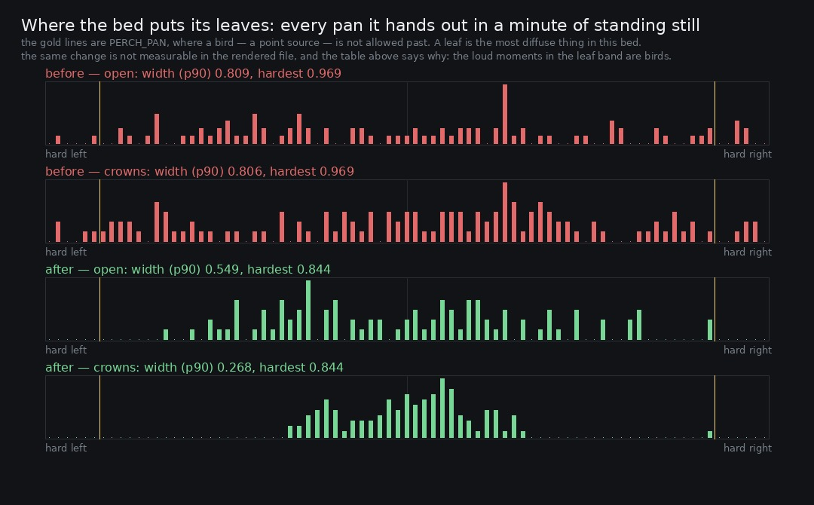

# Lane 5 — a leaf was allowed further out than a bird, and it is not audible that it isn't any more

Branch `cursor/squad5-recheck-5535`, off the integration head at `60085f03`.

Two things in this one: a re-check of the mix that the last six changes could have moved, and a
change to the leaf flutters whose **only honest verdict is that the file does not move**.

## First, the mix still holds

`level.test.mjs` guards the gain staging against `WORST_CASE_PEAK_DBFS`, which is a **recorded
measurement, not a live one** — the test checks arithmetic against the trim and can never catch a
drift. It was last re-measured at 09:36 today, and six lane-5 changes have landed since. Three of
them push on level: a bird's distance and shadow moved onto a gain of their own and the envelope's
floor is attenuated with it (#147); a bird's distance now follows the listener, so he can walk right
up to one (#143); and retiring birds one at a time made the running wood 1.9 dB nearer (#152).

The same worst case #63 was sized against — running and jumping on the flagstones under the densest
cluster of lanterns, with the score playing — captured off the live master on today's head:

| | 09:36 | now | |
| --- | ---: | ---: | --- |
| integrated loudness | −23.9 LUFS | **−23.7 LUFS** | inside the −26 to −17 band |
| true peak (4× oversampled) | −7.0 dBFS | **−7.5 dBFS** | 7.5 dB of room left |
| clipped samples | 0 | **0** | |
| the take | 177 steps, 51 landings, 26 shoves | 174 steps, 51 landings, 33 shoves | |

Six changes cost nothing; the peak is half a decibel *lower*. Worth knowing that
`WORST_CASE_PEAK_DBFS = −16.7` is now conservative by 2.8 dB — the measured peak is −7.5 after a
+12 dB trim, so −19.5 before it. Conservative is the safe direction, so it stays.

## Second, the leaves

`PERCH_PAN` caps a bird at 0.85 and says why: *"a call hard against one channel does not read as
'over there', it reads as a fault in the mix — nothing in a wood is at ninety degrees and zero
distance."* `WIND_LEAN` is 0.35 for the matching reason: *"a bird is a point and the air is not."*

The leaf flutters were drawn uniformly over ±0.9 with a further ±0.15 per leaf in the group. So the
**most diffuse thing in the bed was allowed further out than the most localised**, and measured on
the graph it went to **0.969** — nearly hard against a speaker.

They also took no notice of the canopy, which is the term that describes *these very leaves*:

```
what the bed hands out, a minute of standing still, read off the graph
take               voices    width (p90)  hardest
before open            94          0.809    0.969
before crowns         125          0.806    0.969
after  open            94          0.549    0.844
after  crowns         125          0.268    0.844                 a bird is capped at 0.85
```

Two places whose whole difference is whether there are leaves overhead, and the leaf field was
**three thousandths apart**. Now the open plaza keeps a wide ring of trees around him and closed
crowns bring the leaves nearly overhead — the same reasoning, and nearly the same number, as the
wind's lean.



(The isolated bars out near the gold lines in the lower two panes are bird voices, which are capped
at `PERCH_PAN` by design. Nothing leaks past it.)

## And the honest part: the file does not move

Two minutes standing still in each place, rendered on both builds, `bed` stem:

```
                                   from the file
take               frames flutters   median |pan|  width (p90)  hardest
before open           574      115          0.459        0.811    0.868
before crowns         247      146          0.564        0.819    0.878
after  open           575      115          0.457        0.811    0.868
after  crowns         247      146          0.564        0.819    0.879

side / mid in 0.9-3.5 kHz:  open -4.22 -> -4.21 dB,  crowns -3.95 -> -3.91 dB
side / mid broadband:       open -2.27 -> -2.27 dB,  crowns -3.96 -> -3.95 dB
```

**Nothing. Hundredths of a decibel, three decimal places of pan.** By the brief's own rule that is a
failure to report, not a result to claim, so here is the reason, which took a second measurement to
find.

The instrument was wrong first: it selects short-time frames where the 900–3500 Hz band stands over
its own quiet level and reads their pan. But in that band **the loud moments are bird calls** — the
p99 frame sits **21 dB over the p10**, and a bird is an order louder than a leaf. So the histogram
of "loud frames in the leaf band" is a histogram of birds, whose pans this change does not touch,
and it came out identical because it was measuring the wrong thing.

Correcting for that does not rescue the claim, it explains it: leaves lift their own band's
**median** by 2 to 3 dB, so whatever they do to the stereo image is a small term inside a band whose
loud moments belong to something else and whose steady level belongs to the roll. A whole-take
side/mid is dominated by those two. The leaves are simply too quiet to be heard moving.

So what landed is a correctness fix with a guard, not an audible improvement, and the report says
so. The durable value is the invariant: nothing diffuse may sit outside `PERCH_PAN` again, and the
canopy term now reaches the one part of the bed it is literally named after.

**The question this leaves** is the one worth taking next: if a leaf cannot be heard to move, can it
be heard at all? `QUIET_GAP_MAX` exists because the flutters are what keeps the wood from falling
silent for five seconds at a time — so they are doing a job — but 2 to 3 dB on a band's median is
not much of one, and nobody has measured what the bed sounds like without them.

## Reproduce

```bash
npm run build
node art/audio/2026-09-24-level/worstcase.mjs --dist dist --out /tmp/worst --seconds 70
ffmpeg -y -i /tmp/worst/worst.webm -ar 44100 -ac 2 /tmp/worst/worst.wav
python3 art/audio/2026-09-25-headroom/verdict.py --take /tmp/worst/worst.wav

node art/audio/2026-09-25-leaves/render.mjs --dist dist --tag after --out /tmp/leaves
node art/audio/2026-09-25-leaves/scheduled.mjs --out /tmp/leaves
python3 art/audio/2026-09-25-leaves/width.py --takes /tmp/leaves --before /tmp/leaves-before \
    --out art/audio/2026-09-25-leaves/width.jpg
```

`scheduled.mjs` needs no browser: it drives the bed against a stand-in for WebAudio and reads the
pan off every voice, which is the only instrument that can see this change at all.

## Guard

`ambience.test.mjs` — *a leaf never sits further out than a bird, and the crowns bring it in*. Runs
the bed for a minute at canopy 0 and at canopy 1, requires **every** panned voice to sit inside
`PERCH_PAN`, and requires the field to be at least 0.1 narrower under closed crowns. (Checked:
opening the width back up fails it with "something in the bed sits at 0.947, past the 0.85 a bird is
held to".)

**220 / 220 tests**, typecheck clean, build green, `playtest.mjs --only walk` 11 / 11 with no page
errors.
