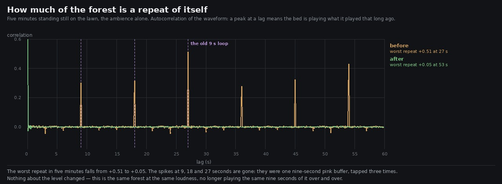

# Lane 5 — the forest was playing the same nine seconds over and over

Branch `agent/squad5-loop`, off the integration head at `d367cfbf`.

Check 4 of `art/audio/RUBRIC_50_SOUND.md` is *nothing in it is periodic: no LFO an ear can lock onto
after a minute*. I scored it **3** and wrote beside the score that it was **believed rather than
measured** — every modulator is a seeded random walk and a test forbids a held tone, so it looked
safe. It was not safe. That note is the only reason this got found.

## What was there

The whole bed is tapped off **one pink-noise buffer**, and that buffer was **nine seconds long and
looped**. Three sources played it:

```
bedSrc     from the start
leafSrc    from a third of the way in   — "so the two wind layers are not the same noise"
flameSrc   from two thirds of the way in
```

An offset is the same noise delayed. The comment claimed otherwise and was wrong about its own line.

Five minutes standing still on the lawn, autocorrelating the waveform — a value at a lag is how much
of what you are hearing is literally what you heard that long ago:

```
lag      9 s      18 s     27 s
r      +0.301   +0.315   +0.513
```

**Half the forest, at twenty-seven second intervals, was a repeat.** There were spikes at every
multiple of nine out to the end of the window.

## What it is now



```
                      worst repeat in five minutes
before                +0.513  at 27 s
after                 +0.052  at 53 s   — no identifiable period at all
```

Three changes, and the third is the one that does most of the work:

1. **The buffer runs 19 s rather than 9.** Costs 3.4 MB more (3.0 → 6.4 MB of buffer).
2. **Each tap plays it at its own rate** — 1, `LEAF_RATE` 0.84, `FLAME_RATE` 0.71 — instead of at
   the same rate from a different offset. Pink noise is self-similar under time-scaling, so a tap
   played slower is still pink; what it is not is the other tap, at any lag. The rates are chosen
   clear of simple ratios: at 5/6 or 4/5 two taps re-align every five or six times round.
3. **Each tap's rate wanders** ±2 % on a slow random walk (`PINK_DRIFT`, 0.03 Hz). Lengthening a
   buffer only buys seconds per megabyte; a rate that drifts means the loop never comes round to the
   same place twice, and a repeat that never lines up is not a repeat. Inaudible in itself — noise
   has no pitch to shift — and it costs one envelope per tap.

## The flame was the third tap, and it needed measuring separately

The lawn has no lantern in earshot, so it could not see `flameSrc`. Standing a metre from a pod —
which is the **loudest never-stopping place in the world** at −60.2 dBA — with the first two taps
already fixed:

```
beside a pod lantern       r at 19 s
flame still undrifted        +0.160
flame drifted                +0.002
```

That also explains a number that would otherwise look odd. With only the two wind taps fixed, the
lawn still read +0.095 at 19 s; with the flame fixed it reads +0.001. The residue at the lawn was
never `bedSrc` — it was the village's pods summing in from a distance.

## This is not a level change

That has to be true or it is a different change wearing this one's evidence. Five minutes at each
place, before against after:

```
                   the lawn            beside a pod
always-on p10    -51.6 → -51.4 (+0.2)  -48.1 → -47.9 (+0.1)
p50              -46.3 → -46.1 (+0.1)  -44.7 → -44.6 (+0.1)
p90              -39.0 → -39.0 ( 0.0)  -38.1 → -38.1 ( 0.0)
60-250 Hz        -56.2 → -56.2 ( 0.0)
250 Hz - 1 kHz   -59.9 → -60.0 (-0.1)
1-2 kHz          -75.3 → -75.3 ( 0.0)
2-4 kHz          -82.4 → -82.5 (-0.1)
```

Same forest, same loudness, same colour. It has stopped repeating itself.

## What did not change, and is not a fault

The **envelope** autocorrelation is 0.261 before and 0.257 after, peaking near 26 s. That is not a
loop: the control buffers are 47 s and there is no peak at 47 (r = −0.02). It is the natural
correlation time of a slow random walk — a gust takes tens of seconds to forget itself, which is
what wind does. Nothing here was aimed at it and nothing here moved it.

## The guards

`src/audio/ambience.test.mjs`, two new tests (17 in the file):

* **the forest does not play the same nine seconds over and over** — the buffer must be at least
  15 s, the taps must not share a rate, and for every `k` from 1 to 8 no tap may land within 0.03 of
  a whole turn of another (which is the same fault with a longer period), and the wander must exist
  and be small and slow.
* **both taps of the pink buffer are driven, and driven differently** — found by the pink buffer's
  own length, because the flame taps a *different* looping stereo buffer and the first version of
  this test caught it by accident. Every tap must have an envelope on its rate.

## Listen

`clips/lawn-{before,after}.mp3` — seventy-five seconds on the lawn, one common +16 dB. The before is
eight turns of the same nine seconds.

## Reproduce

```bash
npm run build
node art/audio/2026-09-25-loop/repeat.mjs --dist dist --out /tmp/loop --seconds 300
node art/audio/2026-09-25-loop/repeat.mjs --dist dist --at -0.2,-1.2 --out /tmp/loop-pod --seconds 300
python3 art/audio/2026-09-25-loop/period.py --before /tmp/loop --after /tmp/loop-after \
    --out art/audio/2026-09-25-loop/loop.jpg
node --test src/audio/ambience.test.mjs
```

**198 / 198 tests**, typecheck clean, build green. Nothing outside `src/audio/` and `art/audio/`.

Check 4 was a 3 on trust and is a 3 on evidence — the same number, honestly held this time. It is
not a 4 because the envelope's own 26 s correlation is measured but not explained beyond "that is
what a slow random walk does".
