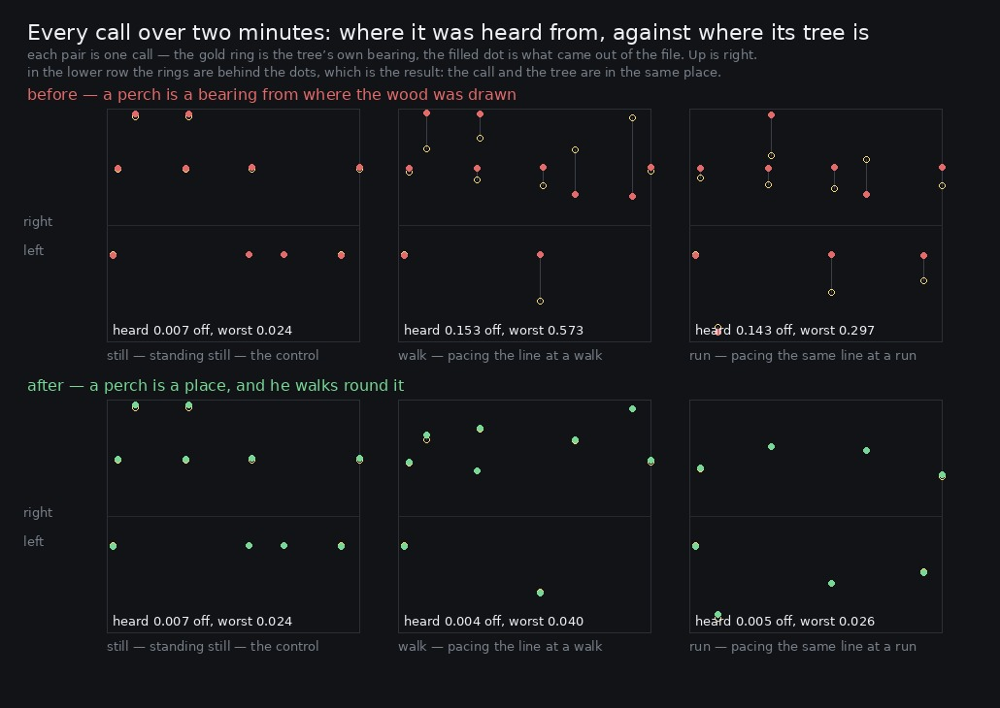

# Lane 5 — the wood was painted on a sphere around him

Branch `cursor/squad5-parallax-5535`, **stacked on `cursor/squad5-turning-5535`** (PR #139) because
both change `ambience.ts`'s perches. Off the integration head at `78f530a2`.

A perch was stored as a **bearing and a distance from the spot the wood was drawn at**, and it kept
both until Link had walked `PERCH_RESEED_M` — twenty-five metres — from that spot. Inside that
radius a bird did not move relative to him at all. He could cross the plaza and walk back and every
call came from the same side, at the same loudness, with the same brightness; and then the whole
wood rearranged at once when he crossed the line.

A perch is now a **place**: a point in the world, with its bearing and its distance read from where
he is standing when the call is made, and re-read every tick while the call is still going.



In the top row the gold rings and the filled dots are joined by a grey stick — the stick is the
error. In the bottom row the rings are behind the dots.

## The measurement

`perchSpots` (new) publishes where the six birds are in world metres. `birdSpots` publishes the
bearing and distance each call was given and the context time it sounded. A `pass` walks a known
line at a known speed with the facing along it, so where he was standing at any moment is exact.
Nothing has to be inferred.

Two different questions get two different answers, and the difference between them is the point:

- **booked** — what the scheduler decided, which happens up to four seconds before the call is
  heard. Reading `birdSpots`.
- **heard** — where the voice actually was, read out of the stereo file with the estimator from
  `2026-09-25-turning`: equal-power panning inverts to `p = 4/π·atan(√(R/L)) − 1`, each kind read in
  its own band, against the bed measured in the second before the call.

The same 21 m line across the plaza, paced for two minutes at three speeds. It never leaves the
re-seed radius, which is where the fault lives. `still` is the control — he does not move, so
nothing may change in any version of the code, and it is the instrument's own floor.

```
take             calls   booked off  as an angle   heard off   worst   n   distance off   worst  in level
before still        17        0.000         0.0°       0.007   0.024  10         0.0 m   0.0 m    0.00 dB
before walk         17        0.159        20.4°       0.153   0.573  10         4.8 m   9.7 m    1.93 dB
before run          17        0.695        48.9°       0.143   0.297  10         3.6 m   8.6 m    1.93 dB
after still         17        0.000         0.0°       0.007   0.024  10         0.0 m   0.0 m    0.00 dB
after walk          17        0.099        18.0°       0.004   0.040   9         1.9 m   5.3 m    0.63 dB
after run           17        0.630        43.5°       0.005   0.026   8         1.9 m   6.8 m    0.69 dB
```

**The heard bearing error collapses to the instrument's floor.** 0.153 pan units at a walk becomes
0.004, and 0.143 at a run becomes 0.005 — both *below* the 0.007 the still control reads, which is
to say both are noise. The worst call in the take goes from **0.573 pan units** — a bird two thirds
of the way to one side of him when its tree was near centre, 42 degrees out — to 0.040.

**The distance a call is given is now the distance its tree is at**, within the lookahead: 4.8 m of
median error becomes 1.9 m, and the worst 9.7 m becomes 5.3. That is worth 1.93 dB of level before
and 0.63 after, and rather more in colour — a call is filtered at `7000 − 5200 × distance`, so 4.8 m
of error is 890 Hz of cutoff.

**Standing still, nothing changed at all**: 0.000 booked, 0.007 heard, 0.0 m, in both builds.

## The two columns that did not move, and why

The **booked** column is almost unchanged — 20.4° → 18.0° at a walk, 48.9° → 43.5° at a run — and
that is correct rather than a failure. It is the **four-second lookahead**, not the perch model: a
call is booked from where he is at booking time, and by the time it sounds he has walked six metres
at a walk or seventeen at a run. What fixes the *heard* bearing is the register of live voices from
PR #139, which now re-reads the perch's direction from the listener every tick instead of only its
facing. The booked distance keeps its 1.9 m of lookahead error for the same reason, and that one is
**not** fixed here: the level and the filter are inside each note's envelope rather than on a
parameter that can be re-aimed.

So the two branches are worth stating together. Without #139 nothing re-aims and the heard bearing
*is* the booked one, 49 degrees out at a run. With #139 alone the facing was tracked but the
direction to the tree was frozen, which is the 0.153 above. Both are needed for the 0.004.

## Also fixed, quietly

`perchShadow` used to reconstruct the perch's world point from the anchor and the stored bearing
every time it was asked. It now reads the point, which is the same number by construction and one
fewer place for the two representations to disagree.

## Listenable

`clips/{walk,run}-{before,after}.mp3` — thirty seconds of the pace each way. The thing to listen for
is a bird calling twice from the same tree while he walks past it: before, the two calls are in the
same place; after, the second is further round.

## Named, not taken

**A call's level, colour and hall share are still booked four seconds early** (1.9 m median, 5–7 m
worst, 0.6–0.7 dB). Following those needs a gain node of its own per voice, because the level is
baked into the envelope rather than sitting on a parameter.

**A bird's occlusion is still booked four seconds early too**, for the same reason, and unlike the
bearing that error grows with distance travelled rather than with turning.

**`PERCH_RESEED_M` is untouched at 25 m.** With a perch as a place, re-seeding is only about *which*
birds are within earshot rather than where they are, which is what it always said it was for. What
a re-seed now does that it did not before is move six birds to new trees in one instant while he is
standing in the middle of them; that is worth a look, and it is not looked at here.

## Reproduce

```bash
npm run build
node art/audio/2026-09-25-parallax/walkby.mjs --dist dist --tag after --out /tmp/parallax
python3 art/audio/2026-09-25-parallax/walkby.py --takes /tmp/parallax \
    --out art/audio/2026-09-25-parallax/walkby.jpg
```

The `before` WAVs come from the tip of `cursor/squad5-turning-5535`. `takes.json` holds the three
takes and is read by both scripts.

`pass.loop` was added for this: a single traverse of a 21 m line is fourteen seconds and the wood
calls eleven times a minute, so anything needing several calls from the same perches needs him to
stay in that part of the world. Pacing is that; teleporting back to the start is not.

## Guard

`ambience.test.mjs` — *walk past a tree and the bird in it goes past you*. Stands at the origin long
enough to draw the wood and hear it, walks twelve metres (inside the re-seed radius, so it must be
the same six birds from a different place), and requires every call made from there to carry the
bearing **and** the distance its own tree has from there, to the three decimals `birdSpots`
publishes. Then it requires that the walk was worth something: at least one bird that called from
both places must have moved. (Checked: freezing the perch back to the anchor fails it with "the coo
came from 0.315 and its tree is at −0.150 from where he is standing".)

**211 / 211 tests**, typecheck clean, build green.
