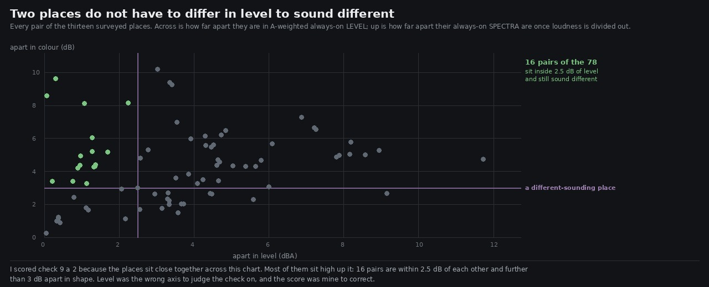

# Lane 5 — I scored my own check on the wrong axis

Branch `agent/squad5-gorge-term`, off the integration head at `06c85a10`. **No `src/` change.**

Check 9 of `art/audio/RUBRIC_50_SOUND.md` — *two places a player can name sound different, and the
difference is the right way round* — is starred, and I gave it a **2**, which is the one thing
keeping the rubric from clearing its own ★ rule. The evidence I gave was that six named places sit
inside 2.5 dB of each other A-weighted.

That was the wrong measurement for the question. Level is one axis. A place is not only louder or
quieter than another — it is a different colour, and a listener has no trouble at all telling the
plaza from the forest floor at the same loudness.

## Two axes, and most of the world is high on the second



Every pair of the thirteen surveyed places. `level` is the A-weighted always-on difference — what I
scored on. `colour` is the RMS difference between their always-on spectra **after each is normalised
to the same broadband level**, so loudness is divided out and only shape is left.

```
across all 78 pairs:  level apart   0.1 to 11.7 dB  (median 3.5)
                      colour apart  0.2 to 10.2 dB  (median 4.3)

16 pairs sit inside 2.5 dB of level and still differ by more than 3 dB in shape
```

So the places do sound different, and more of the difference is in colour than in level. **Check 9
goes from 2 to 3 and check 15 from 2 to 3**, and the ★ rule clears. The remaining thing stopping the
rubric shipping is check 27, which is a real hole rather than a mis-score.

## But one part of what I said was true, and this says it better

The pairs that genuinely sound alike are not random — they are **the open outdoors**:

```
grove-trail / grove-deck        0.1 dB level   0.2 dB colour
plaza / lawn                    0.4           0.9
forest-floor / grove-trail      0.3           1.0
north-clearing / bridge-midspan 2.2           1.1
north-clearing / lookout        0.4           1.2
```

and the pairs that sound most unlike each other are, without exception, **an enclosed place against
anything else**:

```
forest-floor / far-log          3.0 dB level  10.2 dB colour
lookout / far-log               0.3            9.6
north-clearing / far-log        0.1            8.6
forest-floor / log-bore         6.9            7.3
```

The three places with wood round the listener — the far bank's log, the arch's bore, a hut — are
each a place. Outdoors, a paved stone circle in a clearing, an open plateau dais and mid-span over
an eight-metre ravine are within 1.7 dB of one another in shape. **That is the specific weakness,
and it is narrower and more actionable than "everywhere sounds the same".**

Notably `bridge-midspan / lookout` is 1.7 dB apart in colour. Standing out over a ravine ought to be
a different place from standing on a plateau, and the term meant to do it works — forcing `gorge`
from 0 to 1 at mid-span gives **+3.0 dB between gusts and in them**, +1 to +2 dB across every band,
monotone through 0.5, which is the same size as the canopy's effect. It moves the level and barely
moves the shape, and shape is what tells two open places apart.

## Listen

Two pairs, one common +16 dB, sixty seconds each:

```
clips/lookout.mp3   clips/far-log.mp3       0.3 dB apart in level, 9.6 dB apart in colour
clips/grove-trail.mp3   clips/grove-deck.mp3    0.1 dB and 0.2 dB — the same place twice
```

The first pair is the case for the re-score: the same loudness, obviously not the same place. The
second is the case against complacency: a set stone on the trail and a veranda a storey above it are
the same sound to two tenths of a decibel.

## Reproduce

```bash
npm run build
node art/audio/2026-09-24-standing/survey.mjs --dist dist --out /tmp/floor --seconds 90
python3 art/audio/2026-09-25-places/apart.py --takes /tmp/floor \
    --out art/audio/2026-09-25-places/apart.jpg
node art/audio/2026-09-24-standing/term.mjs --dist dist --at 3.9,37.08 --term gorge --values 0,0.5,1
```

**196 / 196 tests**, typecheck clean, build green. Nothing in `src/` changes on this branch — the
change here is to two scores and the reason for them.
