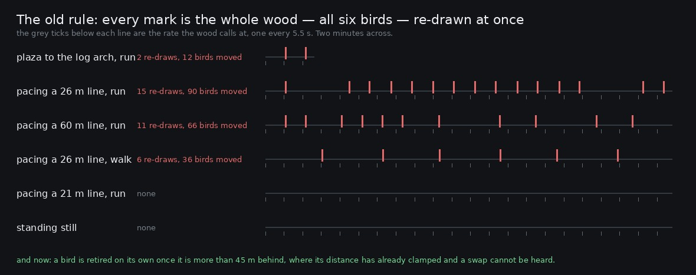

# Lane 5 — the wood was re-drawn more often than it spoke

Branch `cursor/squad5-reseed-5535`, off the integration head at `14fda29d`.

`2026-09-24-perches` built the perch system to fix this: *"216 calls over twenty minutes came from
216 places and a kind's calls scattered 0.47 across a ±0.85 field — indistinguishable from uniform.
A wood does not do that. It holds a handful of individuals, each in its own tree, each calling from
the same direction over and over."*

It held while he stood still. **Running across the village put the scatter straight back**, because
of the rule that retired the birds: when the listener is more than `PERCH_RESEED_M` — twenty-five
metres — from the spot the wood was drawn at, draw the whole wood again around where he is now. Six
new bearings, six new distances, all in the same instant.

That is a pure function of the route, so it can be computed exactly with no browser, no audio and no
seed. Against a wood that calls about once every 5.5 s:



```
plaza to the log arch (one way, run)     14 s    2 re-seeds  one every  7.2 s  =  12 birds moved, 0.77 per call
plaza to the north grove (one way, run)  12 s    1 re-seed   one every 11.7 s  =   6 birds moved, 0.47 per call
pacing a 26 m line, 2 min at a run      120 s   15 re-seeds  one every  8.0 s  =  90 birds moved, 0.69 per call
pacing a 60 m line, 2 min at a run      120 s   11 re-seeds  one every 10.9 s  =  66 birds moved, 0.50 per call
pacing a 26 m line, 2 min at a walk     120 s    6 re-seeds  one every 20.0 s  =  36 birds moved, 0.27 per call
pacing a 21 m line, 2 min at a run      120 s    0
standing still, 2 min                   120 s    0
```

**Running from the plaza to the log arch re-drew the whole wood twice in fourteen seconds.** Two
calls in three arrived after all six birds had jumped to unrelated bearings. A listener who noticed
that the dove was behind him was wrong again within a few seconds, every time he moved.

Note the two zero rows. Standing still never fired it, which is why nothing this lane measured ever
saw it: every `at` render stands still, and pacing a 21 m line — inside the radius — is exactly the
journey `2026-09-25-parallax` used. The fault lived in the gap between "he is not moving" and "he
has gone somewhere".

## The change

A bird is retired **on its own**, once it is more than `PERCH_DROP_M` (45 m) behind him — and the
one that replaces it is drawn into the widest gap the other five leave in the bearings round him, so
the wood stays spread without going back to a ring.

45 m is chosen so the swap cannot be heard. Past `PERCH_FAR_M` (28 m) a perch's distance is already
clamped at 1, so a bird out there sounds identical wherever it is: same level, same cutoff, same
hall share. The only thing a swap can change is its bearing, and a bird of that kind will not call
again for about half a minute.

`perchAnchor` and `PERCH_RESEED_M` are gone. The wood is drawn once, at the spot the context starts.

## Measured

The same 60 m line through the village, paced for two minutes at a run — the journey the model puts
eleven whole-wood re-draws on. `still` is the control.

```
                            calls   birds moved   call distance p10/median/p90   median level
before  still                  16        0        0.48 / 0.70 / 0.87  (13/20/24 m)   −5.4 dB
before  cross                  12       66        0.49 / 0.90 / 1.00  (14/25/28 m)   −7.8 dB
after   still                  16        0        0.48 / 0.70 / 0.87  (13/20/24 m)   −5.4 dB
after   cross                  15       21        0.46 / 0.75 / 1.00  (13/21/28 m)   −5.9 dB
```

**66 bird-moves become 21**, and the 21 are one at a time, each of a bird already past the clamp.
`rehomed` is a new count in the stats so a harness can read it; the 66 is the model's, because the
old build had nothing to count with.

**The running wood also got nearer, which I did not expect.** Median call distance 25 m → 21 m and
median level −7.8 dB → −5.9. The old rule kept dumping him at the edge of a ring it had just drawn
round him while he ran out of it again; birds retired one at a time are re-placed ahead of him as he
goes. That is a 1.9 dB lift on a moving player's birds and it is a side effect, not the aim.

**Standing still is untouched** — rms difference between the two `still` files is −135 dBFS against a
take at −33.6, peak one LSB at sixteen bits. The two are the same file.

`clips/cross-{before,after}.mp3` is forty seconds of the crossing each way. The difference between
the two files is *louder than either* (−42.2 dBFS against a take at −40.6): the birds are simply in
different places, which is the whole of it.

## Named, not taken

**The wood is now drawn once and never wholly re-drawn**, so a player who walks fifty metres has
some of the original six still with him — the ones that happened to stay inside 45 m. That is right
for a wood, but it does mean a very long journey turns the wood over gradually rather than arriving
somewhere with a clean set. Whether the north grove should sound like a *different* wood rather than
the same one thinned and refilled is a design question, not a bug, and it is not answered here.

**A retired bird is placed 7–28 m away in the widest bearing gap**, which can be behind him. Placing
new birds ahead of travel would be a different choice and might read as the wood parting for him;
the gap rule is the neutral one.

## Reproduce

```bash
node art/audio/2026-09-25-reseed/rate.mjs                     # the old rule, exactly, no browser
python3 art/audio/2026-09-25-reseed/rate.py --out art/audio/2026-09-25-reseed/rate.jpg
npm run build
node art/audio/2026-09-25-reseed/render.mjs --dist dist --tag after --out /tmp/reseed
```

The `before` renders come from the integration head at `14fda29d`.

## Guard

`ambience.test.mjs` — *crossing the village retires the birds one at a time, not all six at once*.
Walks a hundred and twenty metres straight, snapshots `perchSpots` every five metres, and requires
that **no more than two birds change tree in the same five metres** while at least three are retired
over the journey. (Checked: putting a whole-wood re-seed back fails it with "6 birds changed tree in
the same five metres", and the sequence it prints — `0,0,0,6,0,0,0,0,0,0,6,0,…` — is the fault
itself.)

Three older tests moved from `PERCH_RESEED_M` to `PERCH_DROP_M`, and one of them changed meaning for
the better: `occlusion.test.mjs` used to require the furthest perch to lie *outside* the re-seed
radius, and now requires a bird to be retired only once it is *past* the distance clamp — which is
the property that makes the swap inaudible.

**214 / 214 tests**, typecheck clean, build green, `playtest.mjs --only walk` 11 / 11 with no page
errors.
