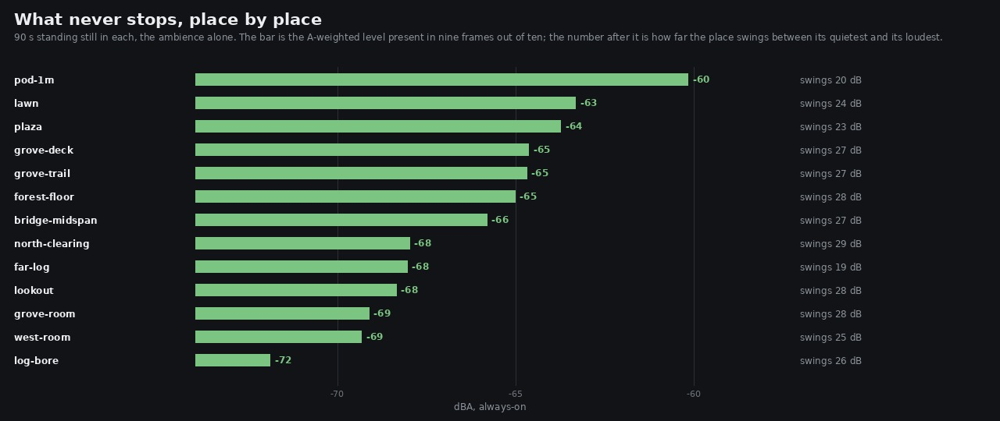

# Lane 5 — the world's floor, re-surveyed; a standing item closed; a claim of mine corrected

Branch `agent/squad5-resurvey`, off the integration head at `c3c446be`. **No `src/` change.** Two new
instruments, a regression audit across thirteen places, one named item closed by measurement, one
gap found for the next iteration, and one correction to a report of mine that is already merged.

The evidence lives beside the instruments in `art/audio/2026-09-24-standing/`, which is where the
survey they extend already lives.

## Why now

The world's floor was last surveyed at 15:18 on the 24th, on nine places. Since then five changes
landed that all move it — the master trim (#63, **+9 dB on everything**), the birds' perches (#67),
the canopy fix and the clearing opening (#55), and the huts becoming rooms (#70) — and the north
grove arrived, which nothing had ever measured standing still. An always-on floor is the metric this
lane answers the owner's complaint with. Nobody had checked it since.

## Two instruments the lane was missing

`survey.mjs` rendered the takes but nothing read them; the numbers in the last report were produced
by hand and cannot be reproduced. Now:

* **`floor.py`** — reads a survey and reports, per place, the A-weighted **always-on** level (the
  10th percentile over time: what is present in nine frames out of ten) and the **swing** (p90−p10).
  Both, together, deliberately: a place can reach a low floor by being quiet or by breathing, and a
  floor that falls while the swing collapses is a regression wearing the right number. `--against`
  prints an older survey beside the new one.
* **`ground.mjs`** — how much air is under a standing place. `__ZR_PLAY__.ground(x, z)` gives the
  height the character system stands him at and the terrain under it; the difference is the drop.
  This lane had been reading `floorY` out of the layout as if it were a drop. It is not, and §4 is
  what that cost.

Four places were added to the survey: the grove's trail and veranda, and the two rooms.

## 1. The floor: healthy, and nothing has drifted



Thirteen places, 90 s standing still in each, the bed alone:

* **Every place breathes.** The smallest swing in the world is 18.6 dB (two metres inside the far
  bank's log, which is the one place with a roof of wood over it); the largest is 28.8 dB. Nothing
  is near the 10 dB line that would mark a place as droning.
* **The loudest never-stopping place is a metre from a pod lantern**, at −60.2 dBA. That is the
  right answer — it is a flame, at arm's length, and nothing in the world that is not a flame is
  louder. Second and third are the lawn and the plaza, 3 dB below it.
* **The whole world sits inside 11.7 dB**, from the pod to the log's bore at −71.9.

## 2. The master trim landed exactly as it was argued

PR #63 raised the master 9 dB on the grounds that *a master gain changes no ratio in the mix*. The
nine places that were in the old survey moved **+8.6 dB on average** in their quiet moments, spread
2.3 dB:

```
place            p50 was     now   moved
lawn               -55.8   -46.0    +9.8
log-bore           -60.9   -50.9   +10.0
pod-1m             -53.7   -45.1    +8.6
forest-floor       -52.7   -44.1    +8.6
far-log            -61.5   -53.0    +8.5
plaza              -55.2   -47.0    +8.2
lookout            -56.4   -48.3    +8.1
bridge-midspan     -53.0   -45.1    +7.9
north-clearing     -54.8   -47.2    +7.6
```

The 2.3 dB of spread is the other four changes, and it falls where they were aimed: the perches
moved birds onto fixed world positions, so a place's bird content now depends on where it is.

## 3. A standing item closed by measurement: the music / bed balance

The lane's standing list has carried "the music sits ~15 dB over the bed" for two days. Measured on
200 s of stems, it is **9.7 LU** (bed −33.7 LUFS, music −24.0), and that number is not the answer
to the question anyway. Two things say it is a non-problem:

**The tune rests, and properly.** Over 200 s: play 12 s, play 12 s, play 25 s, **rest 20 s**, and
again — the tune is silent for 26 % of the time, in blocks of twenty seconds. (A 50 s render lands
inside one playing stretch and reports 6 %, which is what a shorter measurement would have
concluded.)

**And while it plays, it only covers the middle.** Per band, with the tune sounding:

| band | bed | music | bed − music | |
| --- | ---: | ---: | ---: | --- |
| 60–250 | −51.6 | −75.0 | **+23.4** | the wind's body, untouched |
| 250–1000 | −50.1 | −31.5 | −18.6 | the melody; the bed is buried here |
| 1000–2000 | −59.4 | −48.0 | −11.4 | marginal |
| 2000–4000 | −62.1 | −63.5 | **+1.3** | leaves and birds, audible |
| 4000–8000 | −74.6 | −81.7 | **+7.1** | audible |
| 8000–16000 | −88.5 | −101.4 | **+12.9** | audible |

The forest's *character* — the low body of the wind and the whole leaf-and-bird range above 2 kHz —
is never masked. The tune occupies the one region where the bed has least to say. Trimming the music
would take a couple of decibels off a band the bed is 18 dB down in regardless, and this was already
tried and reverted once (05:50, "the rests give the forest its space"). **Recommend striking it from
the standing list.**

Also checked while the stems were open, against the owner's exact words: the bed has **no drone in
any band**. 20–60 Hz swings 13.4 dB, and every band above it swings 16 to 33.

## 4. A correction: the grove's walkway hangs over 3.8 m, not 11.6

`art/audio/2026-09-24-ropewalk/README.md` (PR #68, merged) argued that the grove's rope walkway
should be `bridge` rather than `wood`, and supported it with this table:

| | over | |
| --- | ---: | --- |
| the ravine's rope-and-plank bridge | ~8 m | already `bridge` |
| the grove's walkway | **11.6 m and 11.3 m** | was `wood` |

— and then said "the reason holds here more strongly than it did there". **That is backwards.** 11.6
and 11.3 are the two huts' `floorY`, which the layout authors as an absolute height above the world
origin, not as a drop. Measured with `ground.mjs`:

```
place                                     he stands at  terrain  air under him
the stilt house’s veranda                        11.61     8.49           3.12
the rope walk, midway                            11.43     7.60           3.83
the tree hut’s platform                          11.31     6.89           4.42
the ravine bridge, midspan                       -0.76    -9.47           8.71
the west house                                    3.38     1.87           1.51
the shelf pad, at the gangway’s foot             10.11    10.00           0.11
```

The grove's walkway has **less than half** the air under it that the ravine's bridge has. The
classification it argued for is still right — 3.8 m of nothing under a plank is a plank with nothing
under it, and `exp-south2` made the same call for boards over its gorge — but the comparison given
for it was wrong by a factor of three and in the wrong direction. `src/audio/surfaces.test.mjs`'s
assertion stands; only the reasoning printed beside it was faulty.

The grove reads as a high place because it *is* one — the shelf is 10 m up. The huts are barely off
it.

## 5. The gap this found, for the next iteration

`grove-deck` (the stilt house's veranda) and `grove-trail` (a set stone on the ground, 15 m away and
a storey down) come back the same to within half a decibel **in every band**:

```
place            floor  swing    60-250  250-1k    1-2k    2-4k    4-8k   8-16k
grove-deck       -64.6   27.4     -65.4   -64.7   -72.4   -83.2   -97.8  -107.9
grove-trail      -64.7   27.5     -65.9   -65.0   -72.4   -83.2   -97.7  -108.0
forest-floor     -65.0   27.7     -67.6   -65.5   -72.4   -83.2   -96.5  -107.9
```

So does the forest floor fifty metres away. All three share `canopy 1.00`, `enclosure 0`, `gorge 0`,
and those are the only terms the bed has about a place — so three places with the same three numbers
are one place as far as the sound is concerned. Standing on a veranda with the crowns around you
should not be the same sound as standing under them, and being three metres up is the smaller half
of it: the near leaf layer is the crowns, and up there you are among them rather than below them.

**Why it is not in this branch.** The term needs the height of the ground under the listener, and
the audio is not given it: `createAudio` receives the scene, the wind and the player handle, and the
terrain's `height(x, z)` is reachable from `main.ts` but not from `src/audio/`. `__ZR_PLAY__.ground`
gets it by being wired in `main.ts`. Doing this properly means one new field on what the audio is
handed, which is a file outside this lane and worth asking about rather than assuming.

## Reproduce

```bash
npm run build
node art/audio/2026-09-24-standing/survey.mjs --dist dist --out /tmp/floor --seconds 90
python3 art/audio/2026-09-24-standing/floor.py --takes /tmp/floor \
    --out art/audio/2026-09-24-standing/world-floor-0925.jpg
node art/audio/2026-09-24-standing/ground.mjs --dist dist
node art/audio/2026-09-23-lane5/render-mix.mjs --dist dist --out /tmp/head --seconds 200 --stems bed,music
```

Typecheck clean, build green, **185 / 185 tests** (this branch adds none — it changes no `src/`), `playtest.mjs --only walk` 11 / 11 with no page
errors. Nothing in `src/` changes on this branch.
