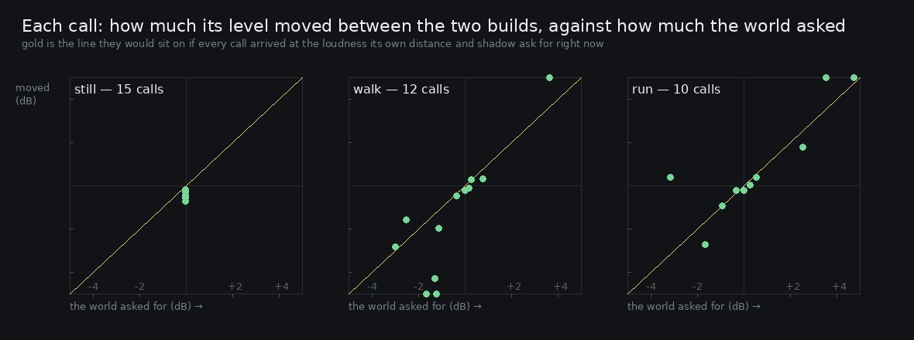

# Lane 5 — a bird's loudness and its shadow were four seconds old

Branch `cursor/squad5-stale-5535`, **stacked on `cursor/squad5-parallax-5535`** (PR #143), which is
itself on `cursor/squad5-turning-5535` (PR #139). All three change the same voices.

A perch is a place and a call arrives from the right direction. Three things about it were still
decided when the call was **booked**, which is `AMBIENCE_AHEAD` — four seconds — before it is heard:

| | |
| --- | --- |
| level | a call is scaled by `1 − 0.66 × distance` |
| colour | and low-passed at `7000 − 5200 × distance` |
| shadow | and, with wood between them, ducked by `OCCLUSION_DUCK` with its top × `OCCLUSION_TOP` |

Four seconds is six metres at a walk and seventeen at a run, which is far enough to walk out from
behind a bole.

## What it was worth

The path spine south of the plaza, between the 2.20 m bole at (4.4, 20.5), the 1.80 m at
(−4.5, 27.0) and the 1.40 m at (12.0, 22.0) — a third of the bearings from anywhere on that line are
shadowed by one of them. Paced for two minutes. `still` is the control.

This part needs no browser and no audio: `perchSpots` says where the trees are, `birdSpots` when
each call sounded, the `pass` geometry where he was, and `occlusionAt` is the same function the bed
calls.

```
take             calls   level  worst   cutoff  worst  shadow  worst   that is      and
still               17   0.00dB  0.00       0Hz      0   0.000  0.000    0.00dB   0.00oct
walk                17   0.92dB  2.63     404Hz   1026   0.000  0.732    3.96dB   1.81oct
run                 17   1.74dB  2.60     602Hz   1483   0.028  0.694    3.70dB   1.72oct
```

A call's level was out by a median **0.92 dB** at a walk and **1.74** at a run, worst 2.6. Its
cutoff by 404 and 602 Hz, worst 1483. And one call in each take was booked with about
**three-quarters of a shadow it no longer had** — 4.0 dB of level and 1.8 octaves of top: a bird
heard from behind a tree that he had already walked out from behind.

Those numbers are a property of the geometry, so they read the same in both builds. They are the
size of the problem, not the fix.

## The fix, and how it is measured

The distance and the shadow now sit on a gain of their own — `reach` — between the note's envelope
and the air, instead of being folded into the envelope's peak; and `reach`, the lowpass and the hall
send join the pan on the register of live voices, re-aimed every tick from where he is now. An
envelope is written once and cannot be taken back; a gain can.

The measurement is then a comparison of the two files, per call, in the band its kind sings in,
against what the geometry asked for over the 0.9 s the call is measured across (the voice keeps
following him through it — at a run he covers 3.8 m while a bird is singing, so the onset value
alone is the wrong prediction).

```
take   calls   level moved   asked    agree   top above 4k moved  cutoff asked
still     15       0.27 dB   0.00      nan              0.28 dB           0 Hz
walk      12       1.79 dB   1.16     0.86              1.79 dB         421 Hz
run       10       0.66 dB   1.27     0.84              0.64 dB         618 Hz
```



**The calls moved, and they moved by what the world asked for**: 0.86 and 0.84 correlation between
what each call's level did between the two files and what its own distance and shadow demanded. The
dots sit on the identity line; in the control they sit on the origin.

## Two things the measurement says that the change does not

**The standing control is not quite silent — 0.27 dB, and the files differ at −71 dBFS against a
take at −39.** That is not noise, and it is not the follower either: he never moves, so every
re-aim asks for the value the call was booked with. It is `adEnvelope`, whose floor is an absolute
0.0005 rather than a share of the peak. With the distance inside the envelope, a far call ramped
from 0.0005 up to a small peak and back; with the distance on `reach`, it ramps from 0.0005 up to
the call's own loudness and is then attenuated, so the **tail** is attenuated too. That is more
correct — a distant bird's decay should be as far away as its attack — and it is 32 dB under the
take, but it is a change and it is not the one being claimed.

**The cutoff is worth much less than the filter says.** 1483 Hz of stale cutoff sounds dramatic and
mostly is not: these birds sing at 1.4–3.5 kHz and the lowpass sits at 1.8–7 kHz, so it is usually
above most of the call's energy and moving it does little. A centroid could not see it at all
(4–13 Hz against 421–618 of cutoff, which is why the figure uses the share of the call above 4 kHz
instead). The level term is what carries distance for a bird; the cutoff only bites when the bird is
far enough, or shadowed enough, for the cutoff to come down through its fundamental.

## Named, not taken

**The attack rounding still uses the booked distance.** `soft = 1 + distance × 1.6` shapes the
attack times, and an attack time cannot be re-aimed once the envelope is written. It is worth a
millisecond or two, against the 2.6 dB and 1483 Hz that no longer are.

**`birdSpots` still publishes the booked bearing and distance**, which is what the scheduler decided
and is the right thing for it to publish — but it is no longer where the call is heard from. Both
`2026-09-25-parallax` and this report measure the heard values out of the file for that reason.

## Cost

One extra `GainNode` per call and four `setTargetAtTime` a tick per live voice, of which there are
two or three: a call lasts under 2.6 s and the wood calls eleven times a minute.

## Reproduce

```bash
npm run build
node art/audio/2026-09-25-stale/render.mjs --dist dist --tag after --out /tmp/stale
node art/audio/2026-09-25-stale/stale.mjs --takes /tmp/stale        # the geometry, no browser
python3 art/audio/2026-09-25-stale/heard.py --takes /tmp/stale \
    --out art/audio/2026-09-25-stale/heard.jpg
```

The `before` WAVs come from the tip of `cursor/squad5-parallax-5535`.

## Guard

`ambience.test.mjs` — *a call booked four seconds ago arrives at the loudness and colour it should
have now*. Books a call, moves him twelve metres (inside the re-seed radius, so the same six trees
from somewhere else), and requires every filter cutoff that moved to be one that some tree's
distance from where he now stands actually asks for — with the weather, the facing and the space
terms all held and no pods, so a bird's lowpass is the only filter in the bed that answers a change
of place. (Checked: dropping the cutoff re-aim fails it with "he moved twelve metres and not one of
18 filters noticed".)

**212 / 212 tests**, typecheck clean, build green.
