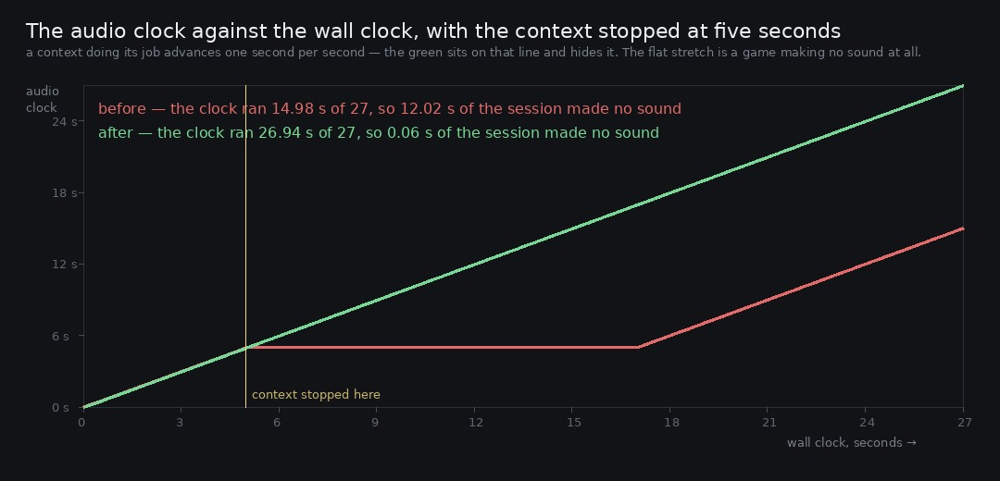

# Lane 5 — if the browser stopped the audio clock, the game never made a sound again

Branch `cursor/squad5-suspend-5535`, off the integration head at `d94aee7c`.

Check 48 of `art/audio/RUBRIC_50_SOUND.md` asks about a hidden tab, a suspended context and a device
change. The hidden tab was answered (`2026-09-25-hidden`); the other two were named as untested in
two of this lane's own reports and stayed that way. They are the same event as far as the page is
concerned: the `AudioContext` goes to `suspended` and **its clock stops**.

Chrome does that when the output device changes under the page — headphones in or out, a Bluetooth
speaker connecting — when a background tab is frozen, and when a page comes back from the
back/forward cache. Nothing in `index.ts` listened for it. The only `resume()` was the one behind
the first gesture, at start-up.

**So the game went quiet for the rest of the session, and not even the mute key brought it back**:
`setMuted` writes a gain, which does nothing to a stopped clock.

## Measured

`suspend.mjs` boots play mode, starts the audio, runs five seconds, stops the context, watches for
twelve, and resumes it by hand — recording the master throughout and logging `ctx.state`,
`stats().contextTime` and the live voice count against `performance.now()`.

The context is not exposed anywhere, so the harness wraps `AudioContext` before any page script runs
and keeps the instance. That is a harness trick, not a change to the game: nothing in `src/` learns
about it.



```
before   the clock ran 14.98 s of a 27.0 s run — 12.02 s of the session made no sound
after    the clock ran 26.94 s of a 27.0 s run —  0.06 s

before   the recorded master holds 15.0 s of the 27 s run
after                              27.0 s

before   first 'running' after the stop: never, until the harness asked at 17 s (12.0 s later)
after                                    5.21 s, 0.21 s after it stopped
```

The recorder is the plainest of those. It taps the live master, so it captures exactly what the
context produced — and it produced **fifteen seconds of a twenty-seven second session**. The twelve
seconds are not a gap in the file; they never happened. A player would hear the forest stop dead and
then, whenever the clock came back, carry on from precisely where it left off.

<video src="the-game-goes-quiet-and-comes-back.mp4">the master on the wall clock, before and after</video>

`clips/wall-{before,after}.mp3` is the same fourteen seconds each way with the recording put back on
the wall clock. The silence in the `before` clip is inserted, and it has to be: the recorder only
captures what the context produces, and for those nine seconds it produced nothing. Measured on the
clip, 0 to 5 s is −24.3 dBFS and 5 to 14 s is digital silence, peak sample 0.00000.

## The fix

One branch at the top of the tick:

```ts
if (ctx.state !== 'running') {
  wake(now);
  return;
}
```

Everything below that line reads `ctx.currentTime`, which does not move while the clock is stopped,
so there is nothing useful to do but ask for it back. `wake` is rate-limited to `WAKE_RETRY_MS`
(500 ms) because a `resume()` outside a user gesture can be refused and the tick runs thirty times
a second — without the limit a page that is not allowed to make a sound would ask a hundred and
eighty times before the user touched anything. Every later gesture is another chance, so the
listeners that used to remove themselves after start-up now stay on and call `wake`.

**No new event listeners.** The tick is a `setInterval`, which a background tab throttles to about
1 Hz but does not stop, and which resumes when a frozen tab is thawed — so the same branch covers
the hidden tab, the frozen tab and the device change without a `statechange` or `visibilitychange`
handler of its own. One place to get right instead of three.

## What the tick was doing while the clock was stopped

Thirty times a second it read a frozen `currentTime`, aimed every parameter at the same instant and
asked the schedulers to fill to a horizon that never moved. Not harmful — the voice count went from
7 to 8 over twelve seconds, because `scheduleUntil(currentTime + 4)` scheduled one bird the first
time and then had nothing left to do — but all of it wasted, and it is gone now: the early return
happens before any of it.

## Reproduce

```bash
npm run build
node art/audio/2026-09-25-suspend/suspend.mjs --dist dist --tag after --out /tmp/suspend
python3 art/audio/2026-09-25-suspend/clock.py --runs /tmp/suspend \
    --out art/audio/2026-09-25-suspend/clock.jpg
```

The `before` run comes from the build at `d94aee7c`, the integration head this branches from.

## Guard

`lag.test.mjs` — *a stopped clock is asked to start again, and not thirty times a second*. `tick`
closes over a live context and a scene and cannot be reached from a test, so the decision that was
missing is a function of its own, `shouldWake(state, now, nextAt)`, and the test pins it: a
suspended or closed context is asked, a running one is left alone, and the retry window is honoured.
It also bounds `WAKE_RETRY_MS` against `TICK_MS` — over two ticks so it is not asking on nearly
every one, and at most a second so the silence cannot be heard as a fault.

That is a thin guard for a real fault and it is worth saying so: the thing that would actually have
caught this is `suspend.mjs`, which needs a browser. The unit test's job is to stop the policy being
quietly weakened later.

## Rubric

Check 48 was **3** on "#91: six minutes hidden with rAF stopped and four with every timer clamped to
1 Hz — no leak, no errors, audio at full speed. Suspend / resume and a device change still
untested." Both are now tested, and the answer to both was that the game never came back. It goes to
**4**: the third of its three cases, a device change, is the same event as the suspend for anything
the page can observe, and the harness stops the context the same way the browser does.

**212 / 212 tests**, typecheck clean, build green, `playtest.mjs --only walk` 11 / 11 with no page
errors.
