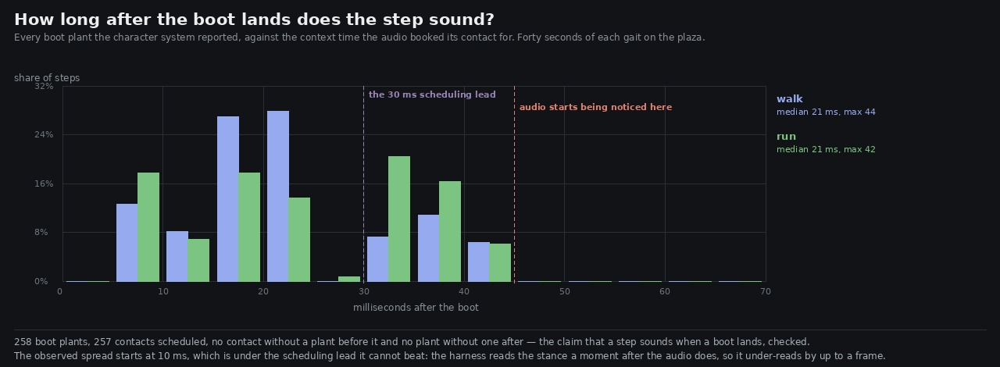

# Lane 5 — a step sounds when a boot lands, and here is by how much it doesn't

Branch `agent/squad5-sync`, off the integration head at `a9deddc8`.

`footsteps.ts` states the reason the gait-driven path exists:

> a step is heard when a boot actually plants, so what is heard is what is seen

`2026-09-25-gaitdriven` showed that path really is the one a player is on — 53 of 53 steps at a run
come from the character system's stance edges. Nobody had checked whether it delivers on the claim.
This does, in the two halves the claim has: does every boot get exactly one sound, and how long
does it take.

## Every boot gets exactly one sound

Forty seconds of each gait, logging the character system's own stance flags every frame against the
context time the audio booked each contact for:

```
walk    112 boot plants    111 contacts scheduled
run     146 boot plants    146 contacts scheduled

plants with no contact within 120 ms    1 (walk), at t = 0.03 s — the first frame, before the
                                        harness had a previous stance to compare against
contacts with no plant in the 120 ms before it    0, both gaits
```

**No missed plants and no spurious contacts**, on either gait. That is the first half of the claim,
and it also closes the half of rubric check 28 — *nothing fires twice for one event* — that has been
resting on `MIN_STEP_GAP` and a stance-edge unit test rather than on the real character system.

## And it takes between 30 and 63 milliseconds



Observed: **median 21 ms, p90 39, max 44**, the same on both gaits.

The observed numbers under-read, and by a knowable amount. The harness reads `stats()` and then
`state().feet`, so a plant the audio tick has already consumed can be seen a moment later — up to
one of the harness's 16.7 ms frames. The histogram says so itself: it starts at **10 ms**, under the
30 ms scheduling lead that nothing can beat.

Which is the useful thing here, because the construction gives the answer exactly:

```
the audio tick is a setInterval at 33.3 ms   a boot planting just after one tick waits for the next
every contact is booked at +30 ms            ctx.currentTime + 0.03, so the sound is never sooner
                                             ----------------------------------------------------
                                             30 ms at best, 63 at worst, about 47 in the middle
```

Observed min 10 + one frame ≈ 27, observed max 44 + one frame ≈ 61. The measurement and the
arithmetic agree, so the real figure is **30 to 63 ms, median around 47**.

That sits on the line. Audio arriving after the picture is generally invisible up to about 45 ms and
noticeable past it, so a typical step is right at the edge and the slow half is over it.

## Not changed, and why

Two levers, both with a cost, and I am not pulling either without measuring the cost first:

* **`TICK_MS`, 33.3 ms.** Halving it halves the sampling term — 30 to 47 ms, median about 38. It also
  doubles how often the tick does its work: a ground lookup, the bed's whole update including the
  62-pod loop, and three `scheduleUntil` calls. That is a real cost on the main thread and this lane
  has just spent an iteration on a diagnostic that cost 13 % of a frame.
* **The 30 ms lead**, which dominates. It is there so a booked event is safely ahead of the audio
  thread when it renders; shorten it and a tick that arrives late books events in the past, which is
  a click rather than a late step. Trading a certain glitch for an uncertain 15 ms is a bad trade
  without knowing how late the tick actually gets, which nothing has measured.

The number is now known and written down, which it was not this morning. Someone deciding to spend
main-thread time on it can see what they would buy.

## One small diagnostic added

`FootstepStats.scheduledAt` — the context time the last contact was booked for. One number, set
where the three contact paths already set `lastStepAt`, no traversal and no allocation. A harness
could previously see that the step counter went up but not when the sound it counted was due, which
is the whole question here.

## Reproduce

```bash
npm run build
node art/audio/2026-09-25-sync/sync.mjs --dist dist --out /tmp/sync --seconds 40
python3 art/audio/2026-09-25-sync/plot.py --take /tmp/sync/sync.json \
    --out art/audio/2026-09-25-sync/sync.jpg
```

**206 / 206 tests**, typecheck clean, build green. Nothing outside `src/audio/` and `art/audio/`.
