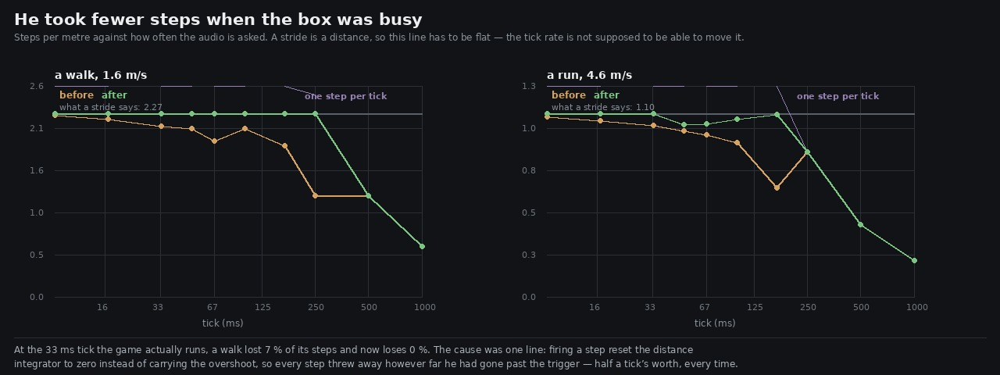

# Lane 5 — he took fewer steps when the box was busy

Branch `agent/squad5-tickrate`, off the integration head at `24dc489f`.

Check 28 of `art/audio/RUBRIC_50_SOUND.md` is *nothing fires twice for one event, and nothing is
missed at any frame rate*. I scored it **3** with the note **"not tested across frame rates"**. That
is the third such note this week; the first two were hiding the nine-second loop and a run that was
a louder walk. This one was hiding a fault in the game as shipped.

## The fault

Steps on the distance path are fired by an integrator:

```ts
travelled += speed * dt;
if (travelled >= stride) { travelled -= stride; fire(); }   // and fire() set travelled = 0
```

`fire` zeroing the integrator is right for a boot plant, a shove or a landing — the stride restarts
from there. It is wrong here, because `travelled -= stride` is immediately overwritten and **the
distance he had already gone past the trigger is thrown away**. That is on average half a tick's
worth, every single step, so the loss scales with the tick.



A stride is a distance, so steps per metre is the number that cannot move. Measured with no
rendering at all — `createFootsteps` against a fake context, four hundred metres at a constant speed:

```
tick        a walk            a run
            before  after     before  after
  8.3 ms      99%    100%       98%    100%
 16.7 ms      97%    100%       96%    100%
 33.3 ms      93%    100%       94%    100%     <- the tick the game actually runs
 50.0 ms      92%    100%       91%     94%     <- the tick the offline renders use
 66.7 ms      85%    100%       88%     94%
100.0 ms      92%    100%       84%     97%
166.7 ms      83%    100%       59%    100%
250.0 ms      55%    100%       79%     79%
500.0 ms      55%     55%       40%     40%
```

**At the 33 ms tick the game actually runs, roughly one step in fifteen never sounded.** On a loaded
box, worse — and the audio runs on a `setInterval`, which is exactly the thing a loaded box stretches.

## The fix, and what is left

Carry the overshoot: `fire` keeps zeroing the integrator for the events where that is right, and the
distance path restores the remainder afterwards. Two lines.

What remains past 250 ms is **not** the same fault. It is the ceiling of one step per tick, which is
arithmetic: a run needs 5.05 steps a second and no design can deliver them from a timer that fires
four times. The measured numbers are exactly `1 / (dt × cadence)` — 79 %, 40 % and 20 % for a run at
250 ms, 500 ms and 1 s, against a predicted 79.2, 39.6 and 19.8. The guard asserts the degradation
stays *at* that ceiling rather than compounding below it.

The run's 94–97 % between 50 and 100 ms is a third thing again, and also not a fault: `MIN_STEP_GAP`
(0.16 s) exists to stop a noisy stance flag double-triggering, and at those ticks quantisation
occasionally puts two triggers closer than that. At 167 ms — longer than the gap — it is 100 % again.

## A second frame-rate dependence, found on the way

The stride's jitter was drawn **every tick** rather than every step:

```ts
const stride = strideFor(speed, onStairs) * (1 + (stepRng() * 2 - 1) * 0.04);
```

`stepRng` is the same seeded stream `designStep` draws from, so the number of draws depended on the
frame rate, and the same walk rendered at 20 Hz and heard at 30 got different steps. It is now drawn
when a step fires. Sixty seconds of the same walk gives the same count at both rates.

## What it does to the renders

The offline render drives at 50 ms, where a walk was losing 8 %. Counting onsets across the scripted
walk's legs: **101 steps before, 106 after**, and the rendered cadence goes from about 3.29 steps a
second to 3.55 against a stride's 3.64. (The residue is the onset detector's own error — it is
unreliable at these rates, which `2026-09-25-gait` had to work around too.)

## The guards

`src/audio/cadence.test.mjs`, three tests, all three checked by putting the bug back:

* **a stride is a distance** — steps per metre within 3 % of `1 / strideFor` at every tick from 8 ms
  to 250 ms, walking.
* **and a run, up to the ceiling** — the same below 33 ms, and past the ceiling it must sit *at* one
  step per tick rather than under it.
* **the seeded stream does not depend on how often the audio is asked** — the same walk at 30 Hz and
  at 20 Hz gives the same number of steps.

## Reproduce

```bash
node art/audio/2026-09-25-tickrate/cadence.mjs
node art/audio/2026-09-25-tickrate/cadence.mjs --json /tmp/tick.json
python3 art/audio/2026-09-25-tickrate/rate.py --before /tmp/tick-before.json \
    --after /tmp/tick-after.json --out art/audio/2026-09-25-tickrate/tickrate.jpg
node --test src/audio/cadence.test.mjs
```

**202 / 202 tests** (three new), typecheck clean, build green. Nothing outside `src/audio/` and
`art/audio/`.

Check 28 was a 3 on trust; it is a 3 on evidence now, with the frame-rate half of it tested and the
double-fire half still resting on `MIN_STEP_GAP` and the stance-edge test rather than on a
measurement of a real noisy gait.
