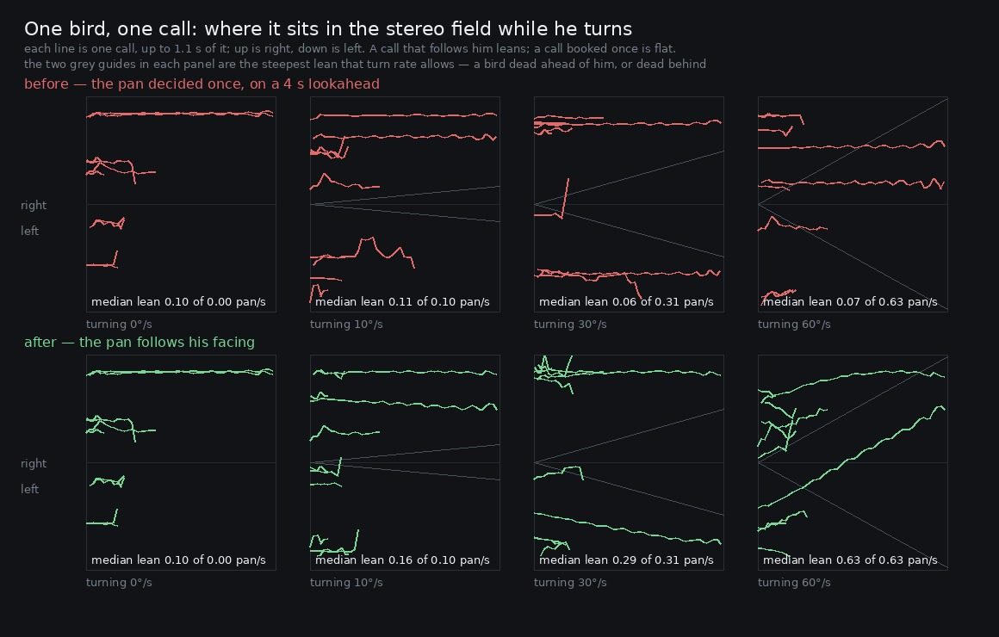

# Lane 5 — the birds were nailed to the speakers whenever he turned

Branch `cursor/squad5-turning-5535`, off the integration head at `78f530a2`.

A bird's place in the stereo field is `sin(bearing − facing)`, and it was worked out once, in
`scheduleBirds`, which runs on a **four-second lookahead**. So every call in the wood was panned to
the way Link was facing up to four seconds before it was heard, and an answering call — booked from
the same tick and sounding 1.1 to 2.5 s later — to as much as six and a half.

Turning is what makes that matter, not walking. A perch is stored as a bearing and a distance from
the anchor, so crossing the clearing does not move a bird in the field at all, which is deliberate
(`PERCH_RESEED_M`). But the pan is a function of the facing alone, and a player turns constantly.

Measured standing on the plaza and turning at 0, 10, 30 and 60 degrees a second, a call swept
**0.06 to 0.11 pan units whatever the rate** — the same at a standstill as at sixty degrees a
second, which is to say turning did nothing at all. It now leans at 0.63 pan units a second at
sixty degrees a second, against the 0.63 the geometry asks of it.



The grey guides in each panel are the steepest lean that turn rate allows — a bird dead ahead of
him or dead behind. Before, nothing leans in any panel. After, the leans grow with the rate and at
sixty degrees a second they run along the guides.

## Three things had to be built before the question could be asked

None of them changes what the game sounds like; they are in the history as their own commits.

**`at.turn`** — a standing render can now turn on the spot at a stated rate. Every `at` render this
lane has made faces one way for its whole length, and a fixed facing cannot ask whether anything
follows him.

**`renderOffline` returns the bed's stats**, and `birdSpots` carries the context time each call is
booked to sound. Until now a render handed back a WAV and nothing else, so "when did the birds call
in this file" had to be answered by hunting for them in the audio.

**The offline twin now schedules the bed as it goes.** This one is a real fault, and it was in every
evidence render this lane has published. `renderOffline` ran its whole loop calling `update` and
then called `scheduleUntil(seconds)` **once, after the loop**. `scheduleBirds` and
`scheduleFlutters` read `gustNow`, `canopyNow`, `forwardNow` and `occludeNow` — so every bird, every
leaf and every note in every render was decided by the last frame's weather, canopy and facing. A
bird's gap follows the gust, and a standing take's gust swings across its whole range in a couple of
minutes, so the twin was booking two minutes of forest out of one instant of it.

What that was worth, on the same spot, the same seed and the same 120 seconds:

```
         band  always-on old      new   shift    mean old      new   shift
   20-60                7.3      7.3    +0.0        14.6     14.6    +0.0
   60-250              14.8     14.8    +0.0        18.7     18.7    +0.0
  250-1000             11.5     11.6    +0.1        17.0     17.3    +0.4
 1000-2000             -9.9     -9.5    +0.5        11.6      9.5    -2.1
 2000-4000            -20.8    -19.0    +1.8         6.1     11.8    +5.7
 4000-8000            -32.0    -31.8    +0.1        -6.7     -7.7    -0.9
 8000-16000           -43.1    -43.1    +0.1       -16.3    -16.4    -0.1

calls in the take: 15 → 22
```

The **always-on floor is unmoved** — within half a decibel everywhere but 2–4 kHz, where it rises
1.8. That is the number the owner's complaint is scored on and the number most of this lane's
published figures are, so those survive. What moves is the **events**: 47 % more bird calls in the
same two minutes, and +5.7 dB of mean level in the band birds occupy. Any claim about event density
taken from a *render* was wrong by about half. The claims this lane has actually published about
bird rates did not come from renders — `2026-09-24-wind/schedule.mjs` and the rate test in
`ambience.test.mjs` both interleave `update` and `scheduleUntil` correctly — so nothing published
needs withdrawing, but it was luck rather than care.

## How the pan is read out of the file

No ground truth is needed about where a perch is, and that is the point: **a bird's own movement
during its own call either happens or it does not.** `StereoPannerNode` is equal-power, so a source
at pan *p* arrives as L = cos((p+1)π/4), R = sin((p+1)π/4), and p = 4/π·atan(√(R/L)) − 1.

Three things had to be got right before the standing control read zero, and each was wrong first:

- **Each kind is read in its own band.** One band for all six put the dove (430 Hz) and the whistle
  (3 kHz) through the same filter; the still-listener control then showed 0.45 pan units of movement
  that could not exist. Per-kind bands took it to 0.15.
- **The bed is subtracted.** It does not stop while a bird sings and it is panned itself, so the raw
  L/R of the mixture is as much the bed's pan as the bird's. The background is the median of the
  second before the call.
- **The run is contiguous from the onset and ends at the first frame that fails.** Skipping past
  failing frames stitched a leaf flutter arriving halfway through a call onto the same straight
  line, which is where the control's 1.3 pan/s outliers came from. A pan also cannot move faster
  than the turn does — 0.018 pan units between frames at the fastest rate here — so a jump of more
  than 0.2 means the estimate has lost the bird, and the run ends there too.

## The result

```
take               calls  median sweep  median |slope|  the turn asks of the median
before @ 0 deg/s      10        0.070          0.101                       0.000 pan/s
before @ 10 deg/s     11        0.093          0.110                       0.105 pan/s
before @ 30 deg/s     10        0.055          0.058                       0.315 pan/s
before @ 60 deg/s     10        0.079          0.073                       0.629 pan/s
after @ 0 deg/s       10        0.070          0.101                       0.000 pan/s
after @ 10 deg/s      11        0.078          0.158                       0.105 pan/s
after @ 30 deg/s      10        0.127          0.285                       0.315 pan/s
after @ 60 deg/s      10        0.168          0.635                       0.629 pan/s
```

The column to compare against is *the turn asks of the median*, not the maximum: the lean a call
gets is `PERCH_PAN · ω · cos(bearing − facing)`, and the median of |cos| is 1/√2, so a set of calls
caught at unrelated facings should come in at 0.707 of the maximum. At 30 °/s the measurement lands
on 0.285 against 0.315, and at 60 °/s on 0.635 against 0.629. At 10 °/s it reads 0.158 against 0.105
because the instrument's own floor — 0.101, from the standing control — is a large part of it.

**The before column is flat.** 0.101, 0.110, 0.058, 0.073 as the turn rate goes 0, 10, 30, 60. A
listener spinning twice a second heard the same still field as one who was not moving.

**The standing control is untouched by the change.** `spin-0-before.wav` and `spin-0-after.wav`
differ by **one bit at sixteen** — peak sample difference 1 against a peak of 6251, rms 105 dB under
the take. The two files are the same file to any ear, which is the right answer: nothing should
happen when he does not turn.

Listenable: `clips/turning-60-{before,after}.mp3` is the same twenty-two seconds of the spinning
take, seven calls in it, and `clips/still-{before,after}.mp3` is the control pair.

## In the real game

`live.mjs` turns Link on the spot at sixty degrees a second for thirty seconds in play mode and
records the master:

```
simFrames 2460 over 30 s   voices 3-9 (5 at the end)   birds 10, flutters 25   pageErrors []
windLean -0.35 .. +0.35, 10 zero crossings — five full turns, which is what 60 deg/s over 30 s is
```

The register of live voices lives in the live `update`, and a register that never lets go leaks;
the voice count sits at 3–9 throughout and ends where it started. `windLean` is the bed's own report
of which way he is facing, so its ten crossings are also proof that the facing reaches the bed. The
measurement itself stays offline, because a bird has to be pulled out of the bed to be seen and the
live master has the score and the boots over it.

## What it costs

Two or three entries in the register at a time — a call lasts under 2.6 s and the wood calls eleven
times a minute — and one `setTargetAtTime` a tick each while it is alive. The smoothing is
`PLACE_TAU`, the same constant every other term that moves with him uses (`2026-09-25-lag`).

## Named, not taken

**A bird's occlusion is still decided at booking.** `perchShadow` asks how much wood stands between
him and the perch, and it asks four seconds early. Unlike the pan this one is a *position* question
rather than a facing one, so turning does not touch it and a runner covering seventeen metres does.
It is a bigger change than the pan: the shadow scales the level as well as the top, and the level is
baked into each note's envelope, so following it needs a gain node of its own in the chain rather
than a parameter to re-aim.

**Leaf flutters are panned at random**, not by bearing — `(rng·2 − 1)·0.9` — so turning cannot move
them and nothing here applies. A leaf is not at a place in this bed, which is defensible for
"leaves all around you" and is at least deliberate.

**The answering call is still booked from the first call's tick**, so its *level* and *shadow* are
up to 6.5 s stale even though its pan now is not.

## Reproduce

```bash
npm run build
node art/audio/2026-09-25-turning/spin.mjs --dist dist --tag after --out /tmp/spin
python3 art/audio/2026-09-25-turning/spin.py --takes /tmp/spin \
    --out art/audio/2026-09-25-turning/spin.jpg
node art/audio/2026-09-25-turning/live.mjs --dist dist --out /tmp/spin
```

The `before` WAVs come from the build at `84eef7d8`, the last commit before the pan followed him —
`git checkout 84eef7d8 && npm run build && node …/spin.mjs --tag before`. `sched.py` compares the
old end-of-loop scheduling against the new, and wants a `--old` directory rendered at `5983beaf`.

## Guards

`ambience.test.mjs` — *a call booked four seconds ago comes from the tree, not from where he was
looking*. Runs the bed until a call is booked and not yet sounded, snapshots every panner, turns him
right round and requires that every panner which moved has been mirrored exactly — and that only a
handful moved, because a register that does not let finished voices go would have every bird the
wood has ever sung following him about for the rest of the session. `windDir` is deliberately left
out, so the only panner in the bed that answers a change of facing is a bird's and the test does not
have to know the graph's shape. (Checked: without the re-aim it fails with "he turned right round
and not one of 81 panners noticed".)

**210 / 210 tests**, typecheck clean, build green.
