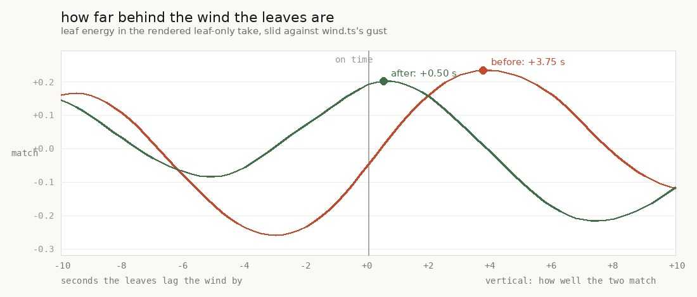

# the leaves were answering the wind of four seconds ago

**The bed was written four seconds ahead of the clock, and a leaf's loudness is read off the
weather at the moment it is written down.** So every leaf in the game carried the wind of four
seconds before it sounded: a median level error of **2.34 dB**, p90 5.62, worst 9.34, with **38 %
of leaves out by more than 3 dB**, and the whole leaf stream lagging the wind by four seconds.

Four seconds was never a number the leaves asked for. It is what a background tab needs. The
horizon is now sized by the tick it actually has to bridge — 0.5 s in the foreground, still up to
4 s when the browser throttles — and the same measurements read **0.34 dB median, nothing over
2 dB, and half a second of lag**. Measured again in the rendered audio: the leaves go from
**3.75 s behind the wind to 0.50 s**.

Two side effects, both checked: the bed's **always-on level in the leaf band falls 1.63 dB** while
its swing deepens 1.94 dB — the owner's own metric, improved by accident and for a reason — and a
tab throttled to 1 Hz still gets **0.87 leaves a second against the foreground's 0.85**.

    src/audio/ambience.ts    AHEAD_FLOOR / AHEAD_TICKS / AHEAD_CEILING, aheadFor()
    src/audio/index.ts       the live tick and the offline render both ask it
    src/audio/ambience.test.mjs   two tests, three regression probes

---

## What reads the weather, and when

`scheduleFlutters` reads `gustNow` twice — once for the leaf's **level**, once for the gap to the
next one:

```ts
const g = gustNow;
const level = (FLUTTER_LEVEL[0] + u * (FLUTTER_LEVEL[1] - FLUTTER_LEVEL[0])) * (0.35 + g * 0.9);
...
nextFlutter += flutterGap(u, (0.3 + g * 1.1) * (1 + canopyNow * CANOPY_FLUTTER));
```

`0.35 + g · 0.9` is **11.1 dB end to end**, and both readings happen when the event is written
down, not when it is heard. The live tick writes the bed four seconds ahead:

```ts
ambience.scheduleUntil(ctx.currentTime + AMBIENCE_AHEAD);   // AMBIENCE_AHEAD = 4
```

Standing perfectly still does not save you. This staleness is not about the listener moving — it
is about the weather moving, and `uGust` is a product of two sines whose fastest term turns at
0.37 rad/s, so four seconds is 1.48 radians of it.

**The lane has been here once and did half of it.** `2026-09-25-stale` found exactly this
lookahead staleness in the BIRD calls — a call's level out by a median 0.9 dB at a walk, one call
booked *0.73 of a shadow it no longer had* — and built the `turning` registry to re-aim them every
tick. Flutters got no registry and were never measured, and there are **forty times as many of
them**: 422 to 1021 leaves in 150 s against eleven bird calls a minute.

## Measured on the schedule

`early.mjs` drives the scheduler directly — it is a pure function of the seeded stream and the
weather — with `wind.ts`'s own analytic gust rather than a stand-in. Ten minutes, open sky:

| | booked 4 s ahead | booked 0.5 s ahead |
| --- | ---: | ---: |
| how far ahead a leaf is written, median | 4.03 s | **0.53 s** |
| the level it carries vs the level it should, median | 2.34 dB | **0.34 dB** |
| p90 | 5.62 dB | **0.87 dB** |
| worst | 9.34 dB | **1.81 dB** |
| out by more than 1 dB | 79 % | **6 %** |
| out by more than 3 dB | 38 % | **0 %** |
| the leaf stream's loudness lags the wind by | 4.0 s | **1.0 s** |
| leaves in ten minutes | 608 | 614 |

The last row is the control and it is the important one: **the leaf count does not move.** This
is only ever about *when* the weather is read, never about how much leaf there is. The full sweep
is in `early.txt` and it is a straight line — every second of horizon costs about 0.6 dB of median
staleness and a second of lag.

The width of the leaf field goes the same way for the other reason. `flutterPan(canopy)` is 0.72
in the open and 0.34 under closed crowns, and it was also read at booking, so walking out from
under a canopy edge left leaves arriving at the wrong width: p90 **0.380 → 0.032** pan units.

### The sign, checked before it was used

A cross-correlation's sign is the easiest thing in this folder to get backwards and the hardest
to notice — the lane's own `panFor` docstring says a sign error there *"would be invisible to
every measurement this lane makes"*. So both tools measure a copy of the gust delayed by a known
three seconds first, and refuse to report anything if it does not read +3.0. I had the direction
backwards in my head when I started and the check is what caught it: the leaves are **late**, not
early.

## Measured again in the audio

`leaves.mjs` renders five minutes standing on the plaza with the wind layers and the birds muted,
so what is in the file is leaves and only leaves. Muting the wind is not tidiness: the continuous
layers follow the gust through `PLACE_TAU` and arrive **on time**, and they live in the same band
the flutters do, so a take with both in it measures a blend of one late stream and one punctual
one. `mute` leaves every draw in place and only omits the connection, so these are the same
leaves the full bed has.



| | leaves behind the wind | match | leaf level | whole bed |
| --- | ---: | ---: | ---: | ---: |
| before | 3.75 s | 0.234 | −57.3 dB | −40.8 dB |
| after | **0.50 s** | 0.201 | −57.4 dB | −41.2 dB |

The match is weak in absolute terms — 0.2 on five minutes of a signal whose own beat is 24 s is
eleven cycles of a noisy thing — and it is quoted rather than hidden. What it is being used for is
the **position** of the peak, not its height, and the two peaks are three and a quarter seconds
apart on a curve that is smooth and single-humped across the whole ±10 s window.

An unsmoothed envelope reads r = 0.03 whatever the truth is: a flutter is under a quarter of a
second long and there is about one a second, so the trace is a spike train and "how much leaf is
happening" only exists over a window. Six seconds is where the match peaks, and it is a quarter of
the gust's own 24 s beat, so it cannot be smoothing the answer into existence.

## The side effect worth more than the fix

The metric this lane answers *"too buzzy"* and *"LOWER THE WHITE NOISE"* with is the **always-on**
level — the 10th percentile over time, never the mean. Per band, over the whole bed:

| band (Hz) | always-on | | swing p90 − p10 | |
| --- | ---: | ---: | ---: | ---: |
| 20–60 | 2.6 → 2.6 | −0.01 | 13.6 → 13.6 | +0.01 |
| 60–250 | 7.3 → 7.3 | +0.00 | 18.4 → 18.4 | −0.01 |
| 250–1000 | 4.5 → 4.3 | −0.15 | 24.3 → 24.2 | −0.15 |
| **1000–2000** | **−6.1 → −7.7** | **−1.63** | **28.5 → 30.4** | **+1.94** |
| 2000–4000 | −11.9 → −12.5 | −0.61 | 31.9 → 32.4 | +0.48 |
| 4000–8000 | −26.7 → −27.5 | −0.81 | 33.2 → 34.1 | +0.92 |
| 8000–16000 | −35.8 → −36.0 | −0.26 | 26.8 → 27.0 | +0.18 |

**The floor fell in every band that moved, and the breathing deepened in the same ones.** That is
the shape a noise complaint wants and the shape a level cut cannot produce, and there is a reason
for it rather than luck: a leaf booked during a gust used to sound four seconds later, in the lull
— loud, in the quiet, propping the floor up. It does not any more. The 1–2 kHz band is where the
flutters live (`centre = 950 + u · 1900`), and it moved most.

Rubric check 1 wants p90 − p10 ≥ 10 dB in every band; every band clears it by a wide margin and
five of seven got better.

## The thing the four seconds was for

The horizon exists so a **background tab** — whose timers Chrome clamps to 1 Hz — still has events
queued when the tick finally runs. Shortening it is the one way this change could break something,
so check 48's own harness was re-run against it, with the clamp imposed:

```
  phase        ctx s  timeouts/s  voices  flutters  leaves/s
  before        41.6        20.0       2        35      1.00
  hidden       106.8         1.0       3         -
  hidden       286.9         1.0       2         -
  back         286.9         0.0       2       249
  after        291.9        16.6       2       253      0.80
```

The clamp plainly took effect — 20 timer callbacks a second down to **1.0** — and across the 245 s
it was hidden the bed produced **214 leaves, 0.87 a second, against the foreground's 0.85**.
Voices stayed in 0–3, the same band as the foreground, the context clock ran at full speed
(245.2 s of 240 s wall), and there were **no page errors**. At 1 Hz `aheadFor` hands back 3.0 s,
three times the gap it has to bridge.

## The fix

```ts
export const AHEAD_FLOOR = 0.5;
export const AHEAD_TICKS = 3;
export const AHEAD_CEILING = 4;

export function aheadFor(tickGap: number): number {
  return Math.max(AHEAD_FLOOR, Math.min(AHEAD_CEILING, tickGap * AHEAD_TICKS));
}
```

Both callers ask for it — the live tick with its own frame interval, the offline render with its
step — so the twin keeps scheduling the same forest the game does, which is the promise
`AMBIENCE_AHEAD` was named for in the first place.

**The floor is 0.5 s** because the horizon can only grow *after* a long gap has been seen, never
during the first one, so it has to cover a foreground stall outright; 300 ms is the longest this
lane has induced (`art/audio/2026-09-26-hitch/`). **The ceiling is the 4 s that shipped**, so a
throttled tab is never worse off than it was.

It lives in `ambience.ts` rather than beside `AMBIENCE_AHEAD` in `index.ts` for a reason worth
writing down: the bed's test loader deliberately refuses any import that is not relative, which
keeps the bed's tests free of the world. Putting the horizon where the thing it governs lives is
what let it be tested at all.

### What was considered and not done

**Applying the weather at sounding time instead**, through one shared gain node the tick keeps
current, would make the level exactly right at any horizon. It was measured and rejected: it fixes
the level and leaves the *rate* on the old horizon, and the two halves of "gusts bring leaves"
then disagree. On the schedule it read **4.0 s of lag and r = 0.372 before, 1.5 s and r = 0.302
with the gain node** — better timing, worse coherence. Shortening the horizon moves both halves
together, and measures 1.0 s at r = 0.388: better on both.

**Predicting the gust forward** is out on arithmetic. A linear extrapolation of a 17 s sine over
four seconds has an error of `(ω·lead)²/2 ≈ 1.1` of its own amplitude — worse than not trying.

## Tests

`ambience.test.mjs` 29 → 31 (`node --test src/audio/ambience.test.mjs`, 31/31). Three ways to put
the fault back, each caught:

| the fault put back | caught by |
|---|---|
| `aheadFor` returns the flat ceiling | *a leaf is booked with the wind it will sound in* — 2.41 dB out |
| the floor lowered under a foreground stall | *the bed is filled as far ahead as the next tick* |
| the live tick back on `AMBIENCE_AHEAD` | *the bed is filled as far ahead as the next tick* |

The last is a **source-level** check on the call sites, for the same reason as `paceFrom`'s:
`aheadFor` is pure, so no behavioural test can tell whether the tick actually asks it. The second
test carries its own control — it measures the four-second horizon too and asserts it is plainly
worse — so the guard cannot quietly stop guarding.

The gust in the test is a plain ramp of known slope, not a copy of `wind.ts`'s two sines: the
property is about the horizon, and a constant copied out of another lane's file goes stale.

## Clips

`clips/` — cut where the wind climbs fastest (0.80 of its range in six seconds, starting 23.1 s
in), the same wall-clock second in both takes, which needs no alignment because both are offline
renders from one seed against one clock.

    leaves-before.mp3 / leaves-after.mp3        the leaves alone, through a gust arriving
    bed-before.mp3    / bed-after.mp3           the same twenty seconds of the whole bed
    bed-minute-before.mp3 / -after.mp3          a minute either side, for context

## Gates

    npm run typecheck                                        clean
    npm run build                                            clean
    node --test src/audio/*.test.mjs                        103 / 103
    node gauntlet/scripts/playtest.mjs --only walk           11 / 11 routes, no page errors
    hidden.mjs --clamp --hidden 240                          no leak, no errors, 0.87 leaves a second

## Named, not taken

- **The rate is still 1.0 s behind and the level 0.5 s.** That is the horizon, and the horizon
  cannot go below what the tick needs. Getting closer needs the weather evaluated at sounding
  time, which is the gain-node idea above — measured, and it costs more coherence than it buys.
- **`MUSIC_AHEAD` is still a flat 6 s.** The score is a function of its own clock and reads no
  weather, so none of this applies to it; but nobody has checked that, and "it should not matter"
  is the kind of sentence this lane keeps finding to be wrong.
- **Bird gaps read `gustNow` at booking too** (`nextBird += … BIRD_LULL_GAP + gustNow · …`). They
  get the shorter horizon for free here, but the `turning` registry re-aims a call's level and
  colour and not its *gap*, so the rate half of "lulls bring calls" was never separately measured.
- **The match is 0.2.** Five minutes is eleven cycles of the gust's beat. A half-hour take would
  tighten the peak and cost about forty minutes of rendering; the lag it would refine is already
  smaller than the tick's own contribution.
- **`AHEAD_TICKS = 3` is a margin, not a measurement.** Two would halve the staleness at 1 Hz and
  one would be exactly the gap with no room at all. Nothing here measures what margin a throttled
  tab really needs, only that three works.

## Reproduce

```bash
node art/audio/2026-09-26-early/early.mjs --out /tmp/early --seconds 600
npm run build
node art/audio/2026-09-26-early/leaves.mjs --dist dist --out /tmp/early/after --seconds 300
python3 art/audio/2026-09-26-early/leaves.py /tmp/early/before /tmp/early/after
python3 art/audio/2026-09-26-early/plot.py /tmp/early/before /tmp/early/after art/audio/2026-09-26-early/early.jpg
python3 art/audio/2026-09-26-early/clips.py /tmp/early/before /tmp/early/after art/audio/2026-09-26-early/clips
node art/audio/2026-09-25-hidden/hidden.mjs --dist dist --hidden 240 --watch 45 --clamp --out /tmp/hidden-after
node --test src/audio/ambience.test.mjs
node gauntlet/scripts/playtest.mjs --dist dist --out /tmp/play2 --only walk
```
