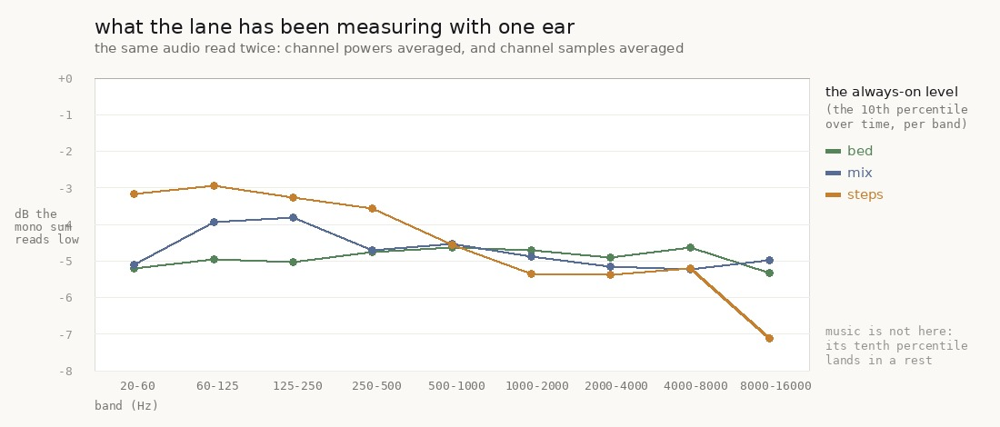

# the always-on metric was reading five decibels low, not three

`art/audio/2026-09-26-mono/` found every tool in this lane averaging the two channels before
measuring anything, corrected `floor.py`, and left `spectra.py` — the tool behind most of the
lane's per-band sheets, and the one the **always-on** numbers come from — for a follow-up. This
is it, and the number is bigger than the last iteration predicted.

**The mono sum reads the bed's always-on level 4.6 to 5.3 dB under what two ears get**, band by
band. I expected 3, which is what decorrelated channels lose in *energy* when you sum them. The
extra two decibels are cancellation: summing two channels that differ puts nulls in the per-bin
power, and a **tenth percentile** sits in the nulls. Energy loss and percentile loss are not the
same number, and the metric this lane answers *"too buzzy"* with is a percentile.

**And a footstep is duller on a phone than on headphones by four decibels of tilt** — the mono sum
reads the steps 2.9 dB low at 60–125 Hz and 7.1 dB low at 8–16 kHz, because a step's body is
centred and its tail through the hall is not.

    art/audio/2026-09-23-lane5/spectra.py   power(), ears(), a 2-D stft, and --one-speaker

**No `src/` change.** Nothing about the game moves; what moves is what the lane can see.

---

## What changed in the tool

`spectra.py` had one reduction, used everywhere:

```python
def mono(a):
    return a.mean(axis=1)
```

It now has two, and the four call sites choose:

- **`power(a)`** — the per-sample power two ears receive, channel powers averaged. The same
  reduction `levels.py` has always used because BS.1770 requires it, and the one `floor.py` was
  corrected to yesterday. `stft` takes two channels and averages their power spectra.
- **`mono(a)`** — kept, and now documented as the question it actually answers. The two sites that
  look for a step's **onset** and its **shape** still use it: those are questions about timing,
  not level, and `find_steps` needs one waveform.

`--one-speaker` forces the old reduction on any sheet, so every number published before today
stays reproducible with one flag rather than with a git checkout.

The reduction is checked before it is used: for anything centred the two agree to 0.000 dB, and
for an unrelated pair the power average reads 3.03 dB higher — the arithmetic, exactly.

## What it is worth

The same audio, measured twice:



| band (Hz) | mix | bed | steps | music |
| --- | ---: | ---: | ---: | ---: |
| 20–60 | −5.10 | −5.22 | −3.17 | +0.00 |
| 60–125 | −3.93 | −4.96 | −2.93 | +0.00 |
| 125–250 | −3.82 | −5.04 | −3.26 | +0.00 |
| 250–500 | −4.72 | −4.76 | −3.56 | +0.00 |
| 500–1000 | −4.55 | −4.64 | −4.55 | +0.00 |
| 1000–2000 | −4.89 | −4.70 | −5.35 | +0.00 |
| 2000–4000 | −5.14 | −4.90 | −5.38 | +0.00 |
| 4000–8000 | −5.22 | −4.64 | −5.20 | +0.00 |
| 8000–16000 | −4.97 | −5.33 | **−7.11** | +0.00 |
| **rms** | −0.48 | −2.26 | −0.67 | −0.26 |

Three things to read out of it.

**The always-on shift is about 5 dB and the rms shift is about 2.** Those are different numbers
for the same audio because they are different statistics. The rms loses the 2.3 dB of energy that
summing a decorrelated pair costs; the tenth percentile loses that *and* the depth of the nulls
the sum creates. A mean and a percentile do not move together, which is the whole reason this
lane uses a percentile.

**It is nearly flat across the bands, so no conclusion about spectral SHAPE flips.** The bed's
shift spans 4.64 to 5.33 dB — 0.69 dB of tilt across nine bands. Everything this lane has
concluded by comparing one band against another (*the bed is dark and its events are not*, the
canopy's 14.2 dB, the roof's colour) stands unchanged. What shifts is every absolute always-on
figure, by about five decibels, for a listener with two ears.

**The steps tilt, and that one is audible.** −2.9 dB at the bottom against −7.1 at the top: a
footstep's low body is nearly centred (it is panned ±0.12) and everything above 1 kHz reaches the
ear through the hall, which is wide. Fold that to one speaker and the boot keeps its thump and
loses its crinkle. **The same step is a different sound on a phone**, and nothing in this lane had
a way to see that before today.

**`music` is a column of zeros and is not a result.** The score rests 20.5 s at a time and plays
79.5 % of the take, so its tenth percentile lands in a rest and both readings floor at −140 dB.
It is left in the table because leaving it out would look like a choice.

## What this does to the published record

Nothing has to be rewritten. Every per-band number in `art/audio/` before today is the
one-speaker reading, it is still reproducible with `--one-speaker`, and every *comparison* — which
is what those reports are actually made of — is unaffected, because both sides of every A/B were
measured the same way.

What changes is the reading of any number quoted on its own against an absolute idea of "quiet".
The world-floor survey was corrected yesterday and carries both columns. The per-band sheets now
carry the two-ear reading by default.

## Gates

    npm run typecheck                                        clean
    node --test src/audio/*.test.mjs                        105 / 105
    the reduction's own check                                0.000 dB centred, 3.03 dB decorrelated

No `src/` change, so the build and the playtest are the ones from `2026-09-26-hall` on the same
commit of `src/`: build clean, 11/11 walk routes, no page errors.

## Named, not taken

- **The sound can only occlude what `LAYOUT` publishes**, which is thirteen giant boles and five
  buildings. The trees system draws whitebarks, understory and column trees with their own trunk
  radii and height extents — `src/world/trees/index.ts` builds exactly the shape an occluder wants
  (`{x, z, r, y0, y1}`) at two places and exports none of it. Until it does, `occlusionAt` is
  working from a forest of eighteen things, and `OCCLUSION_FULL_M` was calibrated against that
  same partial list. **The price is one exported array**; the audio side is a one-line
  concatenation in `OCCLUDERS`. Blocked on lane 4 / the trees system, not on this lane.
- **The steps' 4 dB of tilt between listening cases** is measured here and not acted on. Making it
  smaller means narrowing the step's reverb, which is a level decision nobody has asked for; the
  point of measuring it was to know it exists.
- **Which listening case to tune for is still unchosen**, carried from yesterday. Every shipped
  level was decided on the one-speaker reading by accident. The tool now makes it a choice.
- **`spectra.py`'s step-shape path still sums to mono** and should: onsets and envelopes are
  timing, and `find_steps` needs a single waveform. Worth restating because it will look like a
  miss to the next reader.

## Reproduce

```bash
npm run build
node art/audio/2026-09-23-lane5/render-mix.mjs --dist dist --out /tmp/mono --seconds 120 --stems mix,bed,steps,music
for s in mix bed steps music; do
  python3 art/audio/2026-09-23-lane5/spectra.py sheet --before /tmp/mono --after /tmp/mono --stem $s --out /tmp/s-$s-e.jpg --json /tmp/s-$s-e.json
  python3 art/audio/2026-09-23-lane5/spectra.py sheet --before /tmp/mono --after /tmp/mono --stem $s --out /tmp/s-$s-m.jpg --json /tmp/s-$s-m.json --one-speaker
done
python3 art/audio/2026-09-26-ears/plot.py /tmp art/audio/2026-09-26-ears/ears.jpg
```
