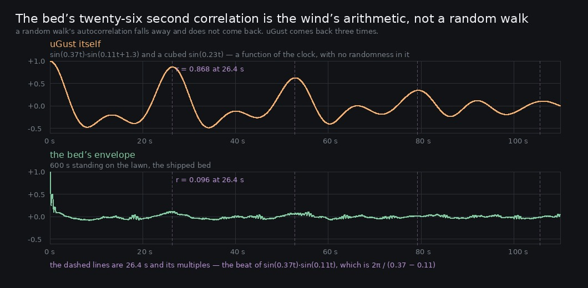

# Lane 5 — the bed's twenty-six second correlation is the wind's arithmetic, not a random walk

Branch `cursor/squad5-ravine-5535`, stacked on `cursor/squad5-pad-5535`
([#203](https://github.com/Leonxlnx/zeldaremake/pull/203)). **No `src/` change, and the reason for
that is the finding.**

Check 4 of `art/audio/RUBRIC_50_SOUND.md` — *nothing in it is periodic: no LFO an ear can lock
onto after a minute* — has been held at 3 for one sentence in `2026-09-25-loop`:

> *"The envelope autocorrelation is 0.261 before and 0.257 after, peaking near 26 s. That is not a
> loop... It is the natural correlation time of a slow random walk — a gust takes tens of seconds
> to forget itself, which is what wind does."*

Its own scorecard called that out: *"not a 4 because the envelope's own 26 s correlation is
measured but explained only as 'that is what a slow random walk does'."* An assertion standing in
for a calculation.

**It is a calculation, and the sentence is wrong.** There is no random walk. There is a product of
two sines.

## The arithmetic

`src/world/wind/wind.ts`, `update()`:

```ts
const g = 0.5 + 0.5 * Math.sin(t * 0.37) * Math.sin(t * 0.11 + 1.3);
const push = Math.max(0, Math.sin(t * 0.23 + 0.4)) ** 3;
uniforms.uGust.value = Math.min(1, g * 0.8 + push * 0.6);
```

A product of two sines is a sum of two: `sin(a)·sin(b) = (cos(a−b) − cos(a+b)) / 2`. So the first
term is not a wander, it is **a beat at 0.26 rad/s and another at 0.48** — periods of **24.2 s**
and 13.1 s — and the push is a cubed half-wave at 0.23 rad/s, **27.3 s**, with harmonics of its
own. Beating together, the whole thing repeats at about **26.4 s**.

And it is a function of `t` alone. **There is no randomness in the weather of this game at all**:
two sessions have the same gust at the same second.

## Measured, on both sides

```
2. the gust, autocorrelated against itself
        lag       r
     26.4 s   0.868
     52.9 s   0.628
     79.4 s   0.351
    117.6 s   0.223

3. the bed’s own envelope, out of 600 s of standing render
        lag       r
     26.2 s   0.126
     26.8 s   0.123
     25.7 s   0.117
     55.7 s   0.112

4. beside each other
   the gust’s strongest slow peak    26.4 s   r = 0.868
   the bed’s strongest slow peak     26.2 s   r = 0.126
   they are 0.2 s apart
```



**A random walk's autocorrelation falls away and does not come back.** This one comes back three
times, at 26.4, 52.9 and 79.4 — its period and its multiples — and the top trace is what that
looks like. The bed's peak lands 0.2 s from the gust's, which is not a coincidence available to a
random walk.

## What the score should be, and why it does not move

**Check 4 stays at 3**, and the reason changes completely.

The old reason was "we cannot explain the 26 s". The new one is that we can, exactly, and that the
bed is already doing most of the work: **the gust arrives at r = 0.868 and leaves the bed at
0.126.** The bed's own seeded random walks (`controlNoiseBuffer` on every continuous level, the
pink taps' `PINK_DRIFT`) and its events (146 flutters and 16 calls in 150 s) dissolve seven eighths
of the correlation on the way through. That is the audio doing its job well, not badly.

What is left — r ≈ 0.12 at 26 s — is small, is the largest periodicity remaining in the bed, and
is inherited rather than made here. That is a 3: good, with something left to want.

## Why nothing in `src/audio/` changes

The obvious move is for the bed to decorrelate itself from the gust — add a slow seeded offset so
its loudness is not a pure function of a periodic input. **That would be papering over it, and it
would cost a check that is currently a 4.**

Rubric check 7 is *"the wood answers weather: gusts bring leaves, lulls bring calls"*, scored 4 and
tested. The bed answering the wind is the feature. Making the audible wind disagree with the
visible wind to hide a repeat in the shared input would trade a real property for a cosmetic one,
and the next agent to measure check 7 would find it broken with no explanation in the code.

**The fault is in the input, and the input is one line in another lane's file.**

## For whoever owns `src/world/wind/wind.ts`

`uGust` is fully deterministic and repeats every ~26 s. Two fixes, either of which is small:

- **A third, incommensurate term.** The three angular frequencies are 0.37, 0.11 and 0.23 rad/s,
  and 0.37 − 0.11 = 0.26 sits within 13 % of 0.23, which is why they beat together into one clean
  cycle instead of scattering. Moving any one of them off that relationship spreads the repeat out
  over minutes.
- **A slow seeded random walk**, which is what the audio already does for every level it owns
  (`controlNoiseBuffer` in `src/audio/graph.ts` — a random walk smoothed twice, 45 s long,
  deterministic from a seed). It would keep the weather reproducible per seed, which the gauntlet
  needs, while removing the exact cycle.

This is not urgent. At r ≈ 0.12 in the bed nobody has reported hearing it, and this lane found it
by auditing its own explanation rather than by noticing it. It is filed here so the explanation in
the record is the true one.

## Listen

`clips/lawn-60s.mp3` — a minute of the shipped bed standing on the lawn, +16 dB. Two and a bit
turns of the gust's cycle. Whether an ear locks onto it is the question the numbers above cannot
settle, and at r = 0.12 the honest answer is probably not.

## Green

No `src/` change. `npm run typecheck`, `npm run build`, **252 / 252** tests, and
`playtest.mjs --only walk` at 11/11 routes with no page errors.

## Named, not taken

- **The bed's dissolution of the gust is worth a number of its own.** 0.868 → 0.126 is a factor of
  seven, and which part of the bed does it — the seeded walks, the events, or the gust knee
  gating the wind off below 0.22 — is answerable with the `mute` instrument now that it works.
  Not done here because this iteration's job was the explanation, not the mechanism.
- **The determinism is a feature elsewhere.** `uGust` being a pure function of `t` is why every
  offline render on this lane is reproducible and why the gauntlet's fixed views are stable.
  Whoever changes it should seed it rather than randomise it.

## Reproduce

```bash
npm run build
node art/audio/2026-09-25-loop/repeat.mjs --dist dist --out /tmp/gust --seconds 600
python3 art/audio/2026-09-26-gust/gust.py --take /tmp/gust/standing.wav --seconds 600
python3 art/audio/2026-09-26-gust/plot.py --take /tmp/gust/standing.wav --seconds 600 \
    --out art/audio/2026-09-26-gust/gust.jpg
```

The gust half needs no render at all — it is the formula from `wind.ts`, autocorrelated.
