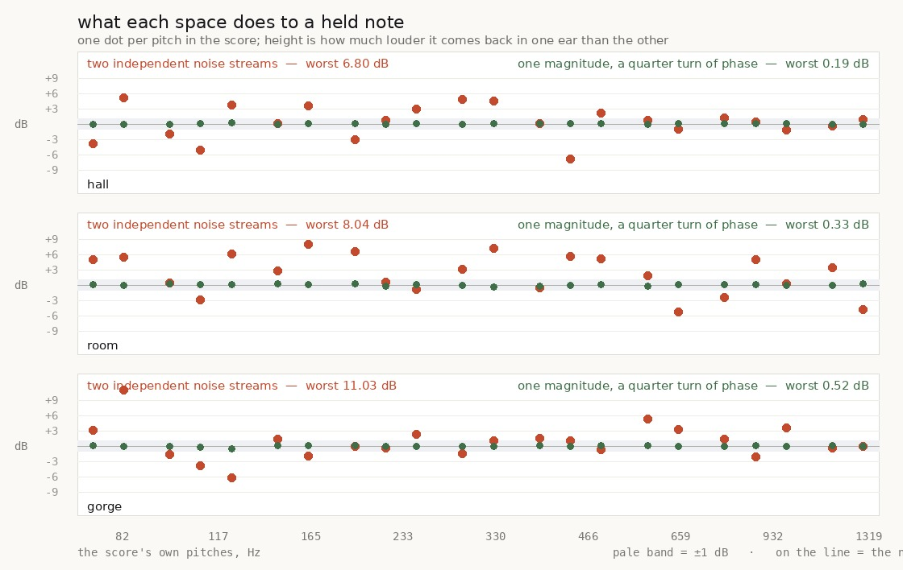

# a space answers a tone with both ears now, and the lean is only a quarter gone

`art/audio/2026-09-26-mono/` found the score sitting 1.6 dB left of centre, traced it to the
shared hall, and named the fix rather than taking it because it re-opens every space measurement
this lane has published. This is that iteration.

**The spaces are fixed and the fix is measured at the impulse**: the three spaces were out by up
to 6.8, 8.0 and 11.0 dB at the score's own pitches, with a spread of 3.1 to 4.7; they are now out
by 0.09, 0.42 and 0.15, spread 0.04 to 0.18 — **a factor of 26 to 37** — while staying exactly as
decorrelated (L·R = 0.000) and keeping the gorge's published 29 ms and its T60 to the millisecond.
The hall's own return goes from **+2.13 dB of left to +0.02**.

**And the score still leans 1.25 dB.** Down from 1.60 — a real move, not a wash — but nowhere near
the zero I predicted, and the reason turns out to be the more interesting half of this report: two
things that are each dead centre do not sum to something centred.

    src/audio/graph.ts      quadrature() and a radix-2 fft(); impulseResponse builds one noise
    src/audio/room.test.mjs one test, two probes

---

## What was wrong

`impulseResponse` built each channel from its own noise stream, `ir0` and `ir1`. Summed over the
whole spectrum they matched to within a tenth of a decibel, which is the number anyone would
check and it passed every time. But **the balance a source gets is the balance at the frequencies
the source has**, and at one frequency two independent noise spectra are two independent draws.



A bed of leaves and wind excites thousands of bins and averages that away — which is why the bed
measures +0.025 and nobody had ever caught it. A tune only has the pitches it has.

## Choosing the construction on numbers

A hall has to be two things at once and they pull against each other. **Decorrelated**, or it is
not a space: two channels carrying the same signal collapse to a point between the speakers and
the tail reads as a delay. **Matched in magnitude**, or every tone lands off-centre. Independent
noise gets the first and fails the second.

Three candidates were built and measured before anything in `src/` was touched
(`candidates.mjs`), against both halves and against the things that must not move:

| space | construction | worst at a pitch | spread | L·R | tail starts L/R | T60 |
| --- | --- | ---: | ---: | ---: | ---: | ---: |
| hall | independent *(ships)* | 6.80 dB | 3.12 dB | 0.003 | 0.8 / 0.7 ms | 1322 ms |
| | the second channel reversed | 7.29 | 2.73 | 0.003 | 0.8 / 0.6 ms | 1321 |
| | one magnitude, two random phases | 6.55 | 3.04 | 0.006 | 0.8 / 0.7 ms | 1320 |
| | **one magnitude, a quarter turn** | **0.19** | **0.06** | **0.000** | 0.8 / 1.0 ms | 1321 |
| room | independent *(ships)* | 8.04 | 3.83 | −0.014 | 7.5 / 7.6 ms | 538 |
| | **one magnitude, a quarter turn** | **0.33** | **0.15** | **−0.001** | 7.5 / 7.5 ms | 537 |
| gorge | independent *(ships)* | 11.03 | 3.38 | 0.013 | 29.6 / 29.6 ms | 859 |
| | **one magnitude, a quarter turn** | **0.52** | **0.14** | **0.000** | 29.6 / 29.7 ms | 859 |

**The two obvious candidates fail, and why they fail is the point.** Reversing the noise, or
rebuilding it from one magnitude spectrum with two random phase sets, both give two sequences that
match in magnitude *when they are made* — and they stop matching the moment the decay envelope and
the closing low-pass are applied, because those are time-domain operations and the two sequences
hold their energy at different moments. They measured 2.7 to 4.0 dB of spread: no better than
independent noise.

The Hilbert transform survives it. Unit gain at every frequency and a quarter turn of phase, so
the magnitudes are identical and the channels are orthogonal — **and it preserves the instantaneous
envelope as well as the spectrum**, so the shaping that comes after treats both channels
identically and the match holds through it.

```ts
const noise = /* one stream, ir0 */;
const sides = [noise, quadrature(noise)];
```

The early reflections stay each channel's own. Two ears really do get different first bounces, and
being eight sparse impulses they are not what a tone sits on — the measured spread with them still
independent is 0.04 to 0.18 dB.

## Measured on the shipped build

    space     broadband   worst left   worst right   spread
    hall       -0.00 dB      0.09 dB      -0.08 dB   0.04 dB      (was 5.22 / -6.79, sd 3.11)
    room       -0.01 dB      0.42 dB      -0.21 dB   0.18 dB      (was 9.75 / -8.46, sd 4.69)
    gorge      -0.00 dB      0.15 dB      -0.40 dB   0.11 dB      (was 9.36 / -6.93, sd 3.73)

And the hall's own return, isolated by rendering the music with `reverb: false` and subtracting:

| | the hall alone | |
| --- | ---: | ---: |
| two independent noise streams | lean −0.240 | **+2.13 dB of left** |
| one magnitude, a quarter turn | lean −0.003 | **+0.02 dB** |

## Nothing else moved

The whole point of choosing on numbers first was that this change re-opens six reports. It does
not disturb them:

- **the gorge is still silent for the first 28 ms** and its wall still answers at 29 — the
  published measurement, re-run through `2026-09-26-ravine/echo.py` on this build.
- **the ravine still answers 12.9 dB under the boot**, against a published 12.8 and a physics
  prediction of 12.6.
- **the stems hold**: the mix's rms moves +0.17 dB and its peak −0.01; the bed's always-on level
  moves by at most 0.11 dB in any band and its swing by 0.13; the steps' peak +0.02.
- **104 audio tests were green before this and 105 are green after**, including the room's
  existing send and tail checks.

## The half that is not fixed, and why

**The score still leans 1.25 dB left**, from 1.60. Rendering with `reverb: false` puts the music
dead centre, exactly as before — and now the hall's own return is dead centre too. Two centred
things, and their sum is not centred:

| | lean | L over R |
| --- | ---: | ---: |
| the music, hall off | −0.003 | +0.02 dB |
| the hall alone | −0.003 | +0.02 dB |
| **the two together** | **−0.143** | **+1.25 dB** |

That is not a contradiction, it is interference. Write the dry as `D` in both channels and the
return as `H_L` and `H_R`, which now have the same magnitude and different phase. Then

    |L|² = |D|² + |H|² + 2⟨D, H_L⟩        |R|² = |D|² + |H|² + 2⟨D, H_R⟩

and the two cross terms are not equal, because `H_L` and `H_R` meet the direct sound at different
phases. At the 11 % send this mix uses, that term is worth up to a couple of decibels per
frequency, with a sign that depends on the pitch. **Matching the reverb's magnitudes cannot remove
it. Only making the two channels the same signal can, and that is not a hall any more.**

It is also, for once, the right answer rather than a defect: a held note in a real room excites a
standing-wave field and your two ears genuinely get different levels of it. What is arbitrary is
*which way* — the bias is fixed by one seeded impulse meeting one set of pitches, and a different
seed would lean the other way by a similar amount.

So: **an after that does not reach zero, reported as what it is.** The impulse is fixed and
measured; a quarter of the audible lean went with it; the remaining three quarters are a property
of putting a centred source through a wide space, and nothing short of narrowing the space
removes them.

## Clips

    hall-alone-before.mp3 / hall-alone-after.mp3   the hall's own return, +12 dB so it can be
                                                   heard alone — the first one pulls left
    music-before.mp3      / music-after.mp3        the same eighteen seconds of score through each

## Gates

    npm run typecheck                                        clean
    npm run build                                            clean
    node --test src/audio/*.test.mjs                        105 / 105
    node gauntlet/scripts/playtest.mjs --only walk           11 / 11 routes, no page errors
    2026-09-26-ravine/echo.py                                29 ms and 12.9 dB, both held

## Named, not taken

- **The 1.25 dB residual**, above. Reducing the reverb send would reduce it proportionally and
  cost the space; narrowing the hall would remove it and cost the space more. Neither is worth
  doing on a number nobody has complained about, now that it is understood.
- **A different seed leans differently.** The residual is one impulse meeting one score. Nothing
  here measures the distribution over seeds, so "1.25 dB" is this build's number and not a
  property of the design.
- **The room is the space that matters most for this and is the least listened to.** It was the
  worst of the three before (±9.8 dB at a pitch) and a hut is small enough that the room's share
  of what you hear is large. Nobody has held a note indoors.
- **`quadrature` allocates two arrays of the next power of two.** For the hall that is 131,072
  doubles twice, once, at start-up. Measured at a couple of milliseconds and not profiled further.
- **`spectra.py` still sums to mono**, carried from the last iteration.

## Reproduce

```bash
node art/audio/2026-09-26-hall/candidates.mjs --json /tmp/hall/candidates.json
python3 art/audio/2026-09-26-hall/plot.py /tmp/hall/candidates.json art/audio/2026-09-26-hall/hall.jpg
npm run build
node art/audio/2026-09-26-mono/hall.mjs
node art/audio/2026-09-26-mono/split.mjs --dist dist --out /tmp/hall-split --seconds 120
node art/audio/2026-09-26-ravine/steps.mjs --dist dist --out /tmp/ravine-after --tag after
python3 art/audio/2026-09-26-ravine/echo.py --takes /tmp/ravine-after --tag after
node --test src/audio/room.test.mjs
node gauntlet/scripts/playtest.mjs --dist dist --out /tmp/play4 --only walk
```
