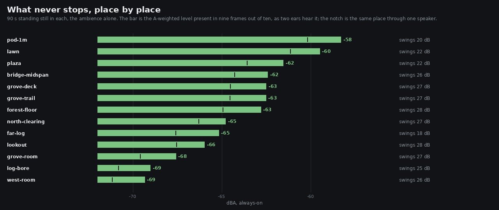

# every measurement on this lane sums to mono, and the score has been sitting left of centre

`ambience.ts` has said this out loud since the perches went in and nobody had followed the
sentence anywhere:

> a sign error in either would be invisible to every measurement this lane makes, **because all of
> them are mono sums**

Followed. Three things fall out, in rising order of how much they matter:

1. **The always-on level — the metric this lane answers *"too buzzy"* with — is 1.5 to 2.4 dB
   under what two ears hear**, in every place in the world. `floor.py` is corrected and the old
   number kept in a column beside it.
2. **The balance between the stems moves up to 2.0 dB** depending on whether the player is on
   headphones or a phone, and every level decision this lane has shipped was taken on the mono
   number.
3. **The score sits 1.6 dB left of centre**, persistently, and the reason is not in the music at
   all: the shared hall is built from two independent noise streams, so it is balanced to a tenth
   of a decibel broadband and out by **up to 9.8 dB at a single pitch**. A bed of noise averages
   that away. A tune only has the pitches it has.

One fix shipped, one fail reported, one cause diagnosed and named.

    art/audio/2026-09-24-standing/floor.py   the always-on metric, corrected, with a selftest
    src/audio/music.ts                       harpPan() — a real bias, and NOT the lean (see below)
    src/audio/music.test.mjs                 one test, two probes

---

## 1. What one speaker does to each stem

`mono.py` reads the four stems as they were rendered — **stereo** is the energy two ears get,
`(L² + R²)/2`; **mono** is `((L + R)/2)²`, which is what a phone, a single Bluetooth speaker or a
laptop's mixed output gives. A centred stem loses nothing; an unrelated pair loses 3 dB.

| stem | on headphones | on one speaker | the collapse | L·R | side − mid | lean |
| --- | ---: | ---: | ---: | ---: | ---: | ---: |
| mix | −27.8 dB | −28.3 dB | −0.48 dB | 0.80 | −9.3 | −0.130 |
| bed | −38.7 dB | −41.0 dB | **−2.27 dB** | 0.18 | −1.6 | +0.025 |
| steps | −34.7 dB | −35.4 dB | −0.72 dB | 0.69 | −7.4 | −0.004 |
| music | −29.3 dB | −29.5 dB | −0.25 dB | 0.90 | −12.2 | **−0.183** |

A level is only a level against something else, and that is where it bites:

| | headphones | one speaker | moves by |
| --- | ---: | ---: | ---: |
| steps over the bed | 4.0 dB | 5.5 dB | **+1.55 dB** |
| music over the bed | 9.4 dB | 11.4 dB | **+2.02 dB** |
| mix over the bed | 10.9 dB | 12.7 dB | +1.79 dB |

The bed is nearly decorrelated and the music is nearly centred, so the forest is **2 dB further
under the tune on a phone than on headphones**. The steps cut of 4 dB, the sfx pad, the music
balance — all of them were decided on the mono column, which is the phone's, by accident rather
than by choice.

Row 43 of the rubric is *the stereo field is used but never collapses to one side*, scored 4 on
"side 3–4.6 dB under mid". **That number matches no stem measured here** — the bed's side is 1.6 dB
under its mid and the music's is 12.2 — and it is not reproducible from any committed script,
which is the same gap row 50 names. The score stands; the evidence is replaced with the table
above, and `lean` is the column that actually answers the wording.

## 2. The world's floor, corrected

`floor.py` is the tool behind the lane's most-quoted table. It averaged the channels before
measuring anything. It now averages channel **powers**, which is what `levels.py` already does
because BS.1770 says to, and what a loudness judgement means.

**For anything centred the two are identical**, so this is a correction and not a recalibration —
and the old number is kept in a `1 spkr` column so an older report stays comparable with the thing
it was measured with. A selftest runs on every invocation and refuses to report if a centred take
does not read the same either way, or an unrelated pair 3.01 dB higher.

```
place              floor   swing  1 spkr    60-250  250-1k    1-2k    2-4k    4-8k   8-16k
pod-1m             -58.3    20.1   -60.2     -51.0   -54.8   -75.9   -80.5   -96.2  -104.3
lawn               -59.5    22.1   -61.2     -54.8   -58.6   -74.8   -78.7   -97.1  -104.0
plaza              -61.5    22.4   -63.6     -55.0   -58.8   -78.2   -83.1   -97.0  -104.6
…
west-room          -69.3    25.5   -71.2     -65.2   -67.9   -82.5   -90.4  -106.6  -105.2

two ears against one speaker: +1.5 to +2.4 dB across the world, median +1.9
```

The ranking does not move and no place stops breathing, so nothing that was concluded from the
survey changes — only the absolute numbers, and only for a listener with two ears. The `1 spkr`
column reproduces the published survey exactly where it should: **pod-1m at −60.2 dBA**, which is
the figure `2026-09-25-resurvey` named as the loudest never-stopping place in the world.



## 3. The score sits left — and the harp is not why

### What was found

The music stem leans left in **every ten-second window of a two-minute take but one**. Not noise:
the steps sit at ±0.03 across the same windows and the bed averages to +0.025.

### The fix that did not work, reported as a fail

The harp is the only panned voice in the music and it was panned by its index in the arpeggio:

```ts
pluck(t0 + i * BEAT * 0.5, chord[idx] + 12 * (lift + 1), vel, (i / (HARP.length - 1) - 0.5) * 0.7);
```

`i` is doing three unrelated jobs. It picks where the note sits, it picks how hard the note is
struck (`i % 2 === 0` is an on-beat eighth and is louder), and it is what every rule thinning the
figure tests — and all of them lean the same way. `bar % 4 === 3 && i >= 6` drops the two
rightmost notes; `i === 5 && bar % 2 === 1` drops another right-of-centre one; `quiet && i % 2 === 1`
drops the right-leaning half; and the accent makes the left-leaning half the loud one.

Walking the schedule with `StereoPannerNode`'s own equal-power law (`harp.py`):

| pan rule | quiet pass | full pass |
| --- | ---: | ---: |
| as it shipped: pan = the note's index | **+1.01 dB left** | **+0.60 dB left** |
| …sweeping the other way each bar | −0.08 | −0.25 |
| …sweeping the other way each phrase | **+0.08** | **+0.08** |

So the sweep now turns round every phrase — the thinning rules have periods of two and four bars
and the accent has a period of one, so a sign that flips every four bars averages all three to
nothing. Per-bar alternation was tried first and is worse, because the bar-parity rules flip *with*
it instead of cancelling.

**And it changed the stem by nothing.** Rendered either side, the music's lean is −0.183 before
and −0.182 after. The two takes do differ — the difference is 27.6 dB under the stem — but the
harp is too small a share of the music for its own 0.6–1.0 dB to show. The change is kept because
the bias is real, latent and now tested, but **it is not what you can hear, and the headline it was
aimed at did not move.**

### What it actually is

`OfflineOptions.reverb: false` separates the dry path from the shared hall, and the answer is not
ambiguous:

| the music stem | lean | L over R |
| --- | ---: | ---: |
| hall on | −0.182 | **+1.60 dB** |
| hall off | −0.003 | **+0.02 dB** |

Dead centre without the hall, in every band (the worst is 0.22 dB at 150–300 Hz). The hall's own
contribution, isolated by subtracting one take from the other, leans −0.240 and is 9.5 % of the
take.

`impulseResponse` builds its two channels from two independent noise streams, `rng.fork('ir0')`
and `ir1`. Summed over the whole spectrum they match — which is the number anyone would check, and
it passes. But **the balance a source gets is the balance at the frequencies the source has**, and
at a single frequency two independent noise spectra are two independent draws:

| space | broadband | worst left at a pitch | worst right | spread (sd) |
| --- | ---: | ---: | ---: | ---: |
| hall | +0.07 dB | +5.22 dB | −6.79 dB | 3.11 dB |
| room | −0.11 dB | **+9.75 dB** | −8.46 dB | **4.69 dB** |
| gorge | −0.13 dB | +9.36 dB | −6.93 dB | 3.73 dB |

A bed of leaves and wind excites thousands of bins and averages it away — which is why the bed
measures +0.025 and nobody ever noticed. A tune has the pitches it has, and the score's happen to
sum to 1.6 dB of left. The room is the worst of the three, so a held note **indoors** would pull
hardest, and no one has listened for that.

### The fix, named and not taken

The two channels of a diffuse tail should share a magnitude spectrum and differ only in phase:
that is what makes a hall wide, and the level difference is an artefact rather than part of it.
Generating the impulse in the frequency domain — one random magnitude, two random phases — does it
exactly.

It is not in this iteration for a reason. It changes all three spaces, and this lane has published
measured numbers on every one of them: the gorge's wall answering at **29 ms** and its field
**12.8 dB** under the direct, the room's tail, the hall's own send calibrations. Every one of those
would need re-measuring against the new impulse, and a fix that quietly invalidates six reports is
worse than a fix that waits for its own iteration and its own before/after.

## Not a finding: the headroom is safe

Worth stating because it is the obvious next worry and it is not true. The peak and LUFS tools
were already per-channel — `verdict.py` takes `max(true_peak_db(a[:, c]) for c in …)` and
`levels.py` K-weights and sums the channels the way BS.1770 requires. So every headroom and LUFS
claim this lane has published is correct as it stands. It is the **spectra and the percentiles**
that were mono: `spectra.py` and `floor.py`, both of which call `.mean(axis=1)` on the way in.

For the record, the mix's true peak is **−11.89 dBFS per channel against −13.01 on the mono sum**,
so a headroom number taken from a summed file would have been 1.1 dB optimistic. None were.

## Clips

    music-hall-on.mp3 / music-hall-off.mp3   the same eighteen seconds of score, with the
                                             shared hall and without it — the lean is in the first
    bed-stereo.mp3 / bed-one-speaker.mp3     the bed as two ears get it, and folded to one channel;
                                             2.27 dB of it is in the fold

## Gates

    npm run typecheck                                        clean
    npm run build                                            clean
    node --test src/audio/*.test.mjs                        104 / 104
    node gauntlet/scripts/playtest.mjs --only walk           11 / 11 routes, no page errors

## Named, not taken

- **The hall's per-pitch imbalance**, above. The fix is understood and the reason to wait is that
  it re-opens every space measurement this lane has published.
- **`spectra.py` still sums to mono**, and it is the tool behind most of the lane's per-band
  sheets. Correcting it shifts every future number by ~2 dB against every past one; `floor.py`
  shows the shape of the answer (both columns, and a selftest), and the same treatment there is
  a bounded follow-up rather than something to slip into this.
- **Nobody has listened to a tone indoors.** The room's ±9.8 dB is the worst of the three and a
  hut is small enough that the room's share of what you hear is large.
- **The bed's L·R is 0.18** — nearly decorrelated. That is wide even for a diffuse field, and it
  is why the bed loses the most to a phone. Whether it should be narrower is a taste question and
  the owner has not asked one.
- **Which listening case to tune for is still unchosen.** The mono column is what every shipped
  level was decided on. That is a defensible choice for a phone and an accidental one, and this
  report only makes the difference visible.

## Reproduce

```bash
npm run build
node art/audio/2026-09-23-lane5/render-mix.mjs --dist dist --out /tmp/mono --seconds 120 --stems mix,bed,steps,music
python3 art/audio/2026-09-26-mono/mono.py /tmp/mono
node art/audio/2026-09-26-mono/split.mjs --dist dist --out /tmp/mono-split --seconds 120
node art/audio/2026-09-26-mono/hall.mjs
python3 art/audio/2026-09-26-mono/harp.py
node art/audio/2026-09-24-standing/survey.mjs --dist dist --out /tmp/standing-mono --seconds 90
python3 art/audio/2026-09-24-standing/floor.py --takes /tmp/standing-mono --out art/audio/2026-09-26-mono/world-floor-stereo.jpg
node --test src/audio/music.test.mjs
```
