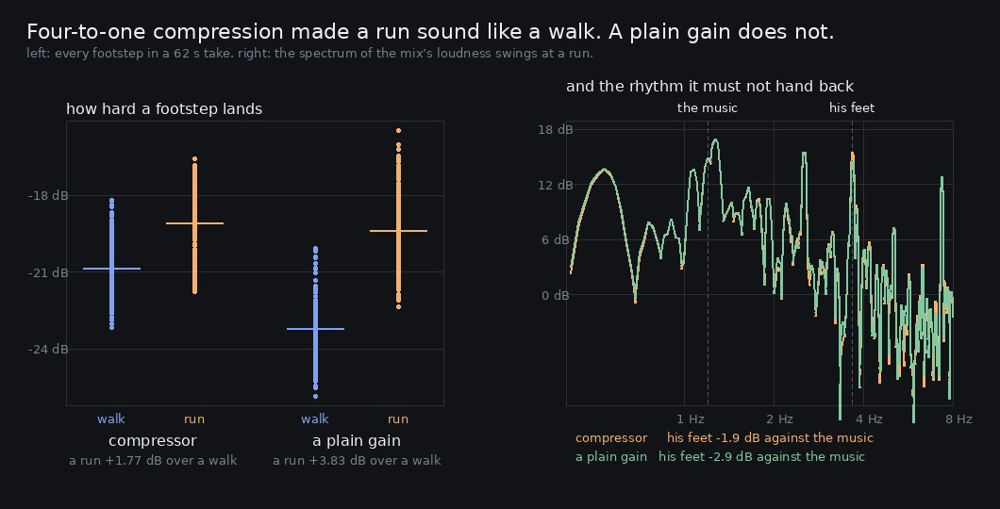

# Lane 5 — the sfx compressor could not show it was worth its cost, so it is a gain now

Branch `cursor/squad5-pad-5535`, off the integration head at `2b15f687`. `src/` changes are
`graph.ts` (the node comes out, one constant replaces two), `index.ts` (one doc comment),
`level.test.mjs` and one line of `room.test.mjs`.

For two days the sfx bus carried a `DynamicsCompressorNode`. It was added for one sentence — the
owner, 2026-09-24 at 23:00: *"the music kind of still shakes whenever I run"* — and it worked: it
took 3.2 dB off the step-rate pulse. Four measurements since then say it was the expensive way to
do that, and this is the fourth.

## The case against it, one measurement at a time

**It was never a limiter.** `2026-09-26-perstep` measured every step in the game individually:
standing, walking, running, on all five surfaces, **every footstep is in full four-to-one
compression**. Its own comment said *"quiet steps pass untouched (the threshold is below a walk's
peak); a run's are held"*; compression begins 16 dB under a walk's peak. What it actually was is a
fixed pad with a wobble.

**The wobble does nothing.** `2026-09-26-release` modelled the node from the spec and swept its
release across a factor of sixteen — 60 ms to 1000 ms. The gain does move 10–12 dB between steps,
exactly as the pumping theory predicts, and the step-rate line moves **0.4 dB**. Whatever the pulse
is, it is not the gain moving.

**It charges 2.4 dB of the difference between a walk and a run.** `2026-09-26-limiter` measured a
run at +3.97 dB over a walk with the node bypassed and +1.55 dB with it in. Four-to-one takes more
off a loud step than a quiet one, so it pushes the gaits together — and the gait difference is the
one thing the player's own feet tell him about his own speed. The lane had been *working on* that
number from the other end ([#177](https://github.com/Leonxlnx/zeldaremake/pull/177) raised the run's
step force) while this quietly took it back.

**And a plain gain does the same job.** Which is this folder.

That last one is not a contradiction of `-limiter`'s "do not raise the threshold". Raising the
threshold let steps through at the *same* pad and handed the pulse back with the gait. Replacing
the node with a *bigger* pad keeps the pulse and buys the gait — a different experiment with a
different answer.

## Setting them the same task

The bypassed path is linear, so every candidate pad is arithmetic on takes already made — the trick
from `-release/price.py`: with the dry steps rendered once, a pad of `p` dB is exactly
`mix_off − (1 − 10^(−p/20))·dry_off`.

```
run at 2.2 m/s
   pad  step over beat  step peak    crest
 -0 dB         +7.6 dB   -12.4 dB  10.7 dB
 -4 dB         +1.9 dB   -16.4 dB  10.7 dB
 -6 dB         -1.2 dB   -18.4 dB  10.7 dB
 -8 dB         -4.5 dB   -20.4 dB  10.7 dB

walk at 1.2 m/s
 -0 dB         +1.8 dB   -16.2 dB   9.1 dB
 -2 dB         -1.1 dB   -18.2 dB   9.0 dB
 -4 dB         -2.0 dB   -20.2 dB   9.0 dB
 -6 dB         -2.1 dB   -22.2 dB   9.0 dB
```

A walk saturates at −2.1 dB, the same way it did in `-release`: past a 6 dB pad its step rate is no
longer the tallest thing near 2.73 Hz. **7 dB is the smallest whole decibel where a run reaches that
margin too**, which is the rule the previous iteration set and this one keeps.

## After: the graph as it now is

Rendered, not priced — the same script, the same seed, the same plaza spine, the same 62 s.

```
gait                    step over beat  step peak    crest
run       compressor           -1.9 dB   -19.1 dB  10.4 dB   under the music
run      a plain pad           -2.9 dB   -19.4 dB  10.7 dB   under the music

walk      compressor           -2.0 dB   -20.8 dB   9.0 dB   under the music
walk     a plain pad           -2.1 dB   -23.2 dB   9.0 dB   under the music

      compressor   a run peaks +1.77 dB over a walk
     a plain pad   a run peaks +3.83 dB over a walk
```

**The owner's complaint stays closed and gets 1 dB better**, the step is very slightly more of a
transient (crest 10.4 → 10.7 dB), and **a run is more than twice as far over a walk as it was**.



The left panel is the whole argument: the same walk and run, once through each. The columns come
apart because nothing is squeezing the loud one any more.

Measured on the loudest step rather than the median, the run actually gets *louder*: its peak goes
−16.1 → −15.2 dBFS, because the compressor was taking the most off exactly the steps that land
hardest. A walk's typical step is 2.4 dB quieter, which is the same fact from the other side, and
it is still **23 dB over the always-on level of the bed and the music together** — nowhere near
being lost under the background the owner has twice asked to be quieter.

```
gait                  step peak  bed floor  over the bed
run       compressor   -16.1 dB   -42.6 dB       26.4 dB
run      a plain pad   -15.2 dB   -42.6 dB       27.4 dB
walk      compressor   -17.7 dB   -42.3 dB       24.7 dB
walk     a plain pad   -19.2 dB   -42.3 dB       23.2 dB
```

## The one thing a gain cannot do

The compressor's docstring named it: *"it is stable because the sfx bus has a compressor on it, so
no amount of stacking gets past it"*, and `MASTER_TRIM_DB = 9` is sized against that stability.
Removing a limiter without re-measuring the worst case would be exactly the kind of argument this
lane does not accept, so `2026-09-24-level/worstcase.mjs` built it on purpose both ways — running
on the flagstones under the lantern bough, the densest cluster of pod flames in the world, jumping
continuously so every landing stacks on the steps, with the score playing:

```
                                   events  sample peak   true peak  loudest second
compressor         143 steps, 46 landings      -9.3 dB     -9.3 dB        -20.9 dB
a plain pad        144 steps, 45 landings      -8.9 dB     -8.9 dB        -20.9 dB

                 true peak    free             stated before the trim
   compressor         -9.3 dB    9.3 dB   passes                      -18.3 dBFS
   a plain pad        -8.9 dB    8.9 dB   passes                      -17.9 dBFS
```

**The stacking protection was worth 0.4 dB.** These are finished output with the master trim
already in them, measured 4× oversampled; `level.test.mjs` requires 6 dB free and there are 8.9.
Stated the way the test carries it — before the trim — the worst case is −17.9 dBFS, still inside
the −16.7 the constant holds.

So the trade is: 0.4 dB of worst-case headroom, for 2.06 dB of the difference between a walk and a
run, 1 dB more margin on the owner's complaint, one fewer node, and no undocumented makeup gain to
measure and take back off.

## What it did not cost

**The control.** The compressor-bypassed takes never touch the bus's output stage, so they must
not move — and they sit at the render's own floor (two renders of identical code differ by about
−108 dB relative, `-release`):

```
   run-mix-off      -108.0 dB   the render floor: unmoved
   run-steps-off    -114.5 dB   the render floor: unmoved
   walk-mix-off     -107.2 dB   the render floor: unmoved
   walk-steps-off   -112.4 dB   the render floor: unmoved
```

**The music.** Untouched, as it has been throughout: the pad is on the sfx bus, not the master, and
nothing is ducked or side-chained.

## Listen

`clips/` — the same fourteen seconds each way, at both gaits, **not normalised**.

```
run-compressor.mp3    run-pad.mp3
walk-compressor.mp3   walk-pad.mp3
```

Play the two walks against the two runs rather than each pair alone. The pulse difference is 1 dB
and subtle; the gait difference is 2 dB and is the point.

## Green

`npm run typecheck`, `npm run build`, **243 / 243** tests, and `playtest.mjs --only walk` at 11/11
routes with no page errors.

`level.test.mjs` keeps the shape the last iteration gave it — the pad must be big enough, and no
bigger than the smallest whole decibel that does it — and gains one guard the last iteration could
not have: **nothing on the sfx bus may have a time constant** without re-measuring what that costs
the gait. That is a `createDynamicsCompressor` check on the source, and it is there because the
node that was just removed was added without that measurement ever being taken.

## Named, not taken

- **`WORST_CASE_PEAK_DBFS = −16.7` is still conservative**, now by 1.2 dB rather than 1.6. Two
  fresh takes of the same deliberate worst case put it at −18.3 and −17.9. Left alone because
  lowering a ceiling constant buys nothing until somebody wants the headroom.
- **`OfflineOptions.limiter` is now named for a node that no longer exists.** Kept, because three
  committed evidence scripts pass it and renaming it would cost their reports their
  reproducibility. It does what it always did: bypass the sfx bus's output stage.
- **The step designs are now the only thing setting the gait difference**, at +3.83 dB against the
  4.31 the designs ask for. The remaining 0.5 dB is the render's own variation over a 62 s take;
  worth confirming on a longer one before anybody adjusts `STEP_FORCE_RUN` again.
- The last candidate from `-limiter`'s list is still **the music's share of the mix**. Not taken
  for the same reason as before: raising the music raises the always-on floor, and that floor is
  where the owner's other complaint lives.
