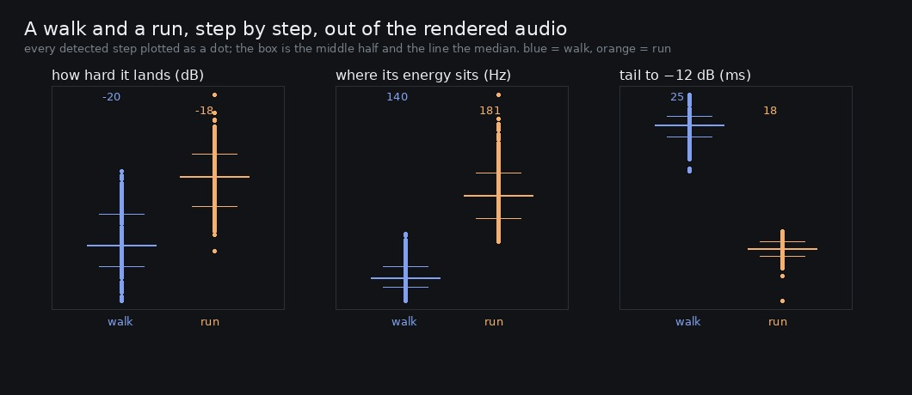

# Lane 5 — a run can be measured against a walk at last, and the compressor eats most of its level

Branch `cursor/squad5-perstep-5535`, off the integration head at `97045ffa`. **No `src/` change.**

Rubric check 21 is *walking and running differ in more than rate*. It has sat at **3** with the same
reason beside it since it was scored: **the per-step instrument does not work at a running cadence.**
At the old controller a run was 4.6 m/s and five steps a second, a step's envelope had not finished
when the next one began, the onset detector under-counted, and the run's own first half differed
from its second by 13.4 dB rms — four times the walk's 3.2 and three times the difference the
measurement was looking for.

PR #59 brought the run to 2.2 m/s and **3.67 steps a second**. 272 ms between steps is not 143, and
the question becomes answerable for the first time. That is the only reason to ask it again.

## The instrument works now, and it says so first

The plaza spine is stone end to end with no enclosure on it, so the surface and the space are held
and the only difference between the two takes is the gait.

```
gait    speed   cadence    found expected  ratio    gap median  gap IQR
walk    1.2 m/s   2.73/s      170      169   1.01        367 ms      2 ms
run     2.2 m/s   3.67/s      228      227   1.00        267 ms      2 ms
```

**Every step, at both gaits** — the ratio of found to expected is 1.01 and 1.00, where under-counting
was the old instrument's failure. The gap between onsets scatters by **2 ms**, so the detector is
finding steps and not parts of them.

## What a step is, per gait



```
gait        peak   centroid  decay to -12 dB
walk     -20.1 dB      140 Hz            25 ms
run      -18.3 dB      181 Hz            18 ms

a run against a walk: +1.7 dB, +42 Hz, -7 ms, and 1.34x the rate
```

The centroid and the decay are the "more than rate" part, and their distributions barely overlap —
the run's body is **30 % brighter** and its tail **28 % shorter** than the walk's, measured out of
the audio rather than off the design. That is check 21 answered, on its own terms, with an
instrument that reports its own reliability first. **It goes to 4.**

## And the part that is not good news

**The design asks for 4.31 dB between the gaits and the ear gets 1.7.**

`strengthFor` gives 0.42 at a walk and 0.69 at a run — a 4.31 dB gap, which is what
`2026-09-25-runforce` put back an hour ago after PR #59 had halved it. It does not arrive. The sfx
bus carries a `DynamicsCompressorNode` at **threshold −30 dB, knee 12, ratio 4**, so compression
begins at −36 dB and is full above −24 — and a step lands at −18 to −20. **Every step in the game
is in full four-to-one compression.** Putting the two step levels through that curve:

```
input -24.4 / -20.1 dB  ->  output -28.6 / -27.5,  gap 4.30 -> 1.08 dB
```

1.08 dB, against 1.7 measured — the extra is the 3 ms attack letting part of the transient past
before the gain reduction settles. So the compressor is taking roughly three quarters of the level
difference between a walk and a run, and always has: the same arithmetic applies to the 4.35 dB the
old controller asked for.

This does not undo last hour's change — 1.7 dB delivered is still nearly double the 1.0 the halved
design would have given — but it does correct the record. That report gave the gap as a property of
`strengthFor`, and a reader would reasonably have taken it for what you hear.

## Named, not taken

**The compressor is called `sfxLimit` and is not behaving like one.** A limiter sits above the
normal signal and catches what overshoots; this one sits fifteen decibels below every footstep the
game makes. Raising its threshold so ordinary steps pass uncompressed would hand the gaits their
full 4.3 dB back and leave the landings and the stacked events still caught — but it would also make
the stem louder, which means re-measuring `SFX_TRIM` and the worst case, and the owner's *"the music
… shakes whenever I run"* is exactly the failure mode at the other end of that dial. It is a change
worth making carefully with a before and an after, not in the last half hour of an iteration.

## Reproduce

```bash
npm run build
node art/audio/2026-09-26-perstep/steps.mjs --dist dist --out /tmp/perstep
python3 art/audio/2026-09-26-perstep/steps.py --takes /tmp/perstep \
    --out art/audio/2026-09-26-perstep/steps.jpg
```

`clips/{walk,run}.mp3` is twelve seconds of each.

**223 / 223 tests**, typecheck clean, build green. Nothing in `src/` changes on this branch.
