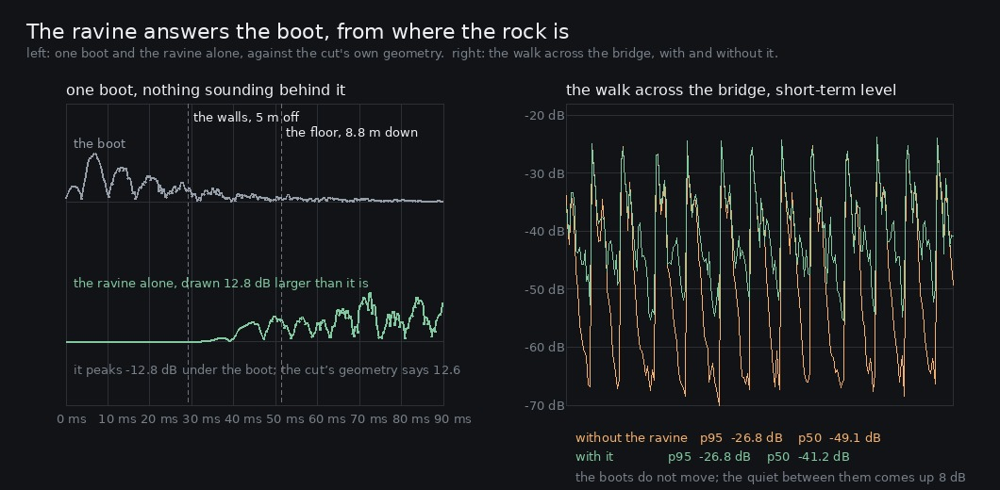

# Lane 5 — `surfaceAt` has known about the ravine since it was cut; his boots did not

Branch `cursor/squad5-ravine-5535`, stacked on `cursor/squad5-pad-5535`
([#203](https://github.com/Leonxlnx/zeldaremake/pull/203)) because both touch `graph.ts`. Merge
#203 first. `src/` changes are `graph.ts`, `footsteps.ts`, `index.ts` and two test files.

`art/audio/RUBRIC_50_SOUND.md` has one specific, named weakness left that is not a mis-score:
**the open outdoors is one place.** Thirteen surveyed spots, and the enclosed ones are each
somewhere while a paved stone circle in a clearing, an open plateau dais and mid-span over an
eight-metre ravine are within 1.7 dB of one another in shape (`2026-09-25-places`). This is the
first of those three, and it turned out to be a hole rather than a tuning problem.

## The hole

`gorgeAt` returns **1.00 the whole way across the bridge** and falls off over about eleven metres
either side, scaled by how deep the cut is there. The bed uses it — `GORGE_HALL` and `GORGE_WIND`,
worth +2.7 dB across the bed. His boots did not: `footsteps.drive` was handed `speed`, `surface`,
`onStairs` and `enclosure`, and nothing else.

That is exactly the hole `2026-09-24-room` found for the huts, so it is measured the same way —
the footsteps stem rendered with the space term forced to 0 and to 1, and subtracted:

```
--- before ---
   on the bridge     -105.7 dB under the take   the render floor: the boots do not know

                         p95 (the steps)   p50 (between them)
   the bridge                      +0.00 dB             +0.00 dB
```

−105.7 dB is this instrument's own floor: two renders of *identical* code differ by that much
(`2026-09-24-room` measured −115, `2026-09-26-release` −108). **A player walking out over eight
metres of open air with rock either side made exactly the sound he makes on a veranda**, in the one
place in this world where a contact would obviously answer.

## What a ravine is

`buses.gorge`, a convolver of its own, built from the cut's geometry rather than from a preset.
`EXPANSION_SOUTH.ravine.line` gives mid-span a half width of 5 m and a depth of 8.8 m, so at
343 m/s:

- a **wall answers 29 ms** after the boot — and that is the pre-delay, because nothing reaches the
  ear before it. A space that starts at sample 0 thickens the boot instead of reflecting it, which
  is the fault the hut's first attempt had.
- the **floor answers 51 ms** after it, which is what the early spread reaches out to.
- it is **brighter than the wood** (7 kHz against the hall's 3) because rock returns the top that
  leaves absorb, and **shorter** (0.9 s against 1.5) because a cut open to the sky loses most of
  its energy upward. Short, bright and late is what tells a ravine from a room.

The return is calibrated, not chosen — `ConvolverNode.normalize` rescales an impulse by a rule that
has nothing to do with the space, the same trap `ROOM_RETURN` documents. The target is physics: a
boot reaches the ear about 1.7 m away, a wall 5 m off returns it over 10 m (15.4 dB of spreading
loss, almost nothing absorbed) and the floor over 17.6 m, so the first-order field should be about
**12.6 dB under the direct**, with higher orders adding little because the fourth wall is the sky.

## After

```
--- after ---
1. does anything happen (the term forced the whole way, one take minus the other)

   on the bridge       -8.9 dB under the take   the ravine

2. does it stay where the cut is (the shipped term, leg by leg)

                         shipped minus no-ravine
   grass                             -105.4 dB   unchanged
   dirt                              -107.2 dB   unchanged
   flagstones                        -200.2 dB   unchanged
   the stair flight                  -104.6 dB   unchanged
   deck planks                       -104.1 dB   unchanged
   the log bore                      -103.6 dB   unchanged
   leaves                            -105.6 dB   unchanged
   a run on stone                    -110.3 dB   unchanged
   the bridge                          -8.9 dB   the ravine

3. what it did to the walk

                         p95 (the steps)   p50 (between them)
   the bridge                      -0.06 dB             +7.95 dB
   the stair flight                +0.00 dB             +0.00 dB

4. where the rock is -- one boot, with nothing sounding behind it

   the boot at 3.05 s peaks at -25.8 dB; the ravine answers -12.8 dB under it

      0 ms  silence
     ...
     26 ms  silence
     28 ms    -70.6 dB
     30 ms    -44.1 dB  ############   <- the walls, 5 m off
     32 ms    -35.3 dB  #################
     ...
     52 ms    -21.2 dB  ########################   <- the floor, 8.8 m down

   silent for the first 28 ms; the rock at mid-span cannot answer before 29
```

**12.8 dB under the boot against the 12.6 the geometry predicts**, and silent until the rock could
have answered. For scale the hut's plank box sits at 10.9 dB under and raises its p50 by 4–10 dB;
this raises it by 8. The hut should be the louder of the two — six surfaces two metres off against
two walls at five and a roof made of sky — and it is.



The right panel is the room lesson in a picture: **the tops of the spikes do not move** (p95 −0.06
dB — whatever this is, it is not a fader) and **the troughs come up 8 dB**, which is where a space
lives. The silence a footstep used to fall into on the bridge is no longer reached before the next
boot lands.

## The control, which is the half that is easy to get wrong

Forcing the term the whole way is what isolates the space, and it is *not* the shipped behaviour —
under it every leg is in a ravine, including the stair flight. So the third take forces nothing and
lets the walk set the term, and leg by leg only the bridge moves; the other eight sit at the render
floor. The two stairs clips below are byte-for-byte the same file, which is the same statement made
where a person can hear it.

## Listen

`clips/` — the steps stem, seven seconds from 44 s so the two seconds of standing before the bridge
are in it. Both clips carry a common +16 dB because the footsteps stem alone is quiet; nothing else
is normalised.

```
bridge-no-ravine.mp3   bridge-ravine.mp3     the boots go out over the cut
stairs-no-ravine.mp3   stairs-ravine.mp3     the control — the same file twice
```

## Green

`npm run typecheck`, `npm run build`, **246 / 246** tests (three new, in `room.test.mjs`), and
`playtest.mjs --only walk` at 11/11 routes with no page errors.

The three new guards are the ones this change could silently get wrong: that the ravine is its own
convolver and not the hall with more send on it (which is what `gorge` already was), that its
pre-delay really is the wall distance — `2 × 5 / 343` asserted against the constant, with the built
impulse's first 29 ms required to be exactly zero — and that the two spaces are independent, so
being out over the cut does not put him indoors or the reverse.

## Named, not taken

- **The bed and the bird calls do not use the ravine**, only the contacts. That is the hut's
  pattern exactly — `buses.room` serves the footsteps and the bed handles indoors by filtering —
  and it is deliberate here for a measured reason: the bed is dark, and the last attempt at the
  gorge's colour opened the bed's own filter and moved 4–8 kHz by +0.3 dB because there is almost
  nothing up there to return. A bird call is not dark, and a call heard from the far bank while you
  stand mid-span is the obvious next thing this space should be under.
- **This does not move rubric check 9 or 15 on their own terms.** Those are scored on the always-on
  spectrum of a listener standing still, and a contact-only space contributes nothing when nobody
  is walking. It moves check 44 (reflection belongs to the space) and what a player actually hears
  crossing the bridge. Re-scoring 9 and 15 needs the point above.
- **A third convolver runs at all times**, 0.9 s of stereo impulse, whether or not anything is sent
  into it. The hall (1.5 s) and the room (0.32 s) already do, so this is the same bet a third time;
  rubric 49 is the check that would notice, and `renderCapacity` is still unsupported here.
- The other two open places from `-places` — the plaza's paved circle and the plateau dais — are
  untouched. The plaza is ringed by huts and trunks at 5–15 m and the dais has nothing around it at
  all, which is a real difference and is currently worth 0.4 dB.

## Reproduce

```bash
npm run build
node art/audio/2026-09-26-ravine/steps.mjs --dist dist --out /tmp/ravine --tag after
python3 art/audio/2026-09-26-ravine/echo.py --takes /tmp/ravine --tag after
python3 art/audio/2026-09-26-ravine/plot.py --takes /tmp/ravine --out art/audio/2026-09-26-ravine/ravine.jpg
bash art/audio/2026-09-26-ravine/clips.sh /tmp/ravine art/audio/2026-09-26-ravine/clips
```
