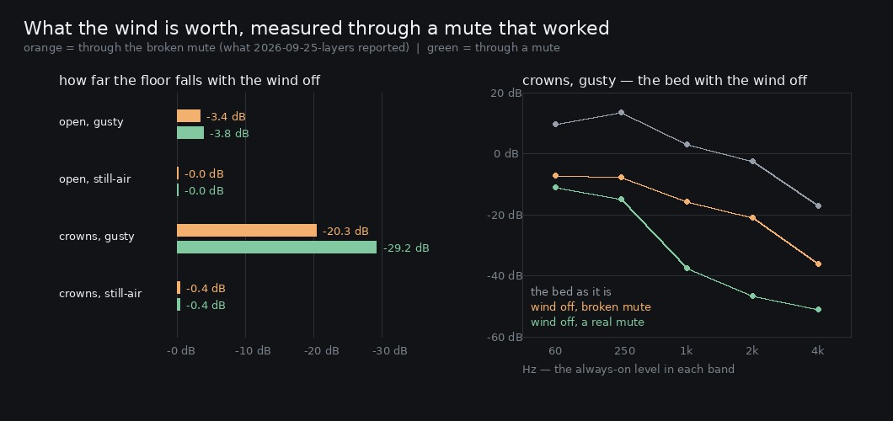

# Lane 5 — re-running the one measurement the broken mute invalidated

Branch `cursor/squad5-ravine-5535`, on top of the ravine and flame work, itself stacked on
`cursor/squad5-pad-5535` ([#203](https://github.com/Leonxlnx/zeldaremake/pull/203)). **No `src/`
change here** — the fix landed in `2026-09-26-shadow2`; this is the follow-through.

Last iteration found that `mute: ['wind']` was not muting the wind. `canopyMod` and `hushMod` are
**connected to** `canopyGain.gain` and `hushGain.gain`, and a node connected to an `AudioParam` is
summed with that param's automation rather than scaling it, so zeroing the level left the gust's
own depth still driving the same gain.

`mute` is the instrument every *what is this layer worth* measurement on this lane rests on, and
`2026-09-25-layers` used it on the wind. Saying "that report's wind rows are wrong" and leaving it
there would be an argument. This is the measurement.

## The method

The identical sixteen takes — two places × two gusts × four mutes, 150 s each — rendered twice:
once on a build with the bug put back, once on the fixed build. The analysis is
`2026-09-25-layers/layers.py`'s own `measure`, loaded out of that file rather than reimplemented,
so the numbers being corrected and the numbers correcting them come from the same code.

## The longest quiet: unchanged

```
condition                            all   no leaves   no birds   no wind
   open, gusty            before    9.45        9.45      11.81     27.16
   open, gusty             after    9.45        9.45      11.81     27.21
   open, still-air        before    4.60        4.60       5.60      4.60
   open, still-air         after    4.60        4.60       5.60      4.60
   crowns, gusty          before   14.73       14.86      33.47     17.76
   crowns, gusty           after   14.73       14.86      33.47     17.76
   crowns, still-air      before    3.25        8.43       4.23      3.58
   crowns, still-air       after    3.25        8.43       4.23      3.58
```

Every figure identical except one, which moves 0.05 s. The report's central finding — *under
closed crowns with the air still, taking the leaves away takes the longest silence from 3.25 s to
8.43 s* — is untouched, and so is *the birds carry the wood far more than the leaves do*.

## The always-on level: one number moves, by 8.8 dB

```
condition                            all   no leaves   no birds   no wind
   open, gusty            before    11.8        -0.0        -0.0       -3.4
   open, gusty             after    11.8        -0.0        -0.0       -3.8
   open, still-air        before     8.1        -0.0        -0.1       -0.0
   open, still-air         after     8.1        -0.0        -0.1       -0.0
   crowns, gusty          before    12.3        -0.1        -0.0      -20.3
   crowns, gusty           after    12.3        -0.1        -0.0      -29.2
   crowns, still-air      before   -16.5        -0.1        -0.2       -0.4
   crowns, still-air       after   -16.5        -0.1        -0.2       -0.4
```

**Under gusty crowns the wind is worth 29.2 dB of the always-on floor, not the 20.2 the report
says.** Everywhere else the correction is half a decibel or nothing at all.



## Why only there — the pattern is the whole explanation

The leak was `windOff * sw` with the `windOff` missing, and `sw` is `swell(gust)`, which is **zero
below `GUST_KNEE`**. So the bug could only leak where there was a gust to leak:

- **both still-air conditions move by 0.0 dB.** The gust is held at 0.12, under the knee of 0.22,
  so the term that escaped the gate was zero anyway. Nothing to leak.
- **open, gusty moves 0.5 dB.** There is a gust, so there is a leak, but with the wind properly
  off the floor in the open is set by other things at −3.8 dB — above where the leak sat, so it
  was mostly masked.
- **crowns, gusty moves 8.8 dB**, because that is the one condition where the wind is the *only*
  thing in the floor. Take it away and there is nothing else holding the level up, so the leak had
  nothing to hide behind.

The right panel above is that last case band by band. With a real mute every band of the bed
collapses by 20 to 40 dB and what is left — −16.9 dB — is the **same floor the still-air crowns
take has**, which is the internal check that the wind is now genuinely gone. The broken mute left
a wind-shaped residue sitting 9 dB over it.

## What this changes in the record

One sentence of `2026-09-25-layers`: *"the always-on floor belongs almost entirely to the wind,
and only where the crowns are closed: muting it costs 20.2 dB under gusty crowns and 3.4 dB in the
open"*. It costs **29.2 dB and 3.8 dB**, and "almost entirely" can drop the "almost" — with the
wind off, the floor under gusty crowns is indistinguishable from the floor of a still-air take.

The report's own conclusion is therefore **strengthened by its correction**, which is the pleasant
case. A correction note now sits at the top of it pointing here.

## Green

`npm run typecheck`, `npm run build`, **249 / 249** tests, and `playtest.mjs --only walk` at 11/11
routes with no page errors. Nothing in `src/` changed on this iteration.

## Named, not taken

- **Nothing else on this lane has a wind row to correct.** Every script in `art/audio/` that
  passes `mute` was checked: `2026-09-25-wet` mutes `birds`, `2026-09-26-shadow2` mutes all three
  and was measured after the fix, and `2026-09-23-lane5`'s `-dry` suffix is the hall's return and
  not this option at all. `-layers` was the only one.
- The **quiet-gap metric never saw the bug at all**, which is worth knowing about it: it counts
  time under a threshold derived from the take's own floor, so a residue that raises the floor
  raises the threshold with it. It is robust to exactly this class of fault, and the always-on
  figure is not.

## Reproduce

```bash
npm run build
node art/audio/2026-09-25-layers/layers.mjs --dist dist --out /tmp/layers-after --seconds 150
python3 art/audio/2026-09-26-relayers/relayers.py --before /tmp/layers-before --after /tmp/layers-after
python3 art/audio/2026-09-26-relayers/plot.py --before /tmp/layers-before --after /tmp/layers-after \
    --out art/audio/2026-09-26-relayers/relayers.jpg
```

The `before` dir needs a build with the two `windOff` factors removed from `canopyMod` and
`hushMod` in `ambience.ts` — two characters each, and the guard in `ambience.test.mjs` fails the
moment they are.
