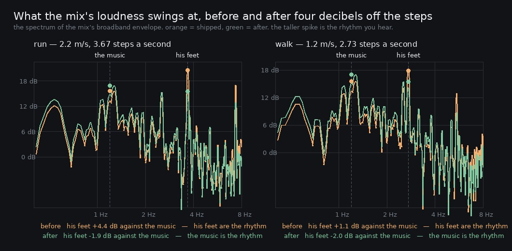

# Lane 5 — the compressor's release is not the pump; the steps' level is, and it is priced

Branch `cursor/squad5-release-5535`, off the integration head at `33e92705`. The only `src/` change
is `graph.ts` (one constant, restructured, and two comments that had gone out of date) plus its
guards in `level.test.mjs`.

`2026-09-26-limiter` closed with one thing still open. The compressor on the sfx bus is worth 3.2 dB
of the owner's *"the music kind of still shakes whenever I run"* (2026-09-24, 23:00), and after it,
**at a run the step rate still stood 4.4 dB over the music's beat** in the mix's envelope spectrum.
Three candidates were named: the release, the step level, and the music's share of the mix.

This rules out the first and takes the second.

## The release is not the cause

The suspicion was mechanical and looked strong. 120 ms is a time constant, so the gain recovers in
about three of them — 360 ms — while at a run the steps are 273 ms apart. The gain is therefore
never settled between steps: pulled down by each one and still climbing when the next arrives. A
gain that *moves at the step rate* puts energy at the step rate, which would mean the compressor
was feeding the very line it is there to remove.

`model.py` tests that without a render per candidate. It is the spec's own node — a soft knee of
12 dB centred on −30, ratio 4, and a gain following the detected level with one-pole attack and
release — run over the compressor-bypassed steps stem. The node's makeup gain is not documented as
a number and `SFX_TRIM` takes it back, so rather than guess either, every modelled take is scaled
to the rms of the *rendered* compressed stem: the model is then only being asked what the SHAPE of
the gain movement does, with the level held at what the graph actually produces.

It has to reproduce the render before anything else in it is worth reading, and it does:

```
the model against the render, at the shipped 120 ms release:
   modelled step line 21.2 dB over background, rendered 22.6 dB
   modelled beat line 18.2 dB, rendered 18.2 dB
```

Then the sweep:

```
 release  recovers in  gain moves    step line  beat line  step over beat
    60 ms       180 ms      10.5 dB      21.3 dB      18.3 dB         +3.0 dB
   120 ms       360 ms      10.6 dB      21.2 dB      18.2 dB         +3.0 dB
   250 ms       750 ms      11.0 dB      21.4 dB      18.0 dB         +3.4 dB
   400 ms      1200 ms      11.4 dB      21.5 dB      17.8 dB         +3.6 dB
   600 ms      1800 ms      11.7 dB      21.6 dB      17.8 dB         +3.8 dB
  1000 ms      3000 ms      12.2 dB      21.7 dB      17.7 dB         +3.9 dB
```

Across a factor of sixteen in release the step line moves **0.4 dB**, and every slower setting is
slightly worse. The gain does move 10–12 dB between steps exactly as predicted, and it makes no
difference: the pulse is not the gain moving, it is the residual transient that survives the
compression. **Reported as a null.** Nothing shipped for it.

That leaves level.

## The level, priced exactly instead of modelled

`SFX_TRIM` is a plain gain on the sfx bus, downstream of the compressor, so changing it scales one
linear part of the mix and nothing else:

```
mix = rest + dry + tail
```

`rest` is the bed and the music, which never touch the sfx bus. `tail` is the hall and the room
answering the steps — those sends are taken off the panner, so they bypass the compressor **and**
the trim. `dry` is the only part the trim moves.

So `dry.mjs` renders the steps once with `reverb: false` and every candidate trim becomes arithmetic
on takes already on disk — `mix_on − (1 − 10^(−c/20))·dry` — which is not a model of the graph but
a signal arithmetically identical to what the graph would produce. `price.py` measures those:

```
run at 2.2 m/s, 3.67 steps a second
   trim  step peak  over the bed    music 1.2 Hz  step rate  the step rate is
  -0 dB    -12.1 dB       30.4 dB         18.2 dB    22.6 dB     +4.4 dB, over the music   <- shipped
  -1 dB    -13.1 dB       29.4 dB         18.7 dB    21.7 dB     +2.9 dB, over the music
  -2 dB    -14.1 dB       28.4 dB         19.0 dB    20.4 dB     +1.4 dB, over the music
  -3 dB    -15.1 dB       27.4 dB         19.2 dB    19.0 dB     -0.2 dB, under the music
  -4 dB    -16.1 dB       26.4 dB         19.5 dB    17.6 dB     -1.8 dB, under the music
  -5 dB    -17.1 dB       25.4 dB         19.7 dB    16.1 dB     -3.5 dB, under the music
  -6 dB    -18.1 dB       24.4 dB         20.1 dB    14.8 dB     -5.3 dB, under the music

walk at 1.2 m/s, 2.73 steps a second
  -0 dB    -13.7 dB       28.7 dB         18.3 dB    19.3 dB     +1.1 dB, over the music   <- shipped
  -1 dB    -14.7 dB       27.7 dB         18.7 dB    18.4 dB     -0.4 dB, under the music
  -2 dB    -15.7 dB       26.7 dB         19.2 dB    17.5 dB     -1.7 dB, under the music
  -3 dB    -16.7 dB       25.7 dB         19.5 dB    17.5 dB     -2.0 dB, under the music
  -4 dB    -17.7 dB       24.7 dB         19.7 dB    17.6 dB     -2.0 dB, under the music
  -6 dB    -19.7 dB       22.6 dB         20.0 dB    17.9 dB     -2.1 dB, under the music
```

**A walk saturates at −2.0 dB.** Past a 3 dB cut its step rate is no longer the tallest thing near
2.73 Hz, so it stops falling — that is the best margin any cut can buy at that gait. **4 dB is where
a run joins it.** That is the number: the smallest cut that gives a run the margin a walk already
has, rather than one chosen for how far it goes.

Doing it approximately would have got it wrong. The model above, which compresses the tails along
with the dry because it cannot tell them apart, puts a 3 dB cut at −1.5 dB — it would have looked
sufficient, and measured, 3 dB lands at −0.2. The 1.3 dB gap is the whole reason this was priced
from a rendered dry stem.

## What shipped

`STEP_CUT_DB` 2 → 6 dB, so `SFX_TRIM` goes −10.1 → −14.1 dB. The trim is now written as what it is
— the compressor's measured makeup gain taken back off, plus a named cut — instead of "8.1 and
2 dB besides".

It has to be there, downstream of the compressor, and that is not a detail. Every step the game
makes is in full four-to-one compression (`2026-09-26-perstep`), so the same decibels taken off the
step designs instead would come back out of the ratio and change almost nothing. `level.test.mjs`
guards the position as well as the size.

Two comments in `graph.ts` were wrong and are fixed in passing: the compressor's *"quiet steps pass
untouched (the threshold is below a walk's peak); a run's are held"* (disproved by `-perstep`: the
threshold is under both gaits), and *"at a running cadence they arrive two to five times a second"*
(PR #59's controller made it 3.67).

## After: the same renders

Same script, same seed, same plaza spine, same 62 s.

```
the mix's envelope: how far each rhythm stands over the background of its own spectrum

gait               music 1.2 Hz  step rate  the step rate is
run      before         18.2 dB    22.6 dB     +4.4 dB, OVER the music
run       after         19.5 dB    17.6 dB     -1.9 dB, under the music

walk     before         18.3 dB    19.3 dB     +1.1 dB, OVER the music
walk      after         19.7 dB    17.6 dB     -2.0 dB, under the music
```

**The music's beat is now the strongest rhythm in the mix at both gaits.** The pricing said −1.8
and −2.0 before anything was changed; the render says −1.9 and −2.0.

The same thing in the shape the ear makes it — `spectrum.py`, the spectrum of the mix's broadband
envelope, orange shipped and green after. At a run the spike at his step rate is the tallest thing
in the picture before, and is 6 dB below the music's after.



## What it did not cost

Each of these is measured rather than argued, because the failure mode being guarded against is an
after that measures like its before — and its mirror, an after that quietly broke something else.

**The control.** The compressor-bypassed takes go nowhere near `SFX_TRIM`, so they must not move.
Not byte for byte: an offline render turns out to be reproducible but **not** bit-identical — two
renders of the *same* code differ by about −108 dB relative, which is this instrument's own floor.
A real change shows at −15 dB, so there are ninety decibels between "unchanged" and "changed".

```
take                    before minus after
   run-mix-off                 -108.1 dB   the render floor: the bypassed path did not move
   run-steps-off               -114.2 dB   the render floor: the bypassed path did not move
   run-mix-on                   -14.1 dB   the cut
   run-steps-on                  -8.6 dB   the cut
   walk-mix-off                -107.4 dB   the render floor: the bypassed path did not move
   walk-steps-off              -112.4 dB   the render floor: the bypassed path did not move
   walk-mix-on                  -15.5 dB   the cut
   walk-steps-on                 -8.6 dB   the cut
```

−8.6 dB on the steps stems is exactly what a 4 dB cut of one summand looks like: 1 − 10^(−4/20) is
0.369, which is −8.7 dB.

**The gait gap.** A trim on the bus scales both gaits alike, so the run's audible lead over a walk
must be untouched — if it narrowed, the cut came off the wrong place.

```
     before   a run peaks +1.55 dB over a walk
      after   a run peaks +1.57 dB over a walk
```

**Audibility, against the owner's other complaint.** He has twice asked for the background to be
quieter, so burying his own footsteps under it would be trading one complaint for the other. A step
still peaks **26 dB over the always-on level** (the 10th percentile over time, not the mean) of the
bed and the music together.

```
gait             step peak  over the bed   hall under the step
run      before    -12.1 dB       30.4 dB              -28.8 dB
run       after    -16.1 dB       26.4 dB              -24.8 dB
walk     before    -13.7 dB       28.7 dB              -30.2 dB
walk      after    -17.7 dB       24.7 dB              -26.2 dB
```

**Headroom.** The run mix's true peak on this line fell from −8.7 to −10.4 dBFS, so the worst case
`level.test.mjs` stages the master against is still an upper bound — now a conservative one, which
is named below rather than silently re-measured.

**The one thing it did cost.** The last column of the table above: the hall answering a step
bypasses the trim, so a step is now 4 dB wetter relative to itself. It sits 25 dB under the direct
sound rather than 29, which is a tail well below the thing it is a tail of, and the alternative —
scaling the sends by the same amount — would have been a second, differently-motivated change
riding along with this one. Named, not hidden.

## And in the live graph, not the twin

Everything above comes from `renderOffline` — the same graph rebuilt in an `OfflineAudioContext`
and driven by a scripted pass against a perfect clock. `SFX_TRIM` is set inside `createBuses`,
which both paths share, so there is no plausible way for one to have it and the other not. That is
an argument, not a measurement, so `live.mjs` records the real build in play mode, running down the
same plaza spine with the master bus tapped:

```
          steps   median step   loudest step  the floor under them
  before     47      -15.5 dB        -8.7 dB              -38.0 dB
   after     50      -17.3 dB       -10.5 dB              -38.6 dB
```

**−1.8 dB**, and that is the right answer rather than a shortfall. A live recording is the master
bus, so every "step peak" in it is a step *plus whatever the bed and the music are doing at that
instant*, and the sum does not fall by the whole of what the step fell by. Running the same
detector over the offline takes shows the size of that exactly:

```
  the offline steps stem   the median step peak falls  4.0 dB   <- the trim, exactly
  the offline mix          the same detector sees      2.4 dB
  the live recording       the same detector sees      1.8 dB
```

The live take is the second kind of measurement and lands where the second kind lands, 0.6 dB off
across two independent real-time takes of a non-deterministic system. The cut is in the graph the
owner hears.

## Listen

`clips/` — the same fourteen seconds of the same seeded take either side of the cut, at both gaits.
**Not normalised**, because the whole point is a level and normalising the pair would hide it.

```
run-before.mp3   run-after.mp3
walk-before.mp3  walk-after.mp3
```

The mp3s carry the finding: measured on the decoded clips the step-rate line drops 3.7 dB at a run
and 3.1 dB at a walk while the beat rises 1.8 dB. (The clips' absolute figures are not the sheet's
— fourteen seconds is too short a window for this metric to resolve 1.2 Hz properly. Read the
tables above for the result and the clips for the ear.)

## Green

`npm run typecheck`, `npm run build`, the whole 239-test suite (four of them new, in
`level.test.mjs`: the cut is big enough, the cut is no bigger than it needs to be, the cut lives
downstream of the compressor where decibels survive, and it can only take level away), and
`playtest.mjs --only walk` at **11/11 routes** with no page errors and nothing stuck. The walk
suite has grown from the nine it had when this lane's goal was written.

## Named, not taken

- **The compressor may be the wrong tool now.** It is a fixed pad with a wobble — every step is in
  full 4:1 — and the wobble is worth nothing (the release sweep above). A straight pad would give
  the same pulse answer without the undocumented makeup gain, without the 10 dB of gain movement,
  and, from the shape of the two exchange rates, at roughly 1.4 dB more step level. Pricing that
  needs one more dry stem, rendered with `limiter: false`.
- **A step is measured inside a mix at about half its true change.** The detector sees 4.0 dB on
  the steps stem, 2.4 on the mix and 1.8 live, for the same 4 dB of trim. Worth remembering before
  anyone reads a step level off a recording of the master and concludes something is wrong.
- **`WORST_CASE_PEAK_DBFS = −16.7` is now conservative** by something under 4 dB. It is still a
  valid ceiling, so nothing is broken, but the next lane to want headroom should re-measure it
  rather than trust it.
- **Offline renders are not bit-reproducible** (−108 dB relative between two runs of identical
  code). Harmless here, and worth knowing before anyone writes a byte-identity guard.
- The remaining candidate from `-limiter`'s list is **the music's share of the mix**. It was not
  taken here because raising the music raises the always-on floor, which is the metric the owner's
  other complaint lives in; cutting a transient does not touch it.
