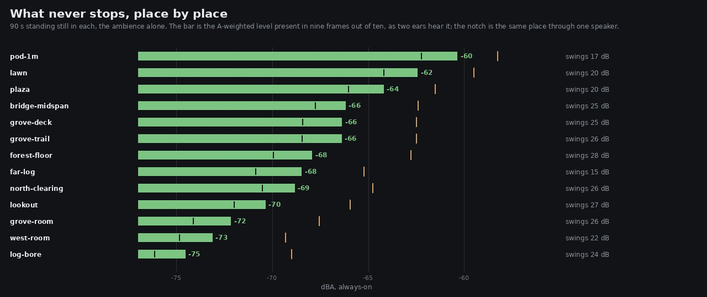
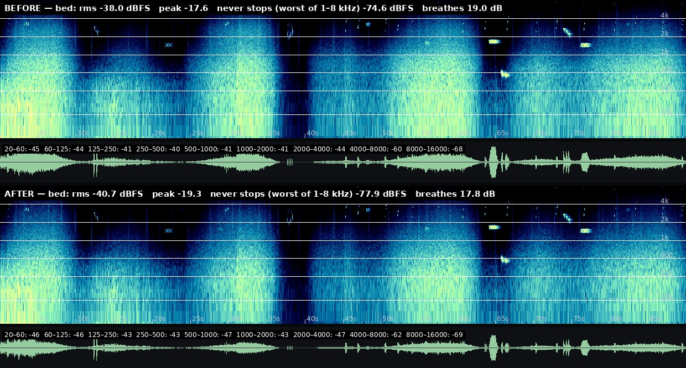

# Q is a resonance in decibels, and the lane had written quality factors

Yesterday's report ended with an item I did not measure at the time:

> **`filter(ctx, type, hz, Q)` passes `Q` straight to WebAudio**, and for `lowpass` and `highpass`
> the spec says that value *"is not a traditional Q, but is a resonance value in decibels"*. The
> lane uses values from 0.5 to 5 across dozens of filters on the assumption that they are quality
> factors. […] a lane that has just been caught by one filter convention should check the other.

It is true, it applies to **seventeen** lowpass and highpass filters in `src/audio/`, and fixing it
is one line. **The always-on floor fell at all thirteen places in the world, by 2.1 to 5.5 dBA,
while the mix's own loudness moved 0.6 LU.** That ratio is the whole finding: this is not a trim.

It also costs something, and the cost is at the bottom of this page rather than buried.

---

## The convention, settled

An impulse through one biquad in a bare `OfflineAudioContext`, read twice — once from
`getFrequencyResponse` (the browser saying what it thinks it is doing) and once from the impulse's
own spectrum (what it did). They agree to 0.01 dB, so there is nothing left to argue about:

```
type       Q set   getFreqResponse   from impulse        peak       at Hz   Q if it were a quality factor
lowpass    0.500        0.50 dB      0.50 dB     1.59 dB      750     1.06
lowpass    0.700        0.70 dB      0.70 dB     1.74 dB      762     1.08
lowpass    0.900        0.90 dB      0.90 dB     1.89 dB      773     1.11
lowpass    5.000        5.00 dB      5.00 dB     5.36 dB      914     1.78
bandpass   5.000        0.00 dB     -0.00 dB    -0.00 dB      996    ≤0.71
```

`Q` **is** the gain at the cutoff, in decibels, exactly. A `lowpass` at 0.7 is not Butterworth; it
is 0.7 dB up at its corner and peaks +1.74 dB at 0.76 of it. `bandpass` takes a
real quality factor and is unaffected — which is why the bandpasses in the bed (the husk at Q 5,
the flutters at 1.1, the footstep bands from 0.6 to 7) were right all along, and only made the
wrong reading look more plausible.

The conversion is exact, not a fit. A quality factor asks for |H(fc)| = Q at the cutoff, and this
parameter is that number in dB:

```
type       Q set   getFreqResponse   from impulse        peak       at Hz   Q it behaves as
lowpass   -3.012       -3.01 dB     -3.01 dB    -0.00 dB       12   ≤0.71 (wanted 0.707)
lowpass   -1.938       -1.94 dB     -1.94 dB     0.21 dB      469   0.80 (wanted 0.8)
lowpass   -0.915       -0.92 dB     -0.92 dB     0.69 dB      621   0.90 (wanted 0.9)
```

0.707 comes back Butterworth to two decimals; 0.9 peaks at +0.69 dB, which is
20 log10(Q / √(1 − 1/4Q²)) out of the textbook. So `filter()` converts, and the numbers at the
call sites finally mean what they read as.

## What it was doing to the bed

Every filter in `src/audio/` whose cutoff and Q are both written down, measured at its own corner:

```
where                 type         Hz   Q written    peak raw    at Hz   peak as a Q    at the corner   flat noise through it
ambience.ts:674      highpass      62       0.60       1.67 dB      82       -0.00 dB          4.94 dB                 0.02 dB
ambience.ts:675      lowpass      620       0.50       1.59 dB     457       -0.00 dB          6.52 dB                 3.26 dB
ambience.ts:691      highpass     900       0.50       1.59 dB    1207        0.00 dB          6.52 dB                 0.39 dB
ambience.ts:692      lowpass     2600       0.50       1.59 dB    1945       -0.00 dB          6.52 dB                 3.25 dB
ambience.ts:718      lowpass      320       0.80       1.81 dB     246        0.21 dB          2.74 dB                 1.37 dB
ambience.ts:848      highpass     320       0.50       1.59 dB     434       -0.00 dB          6.52 dB                 0.14 dB
ambience.ts:1003     highpass    1200       0.60       1.67 dB    1594       -0.00 dB          5.04 dB                 0.38 dB
graph.ts:240         lowpass     3000       0.60       1.67 dB    2262       -0.00 dB          5.04 dB                 2.50 dB
music.ts:313         lowpass     2400       0.70       1.74 dB    1828       -0.00 dB          3.80 dB                 1.89 dB
music.ts:340         lowpass      420       0.60       1.67 dB     316       -0.00 dB          5.04 dB                 2.52 dB
```

Three things in that table matter, and the first is the one I would have reported if I had stopped
at the peak:

- **The peak is the smaller half.** +1.6 to +1.9 dB of resonance is real but modest. **At the
  corner the difference is 2.7 to 6.5 dB**, because a quality factor of 0.5 is −6.02 dB at the
  cutoff where 0.5 dB of resonance is +0.5 dB up. The knee was in the wrong place, not just bumpy.
- **Flat noise through a lowpass loses 1.4 to 3.3 dB of total power** either way. That column is
  the one that predicts a floor, and it is why the world got as much quieter as it did.
- **Two of them bracket the hush** — the always-on leaf layer, `highpass 900` and `lowpass 2600` —
  and put their humps at **1207 Hz and 1945 Hz**, inside the band the owner has twice called white
  noise. Nothing chose that. It is what 0.5 does when 0.5 means decibels.

The other **seven** are built from a constant or a variable and so cannot be quoted at one
frequency, but take the same error: the enclosure lowpass (`ambience.ts:625`, at Q 0.7), the room
and gorge bus tops (`graph.ts:249` and `:260`, both 0.6), each bird's top (`ambience.ts:849`, 0.6,
a different cutoff per bird and per occluder), each flutter's (`ambience.ts:761`, 0.7), each
footstep's (`footsteps.ts:661`, 0.7) and the breath's (`music.ts:270`, 0.9 — the worst of the
seventeen at +1.89 dB).

Three of the seventeen do not hold still, which is the part I went looking for first and the part
that turned out to matter least:

- `ambience.ts:625` is **swept 18 kHz → 900 Hz** by `setTargetAtTime` as he walks indoors, and
  every voice in the bed passes through it. Until today a +1.74 dB hump slid down the whole
  spectrum with it.
- `ambience.ts:675`, the canopy lowpass in the table above, has its frequency **ridden ±280 Hz**
  around 620 by `rides(canopyLp.frequency, …, 'canopy-colour')` — so its hump wandered too, in the
  always-on layer.
- `music.ts:313` is **swept 3800 → 900 Hz** over each pluck's decay.

None of the three was ever measured as audible and none is now: the sweeps are gone with the
resonance. They are written down because "the filter is moving" is the one case where this would
have been more than a static colouration, and a later reader should not have to re-derive that.

**None of the seventeen has a comment claiming a resonance.** The tell is `ambience.ts:676`:
`filter(ctx, 'lowshelf', 140, 0.7, -5)` passes 0.7 to a type that ignores Q entirely. Nobody
writes 0.7 dB of resonance into a shelf. They write Butterworth out of habit.

## The fix

```ts
f.Q.value = type === 'lowpass' || type === 'highpass' ? 20 * Math.log10(Q) : Q;
```

In `filter()`, not at the call sites — so the bed keeps reading as quality factors, and a filter
added tomorrow cannot miss it. `bandpass`, `notch`, `allpass` and `peaking` take a real Q and pass
through; the shelves ignore it and pass through too.

## Measured after, the same way

### Every place in the world

`survey.mjs` stands still in thirteen places and renders 90 s of the bed there. The metric is the
**always-on** level: the A-weighted level present in nine frames out of ten. Before and after are
the same forest — same seed, same walk, same gust — with one line different.

```
place              floor   swing  1 spkr     was   moved
pod-1m             -60.4    17.1   -62.3   -58.3    -2.1
lawn               -62.4    20.4   -64.2   -59.5    -2.9
plaza              -64.2    20.2   -66.1   -61.5    -2.7
bridge-midspan     -66.2    25.4   -67.8   -62.4    -3.8
grove-deck         -66.4    25.3   -68.4   -62.5    -3.9
grove-trail        -66.4    25.7   -68.5   -62.5    -3.9
forest-floor       -68.0    27.6   -70.0   -62.8    -5.1
far-log            -68.5    14.6   -70.9   -65.2    -3.3
north-clearing     -68.9    26.3   -70.5   -64.8    -4.1
lookout            -70.4    27.0   -72.0   -66.0    -4.4
grove-room         -72.2    25.5   -74.1   -67.6    -4.6
west-room          -73.1    22.4   -74.9   -69.3    -3.8
log-bore           -74.6    24.4   -76.2   -69.0    -5.5
```

**Thirteen places out of thirteen, none by less than 2.1 dB.** The loudest never-stopping place in
the world — a metre from a pod lantern — goes from −58.3 to −60.4 dBA. No place stopped breathing
(the swing floor is 10 dB; the lowest here is 14.6).

**The spread is the evidence that this is not a trim.** A trim moves every place by the same
amount. This moved `pod-1m` by 2.1 and `log-bore` by 5.5, because the flame dominates one and the
canopy and the enclosure sweep dominate the other, and they pass different numbers of affected
filters. The bed's own integrated loudness fell 3.1 LU while its floor at `log-bore` fell 5.5 —
the floor fell *further than the level*, which a gain cannot do.



### The mix

```
stem      LUFS before    after  peak before    after   under the mix (LU)  range before   after
mix             -25.1    -25.7        -10.8    -10.9                    —          10.4    10.0
bed             -33.9    -37.0        -17.6    -19.3           8.8 → 11.3          20.1    19.0
steps           -32.9    -32.8        -15.0    -15.1            7.8 → 7.2          12.9    13.1
music           -24.9    -25.4        -11.7    -12.0          -0.2 → -0.3          14.1    13.8

clipped samples after: 0

        band  mean before    after  always before    after
      60-250        -27.1    -27.5          -52.8    -53.6
    250-1000        -25.5    -25.9          -57.4    -59.5
   1000-2000        -38.3    -39.8          -70.4    -73.2
   2000-4000        -44.6    -47.2          -76.3    -79.5
   4000-8000        -61.1    -63.1          -89.3    -91.8
  8000-16000        -70.1    -70.6         -103.8   -104.5
```

**The mix lost 0.6 LU of loudness and 2.1 to 3.2 dB of always-on floor in the four bands that
carry the complaint.** That is the shape a noise fix is supposed to have: the same game, a lower
floor. A level cut would have moved both numbers together.



## What it cost

Three things went the other way, and all three are small, real, and the direct consequence of the
same change:

- **The bed sits 2.5 LU further under the mix** — 8.8 → 11.3 LU. The standing lane item is that
  the music already sits too far over the ambience, and this widens that gap. I did not
  compensate, because giving the bed 3.1 dB back puts the floor almost exactly where it started
  (predicted per place: `pod-1m` +1.0, `plaza` +0.4, `forest-floor` −2.0, net ≈ 0) and an after
  that measures like its before is a fail, not a fix. **The gap is now the most valuable open item
  in this lane**, and it should be closed by bringing the music down rather than the bed up.
- **The bed breathes slightly less.** Modulation depth 19.0 → 17.8 dB; swing narrowed at **all
  thirteen** places, by 0.1 (`forest-floor`) to 3.7 dB (`far-log`, 18.3 → 14.6), though none came
  near the 10 dB line where a place stops being a forest. Relative to its own level the bed is 0.85 dB
  more stationary than it was (drone-minus-RMS −17.6 → −16.8), because some of what used to move
  was a resonance riding the canopy lowpass's ±280 Hz wander. In absolute terms the stationary
  part still fell: drone −55.7 → −57.5 dB.
- **The husk is less masked.** The bed's strongest tonal prominence moves from 2455 Hz at +0.41 dB
  to **150.7 Hz at +1.41 dB** — the flame's husk (a bandpass at 132 Hz, Q 5, unaffected by any of
  this) standing out more now that the broadband lift around it is gone. +1.4 dB of prominence is
  not a drone, but this lane has been told about a drone before and it was at the bottom, so it
  goes on the watch list rather than in a footnote.

## Listen

Unnormalised, so the level change is part of what you hear. 30 s each.

    clips/bed-pod-1m-{before,after}.mp3         the flame place: moved least (−2.1 dBA)
    clips/bed-plaza-{before,after}.mp3          the plaza under the lantern bough (−2.7)
    clips/bed-forest-floor-{before,after}.mp3   crowns closed overhead: moved most (−5.1)
    clips/walk-bed-{before,after}.mp3           the scripted walk, bed alone
    clips/mix-{before,after}.mp3                the scripted walk, everything

## Gates

    npm run typecheck                                       clean
    npm run build                                           clean
    node --test src/**/*.test.mjs                        264 / 264   (260 before, +4 here)
    node --test src/audio/footsteps.test.mjs               green
    playtest --only walk                                  11 / 11 routes, 0 page errors
    worstcase, the bridge          unchanged; three takes each side, and see below
    worstcase, integrated loudness      -24.0 / -23.9 / -24.0  →  -24.4 / -24.4 / -24.4 LUFS
    worstcase, clipped samples                                 0 in all ten takes

Two files in `src/` changed: the one line in `graph.ts`, and the worst-case constant in
`level.test.mjs` that the gate below turned out to need. `filters.test.mjs` is new.

### The worst case did not move, and the instrument is why

I expected the peak to fall — the change only ever removes lift — and the first take said it rose
1.0 dB. Both readings were noise. Three takes of the bridge on each build:

```
                 take 1   take 2   take 3     mean    range
  before          -7.9     -8.4     -6.7     -7.67     1.7
  after           -6.9     -6.8     -8.3     -7.33     1.5
```

The distributions sit on top of each other — *before* holds both the loudest take of the six and
the quietest. **The worst case is unchanged**, and the difference in means (0.34 dB) is a fifth of
the spread of either. Nothing clipped in any of the six takes and every one is more than 3 dB
under the gate. Every take is in `worstcase.txt`.

This is worth more than a gate line, because `worstcase.mjs` is a **live** capture — it records
the real-time graph with the character system running — and it therefore repeats to about
**±0.85 dB**. Every figure this lane has taken from it was a single take quoted to a tenth of a
decibel, `WORST_CASE_PEAK_DBFS = −16.6` included. Two of those figures are mine and both needed
checking:

- **"the bridge is 1.1 dB louder mid-span than under the bough"** (`2026-09-26-ceiling`). The
  margin was quoted from one take each, and 1.1 dB is smaller than one take's spread — so as
  published it was luck. Three takes under the bough on the same build ran **−9.1, −10.1, −10.1**,
  which does not overlap the bridge's −6.8 … −8.3 at any point, and the loudest bough take on
  either build (−8.8) is still under the quietest bridge take on either (−8.4). **The conclusion
  survives and the margin was understated by half: the bridge leads by 2.4 dB, not 1.1.**
- **The pinned worst case was 0.9 dB optimistic.** The loudest of the six bridge takes is −6.7
  dBFS after the trim, so −15.7 before it, against the −16.6 in the file — and the before-build
  takes are what set that, so this change did not cause it. `WORST_CASE_PEAK_DBFS` is now
  **−15.7**, taken as the loudest of six rather than the only one of one, with the spread written
  into the docstring so the next person does not read a tenth off a live capture. The guard still
  passes: −15.7 + 9 = −6.7, inside the 6 dB rule. See the last bullet for what that costs.

## The guard

`src/audio/filters.test.mjs`, four tests. Three assert the conversion (the arithmetic; that
`bandpass`, `notch`, `allpass`, `peaking` and the shelves keep their number; and that 0.707 comes
out Butterworth and 0.9 peaks at +0.69 dB, evaluated from the Audio EQ Cookbook coefficients
rather than taken on trust). The fourth is the one that keeps the convention honest:

```js
if (/createBiquadFilter\(/.test(line) && file !== 'graph.ts') offenders.push(…);
if (/\.Q\.value\s*=/.test(line) && !/f\.Q\.value = type ===/.test(line)) offenders.push(…);
```

A single choke point is what makes this fixable in one line. If someone builds a biquad outside
`filter()`, or reaches past it to set `Q` afterwards, the convention has a hole in it and the units
are silently wrong again — in exactly the way that went unnoticed here for four days.

## Named, not taken

- **The music over the bed, now 11.3 LU.** Promoted from the standing list; this change made it
  worse and the fix belongs on the music side.
- **The husk at 150 Hz**, above. Connected to `2026-09-27-bottom`: the husk and the flame body are
  one noise tap read twice, so it still cannot be tuned on its own.
- **"Seven decibels of trim are still unspent" was wrong, and it is mine.** `2026-09-26-ceiling`
  says *"the trim could go to +16 before the bridge reached the 6 dB rule"*. +16 on a −16.6 dBFS
  worst case lands at −0.6 dBFS, which is the clipping point, not six decibels under it; the 6 dB
  rule allowed +10.6. With the worst case re-measured at −15.7 the rule allows **+9.7, and the
  trim is already at +9**. **0.7 dB is unspent, not seven.** The room the owner was told about is
  not there. Nothing is unsafe — the guard in `level.test.mjs` passes and always did, because it
  does the arithmetic rather than repeating the sentence — but the sentence should not have been
  written and is withdrawn here.
- **`worstcase.mjs` should take takes.** It renders one and prints one number, and the number has
  a ±0.85 dB spread it does not mention. A `--takes N` that runs the route N times and reports the
  loudest with the range beside it would have made all of the above unnecessary. It is a change to
  a harness rather than to the game, so it went behind the report rather than in front of it.
- **The bed is 3.1 LU quieter and nobody re-tuned it.** Its gains were set by ear against a bed
  that had seventeen resonances in it. They are probably still right — everything moved together —
  but "probably" is doing work there and the only way to retire it is an owner listening.

## Reproduce

```bash
npm run build

# the convention, and every written-down filter in the bed at its own corner
node art/audio/2026-09-27-q/q.mjs --dist dist --out art/audio/2026-09-27-q

# before: build the parent of the fix into its own dist
git checkout c63d8134 -- src/audio/graph.ts && npx vite build --outDir dist-before
git checkout HEAD -- src/audio/graph.ts     && npx vite build --outDir dist-after

# thirteen places, 90 s of bed each, either side
node art/audio/2026-09-24-standing/survey.mjs --dist dist-before --out /tmp/q-before --seconds 90
node art/audio/2026-09-24-standing/survey.mjs --dist dist-after  --out /tmp/q-after  --seconds 90
python3 art/audio/2026-09-24-standing/floor.py --takes /tmp/q-after --against /tmp/q-before \
    --out art/audio/2026-09-27-q/world-floor.jpg

# the four stems, either side, and the mix judged as a mix
for D in before after; do
  node art/audio/2026-09-23-lane5/render-mix.mjs --dist dist-$D --out /tmp/q-mix-$D \
      --seconds 90 --stems mix,bed,steps,music
done
python3 art/audio/2026-09-23-lane5/balance.py --before /tmp/q-mix-before --after /tmp/q-mix-after
python3 art/audio/2026-09-23-lane5/spectra.py sheet --before /tmp/q-mix-before \
    --after /tmp/q-mix-after --stem bed --out art/audio/2026-09-27-q/bed-before-after.jpg

# the worst case, three takes per condition, because one take is noise
for R in 1 2 3; do for D in before after; do
  node art/audio/2026-09-24-level/worstcase.mjs --dist dist-$D --out /tmp/worst-$D-$R \
      --seconds 70 --tag bridge --legs "3.8,33,180;4.0,41,0;3.8,37,90;4.0,35,270"
  ffmpeg -y -i /tmp/worst-$D-$R/bridge.webm -ar 44100 -ac 2 /tmp/worst-$D-$R/bridge.wav
  python3 art/audio/2026-09-25-headroom/verdict.py --take /tmp/worst-$D-$R/bridge.wav
done; done

node --test "src/**/*.test.mjs"
node gauntlet/scripts/playtest.mjs --dist dist --out /tmp/play --only walk
```
