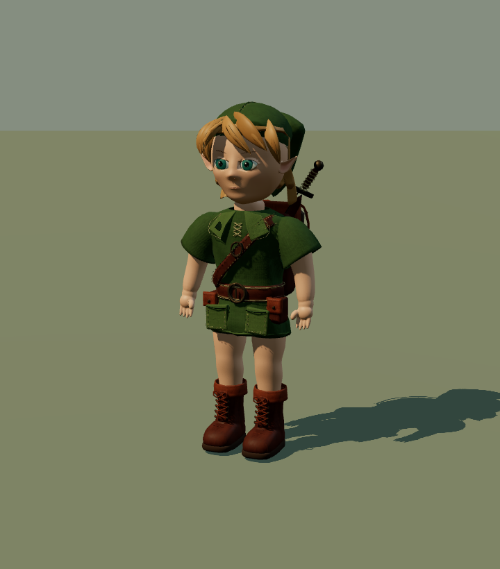
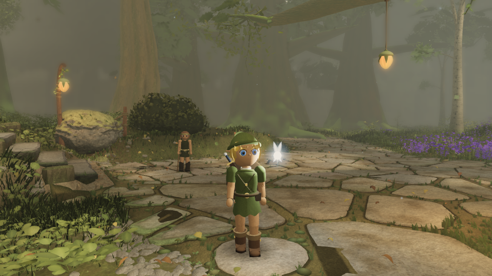
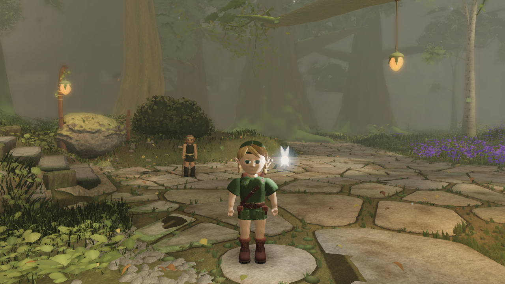

# Link: Blender source and runtime candidate

Open-source redistribution of the Rodin-derived assets is **not yet cleared**; see
[the dated license review](ASSET_LICENSE_REVIEW.md). Generated/authored provenance does
not mean CC0, an unrestricted asset license, or permission to use the Zelda character.

Current game asset: `experiments/2026-09-13/source-runtime/textured-iris-candidate.glb`
(`9189538d`, Fable `ad01908`, take0085). It uses the original Rodin Gen-2.5 two-view body,
Blender corrections and the existing rig/clips. The new `corneal-candidate.glb` (`6f28903d`)
is the reviewed reflection improvement awaiting handoff. Follow the experiment README and
latest `.agents/astra-local.md` entry; the root-level files described below are historical.

**Work resumed after the owner's PC restart, 2026-09-13.** This branch includes
unfinished source changes and rejected experiments. Read [restart notes](experiments/2026-09-13/README.md)
before rebuilding. `link-study.blend` contains the latest rejected ribbon-hair trial;
`link-runtime.blend` and `runtime/pipeline.json` contain an earlier unbaked preparation.
They do **not** reproduce the currently delivered GLB yet.

Isolated generated 3D, material and eye studies are archived under
`experiments/2026-09-13/rodin-text-v1` and `rodin-text-v2`, with exact source metadata in
`rodin-provenance.json`. They remain unaccepted and are not the game asset.

`link-runtime.glb` and `runtime/validation.json` remain the validated **409b603** export.
That commit also preserves its matching editable source and pipeline. Fable integrated this
GLB in world commit **94a73c1**. `build_link.py` creates the source through Blender MCP;
see `../../../tools/blender/README.md`.

The candidate is under visual review.
It is still below the owner's reference quality. Technical export checks do not award an
art pass. The remaining work includes facial surface continuity, more natural hair/clothing,
and motion/contact review under the actual world lighting and terrain sampler.

## Runtime contents

- Four skinned meshes and four opaque PBR materials: skin, hair, eyes, outfit/equipment.
- 24,108 triangles; 1K eye maps and 2K skin/hair/outfit maps. Base colour,
  tangent normal and roughness; outfit metalness is packed with roughness during export.
- Nineteen bones, including `hips`, `chest`, `neck`, `head`, `shoulderL/R`, `elbowL/R`,
  `handL/R`, `thighL/R`, `kneeL/R`, `ankleL/R`, `toeL/R`, and `cap`.
- In-place `idle`, `walk`, `run`, and `stairs` clips. Flat-plane stance paths cancel the
  agreed travel speed; the game still needs terrain adaptation. Walk is a shorter,
  quicker child stride: 0.88 m / 0.55 s at 1.6 m/s. Run is 2.21 m / 0.567 s at 3.9 m/s.
- Metres, +Y up / +Z forward in glTF, unit root transform. The sole geometry begins about
  6.6 mm above zero; the exact rest-space sole offsets are in the browser capture manifest.

`runtime/validation.json` records the actual GLB hash, mesh/material/triangle counts,
texture dimensions, finite normalized weights, bounds, animation loop errors, and unit
normal/tangent bases. Tangents are exported with the baked normal maps.
The current `runtime/pipeline.json` records unfinished preparation; use its version from
409b603 for the delivered asset's bake stages, rig and measured contact paths.

## Review

Latest complete candidate: [18 actual runtime views](progress/2026-09-13T16-43-36-070Z-runtime/manifest.json).



[The same GLB under fixed soft studio lighting](progress/2026-09-13T16-43-39-322Z-runtime-studio/manifest.json)
is captured with `node art/characters/link/capture_runtime.mjs --studio`. It uses native
Three.js RoomEnvironment lighting; the directional review remains the default.

Known visible defects: eyelid shading and stylized face, blocky hair, limited cloth folds, and excessive knee/hem
interaction in the run. This candidate is ready for diagnostic integration, not art acceptance.

`review.html` loads the actual GLB with Three.js. It offers orbit, front/back/face views,
and the four animations. Serve the repository root; its import map uses the installed
Three.js package. `capture_runtime.mjs` creates eighteen dated body/detail/gait images
with GLB and image hashes, deformed sole heights, and render counts. It also checks the
actual skinned soles at 121 poses per locomotion clip; the current minimum is +4.00 mm.

The folders ending in `-runtime` are actual Three.js asset reviews, not official game
captures or gauntlet evidence. The other dated folders contain actual Cycles studio
renders. None uses a reference picture as scenery or a runtime texture.

The older `link-study.glb` / `validation.json` pair remains a static, flat-colour **12:55 UTC**
shape review. It is not the textured runtime candidate. Historical render/source hashes
are preserved byte for byte, including the Windows source line endings used at capture time.

## Comparison inside Fable's world

[Six existing/candidate pairs](progress/2026-09-13T15-26-26-214Z-world-review/manifest.json)
use world commit e591006 and asset 41b9cdf on the Radeon 780M. This is an isolated diagnostic
overlay: it follows the original character root and shows the candidate's idle clip. It does
not implement terrain IK, replace the production loader, or constitute a gauntlet take.
The exact overlay and modified entrypoint are saved beside the images.

| Existing Link | Blender candidate |
| --- | --- |
|  |  |

All six views save 69 draw calls; A changes from 595 / 8,830,884 triangles to 526 / 8,860,508.
The detail and silhouette improve, but hair, cloth and face likeness remain below the targets.
`capture_world.mjs` documents the isolated checkout setup; `world_review.ts` is its art overlay.

## Reproduce on this PC

With the hidden Blender MCP session running, from the repository root:

```powershell
$python = 'E:/Tools/blender-mcp/.venv/Scripts/python.exe'
& $python tools/blender/mcp_call.py --script art/characters/link/build_link.py
& $python tools/blender/mcp_call.py --script art/characters/link/prepare_runtime.py
1..13 | ForEach-Object {
  & $python tools/blender/mcp_call.py --timeout 600 --script art/characters/link/bake_runtime.py
  if ($LASTEXITCODE -ne 0) { throw 'Bake failed; inspect pipeline.json before retrying' }
}
& $python tools/blender/mcp_call.py --script art/characters/link/refine_runtime.py
& $python tools/blender/mcp_call.py --timeout 600 --script art/characters/link/rig_runtime.py
& $python tools/blender/mcp_call.py --timeout 600 --script art/characters/link/export_runtime.py
node art/characters/link/capture_runtime.mjs
```

`prepare_runtime.py --args '{"group":"skin"}'` through the MCP bridge rebuilds just the
skin atlas meshes and invalidates those three bakes. This preserves the other completed
maps during facial revisions. The same option accepts the other material group names.
`refine_runtime.py` seats the leather uppers into their soles, adjusts the nape, and reshapes the cap once,
preserving the UVs. The iris aperture
is authored with the continuous eyelids in the source; it is not expanded after baking.
`rig_runtime.py` retains its deformation-region groups so the rig can be rebuilt repeatedly.

The mouth volume and colour are now part of the continuous face. Facial normals transfer
from the sculpt before baking. Collapsed triangles and invalid corner normals are repaired
before export; all exported tangents are checked. The scalp and garment begin as authored
surfaces. Per-component reduction reserves
geometry for lids and lips; UVs and maps are then baked from the separate source parts.
The garment has open hem/neck boundaries, an inner garment and lacing; boot cuffs are open.
The ears are closed meshes with continuous rims and inner bowls. Hair reduction reserves more
geometry for the visible fringe. Captures use native D3D11 on this Windows PC and record the GPU.
The runtime is a reduced art candidate, not a claim of finished deformation topology.

Save manual edits under a separate filename before regenerating. The scripts replace their
own generated scenes/files. Blender uses four CPU threads and BelowNormal priority;
no desktop mouse or keyboard automation is involved.

## Ownership and provenance

Astra owns character art; Fable owns the environment and the production loader. The
runtime contract is in [Fable's PR2 handoff](https://github.com/Leonxlnx/zeldaremake/pull/2#issuecomment-5653137489).
Fable will review a candidate behind a loader with the procedural Link as fallback.
The existing movement branch, NPCs and Navi are preserved.

Compare against `reference/concepts/03_kokiri_hero_link_sheet.jpg` and owner previews 09/10.
All ten published previews are in `reference/owner-concept-previews/`; their manifest hashes
were verified. The original higher-resolution owner PNGs were not present in Git history.
Geometry, skin tint and shader patterns are original; scanned material inputs are credited
CC0 sources in `textures/CREDITS.md`. No Nintendo model or reference-image texture is used.
