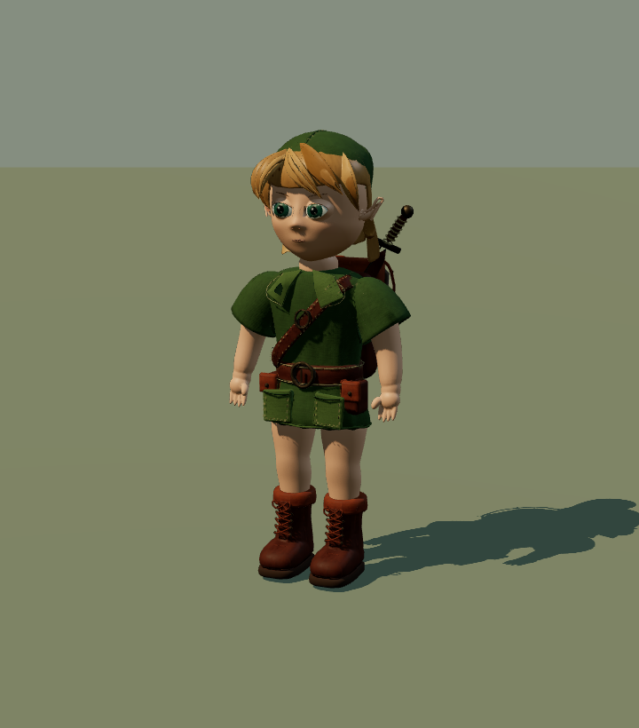

# Link: Blender source and runtime candidate

`link-runtime.blend` is the editable, textured, skinned candidate. `link-runtime.glb` is its
self-contained game export. The original sculpt and studio remain in `link-study.blend`;
`build_link.py` creates that sculpt through Blender MCP. See `../../../tools/blender/README.md`.

The candidate is under visual review and has not yet been integrated into Fable's world.
It is still below the owner's reference quality. Technical export checks do not award an
art pass. The remaining work includes facial surface continuity, more natural hair/clothing,
and motion/contact review under the actual world lighting and terrain sampler.

## Runtime contents

- Four skinned meshes and four opaque PBR materials: skin, hair, eyes, outfit/equipment.
- 24,133 triangles; 1K hair/eye maps and 2K skin/outfit maps. Base colour,
  tangent normal and roughness; outfit metalness is packed with roughness during export.
- Nineteen bones, including `hips`, `chest`, `neck`, `head`, `shoulderL/R`, `elbowL/R`,
  `handL/R`, `thighL/R`, `kneeL/R`, `ankleL/R`, `toeL/R`, and `cap`.
- In-place `idle`, `walk`, `run`, and `stairs` clips. Flat-plane stance paths cancel the
  agreed travel speed; the game still needs terrain adaptation. Walk is a shorter,
  quicker child stride: 0.88 m / 0.55 s at 1.6 m/s. Run is 2.21 m / 0.567 s at 3.9 m/s.
- Metres, +Y up / +Z forward in glTF, unit root transform. The sole geometry begins about
  6.6 mm above zero; the exact rest-space sole offsets are in the browser capture manifest.

`runtime/validation.json` records the actual GLB hash, mesh/material/triangle counts,
texture dimensions, finite normalized weights, bounds, and animation loop errors.
`runtime/pipeline.json` records the source, bake stages, rig and measured contact paths.

## Review

Latest complete candidate: [18 actual runtime views](progress/2026-09-13T14-48-18-787Z-runtime/manifest.json).



Known visible defects: round eyes, blocky hair, limited cloth folds, and excessive knee/hem
interaction in the run. This candidate is ready for diagnostic integration, not art acceptance.

`review.html` loads the actual GLB with Three.js. It offers orbit, front/back/face views,
and the four animations. Serve the repository root; its import map uses the installed
Three.js package. `capture_runtime.mjs` creates eighteen dated body/detail/gait images
with GLB and image hashes, deformed sole heights, and render counts.

The folders ending in `-runtime` are actual Three.js asset reviews, not official game
captures or gauntlet evidence. The other dated folders contain actual Cycles studio
renders. None uses a reference picture as scenery or a runtime texture.

The older `link-study.glb` / `validation.json` pair remains a static, flat-colour **12:55 UTC**
shape review. It is not the textured runtime candidate. Historical render/source hashes
are preserved byte for byte, including the Windows source line endings used at capture time.

## Reproduce on this PC

With the hidden Blender MCP session running, from the repository root:

```powershell
$python = 'E:/Tools/blender-mcp/.venv/Scripts/python.exe'
& $python tools/blender/mcp_call.py --script art/characters/link/build_link.py
& $python tools/blender/mcp_call.py --script art/characters/link/prepare_runtime.py
1..13 | ForEach-Object {
  & $python tools/blender/mcp_call.py --timeout 600 --script art/characters/link/bake_runtime.py
  if ($LASTEXITCODE -ne 0) { throw 'Bake failed; inspect pipeline.json before retrying' }
}
& $python tools/blender/mcp_call.py --script art/characters/link/refine_runtime.py
& $python tools/blender/mcp_call.py --timeout 600 --script art/characters/link/rig_runtime.py
& $python tools/blender/mcp_call.py --timeout 600 --script art/characters/link/export_runtime.py
node art/characters/link/capture_runtime.mjs
```

`prepare_runtime.py --args '{"group":"skin"}'` through the MCP bridge rebuilds just the
skin atlas meshes and invalidates those three bakes. This preserves the other completed
maps during facial revisions. The same option accepts the other material group names.
`refine_runtime.py` applies the nape and iris rest-mesh adjustments once; their UVs remain.
`rig_runtime.py` retains its deformation-region groups so the rig can be rebuilt repeatedly.

The scalp and garment begin as authored surfaces. Per-component reduction reserves
geometry for lids and lips; UVs and maps are then baked from the separate source parts.
The runtime is a reduced art candidate, not a claim of finished deformation topology.

Save manual edits under a separate filename before regenerating. The scripts replace their
own generated scenes/files. Blender uses four CPU threads and BelowNormal priority;
no desktop mouse or keyboard automation is involved.

## Ownership and provenance

Astra owns character art; Fable owns the environment and the production loader. The
runtime contract is in [Fable's PR2 handoff](https://github.com/Leonxlnx/zeldaremake/pull/2#issuecomment-5653137489).
Fable will review a candidate behind a loader with the procedural Link as fallback.
The existing movement branch, NPCs and Navi are preserved.

Compare against `reference/concepts/03_kokiri_hero_link_sheet.jpg` and owner previews 09/10.
All ten published previews are in `reference/owner-concept-previews/`; their manifest hashes
were verified. The original higher-resolution owner PNGs were not present in Git history.
Geometry, skin tint and shader patterns are original; scanned material inputs are credited
CC0 sources in `textures/CREDITS.md`. No Nintendo model or reference-image texture is used.
