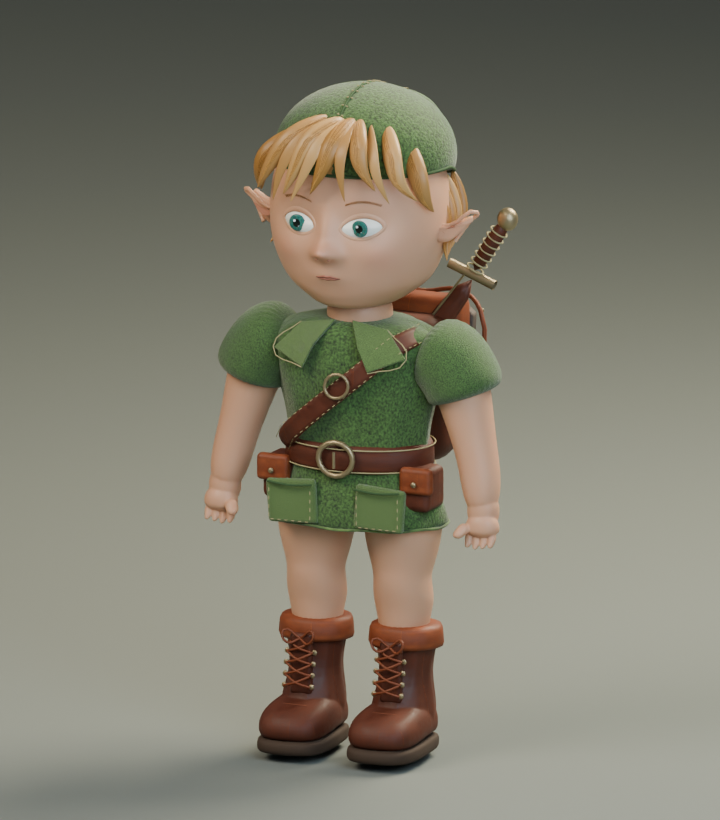

# Link: local Blender art checkpoint

Editable source: `link-study.blend`. Rebuild with `build_link.py` through the installed
Blender MCP; see `../../../tools/blender/README.md`. The Blender file packs its used images.
The static, flat-colour `link-study.glb` is for shape review only. It is not a game-ready replacement.

Current checkpoint: **2026-09-13 12:55 UTC** —
[front](progress/2026-09-13_125545/02-front.png),
[side](progress/2026-09-13_125545/03-side.png),
[back](progress/2026-09-13_125545/04-back.png),
[face](progress/2026-09-13_125545/05-face.png),
[boots](progress/2026-09-13_125545/06-boots.png).



## What is here

- Original child character geometry: facial planes, pointed ears, layered hair, a fitted
  green cap, tunic, belt, backpack, wooden shield, sheathed sword, fingers and laced boots.
- Separate editable model parts, procedural skin colour, and CC0 leather/cloth/wood maps.
- Dated real Cycles renders under `progress/`: body, face and boot views. Manifests record
  camera values, blend/source hashes and image hashes. These are not game captures or
  gauntlet score evidence. Later checkpoints include a copy of the generator.
- `export_check.py` validates evaluated geometry, ground bounds and GLB structure. It
  evaluates curves before export so stitches and hair fibres are not silently lost.
  The resulting `validation.json` reports actual triangle/material counts.

## Visual review and remaining work

This is an early sculpt, below the owner's stylised-realistic reference quality. The face
still needs a stronger sculpt and expression pass; the hair masses are too rigid, and the
clothing needs authored folds, hems, wear and a proper weave bake. Surface detail alone
cannot make the current anatomy match the reference.

The Blender sculpt is deliberately much denser than the runtime budget. It has no skeleton
or animation clips. The GLB keeps basic material values and skin vertex colour; it does not
reproduce Blender's procedural/triplanar material detail. Do not integrate it as final art.
The next delivery needs retopology, UVs, baked PBR maps, skinning and motion validation.

Fable acknowledged character ownership in PR2 on 2026-09-13 at 12:02 UTC and supplied this
runtime contract (Fable continues all environment work):

- Metres, +Y up, +Z forward, origin at the feet, unit scale; approximately 1.18 m to crown.
- At most 25,000 triangles, four materials and 2K maps; opaque PBR surfaces.
- Bones: `hips`, `spine`/`chest`, `neck`, `head`, `shoulderL/R`, `elbowL/R`, `handL/R`,
  `thighL/R`, `kneeL/R`, `ankleL/R`, `toeL/R`; optional `cap`.
- Seamless in-place `idle`, `walk`, `run`, `stairs`; travel speeds 0 / 1.6 / 3.9 / 1.1 m/s.
  Approximate cycle strides: walk 1.2 m, run 2.2 m. Fable translates the root and plants feet.
- Fable will add a loader with the existing procedural character as fallback when a candidate
  meets the contract. This first static art export has not reached that point.

The working Blender coordinates are Z-up / -Y forward; the exporter converts to the agreed
Y-up / +Z-forward convention. The existing movement branch and runtime are untouched.

## Reference and provenance

Compare against `reference/concepts/03_kokiri_hero_link_sheet.jpg` and owner previews 09/10.
The ten owner previews were recovered from Astra's reference branch. They are never used as
runtime textures. See `textures/CREDITS.md` for the CC0 material sources.

## Reproduce the checks on this PC

From the repository root, with the hidden Blender session running:

```powershell
& 'E:/Tools/blender-mcp/.venv/Scripts/python.exe' tools/blender/check_connection.py
& 'E:/Tools/blender-mcp/.venv/Scripts/python.exe' tools/blender/mcp_call.py --script art/characters/link/build_link.py
1..6 | ForEach-Object {
  & 'E:/Tools/blender-mcp/.venv/Scripts/python.exe' tools/blender/mcp_call.py --script art/characters/link/render_review.py
  if ($LASTEXITCODE -ne 0) { throw 'Render failed' }
}
& 'E:/Tools/blender-mcp/.venv/Scripts/python.exe' tools/blender/mcp_call.py --script art/characters/link/export_check.py
```

Save any manual edits under another filename before rebuilding: the generator replaces its
own scene and `link-study.blend`. Other Blender scenes are preserved. No desktop mouse or
keyboard automation is needed; renders use four CPU threads.
