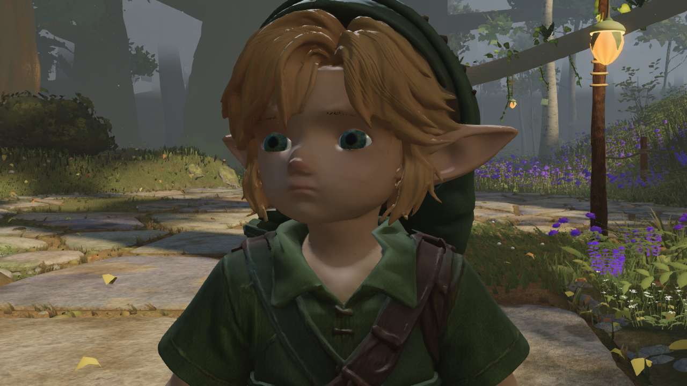
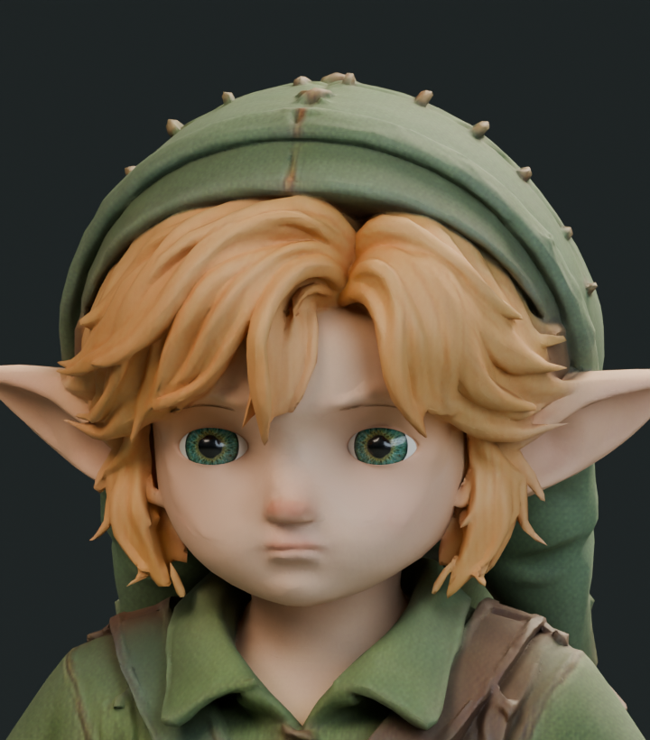
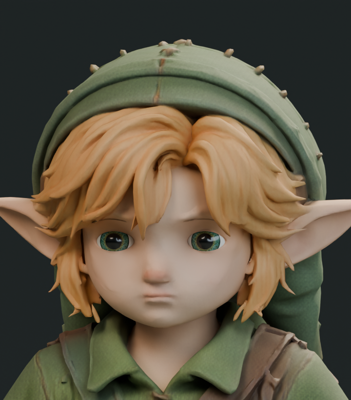
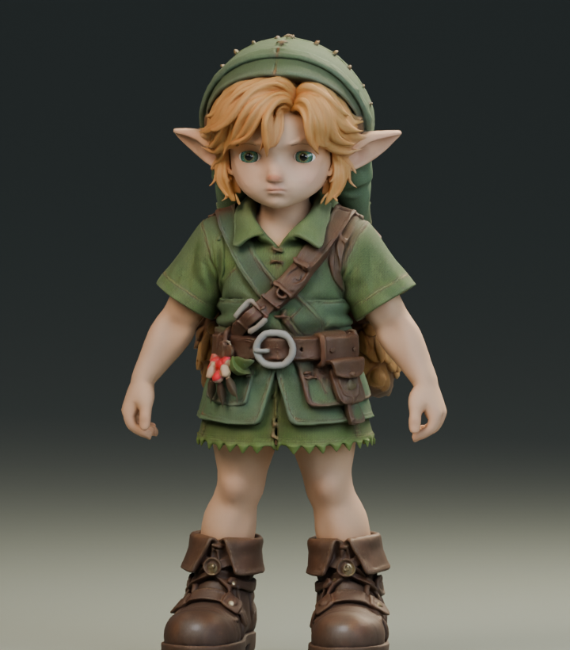
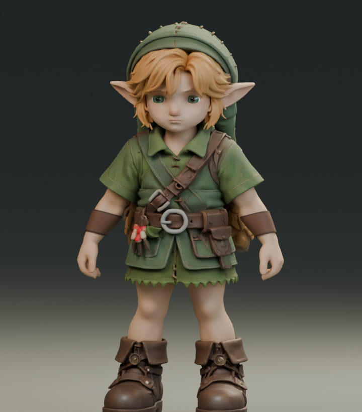
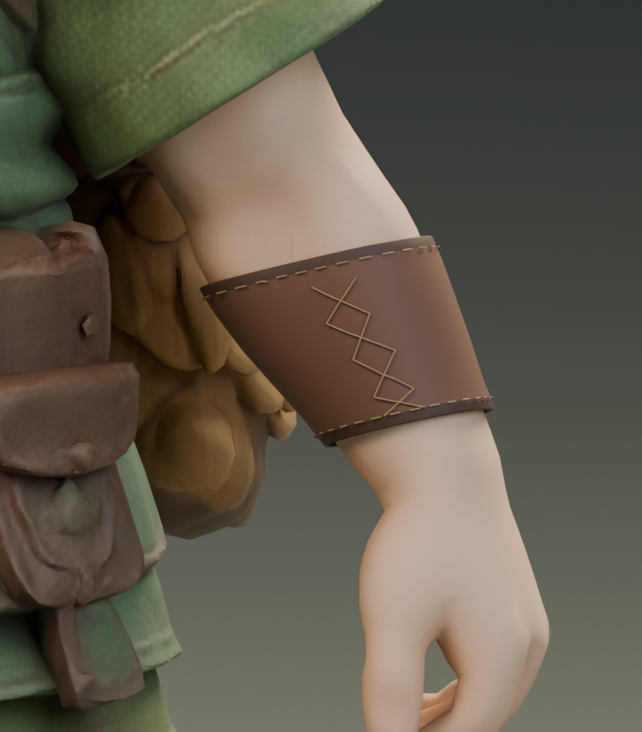

# Link hair review against the owner's new video

Native Blender comparisons, September16. Runtime remains24591126; neither candidate is promoted.

- `hair-before.png` / `hair-after.png`: current normal atlas with additional filtered relief from the previously authored native groom bake.228431pixels change; geometry and all pixels outside the mask remain exact beforePNG serialization. The gain is too small to address the broad sculpted hair forms. Rejected for delivery.
- `tips-after.png`:36head-bound rooted strands,4032triangles, maximum root gap0.1802mm. Source-atlas projection gives dark wire-like ends because freed tips can sample neighbouring regions. Rejected.
- `tips-colour-after.png`: same geometry with constant linear golden albedo(.56,.31,.105), roughness.48. Dark texture artefacts are reduced, but isolated whiskers do not replace the broad underlying locks. Rejected for delivery; no game export justified.

The next hair pass must change the broader lock breakup and coverage, rather than add isolated whiskers or turn up an existing normal bake. The reference also calls for finer directional strands and more varied root-to-tip colour; these trials do not achieve it. The existing face/rig/animation remains the baseline.

Scripts and native renders are reproducible work evidence, not runtime assets or art acceptance. Native sources stay locally beside these files: hair-relief-study.blend, hair-tips-study.blend, character-review.blend. The colour correction is recorded separately in refine_tip_colour.py; the initial tip source preserves the rejected projected-atlas result. The full comparison reference is in PR11 art/environment/owner-video-review.

## Fringe deformation follow-up

`fringe-shape-before.png` / `fringe-shape-after.png`:1072 existing vertices moved up to14.5mm to taper/shorten central locks asymmetrically. Boundary positions stayed fixed and no triangles reversed, but the portrait exposed an angular crease at the parting. Not accepted.

The first normal check found six corners at one unchanged-position vertex33146 bordering a changed face. Normal support was corrected to include all vertices of changed incident faces; outside that support, maximum decoded normal error is.000581. This is a local shading-support correction, not permission to alter unrelated normals.

`fringe-smooth-before.png` / `fringe-smooth-after.png`: eight iterations smoothing the displacement and a global scale bound prevent local triangle-area ratios outside.5–2.1277vertices move up to3.359mm; boundary fixed,0 reversed triangles, outside normal error.000581. The angular crease is avoided, but the visual change is too small to replace the thick lock structure. Also not promoted. Strong deformation of the old bounded patch is not the route to a substantially different hair silhouette; the next substantial hair pass needs complete lock surfaces and their attachments handled together.

Native sources fringe-shape-study.blend and fringe-smooth-study.blend stay local. Their scripts reuse study_hair_surface.py from the existing experiment directory. No runtime GLB or animation was changed in this follow-up.

## Current full-hair selection and profiles

The hair region was reselected on the current model using the existing hair albedo/height criteria:5531faces,3168vertices.96vertices on the old selection boundary lie inside the new region;135old selected vertices do not meet the current criteria. `full-hair-mask.json` records the new selection. It is an editing mask, not proof of anatomical segmentation.

Full-region smooth warp:2261vertices,max3.050mm,0reversed triangles. A stronger experimental area allowance(.1–10 instead of.5–2) permits2269vertices,max5.958mm,still0reversed triangles. Both preserve boundary positions and have outside-normal roundtrip error.000581. The stronger candidate was checked in matched front and oblique-profile renders (`fringe-strong-*`, `profile-*`). Neither materially replaces the broad lock structure; no candidate promoted. Future work should use the current mask to work on complete lock surfaces/attachments, not repeat these small whole-region warps.

Lighting coordination: PR11 exact head9e52630ff0f6f67a1490d102811f621938a7d606 passed CI runs35110957054(push) and35110965324(PR). Fable was notified via PR2 comment5700430168. This is CI confirmation of lighting, not character art acceptance.

## Secondary hair surfaces: native and actual Three.js review

62 curved secondary locks add 27,984 triangles over the original fringe. Fixed-topology clearance converged from 262 intersecting triangles to zero after 13 half-millimetre projection steps (maximum vertex displacement 6.5 mm). Earlier subdivision experiments increased intersections and were rejected before updating the mesh. A suspected short-ray error was not confirmed: short and long rays agreed in the diagnostic.

The remaining dark stitching came from UV interpolation across atlas chart seams. Sampling the existing albedo into per-corner vertex colours removed the stitching without adding a texture. `locks-colour-after.png` is native Blender evidence. The exporter copies only the addition from the multi-scene Blender export and appends it under the runtime head using its inverse rest transform. The original binary, meshes, rig, clips and textures are asserted unchanged. Addition: 951,984 bytes, one mesh/material. Native packed scene and intermediate GLBs remain local.

Actual Three.js studio capture completed 18 views and 363 gait-clearance samples without page errors. Matched `surface-locks-runtime-before.png` and `surface-locks-runtime-after.png` use the current 24591126 runtime baseline. Fine strands are more visible, but overlaps at the crown still need cleanup. The renderer counts 13 calls / 196,854 triangles including passes, compared with baseline 11 / 140,886. This is NOT promoted to the game: next remove the crossing crown strands, inspect moving head attachment and test in world lighting. The unrelated older art-root GLB was initially captured, identified as a different baseline and excluded from this comparison.

## Game integration and lighter geometry follow-up

The head-child mesh exported earlier bypassed the runtime's skinned-mesh shadow setup and character triangle/material audit. The exporter now gives every hair vertex weight1 on the existing head joint (skin0, joint3). It checks the original head inverse-bind matrix and uses the body's existing parent; original rig/clips remain unchanged. No production loader change was needed. The play-review helper now identifies the large body using its blink morph as well as vertex count, avoiding misidentification of a large hair mesh. The first attempt failed that old body-selection check and is not counted as a completed capture.

The corrected dense candidate b32f2d70 completed300 actual-game walk/run/idle frames and five blink close-ups. Matched baseline and candidate motion samples are exactly equal, no page errors or reach clamps. The live audit counts92962 versus70442 triangles and five materials. `world-hair-before.png` / `world-hair-after.png` show the actual forest close-up. Existing harsh face shadows appear in both. This is a flat-ground review, not new stair validation.

A subsequent Blender decimation study lowers the addition from22520 to5629 triangles and its exported size to342496bytes including skin attributes. Its18-view Three.js studio review completes. However, native BVH checking finds10 body-intersecting triangles after simplification; fine lines also become less even. `reduced-hair-face.png` and the contact report preserve this result. Do not promote this reduced candidate until contact and shading are corrected. The dense source remains in the local packed crown study. The five-comparison README's hair panel is the earlier dense studio candidate and remains accurately labelled.

## Reduced strand clearance corrected

The10 native body intersections after decimation are resolved in one local0.25mm correction; no additional triangles. Final candidate74a853bb17d62d93aa16872ed24654735583b8f19c684efe9dd5c0c16d14b9a8 adds5629triangles and342496bytes, with existing head skin binding and exact original rig/clips/images/geometry. The exporter accepts Blender's numeric object-name suffix while requiring exactly one matching mesh; the first attempt failed that name assertion and its subsequent stale studio capture18:30:42 is excluded. Correct current studio capture is18:31:29.

Actual world capture18:32:07 completes300frames across walk/run/idle and5blink closeups, with no page errors or reach clamps. All300 motion records match the current24591126 baseline exactly. Live character audit counts76071triangles. This does not extend to untested stairs or prove all-angle/self-collision clearance. The fine strands remain more visible in studio than in the darker forest. Candidate remains separate, pending a stronger visual-quality decision and remaining face/garment work.

| Existing game character | Reduced hair candidate in the same game lighting |
| --- | --- |
|  |  |

Native source: local hair-locks-reduced-study.blend plus preserved dense hair-locks-clean-crown-study.blend. Reproducible correction/export scripts and reports are adjacent. No default game asset changed in this follow-up.

## Native pupil-proportion study and baseline mismatch

Reused the existing textured iris shader in Blender at pupil/iris radius0.557(control) and0.393(daylight), keeping geometry/lids/rig untouched. Three matched16-sample native renders compare the current baked material, old procedural control and smaller-pupil variant. The old procedural control does not reproduce the current baked eyes: the smaller-pupil variant is already closer to the existing model. This is not an accepted improvement. The eye-crop numeric difference is recorded in pupil-baseline-comparison.json; materials/rig pose are restored after the study. An initial Python variable collision with the reused shader's `radius` socket caused a terminal error after the control render; corrected to `pupil_radius` and rerun successfully.

| Current baked eyes | Old procedural control | Smaller-pupil experiment |
| --- | --- | --- |
|  |  |  |

No runtime change. Further eye edits need to start from the actual baked material or establish a matched reconstruction first, rather than mistaking an older shader's differences for an improvement.

Fable explicitly confirmed Verdant reuse at18:41 UTC in PR2 comment5702697973. Fresh remote a728d9cb seals round39 take109 on0820f92. Source reuse includes tree primitives, birch, shaped leaf laminae, leaf shading and understory geometry. Round40 details are his stated work plan, not independently verified completion. Requested accessible copies of his cloud-local closeup captures in comment5702804346. The five-comparison README now records this confirmation.

## Current eye provenance, brow fit, and forearm guards

The pupil mismatch is now explained by the retained UV remap in study_pupil_uv.py and public/models/link/SOURCE.md (retained assetbdcb9ec7):188UV corners per eye already reduce the pupil/iris radius toward0.393 without changing the baked texture. Reapplying the old Generated-coordinate shader bypassed that change. Preserve the current UVs; do not redo the same pupil adjustment.

Current-brow local fit moved396vertices by at most2.987mm, skipping113ring sections without a reliable bounded match. Matched native images show little perceptual gain, so this remains rejected. Original body restored after rendering.

The reference character's leather forearm guards are a larger missing feature. New original guard shells follow skin cross sections weighted to elbowL/R, with3mm radial clearance, dark leather bindings, physical thickness and rounded edges. A first attempt centered on the bone exceeded the radius bound; corrected to centers measured from skin cross sections. Both448-triangle base shells have zero rest-pose body intersections. That check covers the base shells, not every evaluated modifier or animation pose. Native before/after images show the first blockout; straps, seams, evaluated contacts and game export are still pending. Geometry is bound to the existing forearm bones; packed native source is local forearm-guards-study.blend. No default game asset changed.

| Current character | Original fitted guard blockout |
| --- | --- |
|  |  |

## Fitted stitches, lacing and evaluated guard contact

Added original waxed-thread edge stitches and crossed lacing. Straight chords initially cut through the convex leather; the final paths are subdivided and projected onto the guard surface, offset2.4mm above its base shell. Native plain/sewn closeups show the correction. The plain/sewn pair compares detail only, not a finished material bake.

Rigid elbow-only weights caused skin contact in bent poses. Replaced them with barycentrically interpolated nearest-body weights for both shells and thread meshes. The stress harness now resets the whole rig to identity before each elbow-X pose and restores rotation modes as well as matrices. The earlier stress results mixed a stored pose with the tested elbow angle and must not be presented as a clean before/after numeric comparison. A missing Python collections import was fixed after a terminal error; weights were regenerated on retry.

Evaluated geometry, including thickness/bevel:1536triangles per shell. At0,.4,.8radians elbow flexion, both shells have0 intersecting triangles against the body. At1.2radians,7left/9right remain. This test covers evaluated guard shells; it is not a full cloth/cord self-collision test or a game animation pass. Need correct these high-flexion contacts, validate native stitch topology, then export/bake and inspect actual game clips. Native scene forearm-guards-detailed-study.blend stays local; default runtime unchanged.

| Plain guard | Surface-following stitches and lacing |
| --- | --- |
|  |  |

## Guard clearance and standalone skinned export

The high-flexion contacts lie on skin influenced by elbow/shoulder weights, not the hand. A bounded radial increase on the upper three guard rings (fading out over the fourth) moves the attached thread by the same interpolated displacement. At1.5mm additional upper clearance, all four evaluated objects—two leather shells and two thread meshes—have zero body intersections in seven isolated elbow-X poses from0 to1.2radians. `guard-clearance.json` preserves every attempted offset and pose. This is not yet proof for the actual clips, wrist rotation or cord/leather self-contact.

`guard-addition.glb` is a standalone613236-byte review asset with4meshes,3materials and1skin. Existing body weights are retained through evaluated thickness/bevel. An initial exporter warning was traced to two tiny negative weights produced by bevel interpolation (vertices741/742, group10); the exporter clamps only negative roundoff within1e-6 and normalizes those vertices. Native mesh validation then reports no repairs and the export completes without the warning. Positions/normals/joints/weights are present for all primitives; no animations or images are embedded. Procedural leather bump is not baked, so this does not yet reproduce the full native material in game. The original runtime character is unchanged.

Next: integrate the four addition meshes using the existing runtime skeleton and unchanged clips, bake/review leather detail, then capture real game animation and fit. Local packed source: forearm-guards-clearance-study.blend.
