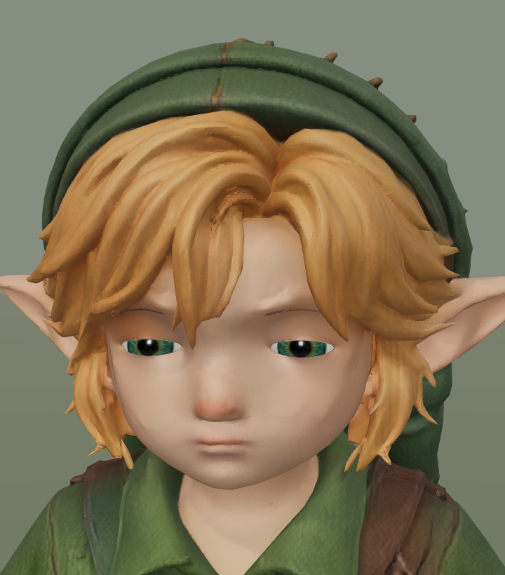
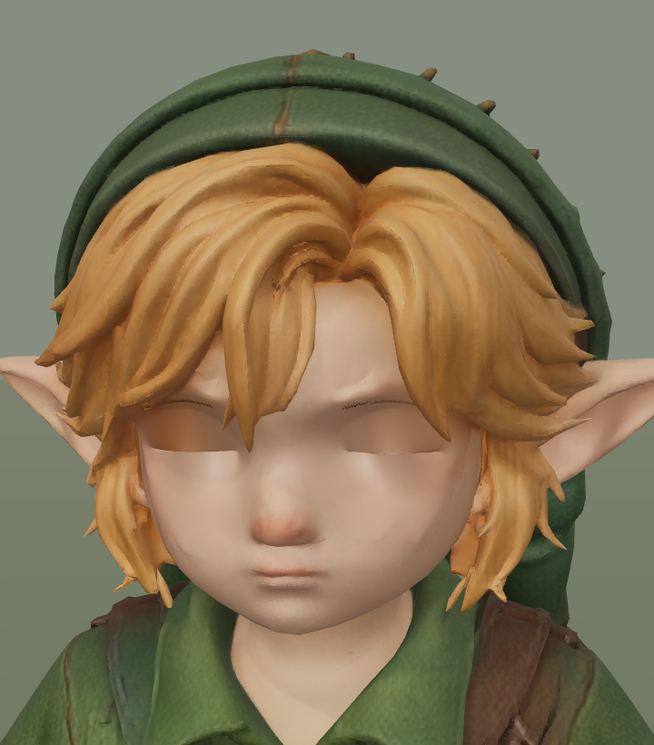
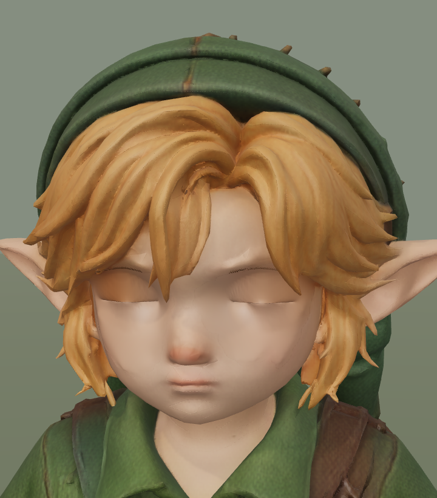
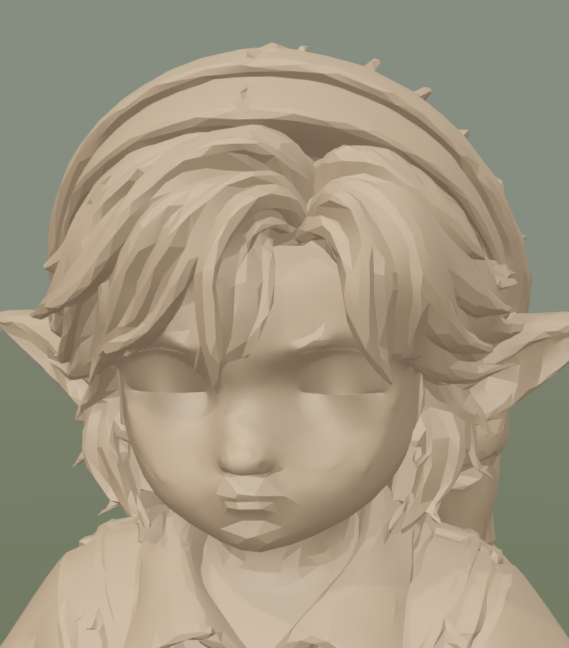
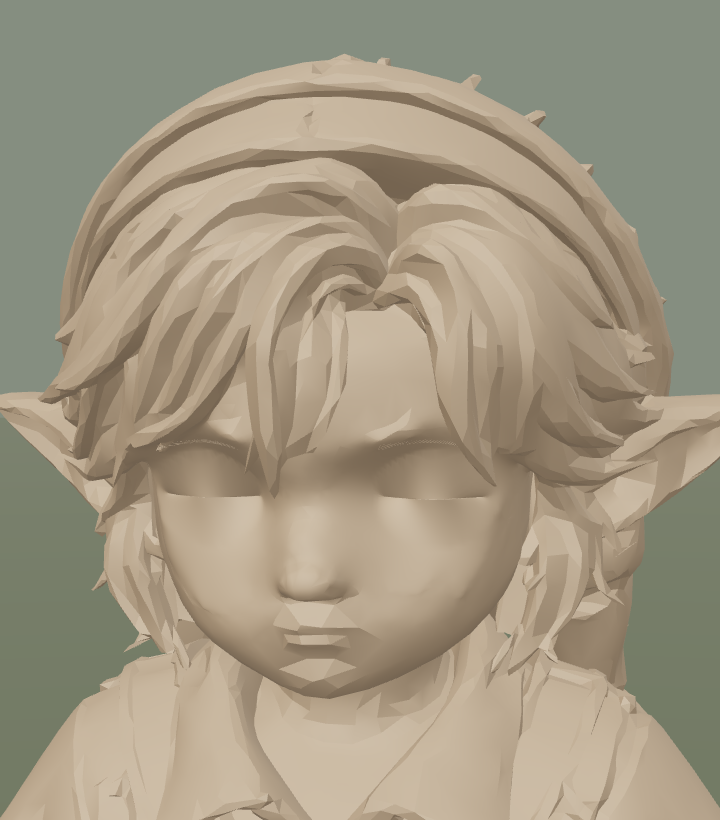
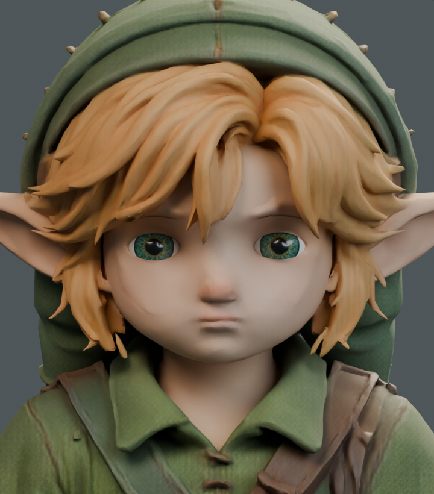
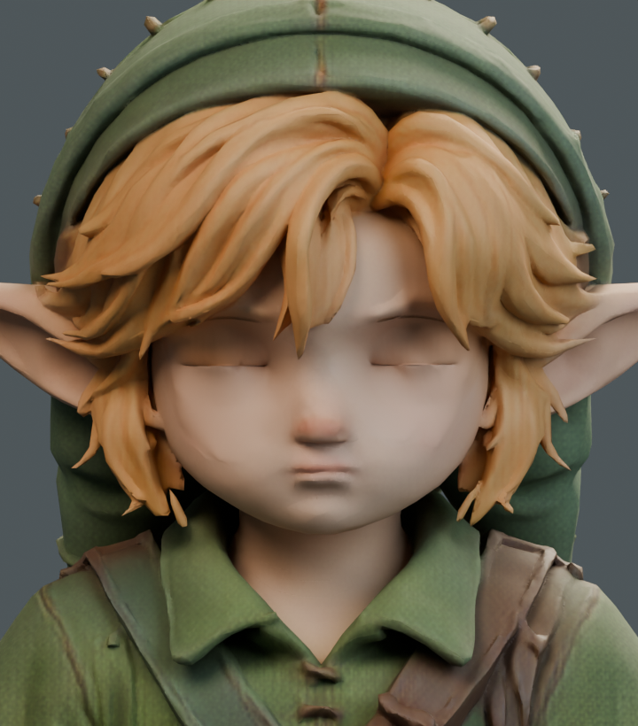

# Closed-lid shading diagnosis — 19 September

Rejected: transporting the retained normals with the actual blink surface adds faint corrugation and does not remove the broad dark upper-lid area. The default character remains `24591126`. This is diagnostic evidence, not a shipped face improvement.

`study_normals.py` runs inside Blender. It changes only two orbital morph NORMAL accessor references and appends their float data; assertions preserve the entire original binary, all other document fields, rest geometry, UVs, skin weights, rig and clips. Runtime candidate `b9fd4302d738f26d7a6a57dfb54f1638140879c55efffc5233c0ac5eee1ab14d` completes 18 standard views, five blink phases and 363 sole samples without page errors. All 18 standard images and the open-eye image are pixel-exact to baseline; final render cost stays 11 calls / 140886 submitted triangles.

| Retained GLB | Rejected normal transport |
| --- | --- |
|  |  |
|  |  |
|  |  |

The existing orbital material has no normal map. Cumulative runtime ablation removes every normal map, then colour/AO/roughness maps, then received shadows. The dark lid region persists, so those maps and received shadows alone do not explain it. Surface geometry, vertex normals and studio illumination remain contributors; no claim that this isolates one sole cause.

| Normal maps removed | Also uniform material | Also no received shadows |
| --- | --- | --- |
|  |  |  |

`roundtrip.py` imports the exact default GLB into a separate Blender scene using the source studio lights. The broad upper-lid shade appears there too. These are native renders, not matching Three.js-camera comparisons. Importing a GLB into Blender is not proof that its supplied morph normals are evaluated identically to Three.js.

| Imported default, open | Imported default, closed |
| --- | --- |
|  |  |

Before another cheek edit, the current native material boundary was inspected: all 238 coincident skin/orbital seam points have normal differences below 0.035 degrees. There is no broken rest-normal seam to weld. Existing rejected cheek subdivision, normal reduction and small depth-fit studies must not be repeated as new fixes.

Run `node art/characters/link/progress/2026-09-19-blink-shading/verify.mjs` for the saved evidence checks. The shared capture helper now supports `--studio --blink --blink-diagnostic --asset <relative-character-GLB>` and asserts exact appearance restoration after ablation. Large experimental GLBs stay local; Blender scripts reconstruct the study from the pinned default. No animation or production asset changed.
