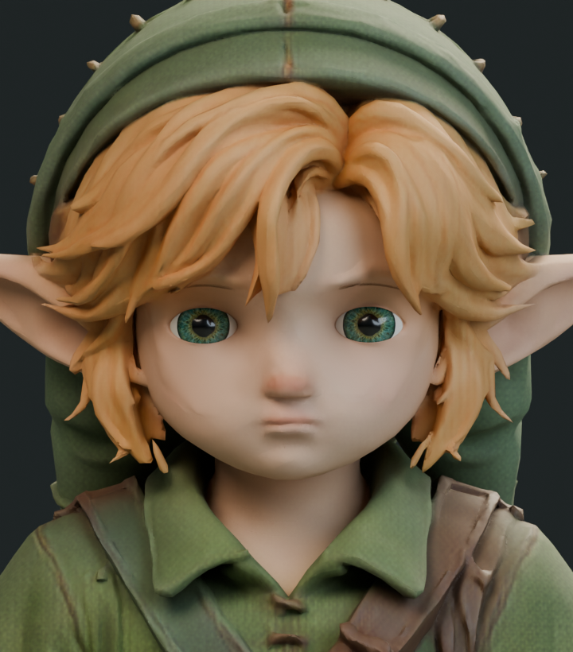
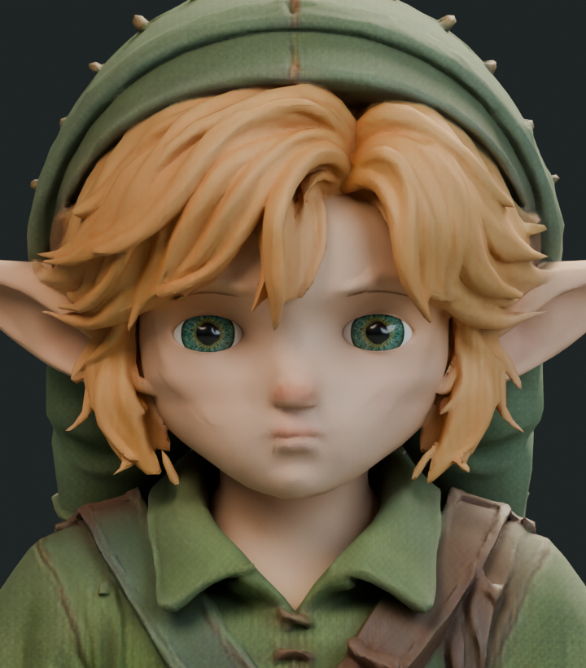
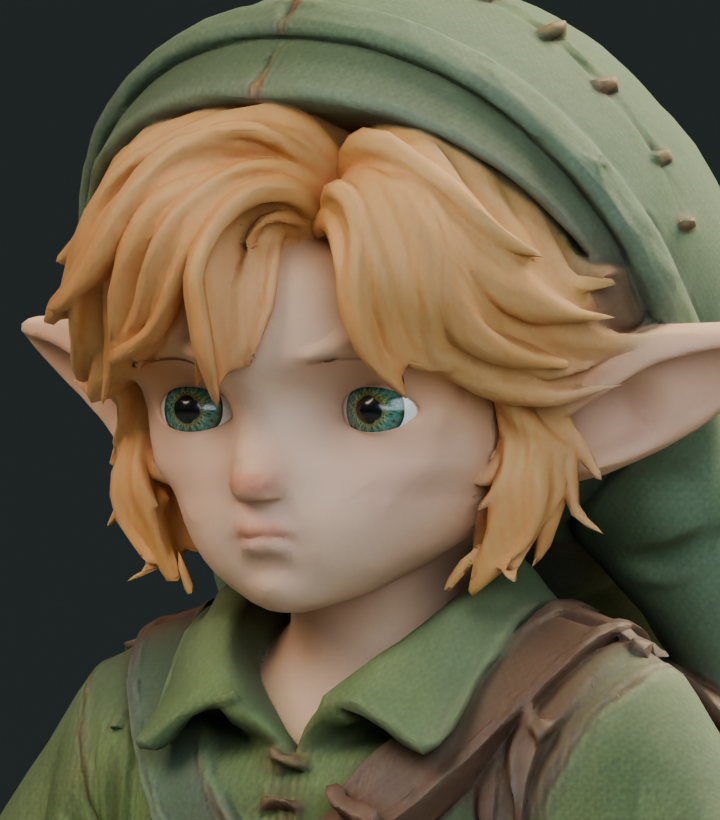
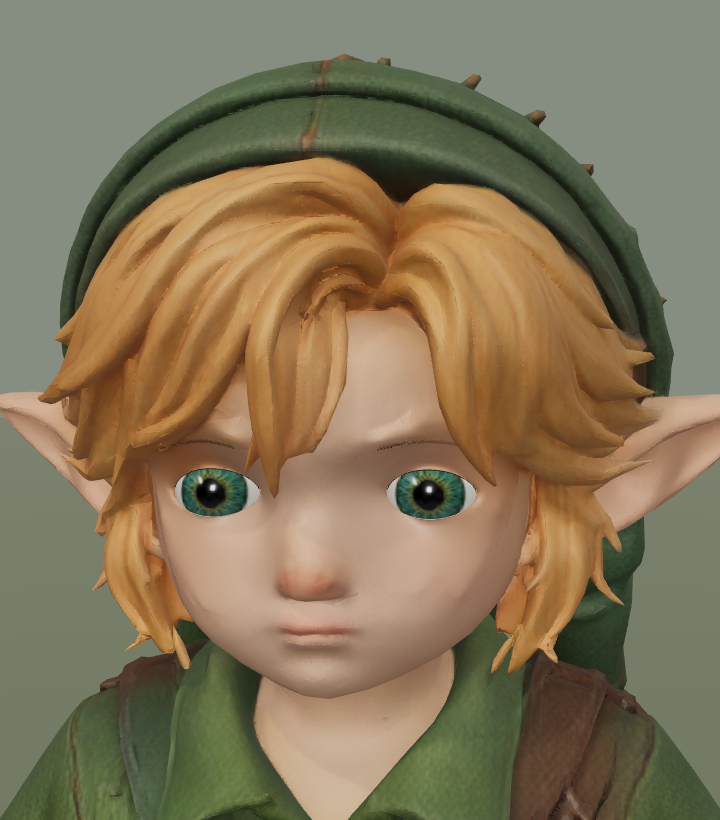
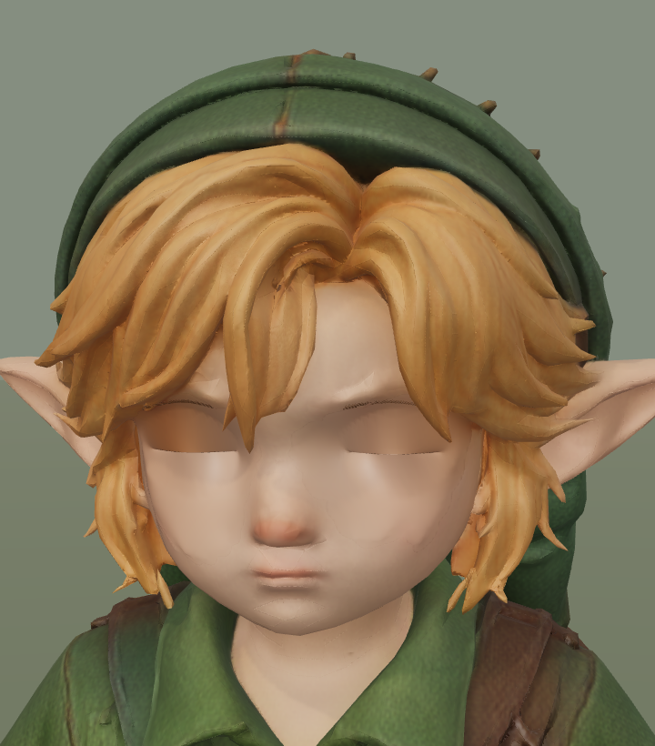

# Native face studies — 19 September 2026

The owner requested a better face and natural movement. Character-9 is concurrently changing runtime gait speed/planting/IK; Astra is keeping authored clips and skeleton untouched during this face pass. Coordination is on PR2 comment5744026281.

## Rejected lower-face proportion study

A bounded deformation narrows the lower face and extends the chin, changing2034vertices by at most7.815mm. Existing normals are transported by the deformation Jacobian; all blink displacement vertices and skin weights are protected. The first mask assertion correctly detected48 blink-affected vertices and stopped before deforming; narrowing the mask boundary completed the study. Native front, three-quarter and profile pairs were rendered. The narrower face accentuates existing cheek ridges rather than producing the reference's smooth youthful face, so this is rejected and not exported. Original mesh restored.

| Baseline | Rejected proportion trial |
| --- | --- |
|  |  |
|  |  |

## Upper eyelid margin material candidate

Reused the existing connected eyelid geometry:116upper-margin triangles receive an original warm brown material. No new geometry or texture, and no rig, clip, weight or blink edits. Native open/half/closed images show a subtle margin rather than a new lash mesh. The export splits those exact triangles into one additional primitive and asserts the complete original binary prefix, animation, rig, nodes, textures and morph accessor references remain intact.

Candidate SHA256: `dae86ec57316743ab8d2b1efc192573770ecbd9e368577f6bb0299c8dfaedb8b`.

Actual Three.js candidate18:06:05 and baseline18:07:31 each complete18studio views, five blink phases and the existing363sole samples without page errors. Same camera and lighting. Submitted triangles remain140886; render calls11to13 in the final review frame (additional material primitive across passes). These are studio render totals, not character triangle totals or actual-world performance. An earlier18:04capture used the wrong blink flag and covers only18standard views; excluded from blink evidence.

| Current default | Margin candidate |
| --- | --- |
|  |  |
|  |  |

The broad dark upper-lid shading at full closure is already present in the exact24591126baseline; it is not caused by splitting the margin. The small visible eye-edge change does not solve overall face quality. Candidate remains separate pending independent visual review; default runtime unchanged. No actual-game motion test claimed for this candidate. Large packed native scenes and full experimental GLBs remain on the laptop; committed scripts reconstruct the candidate from the retained baseline.
