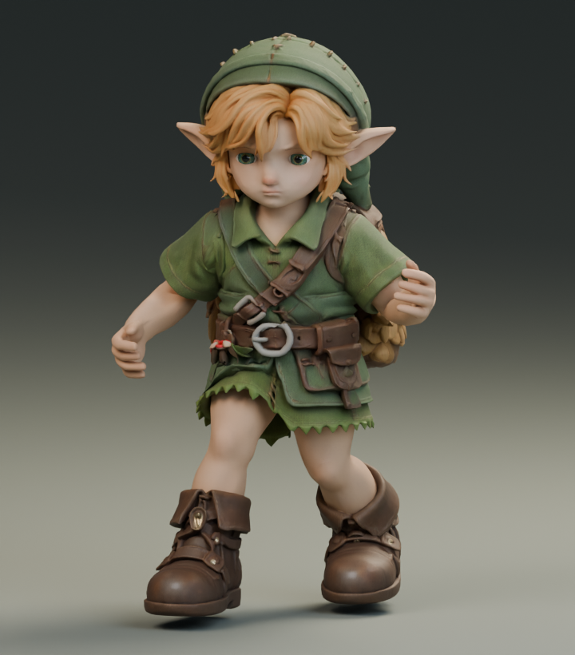
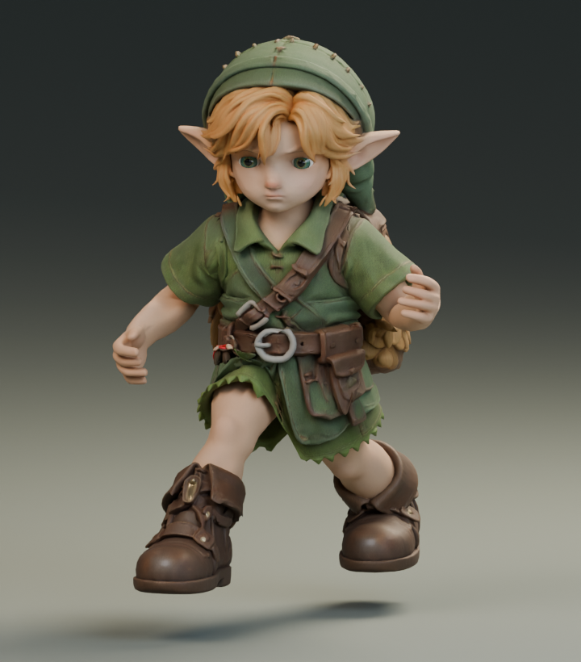
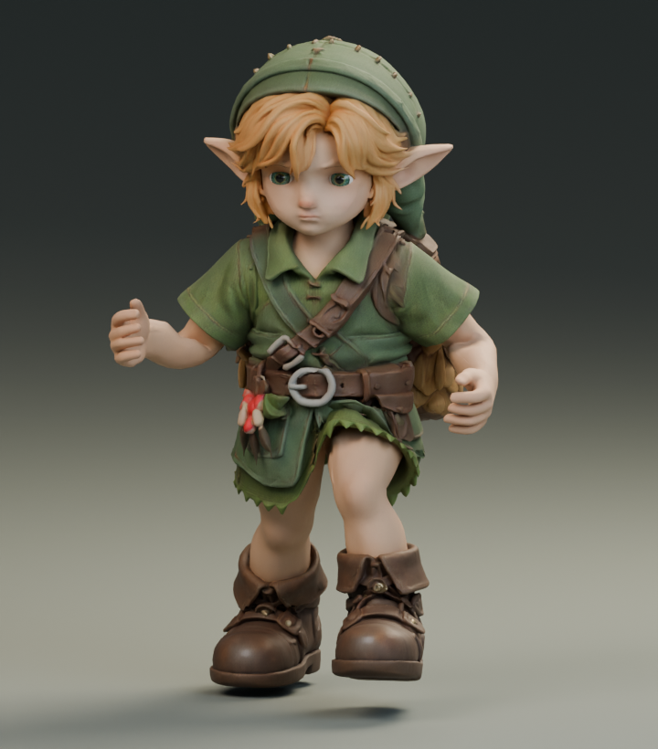
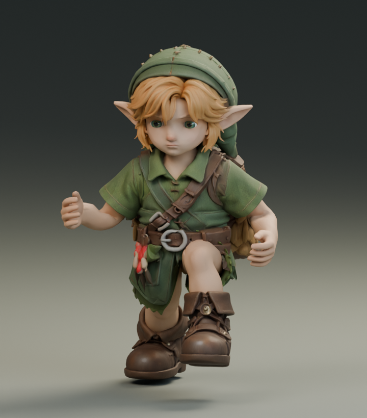
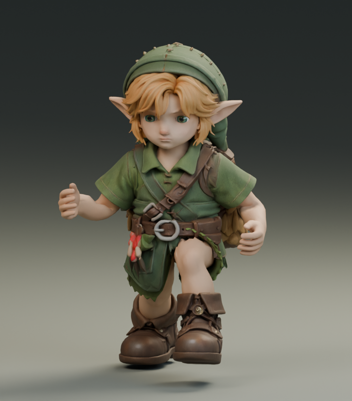
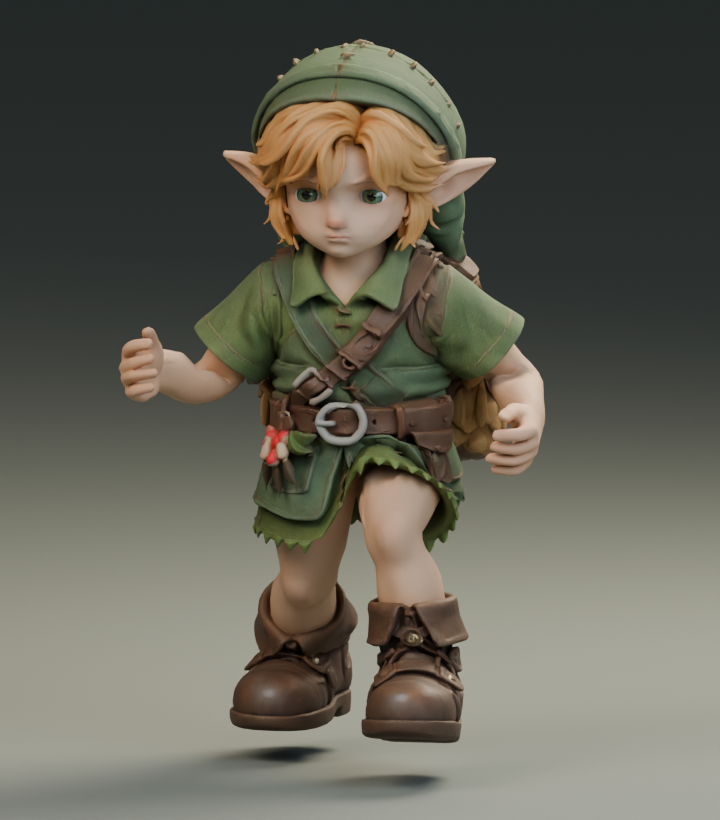

# Run contact and flight — Blender study

Default remains **24591126**. The current candidate is **3218b164**: a swing-only change that preserves the original run stride, cycle, hips and upper body. Game acceptance is pending. This is native animation evidence, not a gauntlet take or a final character-quality claim.

## What changed

The previous return path capped its endpoint tangent independently of the planted foot speed. Its slow lift also left the shoe close to the floor after toe-off. The replacement joins the planted velocity continuously, limits fore/aft overshoot to 7 mm, and lifts the shoe faster. It uses 112 samples at 240 fps over the same 28/60-second cycle.

The initial 2.05 m stride / .27 duty proposal is **rejected**. Its longer planted interval forced the 0.4113 m legs into a crouch: native hip height varied 0.396–0.475 m versus the original 0.470–0.477 m. Reducing flight height did not solve that geometric constraint. It also lifted the tunic too far. Requiring a .12-second plant at 4.6 m/s implies .552 m of foot travel; retaining the original upright posture cannot accommodate that span on this rig.

The revised candidate keeps the original 1.82 m stride and .20 duty. It improves flight independently of plant duration. It does **not** claim to fix the walk-to-run blend's plant-window mismatch; Fable's phase, pinning and arm modifiers are unchanged.

## Native measurements

Actual deformed shoe vertices, 137 phases per clip, flat native floor:

| Measurement | Retained baseline | Swing-only candidate |
| --- | ---: | ---: |
| Minimum shoe height | 5.71 mm | 6.61 mm |
| Shoe height near first 60 Hz game frame after toe-off | 8.93 mm | 36.63 mm |
| Highest knee relative to hip | −91.02 mm | −89.37 mm |
| Hip-height range | 0.4700–0.4767 m | identical |

The toe-off comparison uses the nearest sample at phase .242647, not an exact continuous-time extremum. Maximum bone-length error is 4.88e-8 m; loop matrix error is 1.20e-7. Native checks do not prove terrain contact or garment collision freedom.

The first clearance script used .25 as its baseline duty. The delivered reports correct this to the actual .20. A first float32 finite-difference assertion used too small a step; resolving differences at 1e-5 phase passed the unchanged .002 m/s tolerance. Neither failed attempt is counted as acceptance evidence.

## Visual evidence

All images are direct Blender or game renders. The initial high-flight poses are included to explain the rejection; they are not the final candidate.

| Pose | Baseline | Tested variant |
| --- | --- | --- |
| Flight phase .40, rejected high arc |  |  |
| Peak knee phase .78, rejected high arc |  |  |
| Peak knee phase .78, rejected lower arc |  |  |
| Peak knee phase .78, current retained-hip flight |  |  |

Final native and game comparisons follow after their captures finish.

## Game validation

Matched baseline: world **38f430ea**, bundle `index-DOK19L-P.js`, 300 fixed 60 Hz frames covering walk → run → idle; complete, no page errors, no reach-clamped frames. Evidence: [baseline manifest](game-before/manifest.json), [baseline video](game-before/walk-run-idle.mp4).

Startup needed longer than the old hardcoded three-minute harness limit under local load. The harness now uses the existing gauntlet readiness timeout, polls independently of animation frames, and records console, requests, browser exits and startup failures. Two runs of the rejected longer-contact candidate lost their Chrome process after a few unchanged walk frames. Their cause is unresolved; neither run is valid evidence. The reduced-screenshot mode retains the same 300 simulation frames and selected image timestamps.

## Reproduce the candidate

`export_candidate.py` combines the committed native animation carrier with the pinned baseline. It asserts the baseline hash, finite samples, unchanged rest transforms, constant STEP channels, preserved original binary prefix, untouched clips and non-leg run channels. Hips also stay byte-exact for the retained-hip candidate.

```sh
python art/characters/link/progress/2026-09-19-run-contact/export_candidate.py public/models/link/link-runtime.glb run-flight-retained
```

This produces `run-flight-retained-candidate.glb`, SHA256 `3218b16423aa2c1f8cf4e03f8bb63c25c719f21a3bcef30bbf70800e0ff81c41`. Copy it beside the default model to inspect via `?link=run-flight-retained-candidate.glb`. **No runtime stride patch is needed for this candidate.** `runtime-contract.diff` belongs only to the rejected 2.05 m trial.

`study.py` records native authoring; its `JOB` is saved in `run-flight-retained-study.json`. The packed 119 MB source scenes remain in the owner's local Blender workspace under `E:/zeldaremake/art/characters/link/progress/2026-09-19-run-contact/`; they are not part of this portable export check. The small native action and animation carrier are included. This does not change the character's existing asset licensing or source credits.
