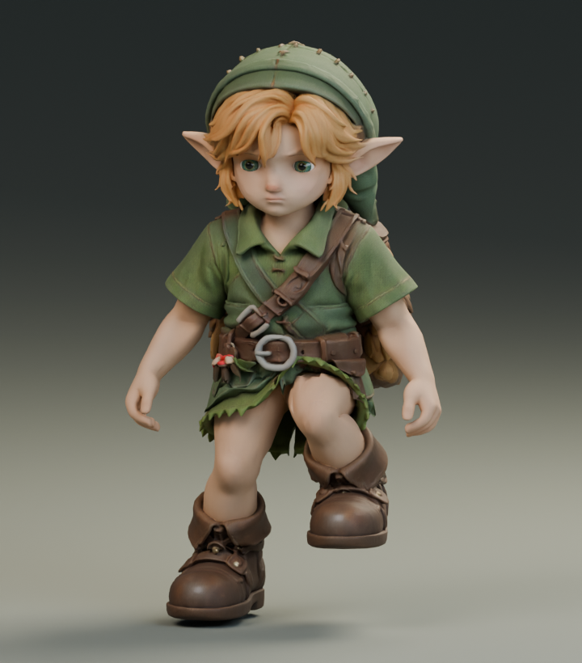
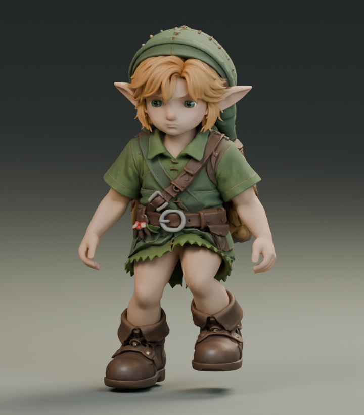
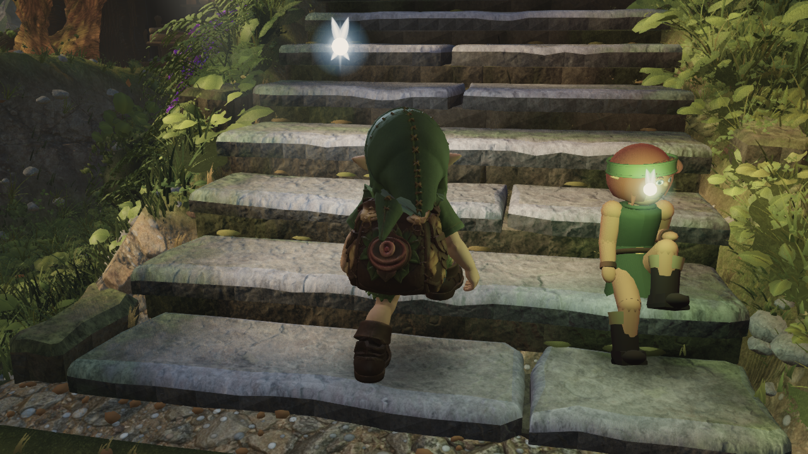
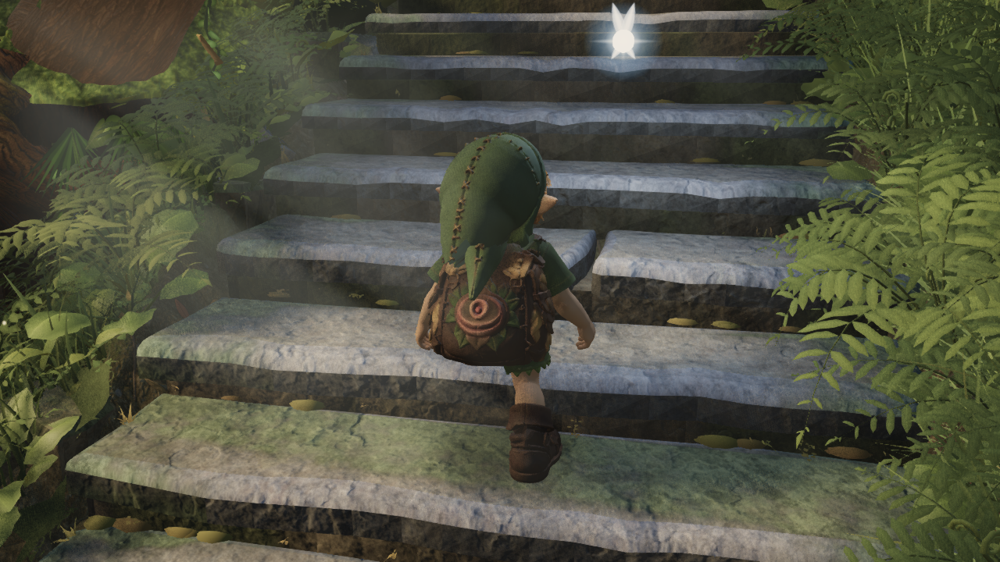
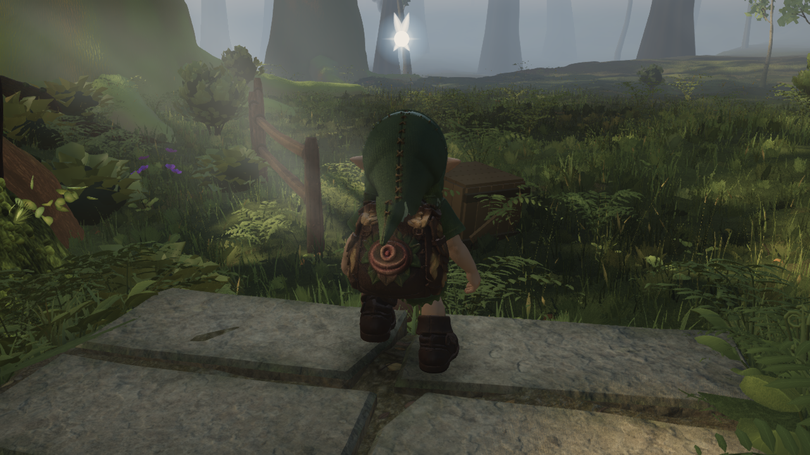
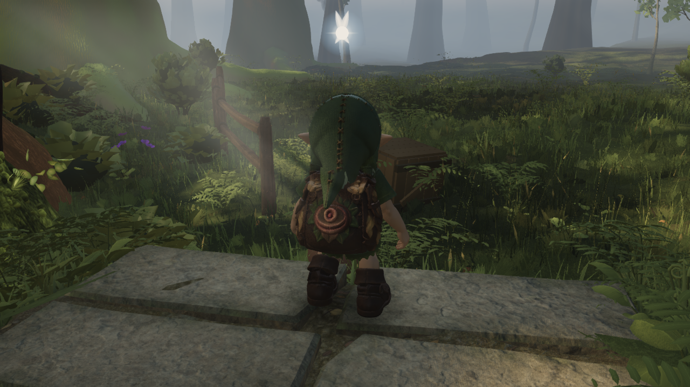
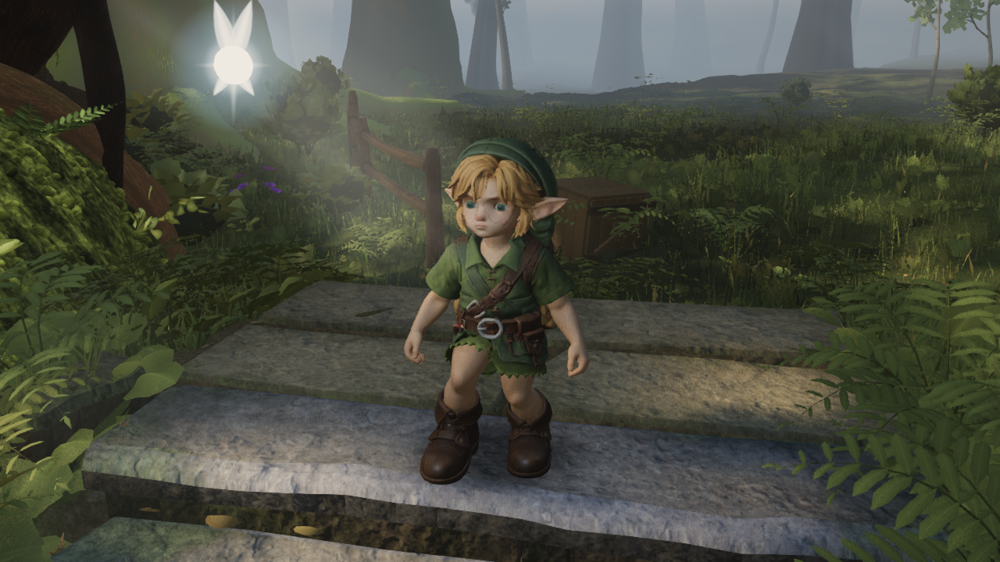
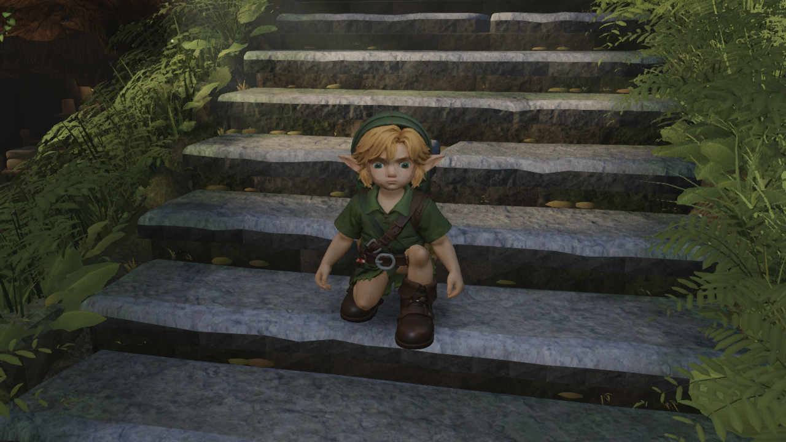

# Lower stair swing - native study

Default asset **24591126** is unchanged. Candidate **6c62b70f** changes only the six leg bones in the stairs clip. The native-only fix is **rejected for promotion** after the matched actual-player comparison: it improves sampled descent clearance but barely changes excessive flexion and increases near-floor foot travel.

The 145 mm ankle lift was a high marching action even before the runtime added step clearance. The study reduces the lift above 110 mm to 60 mm, proportionally reduces foot pitch, and preserves the original 0.8066667 m stride, 44/60-second cycle, hips and all non-leg channels. Baking uses 176 samples at 240 fps. Other GLB clips, mesh, textures, binds and original binary prefix are unchanged.

| Native measurement, 137 phases | Baseline | Candidate |
| --- | ---: | ---: |
| Maximum knee flexion | 123.69 degrees | 93.74 degrees |
| Highest knee relative to hip | -12.28 mm | -76.97 mm |
| Minimum skinned shoe height | 6.445 mm | 6.444 mm |

Maximum planted shoe-height difference is 0.036 mm. Bone-length error <0.00005 mm; loop matrix error is zero. The cycle check caught a stale Blender evaluation at frame zero after switching actions; explicitly invalidating the rig and evaluating a previous frame fixed the source, without weakening the loop assertion. Subframe FK rotation contains 0.00181 degrees of non-pitch rotation, so the authoring check permits 0.00573 degrees.

Matched Blender render at phase .75; all materials, lights and camera unchanged:

| Baseline | Lower swing |
| --- | --- |
|  |  |

The knee stays farther below the hem and the shoe follows a lower arc. This is a flat studio pose; it does not prove correct clearance on the world stair geometry.

## Actual-player baseline

World c6206a7d, full high settings, actual player, default245 asset: 660 ascending and 660 descending frames. Separate thigh and knee measurements find max flexion 144.21/163.41 degrees up and 133.78/157.55 degrees down. Sampled ascending shoe vertices clear the rendered mesh, while one descending sample penetrates 73.08 mm. Neither direction reports a reach clamp. Evidence is in [game-before](game-before/manifest.json).

## Reproduction

Run study.py inside the existing native Blender workspace; it reuses rig_runtime.py and the saved CC0 arm scene. The full packed study stays local; the small action and native carrier are committed. Export the carrier using ../2026-09-19-run-contact/export_native.py with JOB scene/stem/gait/out. Build the game candidate with:

```sh
python art/characters/link/progress/2026-09-19-run-contact/export_candidate.py public/models/link/link-runtime.glb stairs-lower-swing art/characters/link/progress/2026-09-19-stair-contact
```

The exporter asserts the known baseline SHA, same rest nodes and unedited channels. Its existing run candidate still regenerates as exactly3218b164 after the shared exporter gains stair support. Copy the new sibling candidate into public/models/link and the existing dist/models/link, then capture with LINK_REVIEW_ASSET=stairs-lower-swing-candidate.glb and node art/characters/link/capture_play_motion.mjs --stairs-only. Use the shared capture slot on the owner's laptop. No asset licence change is implied by this study.

## Actual-player verdict: do not promote the native-only fix

Both traces use c6206a7d, identical built JavaScript, character source, capture harness and full-high profile. All 1320 horizontal player positions are exact. [Runnable comparison](compare.py), [results](comparison.json), [candidate trace](game-after/manifest.json).

| Measurement | Up baseline / candidate | Down baseline / candidate |
| --- | --- | --- |
| Max thigh flexion | 144.21 / 143.30 degrees | 133.78 / 133.17 degrees |
| Max knee flexion | 163.41 / 162.30 degrees | 157.55 / 154.52 degrees |
| Lowest sampled shoe vertex vs rendered stair | +1.01 / +1.01 mm | -73.08 / -5.19 mm |
| Max root vertical step | 25.20 / 25.20 mm | 20.16 / 20.07 mm |
| Summed near-floor unplanted marker travel | 1.934 / 3.187 m | 3.297 / 4.914 m |
| Near-floor unplanted intervals | 98 / 146 | 125 / 179 |
| Reach-clamped frames | 0 / 0 | 0 / 0 |

Near-floor travel is summed across the entire trace, not metres per step. Shoe raycasts sample four actual sole vertices per foot every ten frames; missing the remaining collision surface is a limitation. The foot audit's separate conservative footprint still reports -117 mm up and -53.5 mm down for the candidate; the better sampled vertex minimum is not collision-free acceptance. Maximum apparent planted-marker movement is unchanged (47.66 mm up,34.37 mm down); the audit may switch footprint contact points, so this alone is not a pin-slip measurement.

The images confirm that the native improvement is largely lost in the terrain solver. At the middle descent frame both versions still fold the knee against the body. Root support selection and feasible leg extension require the next investigation; further lowering the authored arc is insufficient.

| Actual world pose | Baseline | Native-only candidate |
| --- | --- | --- |
| Up, frame30 |  |  |
| Up, frame360 |  |  |
| Up, frame660 |  |  |
| Down, frame30 |  |  |
| Down, frame360 |  |  |

Typecheck passed. No production asset or terrain/layout value changed in this study.
