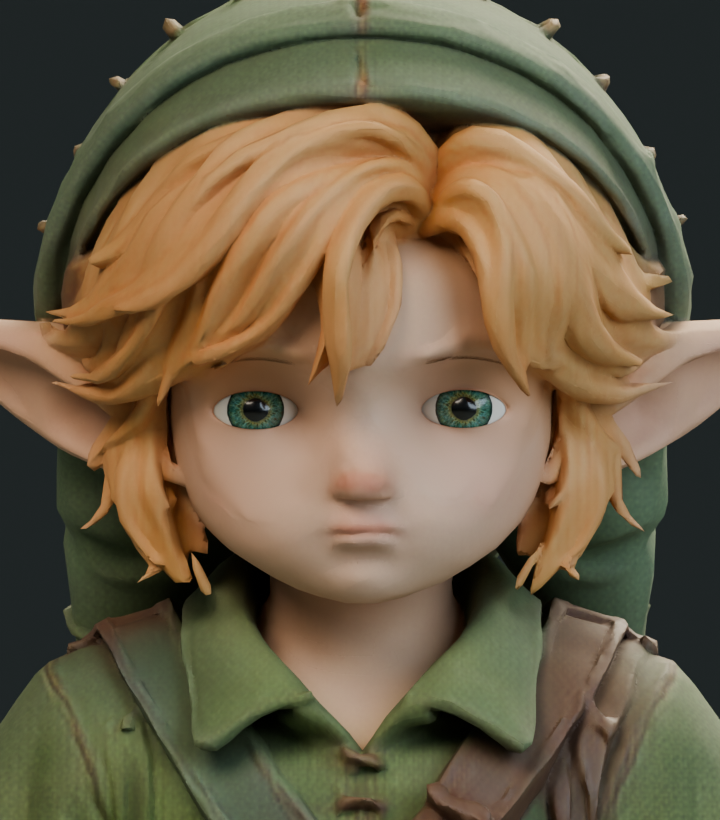
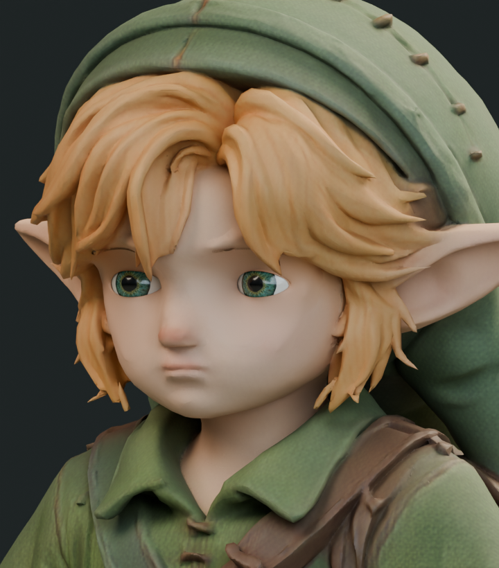
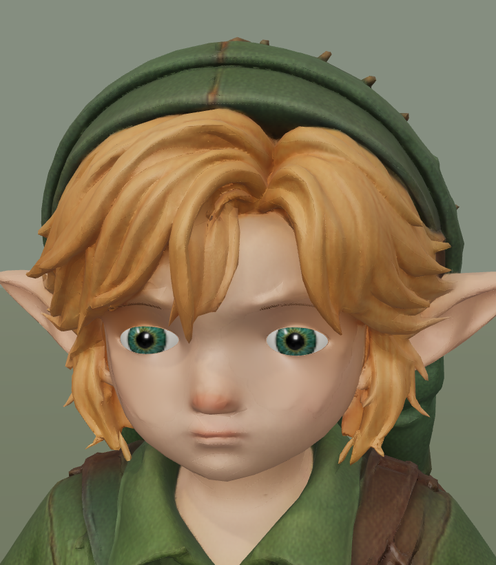
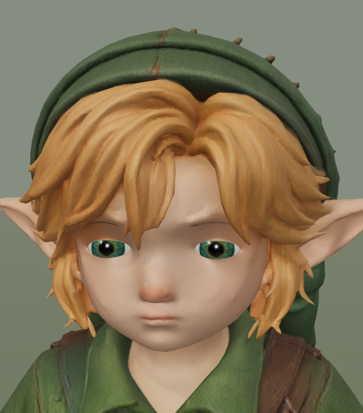
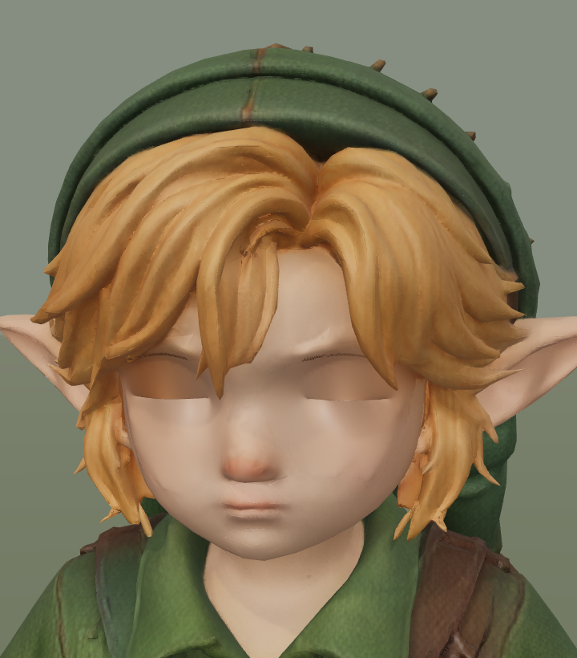
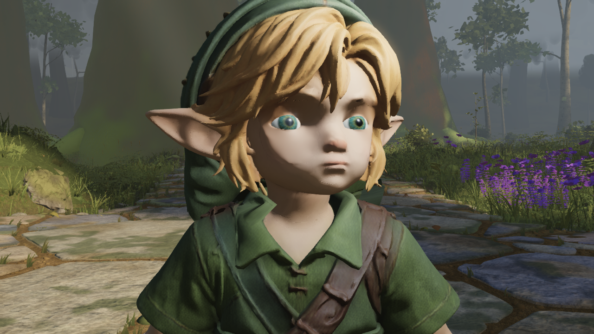
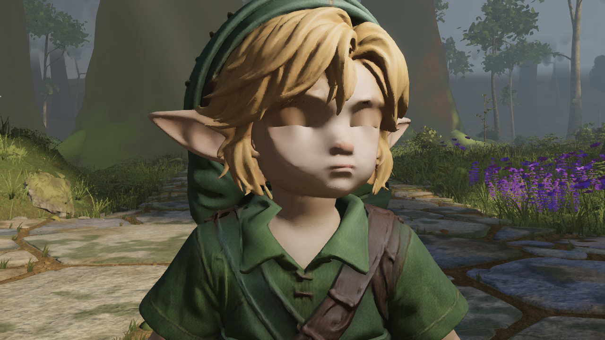

# Link: resting eyes and iris study

The combined study makes the open gaze slightly calmer. It is **not adopted**: face quality, patchy cheeks, the flat brown closed lids and overall likeness still need work. The default remains `24591126`. This is character evidence, not a world gauntlet take or licence change.

Native Blender comparisons tested blinkHalf at 0, .18, .32, .60 and .90, plus iris UV scales 1, 1.14 and 1.25. The stronger lid closures look sleepy; the smaller iris alone makes the front view look more startled. The review candidate combines .32 of the authored half-blink shape with the 1.14 eye UV mapping. No new texture, mesh, material or draw call is added.

The resting shape is rebased into the asset, with corresponding offsets removed from both blink targets. Thus existing runtime blink weights still reach the original half-closed and fully closed shapes. The exporter verifies every one of the 1,227 affected exported positions against 1,099 native Blender points; largest endpoint mismatch is 0.000029 mm. Serialized half/full endpoints stay within 0.000060 mm of the original. All original binary data, rig, clips, skin weights, texture images, material values and triangle indices are preserved.

Candidate SHA256: `99954ab236b5d9c3cfc6f97e84edd266930780317fa196f91a20c55f5c3784b1`.

## Five matched comparisons

Native rows use identical cameras and Cycles lighting. Three.js rows use the existing character studio. These are renderer screenshots, not retouched illustrations.

| View | Before | Candidate |
| --- | --- | --- |
| Blender front |  |  |
| Blender oblique |  |  |
| Three.js open eyes |  |  |
| Three.js quarter blink |  |  |
| Three.js closed lids |  |  |

Both studio captures complete 18 views and five blink states without page errors, at 11 draws / 140,886 submitted triangles. All walk/run/stair clearance measurements are exactly equal. Back and boots images are byte-identical. Closed lids differ at two pixels (maximum channel difference 5/255); this is near-identical, not pixel-identical. Their existing brown/flat appearance remains. These captures do not prove natural gait or complete collision correctness. The studio launcher logged an aborted initial model request on both runs, then completed; do not interpret the page-error count as a claim of no request retry.

Full raw studio folders remain in the owner's primary workspace as `2026-09-19T22-57-24-468Z-runtime-studio` and `2026-09-19T22-58-53-383Z-runtime-studio`. This folder carries their manifests and the eight relevant images from each. Native packed scenes remain local (`iris-scale-study.blend`, `combined-study.blend`); the GLB is reproduced rather than duplicated in Git.

## Actual world check

Both high-default world captures complete on `b4319286`, identical bundle `index-BjbkTnJJ.js`. All 12 movement-smoke samples and all five blink times/applied weight sets are exactly equal. The harness checks three morph-equipped body primitives and zero-dt stability. Both runs have zero page errors and an aborted initial GLB request followed by successful loading. This is a short execution regression, not full movement acceptance; the broader gait evidence belongs to the separate run/stair studies.

The candidate looks slightly less wide-eyed in this direct sunlight, but the hard hair shadow, patchy cheeks, blunt nose and closed-lid appearance still dominate. It stays unpromoted pending further face work and independent visual review.

| World pose | Before | Candidate |
| --- | --- | --- |
| Open gaze |  |  |
| Fully closed |  |  |

Reproduction after generating the candidate: copy it to `public/models/link/face-expression-candidate.glb`, build, then run `capture_play_motion.mjs --smoke --flat-only --blink-closeup` with `LINK_REVIEW_ASSET=link-runtime.glb` and `LINK_REVIEW_ASSET=face-expression-candidate.glb` in separate runs. Use the shared native capture slot. [Comparison record](game-comparison.json) records the exact scope; both raw manifests and screenshots are included.

## Reproduce

From the repo root, with Python (Pillow is needed for the image check):

```sh
python art/characters/link/progress/2026-09-20-face-expression/export_candidate.py public/models/link/link-runtime.glb
python art/characters/link/progress/2026-09-20-face-expression/verify_runtime.py
```

The exporter pins the input SHA and asserts preserved data and blink endpoints. `study.py`, `study_iris.py` and `export_native_endpoints.py` run in the owner's loaded native scene `Link | September19 run contact baseline`. The combined native job uses `factors=[1.14], rest_half=.32, prefix='combined'`; the stronger resting-lid job uses `weights=[.6,.9], report='relaxed-study.json'`. Every preview restores original meshes, morph weights, camera and pose mode afterwards.
