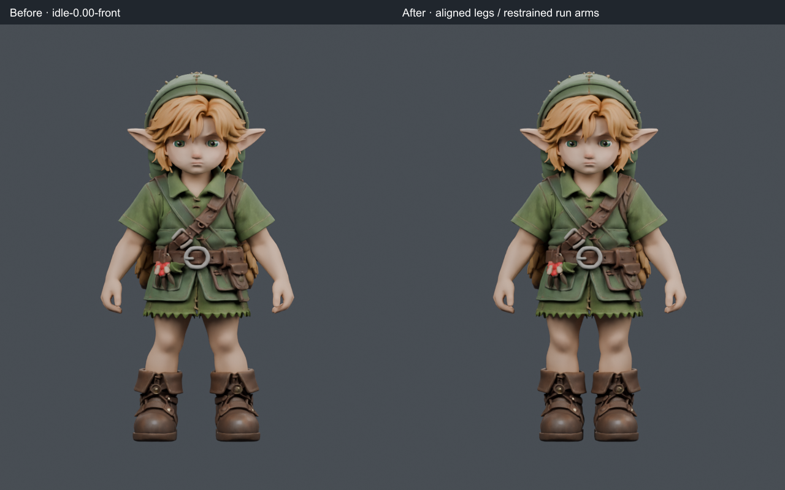
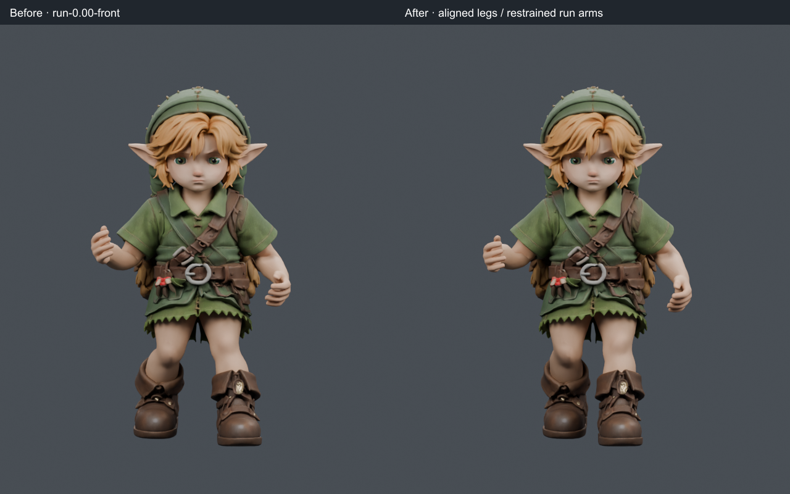
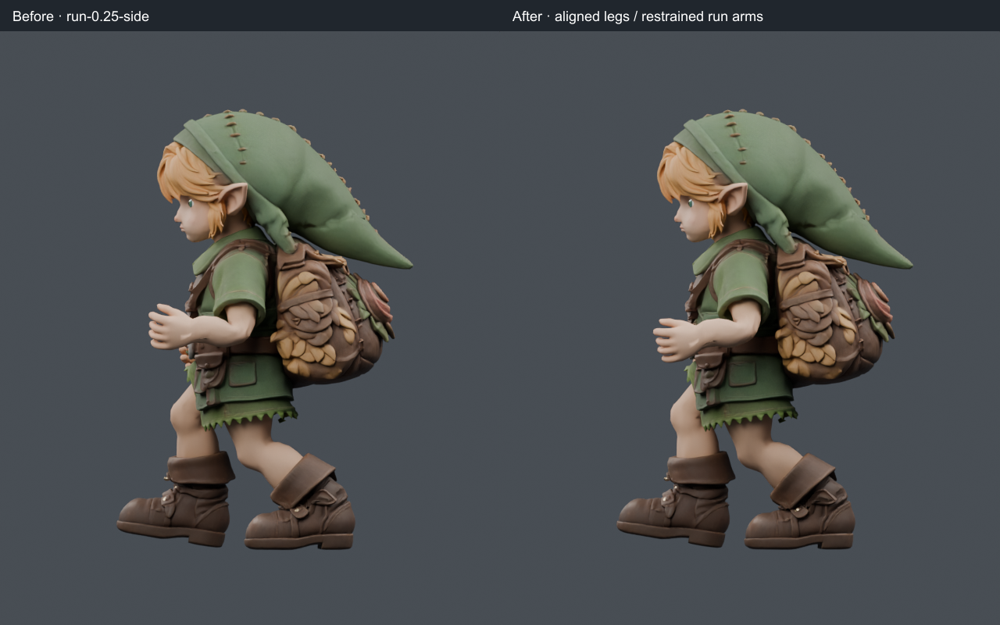
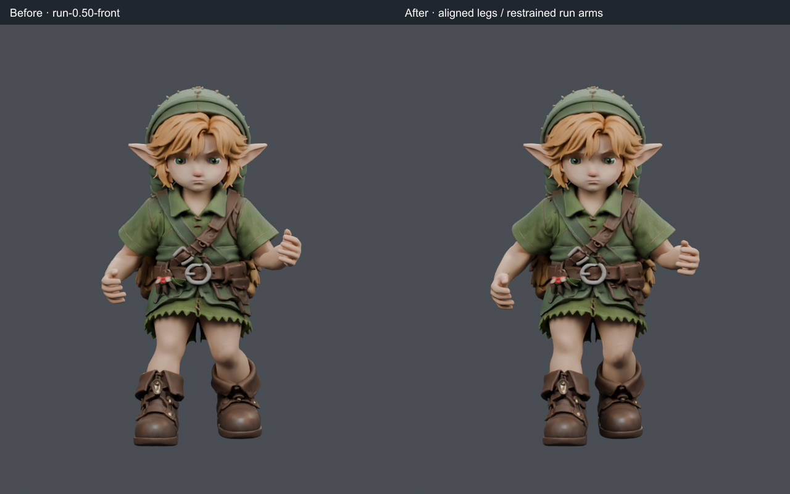
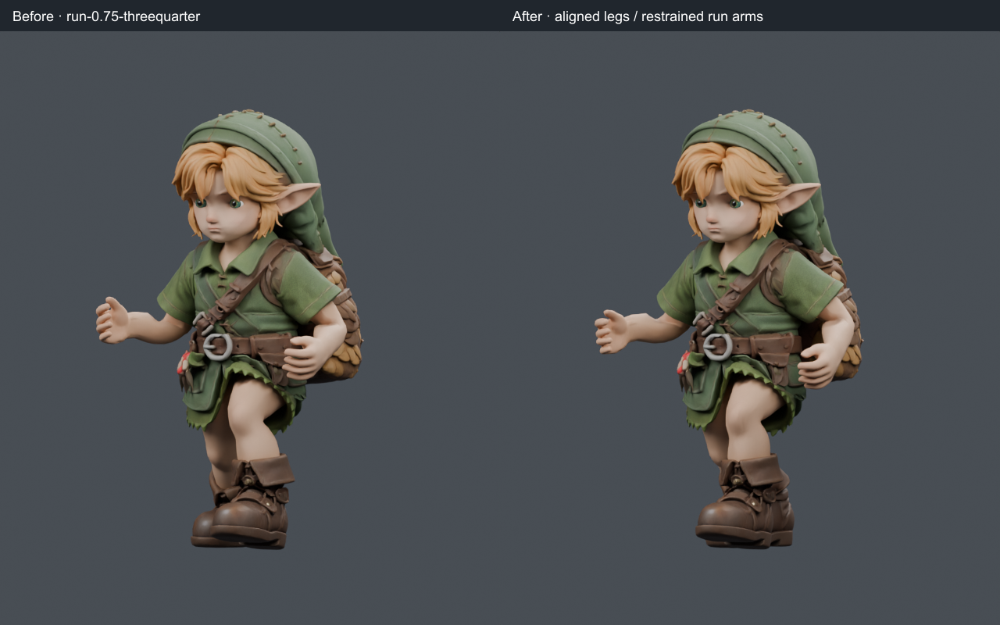
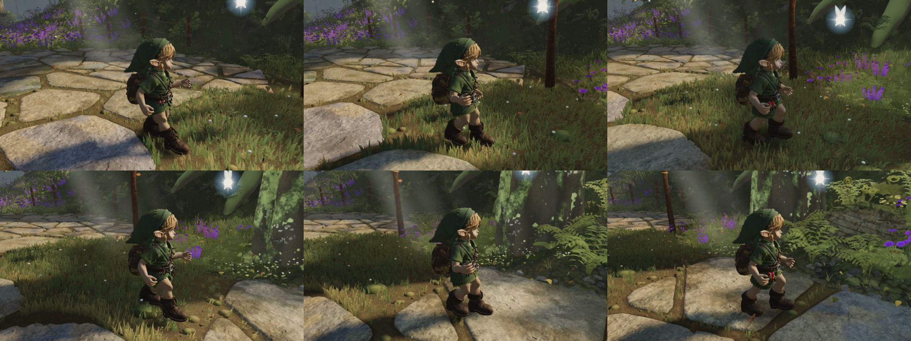

# Link: leg alignment and running arm carriage

The owner identified splayed calves/boots, arms held too far forward and distracting background characters. The reviewed Blender candidate straightens the lower-leg silhouette and carries the running hands farther back. Background NPCs, their contact shadows and their fairies are temporarily hidden behind one parent group; Link and Navi remain visible. The separate zero-dt runtime correction prevents a same-time redraw from snapping the filtered arm pose.

Source asset: `382ec9ecab9f77062b61c77192ada4df860abc33666284d8971abe1e577492eb` at `d679e7ee`.
Reviewed candidate: `ea93932d8afe02ec4bbcf3487fb20ce3f55272fb60f20998dc728cb637ae575f`.
World source for the candidate game study: `d7516294`, bundle `index-Co5z2jjO.js`, including the separately reviewed atlas colour-encoding correction.

## Five matched native comparisons

These are actual Blender renders, before left / after right: identical camera, lights, render settings and clip phase. Four CPU threads, Cycles 16 samples, 640×760 per side. No repainting, generated overlays or colour corrections. The baseline and final rigs run at 24 fps; fractional frames preserve the original 28/60-second cycle.











## What changed

The rig's knees and ankles are nearly vertical on flat ground; runtime knee swivel is inactive there. The original calf/boot mesh sits laterally outside those joints. A smooth native deformation moves 13,492 lower-leg vertices inward, at most 45 mm at the sole, fading to zero at 0.40 m. Height, depth, UVs, skin weights and bone positions remain unchanged. Normal/tangent frames follow the deformation; uniform translations preserve their original values exactly. All shape-key position deltas remain valid because the affected lower legs have zero blink deltas.

Only four run rotation channels change: shoulders move about 0.10 radians backward and 0.08 outward for pouch clearance; elbows open by 0.14 radians. These are measured artistic adjustments, not universal anatomical targets. Hips, chest, legs, wrists, other clips, strides and cycle duration are preserved. The native carrier is sampled at 240 fps, 113 samples over 28/60 seconds. Native loop quaternion error is below 6×10⁻⁸.

| Actual runtime at 60 Hz | Before | Candidate |
| --- | --- | --- |
| Left upper-arm maximum forward pitch | 24.75° | 19.50° |
| Right upper-arm maximum forward pitch | 22.12° | 16.85° |
| Left/right mean elbow flexion | 88.33° / 88.00° | 81.12° / 80.92° |
| Left/right mean hand distance forward of shoulder | 82.8 / 78.3 mm | 62.9 / 58.9 mm |
| Minimum sampled transverse lower-leg gap, idle/walk/run | about 83.9 mm | 12.77–12.88 mm |
| Native arm/body triangle intersections, sum over 113 phases | 1,666 | 1,452 |
| Native intersections below the armpit threshold | 292 | 235 |

The initial backward-arm candidate increased pouch contacts and was rejected. Small outward clearance reduced them below the original model. The remaining triangle contacts are disclosed; this is not a claim of collision-free animation. The lower-leg gap test covers the selected mesh region below 0.30 m and sampled flat poses, not arbitrary terrain.

The zero-dt correction reduces measured same-time hand jumps from 20–23 mm (running) and 28 mm (walking) to zero. All six positive-dt baseline traces remain identical for that runtime-only change. See [the separate audit](../2026-09-20-natural-run-audit/README.md).

## Checks and limits

`export_candidate.py --self-check` checks the field derivative and transformed normal/tangent orthogonality. Export checks retain the complete original binary prefix and every unselected JSON value. The native importer has up to 2.8 µm of coordinate conversion drift; the patch applies to original GLB coordinates, checks native displacement within 1 µm and preserves original height/depth exactly. Existing blink normal delta noise below 1.2×10⁻⁷ is preserved.

The final CPU audit reports no errors and stable zero-dt arms. Idle/walk skeleton traces remain identical to the source; their lower-leg mesh intentionally changes. Run leg/chest measurements remain identical. [Mesh separation](lower-leg-gap.json) was sampled on the identical corrected mesh before the final arm-only adjustment; [the final comparison](clear-runtime-comparison.json) records the unchanged leg/chest traces.

The final actual-game capture completed 300 simulated frames through walk, run and idle without browser errors or reach clamps. It verifies asset `ea93932d…575f`, zero visible NPCs and one contact shadow. The encoded 150-frame, 1280×720 video is 30 fps; that is capture playback, not a real-time performance measurement. Maximum per-frame root-height change was 9.15 mm across the transitions. This path did not sample rendered stair contacts.

[Actual-game walk/run/idle video](../2026-09-20T18-31-42-537Z-play-motion/walk-run-idle.mp4) · [capture manifest](../2026-09-20T18-31-42-537Z-play-motion/manifest.json)



The first 660-frame ascent/descent check sampled shoe contact only every tenth frame. Its +2.66 / −1.98 mm minima missed transient intersections; they do not describe the full motion. The subsequent check samples every frame: 5,010 ascending and 4,808 descending sole markers, with minima +2.65 mm / −67.32 mm. Two brief descending swing intersections remain at frames 274 and 449. Maximum knee flexion remains 162.35° up / 155.03° down.

A separate runtime correction prevents an existing stance pin from being shifted a second time during support sampling and includes the footprint corners on the rendered stair surface. The original frame-477 descent jolt falls from +60.37 to −5.95 mm; maximum descent root step falls to 19.79 mm. Flat skeleton traces and knee maxima remain unchanged. The dense native run completes 1,320 frames without page errors or reach clamps. One GLB request was aborted, alongside a successful HTTP 200 response and the verified served asset; no fallback model was used. See the [support diagnosis and runnable regression](../2026-09-20-natural-run-audit/STAIR_REPORT.md) and [dense native evidence](../2026-09-20T19-07-51-558Z-play-motion/README.md).

The candidate is adopted locally with its matching loader digest. Existing synthetic stair diagnostics separately expose about 99 mm descent penetration; that artificial route must not be confused with the rendered-mesh test above. Body posture and full leg timing have not been rewritten by this patch. The face, hands, pack contacts, uneven-ground motion and environmental reference match remain unfinished. No phase exit or frame-rate claim is made.

## Reproduce the export

Use Python's standard library; no new packages. Recover the original source from Git without replacing the adopted asset:

```python
import subprocess
from pathlib import Path
Path('source-382.glb').write_bytes(subprocess.check_output([
    'git', 'show', 'd679e7ee:public/models/link/link-runtime.glb']))
```

Then run, from the repository root:

```text
python art/characters/link/progress/2026-09-20-natural-run/export_candidate.py --self-check
python art/characters/link/progress/2026-09-20-natural-run/export_candidate.py source-382.glb art/characters/link/progress/2026-09-20-natural-run/reproduced.glb --carrier art/characters/link/progress/2026-09-20-natural-run/run-arms-native.glb
```

The committed native coordinate record and small armature carrier reproduce the candidate byte-for-byte. Blender authoring scripts are `import_baseline.py`, `legs_native.py`, `arms_native.py`, `render_native.py` and `check_native_contacts.py`. Import the recovered source using the `SOURCE_ASSET` override; run those scripts in a separate Blender 4.5 scene. Existing source scenes are preserved. The final local native project is `natural-carriage-study.blend` beside this README.
