# Running arms, foot recovery and smaller boots

Playable local candidate **382ec9ec**, built from default **24591126**, with the accompanying take-off coordinate correction in `glbLink.ts`. This combines the retained run-flight study with a smaller shoulder correction and shorter/narrower boots. The shared default is unchanged while Fable reviews the combined candidate.

The shoulder carriage rotates inward by 0.10 radians (5.73 degrees). The existing CC0-derived elbow, wrist and torso animation stays intact, including its timing. The leg swing uses the previous 3218b164 study: faster clearance after toe-off, continuous endpoint velocity, the original 1.82 m stride and 28/60-second cycle. Boots are 10% narrower and 12% shorter below 0.10 m, fading smoothly to the unchanged cuff at 0.20 m. Rest-pose sole height is unchanged.

The running research supports arm swing counterbalancing the legs' rotational momentum; it does **not** prescribe these artistic adjustment values. See [Arellano & Kram, 2014](https://journals.biologists.com/jeb/article/217/14/2456/12120/The-metabolic-cost-of-human-running-is-swinging). The existing motion source is [Quaternius Universal Animation Library](https://quaternius.com/packs/universalanimationlibrary.html), with provenance already recorded in `reference/animations/quaternius-standard/SOURCE.json`. No new motion service or generated asset was purchased.

## Matched Three.js comparisons

Both columns use the same studio, camera, animation phases and original textures. Native Blender arm-only comparisons are also included as `run-*-before/after.png`; their unchanged boots isolate the arm edit.

| View | Before — default245 | After — combined382 |
| --- | --- | --- |
| Full body | 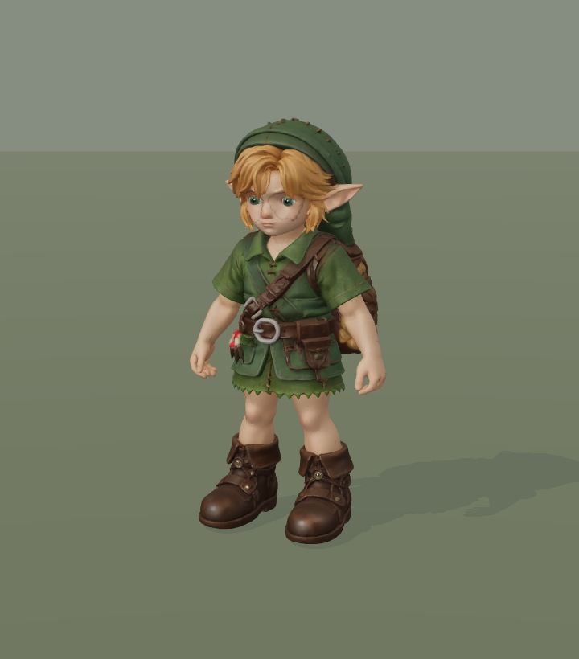 | 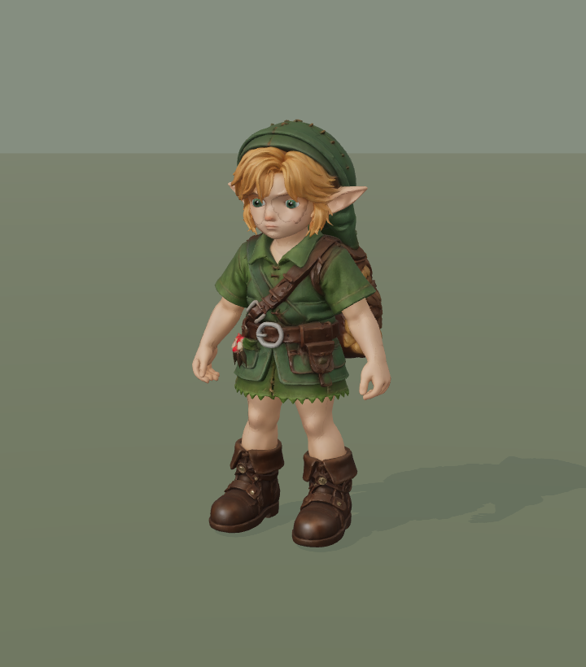 |
| Shoes | 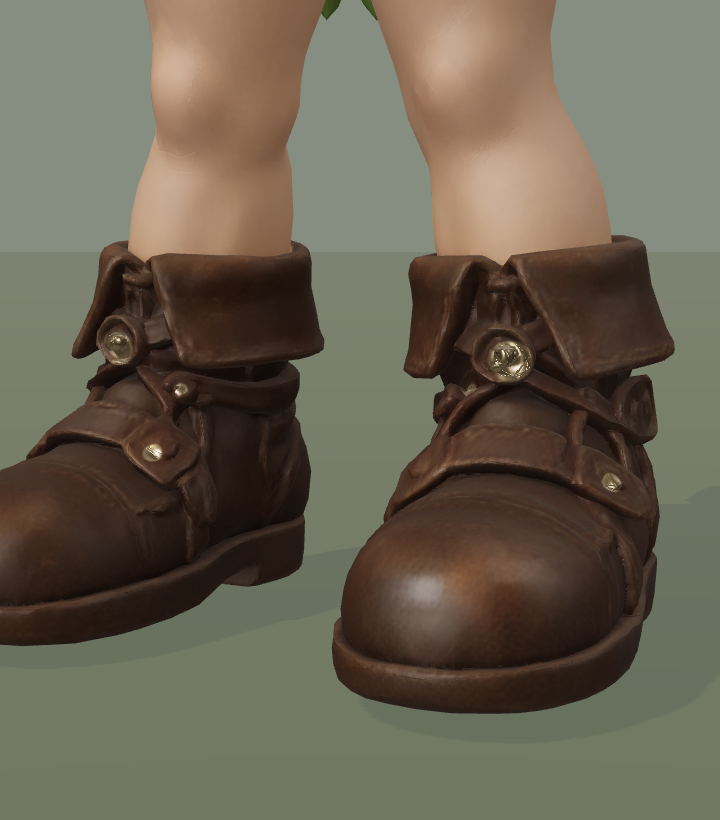 | 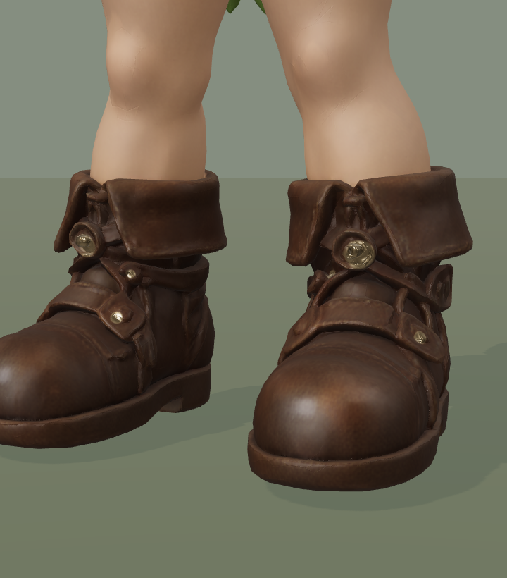 |
| Run 0% | 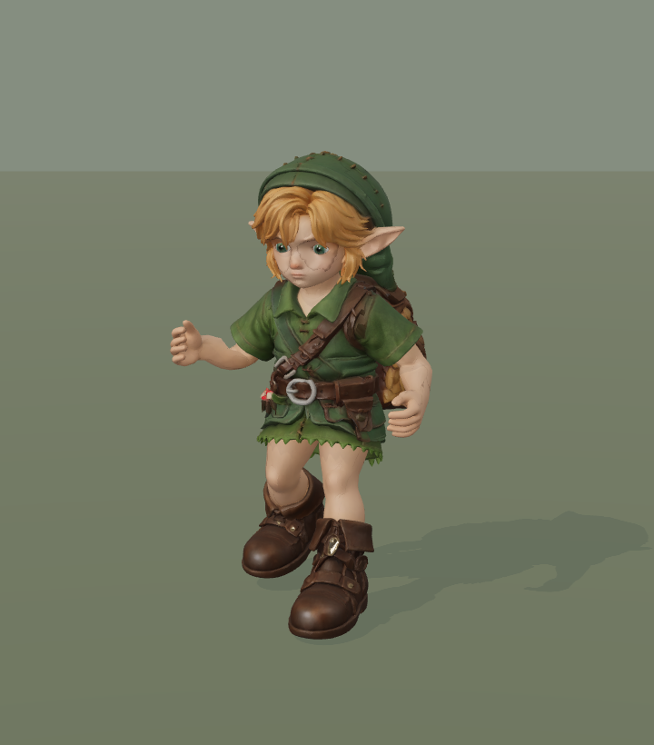 | 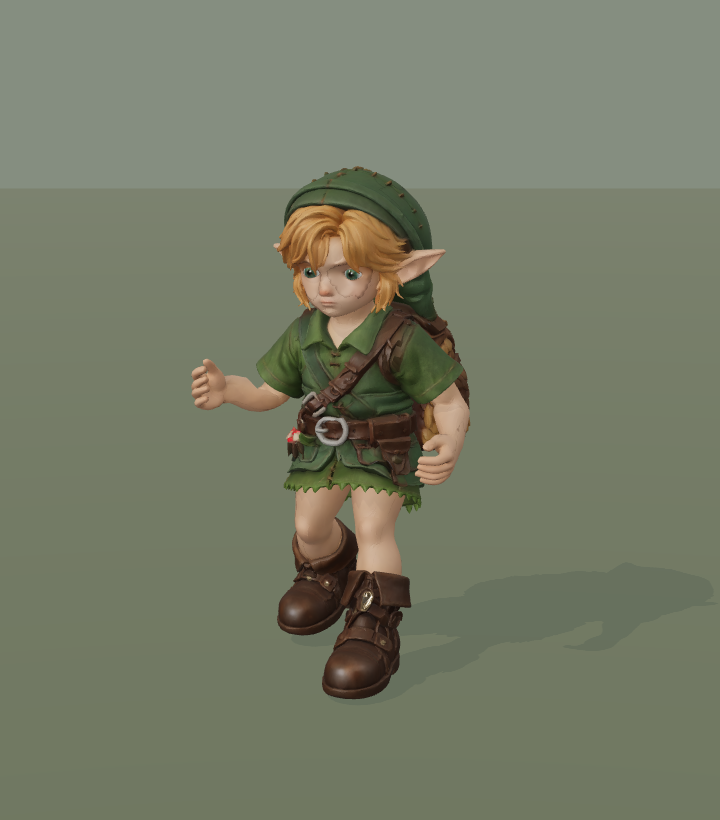 |
| Run 25% | 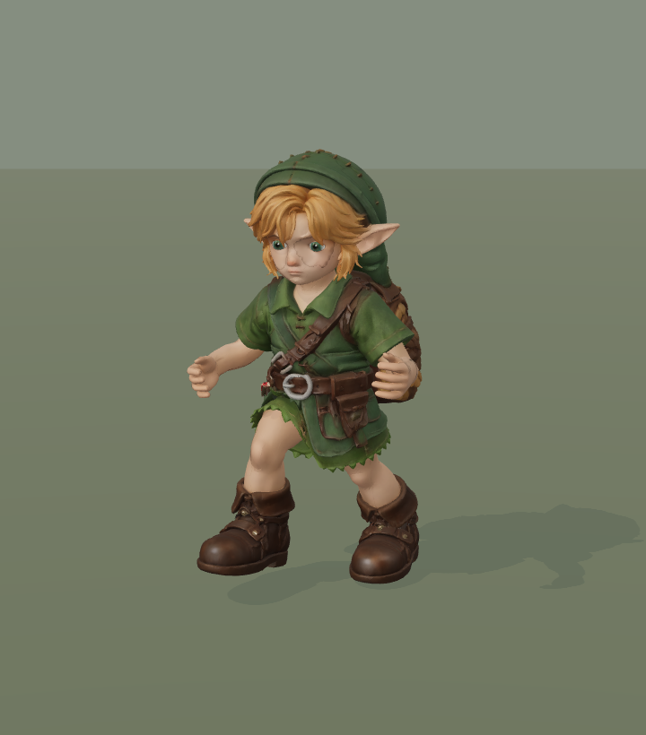 |  |
| Run 50% | 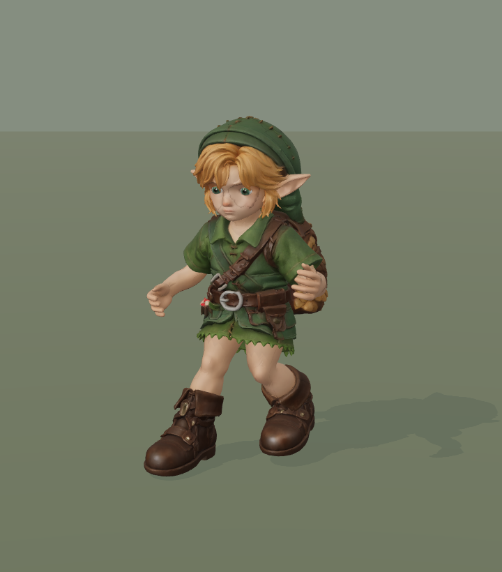 | 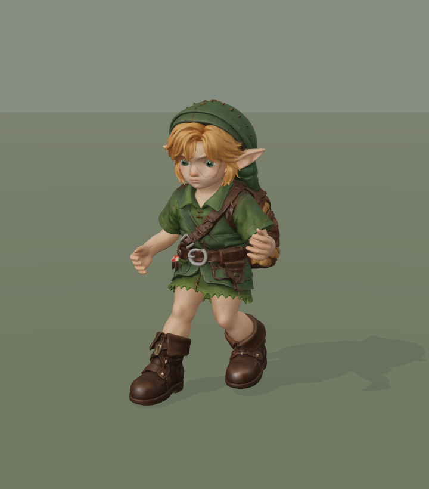 |
| Run 75% | 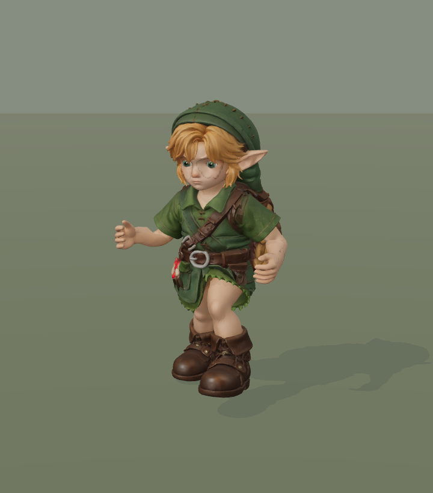 | 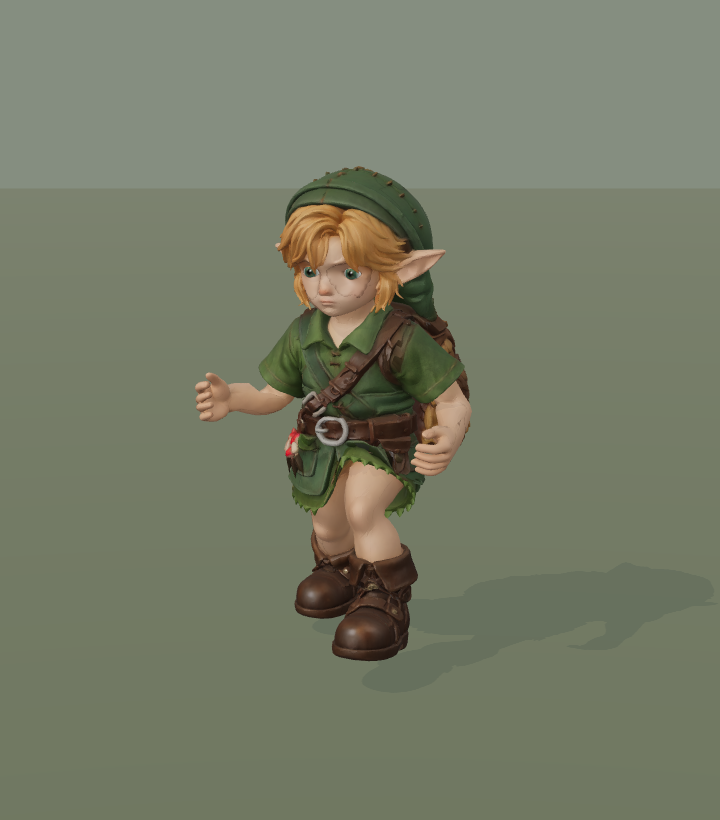 |

## Reproduce

From the repository root, using Python 3:

```sh
python art/characters/link/progress/2026-09-19-run-contact/export_candidate.py public/models/link/link-runtime.glb relaxed-run art/characters/link/progress/2026-09-20-run-arms
python art/characters/link/progress/2026-09-20-run-arms/boots.py art/characters/link/progress/2026-09-20-run-arms/relaxed-run-candidate.glb art/characters/link/progress/2026-09-20-run-arms/relaxed-run-boots.glb
```

The first command verifies the source245 digest and preserves original binary data, rig, unrelated animation channels, textures and mesh. The second verifies changed positions against the native Blender record; normals and tangents follow the same smooth deformation field. Skin weights, UVs, blink morphs, rig and animation clips are preserved by the boot patch. The small `relaxed-run-native.glb` is an animation-only carrier, without character meshes or textures.

Copy the resulting model beside the existing runtime asset for local review, then open the game with `?link=relaxed-run-boots.glb&dev=0&hud=0`. The original full model is not duplicated in this evidence folder.

## Limitations and rejected variants

### Stair follow-up, 20 September 10:50 UTC

`python art/characters/link/progress/2026-09-20-run-arms/diagnose_stairs.py`
extracts the worst recorded poses from the existing actual-world trace. At ascent
frame 155, the right ankle is only 72.87 mm below its hip and 33.15 mm away
horizontally, with approximately 412 mm of leg bones connecting them. The resulting
162.35-degree knee fold is a compressed target, not a stretched leg. The descent
also brings the trailing ankle close to the hip. Merely removing the native swing
arc did not solve this in the previous stair study.

Two additional source-only trials were rejected and fully reverted on top of
`0dfd3601`, using candidate382 and `check_stair_grounding.mjs`:

| Synthetic ascent trial | Max knee flexion | Min audited shoe gap |
| --- | ---: | ---: |
| Retained source | 165.30 degrees | -0.007 mm |
| Add `leg.pinX/Z` to the geometric clearance probe's `sx/sz` | 165.30 degrees | -270.00 mm |
| Advance uphill stair swing by `min(0.10, rise * 0.4) * sin(pi * phase)^2` in `sh` | 162.28 degrees | -10.98 mm |

Both trials kept the flat and descending summary metrics unchanged and reported
zero reach clamps. Neither is a suitable fix: the probe-only change breaks support
consistency, and the forward arc barely reduces the fold while worsening clearance.
These are diagnostic fixture results, not additional actual-world captures.

The next hypothesis is a coordinated support-height and foot-trajectory adjustment,
tested against both knee compression and contact continuity. Johansen's
[locomotion thesis, sections 7.3.6 and 7.4](https://runevision.com/thesis/rune_skovbo_johansen_thesis.pdf)
describes deriving body support from grounded feet and then solving hip/foot alignment
together. That is research guidance, not evidence that a new implementation here works.
No new solver, rig proportions or shared default has been introduced in this follow-up.

A 0.20-radian shoulder correction plus inward forearms caused substantially more clothing intersections and was rejected. A second forearm adjustment was also removed: shoulder-only correction preserves the original elbow and wrist curves. Native triangle-overlap counts include sewn sleeve/armpit contacts, so they are not penetration depths or a collision-free guarantee. The narrower shoulders still need visual review at those seams. Face quality and the known excessive stair knee folding are separate unfinished work.

## Validation

- Native arm loop closes within 5.96e-8 matrix units. All non-shoulder channels match the retained run study. Across 113 samples, arm/body triangle pairs total 756→1394, peak 24→34; pairs reaching below native Z 0.69 m decrease 40→21. The peak's triangles lie at the armpits/sleeves (Z 0.719–0.812 m). These are geometric contact counts, not penetration depths.
- The shoe exporter checks 11,244 exported vertices against the native Blender result with zero position discrepancy. The original asset's rig, clips, skin weights, texture/UV data and blink morphs are preserved by that patch.
- Actual Three.js studio: 22 candidate views, 11 draws/140,886 triangles, no page errors. Initial model request abort followed by successful load is logged by the capture helper.
- Production rig on flat ground: 240 frames, no reach clamps, 0.956 mm root-height range and 68 flight frames in the steady 120-frame window. Minimum shoe gap −0.0012 mm.
- Production rig on analytic stairs: 600 frames per scenario. Maximum body-height step ascending 25.89→25.15 mm; descending 19.73→19.62 mm. No reach clamps; zero-dt reposing and jump take-off reset assertions pass. Descending footprint penetration remains 97.68→99.05 mm; this is unresolved and is not hidden by the passing continuity assertion.
- The first full-high world recording exposed a regression: the new clip eliminated near-floor foot travel, but introduced a 16.13 mm body-height step after a stance pin. [Pre-fix recording](game-after/walk-run-idle.mp4), [manifest](game-after/manifest.json). This is retained as diagnostic evidence, not the accepted runtime behavior.
- The take-off release calculation mixed an actual foot anchor with a hip based on the predicted clip position. Both ends of its frozen pose now use the same anchor. `node art/characters/link/check_run_grounding.mjs relaxed-run-boots.glb --shift-takeoff` fails before the fix at an 18.01 mm root-height range and passes afterward at 0.709 mm, at the actual 4.6 m/s player speed. Moving a support-sampling anchor on a flat floor must not create a fictitious reach deficit.
- The same 300-frame world path was then captured with the corrected runtime: no page errors or reach clamps; near-floor unplanted foot travel in steady run falls from 1.750 m to zero, with zero planted-foot drift. Largest steady-run body step is 7.689→7.710 mm; across all transitions it is 7.689→9.622 mm, so this does not claim every body-motion metric improved. Audited minimum shoe gap is −6.9→−6.7 mm. [Fixed runtime images and trace](game-fixed/manifest.json), [comparison](comparison.json); run `python art/characters/link/progress/2026-09-20-run-arms/verify.py` to check the matched evidence.
- The synthetic stair summary maxima remain unchanged by the release correction. Flat and descending traces are exact; ascending poses differ by up to 16.70 mm in root height and 4.43 degrees at a knee. They are **not** identical traces; the correction removes the invented release drop there too.
- Full-high actual-world stairs: 660 ascending and 660 descending frames, no page errors or reach clamps. Against the existing default245 take-off regression capture on the same world geometry, maximum body step changes 25.226→25.202 mm up and 20.159→19.846 mm down. Sampled descent shoe penetration improves 73.08→13.32 mm, with zero samples below −20 mm (previously one). Peak knee flexion remains excessive: 162.35° up and 155.34° down. [Actual stair trace and images](game-stairs/manifest.json); the analytic stair fixture above has different geometry and different penetration values.
