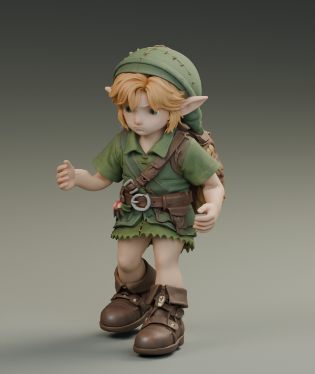
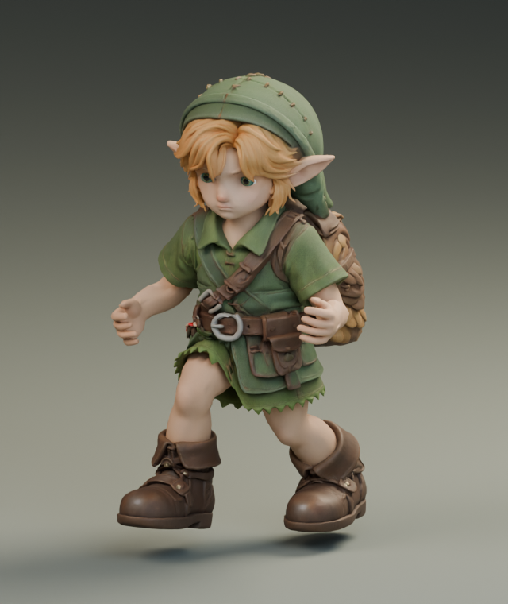
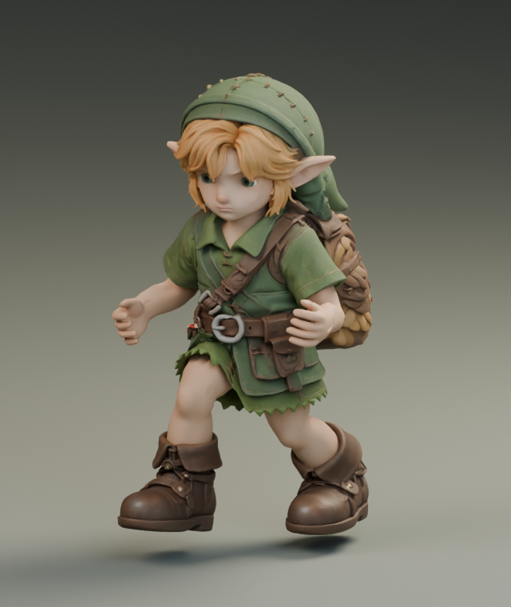
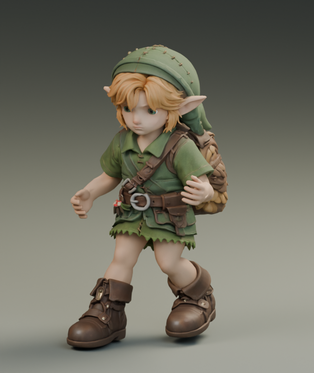
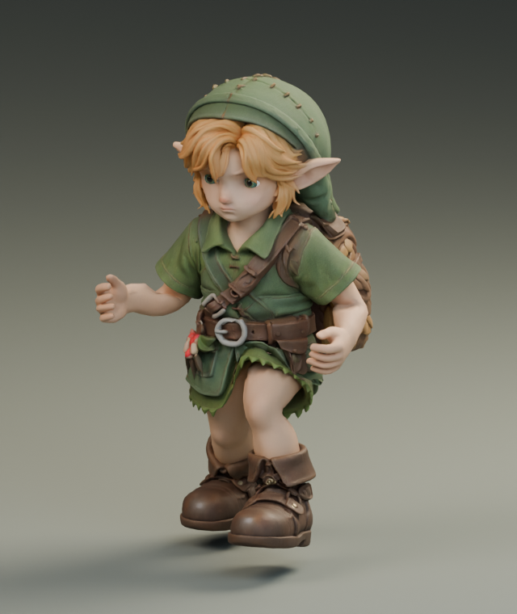
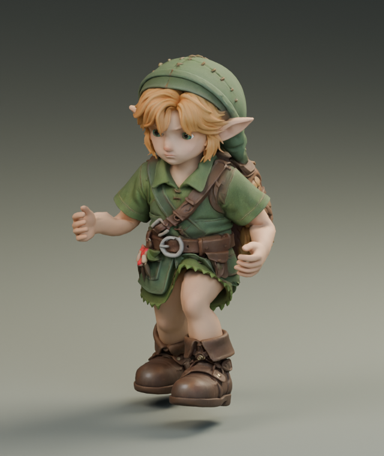

# Running torso follow-through

Optional candidate `bfc3c08d` adds a restrained chest turn to `1e81bb6c`, which
already contains the running arms, smaller boots and stair-posture improvements.
The existing arm retargeting removes the source chest rotation; the destination
run therefore had no axial chest turn. This study restores 15% of the same
phase-aligned Quaternius `Jog_Fwd_Loop` yaw, from -5.76 to +5.68 degrees. The head
keeps its previous world orientation while following the torso's position.

Only the run clip's chest/head rotation channels change. The exporter verifies
the source digest, unchanged original binary prefix, rig, meshes, materials,
other clips and unselected channels. Hips/leg matrices are exact across all 113
native samples; head orientation error is at most 2.39e-7 matrix units. The
production shifted-takeoff check passes at 4.6 m/s: 0.709 mm body-height range,
68 flight frames in the steady window, no reach clamps.

This is an art adjustment, not a biomechanical prescription. Research establishes
that arm swing helps counterbalance the legs' rotational momentum, and restricting
it changes shoulder/pelvis rotation: [Arellano & Kram, 2014](https://journals.biologists.com/jeb/article/217/14/2456/12120/The-metabolic-cost-of-human-running-is-swinging).
The source is the existing [Quaternius Universal Animation Library](https://quaternius.com/packs/universalanimationlibrary.html),
recorded in `reference/animations/quaternius-standard/SOURCE.json`. The 0.078125
phase offset comes from the existing September13 arm timing study.

## Matched native views

These isolate the torso edit; both native renders retain the original boot mesh.
The exported game candidate preserves the smaller boots from `1e81bb6c`.

| Run phase | Before | After |
| --- | --- | --- |
| 0% |  |  |
| 25% |  |  |
| 50% |  |  |
| 75% |  |  |

Arm/body triangle-overlap pairs increase from 1394 to 1602 over 113 samples, with
the peak increasing from 34 to 44. Pairs extending below the armpit remain 21.
These counts include clothing seams and are not penetration depths; sleeve contact
is still a limitation. Static hand shape and remaining stair folding are unchanged.
Default `24591126` remains unchanged during Fable's review.

## Actual-game validation

The 300-frame high-default walk/run/idle recording on `index-C8Futrc5.js` completed
with no page errors or reach clamps. Against the integrated-world `1e81bb6c`
baseline, every sampled root position, foot/contact value checked by `check.py`,
and hip/knee angle is exactly unchanged. This isolates the upper-body edit without
undoing the existing leg fixes. Maximum root step remains 9.149 mm.


The movie contains 150 verified 1280x720 frames at 30 fps: two seconds walking,
two running, then one stopping. [Full trace](game/manifest.json),
[comparison](comparison.json). The first attempt lost its browser connection
during loading and produced no gameplay; [failure record](failed-video-boot.json).
The successful retry used the same build, candidate and high defaults.

Run `python art/characters/link/progress/2026-09-20-run-torso/check.py` to verify
native isolation, unchanged gameplay contacts and the movie hash/frame metadata.

## Replay

First reproduce `stairs-upright-candidate.glb` using the adjacent stair-posture
README. Then, from the repository root:

```sh
python art/characters/link/progress/2026-09-19-run-contact/export_candidate.py art/characters/link/progress/2026-09-20-stair-posture/stairs-upright-candidate.glb run-torso art/characters/link/progress/2026-09-20-run-torso
```

The committed native GLB is a 135,808-byte animation carrier with no meshes or
images. `study.py` records Blender authoring; it uses the local preceding
`relaxed-run-study.blend` and the Quaternius source scene. The shared
`run-arms/review_native.py` accepts `JOB` with this folder as `out`,
`run-torso-study.json` as `study`, and the original relaxed-arm scene as `before`.
It checks 113 poses and renders the four matching views with four CPU threads.
